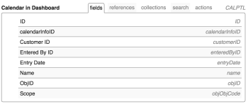

# Utilização do API Explorer

Ao usar a API principal do Adobe Workfront, o API Explorer é uma ferramenta de referência legada que cataloga os relacionamentos entre recursos, parâmetros e variáveis compatíveis.

## Acessar o API Explorer:

1. Use um navegador da web para acessar o [API Explorer](https://developer.adobe.com/workfront/api-explorer/)\
   

1. No canto superior direito do API Explorer, selecione a **versão da API** desejada do Workfront. Por padrão, a versão mais atual é selecionada automaticamente
1. O campo **Filtro** pode ser usado para filtrar os objetos listados por nome e truncar a lista de objetos exibidos de acordo:

   

   * **Campos**: campos disponíveis dentro do objeto especificado.
   * **Referências**: variáveis de referência disponíveis para o objeto especificado. Uma referência é um alias para uma variável. Depois de inicializada, uma referência pode ser usada alternadamente com o nome da variável. Uma referência usa memória inicializada.
   * **Coleções**: coleções disponíveis para o objeto. Coleções são variáveis que representam uma relação “um para muitos” entre o objeto e o recurso.
   * **Pesquisa**: recursos de pesquisa disponíveis para o objeto. Os resultados de uma pesquisa se baseiam nos parâmetros de consulta especificados pelo recurso de pesquisa na solicitação de API.
   * **Ações**: ações compatíveis com o objeto. As ações podem ser procedimentos simples ou complexos executados em relação a um recurso ou conjunto de recursos. Uma determinada ação também pode afetar os recursos relacionados.

1. Abra uma guia e, em seguida, clique na ID do objeto para exibir as variáveis aplicáveis.\
   \
   Dependendo do objeto selecionado, as seguintes variáveis podem ser aplicadas:

   | Variável | Definição |
   |---|---|
   | Nome do campo | O nome de um campo usado em uma operação na API do Workfront. |
   | Tipo de campo | O tipo de valores que podem ser inseridos em um campo específico em uma tabela de dados. Os possíveis valores de tipo de campo incluem string, double, int, dateTime. |
   | Tipo enumerado | Os tipos de valores que podem ser usados para identificar um tipo de dados. |
   | Valores possíveis | Valores aceitáveis para o objeto. |
   | Tipo de atributo ObjCode | Atributos que podem ser usados para modificar a classe de objeto. |
   | URL | O caminho de entrada que permite ao aplicativo se comunicar com a API do Workfront. |
   | Argumentos | As variáveis do objeto que podem ser transmitidas entre seu aplicativo e o Workfront. |
   | Tipo de resultado | Tipos de dados permitidos que podem ser retornados por um método. |
