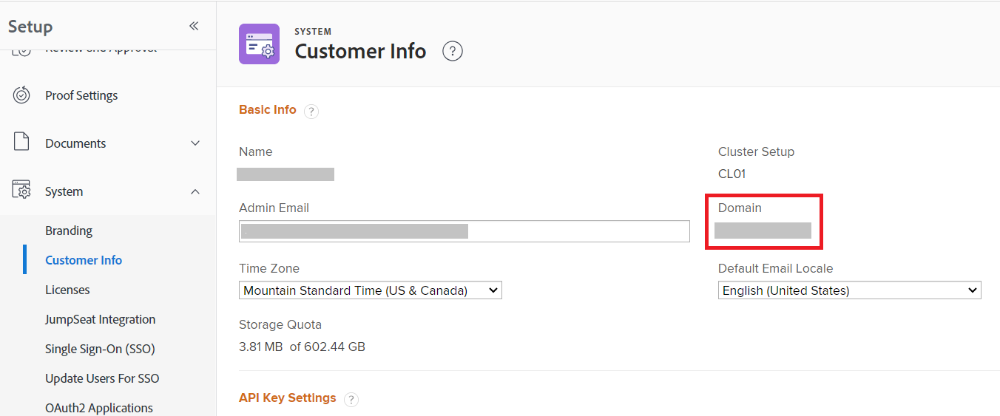

# Formato de domínio para chamadas de API do Adobe Workfront

Ao fazer uma chamada de API para a API do Workfront, você usa o domínio de sua organização na chamada.

O URL criado para a chamada de API depende do URL usado para conectar-se ao Workfront.

| O URL do Workfront começa com: | URL para chamadas de API: |
|---|---|
| `experience.adobe.com` | `<yourdomain>.my.workfront.adobe.com` |

## Requisitos de acesso

+++ Expanda para visualizar os requisitos de acesso da funcionalidade neste artigo.

<table style="table-layout:auto"> 
 <col> 
 <col> 
 <tbody> 
  <tr> 
   <td role="rowheader">Pacote do Adobe Workfront</td> 
   <td> 
Qualquer 
 </td> 
  </tr> 
  <tr> 
   <td role="rowheader">Licença do Adobe Workfront</td> 
   <td>
Padrão

   
Plano
</td> 
  </tr> 
  <tr> 
   <td role="rowheader">Configurações de nível de acesso</td> 
   <td> 
Você deve ser um administrador do Workfront
 </td> 
  </tr> 
 </tbody> 
</table>

Para obter informações, consulte [Requisitos de acesso na documentação do Workfront](/help/quicksilver/administration-and-setup/add-users/access-levels-and-object-permissions/access-level-requirements-in-documentation.md).

+++

Para localizar seu domínio:

1. Clique no ícone **[!UICONTROL Menu Principal]**  no canto superior direito do Adobe Workfront ou (se disponível) clique no ícone **[!UICONTROL Menu Principal]**  no canto superior esquerdo e clique no ícone **[!UICONTROL Instalação]** .
1. Selecione **Sistema** e, em seguida, **Informações do cliente**.

   Seu domínio está listado à direita da tela.

   

