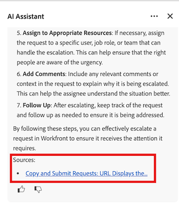

# O Assistente de IA solicita as práticas recomendadas

O Assistente de IA do Workfront é uma ferramenta poderosa que pode ajudá-lo a realizar seu trabalho com mais eficiência, oferecendo informações úteis sobre os dados de sua conta e tipos de objetos específicos.

Neste artigo, você aprenderá sobre as práticas recomendadas atuais do Assistente de IA, incluindo como escrever avisos claros, quais tipos de objeto você pode solicitar informações e como acessar recursos adicionais para verificar informações quando necessário.

Para obter mais informações sobre o Assistente de IA, consulte [Visão geral do Assistente de IA](/help/quicksilver/workfront-basics/ai-assistant/ai-assistant-overview.md).

>[!NOTE]
>
>À medida que os recursos do Assistente de IA evoluem, o tipo de solicitações e perguntas que você pode fazer se expande. Recomendamos revisitar este artigo à medida que novos recursos do Assistente de IA são lançados para saber mais sobre os prompts disponíveis que você pode usar.

## Tipos de objeto disponíveis para o Assistente de IA

O assistente de IA pode fornecer dados para os seguintes tipos de objetos:

* Portfólios
* Programas
* Projetos
* Tarefas
* Problemas
* Formulários personalizados
* Usuários
* Registros do Workfront Planning

>[!NOTE]
>
>Você deve ter a permissão necessária em seu nível de acesso para um objeto antes de solicitar os dados dele ao Assistente de IA.

## Práticas recomendadas

### Inserir avisos claros

Para acessar as informações mais úteis do Assistente de IA, é importante criar prompts que forneçam a resposta que você está procurando. A lista a seguir contém princípios que podem ajudá-lo a formular melhor os prompts apropriados:

* **Usar um idioma claro e específico**: evitar prompts vagos e gerais ajudará o Assistente de IA a orientar os dados que você está tentando receber.
* **Incluir períodos**: fornecer períodos de tempo específicos ao Assistente de IA para um objeto ajudará a restringir os dados que ele precisa processar e resultará em informações mais direcionadas em sua resposta.
* **Solicitar somente uma coisa por vez**: quando várias solicitações não relacionadas são incluídas em um único prompt, o Assistente do AI não poderá fornecer as informações corretas.

Para obter informações sobre prompts recomendados, consulte a seguinte seção neste artigo: [Exemplos de prompt](#prompt-examples).

### Verificar respostas do Assistente de IA

Nesse estágio do desenvolvimento do Assistente de IA, é recomendável verificar as informações fornecidas ao solicitar informações sobre processos do Workfront. Você pode fazer isso clicando no link do artigo fornecido na seção Origens na resposta do prompt.

Para obter mais informações sobre prompts de processos do Workfront, consulte [Prompts para saber mais sobre ações do Workfront](#prompts-to-learn-about-workfront-actions) neste artigo.

## Exemplos de prompt

As tabelas abaixo contêm exemplos de prompts que você pode usar para gerar informações sobre seu trabalho e saber mais sobre processos ou ações específicos do Workfront que você gostaria de fazer.

### Avisos para encontrar informações sobre o seu trabalho

<table>
    <tr>
        <td><b>Tipo de objeto</b></td>
        <td><b>Prompt</b></td>
    </tr>
        <tr>
        <td>Projetos</td>
        <td><em>Qual é a data de conclusão para [NOME DO PROJETO]?</em>
        </td>
    </tr>
    <tr>
        <td>Projetos</td>
        <td><em>Qual é o status do [NOME DO PROJETO]?</em>
        </td>
    </tr>
    <tr>
        <td>Projetos </td>
        <td><em>Quem é o proprietário do projeto para [NOME DO PROJETO]?</em></td>
    </tr>
    <tr>
        <td>Tarefas</td>
        <td><em>Quais tarefas são atribuídas a mim esta semana?</em></td>
    </tr>
       <tr>
        <td>Problemas </td>
        <td><em>Quais problemas abertos são atribuídos à minha equipe?</em></td>
           <tr>
        <td>Usuários</td>
        <td><em>Quem faz parte da equipe criativa do [NOME DO PROJETO]?</em></td>
    </tr>
           <tr>
        <td>Usuários </td>
        <td><em>Quantas tarefas são atribuídas a [USUÁRIO]?</em></td>
    </tr>
   </table>

### Avisos para saber mais sobre as ações do Workfront

<table>
    <tr>
        <td><b>Tipo de objeto</b></td>
        <td><b>Prompt</b></td>
    </tr>
    <tr>
        <td>Projetos</td>
        <td><em>Como criar um novo projeto a partir de um modelo?</em>
        </td>
    </tr>
    <tr>
        <td>Projetos </td>
        <td><em>Qual é a diferença entre um projeto e um programa?</em></td>
    </tr>
    <tr>
        <td>Tarefas</td>
        <td><em>Como faço para atribuir uma tarefa a vários usuários?</em></td>
    </tr>
       <tr>
        <td>Tarefas</td>
        <td><em>O que significa o status Pronto para iniciar?</em></td>
    </tr>
       <tr>
        <td>Problemas </td>
        <td><em>Como converter uma solicitação em uma tarefa?</em></td>
    </tr>
           <tr>
        <td>Problemas </td>
        <td><em>Qual é o ciclo de vida de um problema no Workfront?</em></td>
    </tr>
        </tr>
           <tr>
        <td>Problemas </td>
        <td><em>Como escalar uma solicitação?</em></td>
    </tr>
           <tr>
        <td>Documentos</td>
        <td><em>Como fazer upload de uma nova versão de um documento?</em></td>
    </tr>
           <tr>
        <td>Documentos </td>
        <td><em>Posso definir workflows de aprovação de documentos?</em></td>
    </tr>
   </table>

## Limitações atuais do Assistente de IA

O Assistente de IA é uma ferramenta poderosa, mas há determinados tipos de perguntas e solicitações para as quais ele não pode fornecer dados no estágio atual de desenvolvimento. A tabela abaixo contém exemplos de prompts para os quais o Assistente do AI não pode exibir dados.

<table>
    <tr>
        <td><b>Tipo de prompt</b></td>
        <td><b>Exemplo</b></td>
    </tr>
    <tr>
        <td>Perguntas sobre configurações personalizadas</td>
        <td><em>Que lógica de integração personalizada está sendo executada em nossa instância do Workfront?</em>
        </td>
    </tr>
    <tr>
        <td>Perguntas sobre dados fora do Workfront </td>
        <td><em>Você pode me mostrar meu calendário do Outlook para hoje?</em></td>
    </tr>
             <tr>
        <td>Perguntas sobre produtos não integrados da Adobe </td>
        <td><em>Como editar uma PDF no Acrobat aqui?</em></td>
         <tr>
        <td>Questões que exigem julgamento humano</td>
        <td><em>Este projeto deve ser suspenso?</em></td>
    </tr>
    </tr>
       <tr>
        <td>Solicitações de atualizações em massa</td>
        <td><em>Reatribuir todas as tarefas vencidas para [USER].</em></td>
    </tr>
       <tr>
        <td>Solicitações de análise preditiva</td>
        <td><em>Sugira um novo plano de projeto com base em nossos dados históricos.</em></td>
    </tr>
           <tr>
        <td>Solicitações de informações acima do seu nível de acesso</td>
        <td><em>Listar todas as taxas de faturamento na conta.</em></td>
    </tr>
           <tr>
        <td>Solicitações que contêm informações vagas </td>
        <td><em>Corrija meu projeto.</em></td>
    </tr>
   </table>