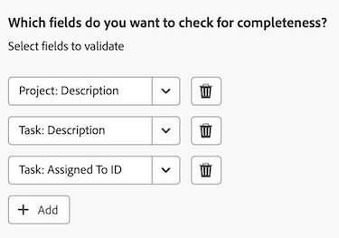

# Visão geral da Integridade do Projeto

>[!IMPORTANT]
>
>No momento, o recurso Integridade do projeto está disponível apenas para usuários que participam da fase beta.

O recurso Saúde do projeto do Adobe Workfront utiliza o poder do Assistente de IA para fornecer instantaneamente uma avaliação do desempenho de seus projetos, quais áreas precisam de sua atenção e como evitar problemas que podem custar tempo e dinheiro.

O Assistente de IA pode gerar uma avaliação de Integridade do projeto para os seguintes objetos:

* Um único projeto
* Um único programa
* Vários projetos

Para obter mais informações sobre o Assistente de IA, consulte [Visão geral do Assistente de IA](/help/quicksilver/workfront-basics/ai-assistant/ai-assistant-overview.md).

+++ Expanda para visualizar os requisitos de acesso para a funcionalidade neste artigo.

<table style="table-layout:auto"> 
<col> 
</col> 
<col> 
</col> 
<tbody> 
<tr> 
   <td role="rowheader">
Pacote do Adobe Workfront
</td> 
   <td> 

Selecionar ou superior 
 

Fluxo de trabalho Selecionar ou superior

   </td> 
<tr> 
 <tr> 
   <td role="rowheader">
Licença do Adobe Workfront
</td> 
   <td> 

Standard
 
   </td> 
   </tr> 
  </tr> 
  <tr> 
   <td role="rowheader">
Configurações de nível de acesso
</td> 
   <td>
Você precisa ser um administrador do sistema para gerenciar as configurações de Integridade do Projeto 

   
Editar acesso aos projetos para aplicar as configurações de Integridade do Projeto 

     
Exibir acesso aos projetos para exibir as configurações de Integridade do Projeto 

  </td> 
  </tr>  
    </tr>  
</tbody> 
</table>

Para obter mais detalhes sobre as informações nesta tabela, consulte [Requisitos de acesso na documentação do Workfront](/help/quicksilver/administration-and-setup/add-users/access-levels-and-object-permissions/access-level-requirements-in-documentation.md).
+++

## Inscrever-se no beta de Integridade do projeto

Para utilizar o Project Health, sua organização deve ter o Assistente de IA ativado.

Para ativar o Assistente de IA e a Integridade do projeto para sua organização, todos os itens a seguir devem ser aplicados:

* Sua organização deve ter migrado para o Adobe IMS (Identity Management System).
* Sua organização deve ter um plano Select, Prime ou Ultimate Workfront
* A Experiência unificada do Adobe deve ser habilitada.
* A Adobe deve ter um contrato de API Gen da Adobe assinado no arquivo.
* O administrador do Workfront deve ativar o Assistente de IA para os usuários em sua organização. O Assistente de IA é ativado por meio de níveis de acesso.
* As opções Habilitar IA e Integridade do projeto devem ser selecionadas na seção Preferências de IA em Configuração > Sistema > Preferências.

  

Para obter mais informações, consulte [Visão geral do Assistente de IA](/help/quicksilver/workfront-basics/ai-assistant/ai-assistant-overview.md) e [Configurar preferências do sistema](/help/quicksilver/administration-and-setup/manage-workfront/security/configure-security-preferences.md).

## Como a integridade do projeto é calculada

O Assistente de IA fornece uma avaliação rápida da condição geral de um projeto, atribuindo a ele um dos estados de Integridade do projeto disponíveis:

* No Prazo
* Em Risco
* Com problemas

Esse estado é calculado usando componentes do projeto, como progresso do projeto, trabalho subestimado e muito mais. Para obter uma lista completa dos componentes usados para medir a Integridade do Projeto, consulte a seção [Lista de estados do projeto e do programa](#project-and-program-states-list).

A cada componente do projeto é atribuída uma pontuação de risco numérica que vai de (0 a 100), cuja média é criada para criar o estado geral de Integridade do projeto:

* No Target (75 ou superior): o desempenho do projeto está dentro dos limites esperados.
* Em risco (50-74): são detectados problemas emergentes que podem afetar o desempenho do projeto.
* Em Problema (49 ou menos): o desempenho do projeto está abaixo dos limites aceitáveis e requer atenção imediata.

>[!NOTE]
>
>* Atualmente, o Assistente de IA avalia somente os dados do projeto selecionado.
>* A análise entre projetos ou histórica ainda não está incluída no cálculo da Integridade do Projeto.

### Exemplos de cálculo da Integridade do projeto para um projeto

No primeiro exemplo, quatro componentes de projeto são avaliados e suas pontuações de risco individuais são calculadas da seguinte maneira:

* 2 No Target (pontuação de risco 90)
* 1 Em Risco (45 pontuação de risco)
* 1 Em Problema (pontuação de risco 20)

Quando você calcula a média dessas pontuações, o resultado é 61. Usando os critérios de Integridade do Projeto listados acima, este projeto será colocado no estado Em Risco.

No próximo exemplo, uma alteração de agendamento de 1 dia ocorreu no início da linha do tempo do projeto. Neste cenário, o Assistente de IA avalia o tempo e o impacto da alteração em relação à duração geral do projeto:

* Um turno de agendamento de 1 dia no início de uma linha do tempo de 60 dias do projeto é pequeno e normalmente pontuado como No destino.
* Um turno de agendamento de 1 dia próximo à data de conclusão de um projeto causa mais interrupções e pode ser marcado em Risco ou Com Problemas.

Como a alteração era pequena e ocorreu no início da linha do tempo do projeto, isso coloca o projeto no estado No destino.

Se ocorrerem várias alterações de cronograma dentro da linha do tempo de um projeto, essas alterações serão pontuadas e calculadas na média antes de serem aplicadas ao cálculo de Integridade do projeto.

## Entender a diferença entre as condições do projeto e a Integridade do projeto

As Condições do projeto e Integridade do projeto são conceitos semelhantes no Workfront e têm os mesmos nomes padrão para descrever a condição ou o estado do projeto (No destino, Em risco e Com problema), mas atendem a diferentes objetivos.

As condições do projeto fornecem um instantâneo básico sobre o desempenho atual de um projeto com base apenas nas datas planejadas, projetadas e estimadas. Ele pode ser definido manualmente pelo proprietário do projeto ou automaticamente pelo Workfront com base nas tarefas do projeto. Como alternativa, o Project Health é mais abrangente e avalia outros fatores, fornecendo um nível superior de compreensão de como está se saindo.

Para obter mais informações sobre Condições do projeto, consulte [Condições personalizadas](/help/quicksilver/administration-and-setup/customize-workfront/create-manage-custom-conditions/custom-conditions.md).

## Lista de estados do projeto e do programa

A tabela abaixo contém um detalhamento dos estados disponíveis em que o Assistente de IA atribuirá o projeto ou programa ao gerar uma avaliação de Integridade do projeto.

<table>
    <tr>
        <td><b>Estado do Projeto</b></td>
        <td><b>Definição</b></td>
        <td><b>Fatores</b></td>
    </tr>
    <tr>
        <td>No Prazo</td>
        <td>Isso é atribuído quando o nível de risco médio para os seguintes fatores se enquadra no limite saudável.
        </td>
        <td> 
        <ul><li>Desvio de escopo</li>
        <li>Campos ausentes</li>
        <li>Alterações no cronograma</li>
        <li>Trabalho subestimado</li>
        <li>Progresso do projeto</li>
        <li>Tarefas vencidas</li>
        <li>Orçamento</li>
        </ul></td>
    </tr>
    <tr>
        <td>Em Risco</td>
        <td>Isso é atribuído quando o nível de risco médio dos seguintes fatores cai um pouco abaixo do limite saudável.</td>
        <td>
        <ul><li>Desvio de escopo</li>
        <li>Campos ausentes</li>
        <li>Alterações no cronograma</li>
        <li>Trabalho subestimado</li>
        <li>Progresso do projeto</li>
        <li>Tarefas vencidas</li>
        <li>Orçamento</li>
        </ul></td>
    </tr>
    <tr>
        <td>Com problemas</td>
        <td>Este é atribuído quando o nível médio de risco para os seguintes fatores cai abaixo do limite saudável.</td>
        <td>
        <ul><li>Desvio de escopo</li>
        <li>Campos ausentes</li>
        <li>Alterações no cronograma</li>
        <li>Trabalho subestimado</li>
        <li>Progresso do projeto</li>
        <li>Tarefas vencidas</li>
        <li>Orçamento</li>
        </ul></td>
    </tr>
    </tr>
   </table>

## Lista de prompts do assistente do AI

Abaixo está uma lista de prompts que você pode usar para solicitar a Avaliação da IA a fim de gerar uma Avaliação da Integridade do Projeto para um projeto, programa ou todos os projetos em sua conta.

<table>
    <tr>
        <td><b>Localização</b></td>
        <td><b>Prompt</b></td>
    </tr>
    <tr>
        <td>Uma página de detalhes do projeto específica</td>
        <td><em>Qual é o estado deste projeto?</em></td>
    </tr>
    <tr>
        <td>Qualquer página no Workfront </td>
        <td><em>Qual é a integridade do projeto [NOME DO PROJETO]?</em></td>
    </tr>
    <tr>
        <td>Qualquer página no Workfront </td>
        <td><em>Qual é o estado dos meus projetos?</em></td>
    </tr>
       <tr>
        <td>Uma página de detalhes do programa específico</td>
        <td><em>Qual é o estado deste programa?</em></td>
    </tr>
       <tr>
        <td>Qualquer página no Workfront </td>
        <td><em>Qual é a integridade do programa [NOME DO PROGRAMA]?</em></td>
    </tr>
   </table>

## Gerenciar configurações de Integridade do Projeto

Uma configuração de integridade do projeto contém critérios específicos que determinam como a integridade do projeto é calculada. Depois que uma configuração é criada, você pode aplicá-la a um projeto.

>[!NOTE]
>
>Você precisa ser um Administrador do Sistema para gerenciar as configurações de Integridade do Projeto.

{{step-1-to-setup}}

1. Clique em **Preferências do projeto** no painel esquerdo e selecione **Integridade do projeto** no menu suspenso exibido.

1. No canto superior direito da página, selecione **Nova configuração**.

1. (Opcional) Na página de detalhes das configurações, substitua *Configuração sem título* por uma nova configuração **Nome**.

1. Na seção **Que fatores você deseja incluir na integridade do projeto**, desmarque qualquer fator que não queira incluir ao determinar os critérios de integridade do projeto:
   * **Trilha de escopo**: quanto o escopo do projeto foi expandido desde seu início.

   * **Campos obrigatórios**: se algum campo obrigatório estiver ausente (por exemplo, descrição do projeto). Estes campos obrigatórios determinam a integridade do projeto e são especificados em **Quais campos você deseja verificar?** seção de configuração abaixo.

   * **Alterações de agendamento**: quantas alterações de agendamento ocorreram desde que o projeto foi iniciado.

   * **Estimativa da tarefa**: a precisão com que o trabalho da tarefa foi estimado (por exemplo, nenhuma tarefa vencida atualmente no projeto).

   * **Burndown de tarefas**: a comparação entre o andamento do trabalho do projeto e a linha do tempo do projeto.

   * **Tarefas vencidas**: quantas tarefas estão atrasadas na data de vencimento.

   * **Custo**: se o projeto estiver acima do orçamento.

1. No **Quando o projeto é iniciado oficialmente?**, selecione o evento que sinaliza o início do seu projeto no menu suspenso.

1. No **Como você estima o escopo do trabalho em um projeto?Seção**, selecione qual fator de projeto aumentará à medida que o escopo do projeto aumentar.

1. Na **Em quais campos você deseja verificar a integridade?**, selecione um ou mais campos que serão verificados para determinar a integridade do projeto.

   

1. Clique em **Salvar** no canto superior direito.

## Aplicar configurações de Integridade do Projeto

Depois que um administrador cria uma configuração de Integridade do projeto, os usuários com acesso de Edição podem aplicá-la a um projeto.

{{step1-to-projects}}

1. Na página **Projetos**, selecione um projeto.

1. Clique no ícone **Mais**  à direita do nome do projeto e selecione **Editar**. O painel lateral **Editar projeto** é aberto.

1. No painel esquerdo, selecione **Configurações do projeto**.

1. No campo **Configuração de Integridade do Projeto**, selecione a configuração que deseja aplicar a este projeto.

   

1. Clique em **Salvar** no canto inferior esquerdo do painel.

## Gerar uma avaliação de Integridade do Projeto para um projeto ou programa

Se você tiver acesso de Visualização para um projeto ou programa, poderá gerar a avaliação de Integridade do projeto usando o assistente de IA.

Se estiver gerando uma avaliação para um projeto, isso pode ser feito a partir da página do projeto ou referenciando o nome do projeto quando você perguntar ao assistente como o projeto está se saindo.

Se estiver gerando uma avaliação para um programa, você pode fazê-lo na página de detalhes do programa.

>[!NOTE]
>
>Uma avaliação de Integridade do Projeto não pode ser gerada para um projeto até que ele tenha sido iniciado. Você pode definir qual evento aciona um projeto para começar nas configurações do projeto.

Para obter mais informações, consulte a seguinte seção neste artigo: [Gerenciar configurações de integridade do projeto](#manage-project-health-configurations).

1. Navegue até o projeto ou programa para o qual você deseja gerar uma avaliação de Integridade do Projeto.

1. Na página de detalhes do projeto/programa, clique no **ícone do Assistente de IA** , no canto superior direito da tela. O Assistente de IA é aberto.

1. Digite o seguinte no campo **Pergunte-me sobre o Workfront**: *Qual é a integridade deste projeto?*

   Ou

   Digite o seguinte no campo **Pergunte-me sobre o Workfront**: *Qual é a integridade deste programa?*

   >[!NOTE]
   >
   >Se você estiver acessando o Assistente de IA de uma página diferente no Workfront, poderá digitar *Qual é a integridade do projeto [NOME DO PROJETO]?* ou *Qual é a integridade do programa [NOME DO PROGRAMA]?*  
   >Para obter uma lista completa dos prompts atuais que você pode inserir, consulte a seguinte seção neste artigo: [lista de prompts do Assistente de IA](#ai-assistant-prompts-list).

1. Clique no ícone **Enviar** . A avaliação de Integridade do projeto é gerada e exibida no painel. Uma medalha é exibida na parte superior de cada avaliação de Integridade do Projeto, o que reflete a condição atual do projeto.

   

   Se estiver gerando uma avaliação para um portfólio, várias medalhas serão listadas mostrando a condição de cada projeto no programa. Para obter mais informações sobre os rótulos de medalha, consulte a seguinte seção neste artigo: [Lista de estados do projeto e do programa](#project-and-program-states-list).

1. (Opcional) Clique em um dos pontos de avaliação para expandir seus detalhes.

1. (Opcional) No modo de detalhes expandido, clique no link da tarefa para abrir os detalhes da tarefa.

   

1. Depois de examinar os detalhes de integridade do projeto, clique no ícone **Fechar**  no canto superior direito do Assistente de IA.

## Gerar uma avaliação de Integridade do Projeto para vários projetos

Você pode gerar uma avaliação combinada da Integridade do projeto para todos os projetos aos quais você tem acesso de Visualização (ou superior) no momento.

Um projeto só será incluído na avaliação combinada da Integridade do Projeto se o projeto tiver sido iniciado. Você pode definir qual evento aciona um projeto para começar nas configurações do projeto. Para obter mais informações, consulte a seguinte seção neste artigo: [Gerenciar configurações de integridade do projeto](#manage-project-health-configurations).

1. Clique no ícone do **Assistente de IA** , no canto superior direito da tela. O Assistente de IA é aberto.

1. Digite o seguinte no campo **Pergunte-me sobre o Workfront**: *Qual é a integridade dos meus projetos?*

   Para obter uma lista completa dos prompts atuais que você pode inserir, consulte a seguinte seção neste artigo: [lista de prompts do Assistente de IA](#ai-assistant-prompts-list).

1. Clique no ícone **Enviar** . A avaliação de Integridade do projeto é gerada e exibida no painel.

   

   Ao gerar uma avaliação para vários projetos, o Assistente de IA agrupa os resultados com base no desempenho atual dos projetos.

1. (Opcional) Clique em um dos emblemas de condição de integridade do projeto para expandir a lista de projetos e, em seguida, selecione um link para um projeto específico para ir para a página de detalhes desse projeto.

1. Depois de examinar os detalhes de integridade dos projetos, clique no ícone **Fechar**  no canto superior direito do Assistente do AI para fechá-lo.

<!--

## Build a Project Health table report in a Canvas Dashboard

>[!IMPORTANT]
>
>The Canvas Dashboards feature is currently only available for users participating in the beta stage. For more information, see [Canvas Dashboards beta information](/help/quicksilver/product-announcements/betas/canvas-dashboards-beta/canvas-dashboards-beta-information.md). 

You can add a table report to a Canvas Dashboard in order to easily visualize your Project Health data in a table format.  

### Prerequisites 

You must create a dashboard before you can build a table report. 

For more, see [Create a Canvas Dashboard](/help/quicksilver/reports-and-dashboards/canvas-dashboards/create-dashboards/create-dashboards.md).

### Build a Project Health table report 

There are many configuration options available for building a Project Health table report. In this section, we'll walk you through the process of creating one that displays the following columns: 

* **Name**: Contains the project name. 
* **Project Health Analysis**: Contains a summary of the Project Health assessment. 
* **Project Health Created At**: Contains the date/time when the Project Health assessment was last generated. 
* **Project Health Label**: Contains the project's label (e.g. On Target, At Risk, or In Trouble).

{{step1-to-dashboards}}

1. In the left panel, click **Canvas Dashboards**. 
1. In the upper-right corner, click **New Dashboard**. 
1. In the **Create dashboard** box, enter the dashboard's **Name** and **Description**. 
1. Click **Create**. 
1. In the **Add report** box, select **Create report**. 
1. On the left side, select **Table**. 
1. In the upper-right corner, click **Create report**. 
1. (Optional) Follow the steps below to configure the **Details**  section: 
    1. Enter a report **Name**. 
    1. Enter a report **Description**. 
1. Follow the steps below to configure the **Build table**  section: 
    1. In the left panel, click the **Table columns** icon. 
    1. Click **Add column**, then select **Project** > **Name**. 
    1. Click **Add column**, then select **Project** > **Project Health** > **Health Analysis**. 
    1. Click **Add column**, then select **Project** > **Project Health** > **Created At**. 
    1. Click **Add column**, then select **Project** > **Project Health** > **Health Label**. 

1. Follow the steps below to configure the **Filter**  section: 
    1. In the left panel, click the **Filter** icon. 
    1. Select **Edit filter**. 
    1. Click **Add condition** and then specify the field you want to filter by and the modifier that defines what kind of condition the field must meet. The column appears in the preview section on the right.
    1. (Optional) Click **Add filter group** to add another set of filtering criteria. The default operator between the sets is AND. Click the operator to change it to OR. 

1. Follow the steps below to configure the **Drilldown Group Settings**  section: 
    1. In the left panel, click the **Group Settings** icon. 
    1. Click the **Add grouping** button and then select the field you want to create as a grouping. The grouping column appears in the preview section on the right. 

1. Click **Save** to create the report.

-->
