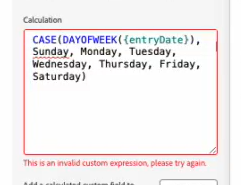

# Gerar ou revisar fórmulas de campo calculado com o Assistente do AI

Você pode usar o Assistente do AI para gerar fórmulas com base em um prompt fornecido. Você também pode resolver erros em suas expressões personalizadas inválidas em campos calculados.

## Requisitos de acesso

Você deve ter o seguinte acesso para executar as etapas deste artigo:

<table style="table-layout:auto"> 
 <col> 
 <col> 
 <tbody> 
  <tr> 
   <td role="rowheader">plano do Adobe Workfront</td> 
   <td>
Novo: Prime ou Ultimate

       
ou

       
Atual: não disponível
</td>
  </tr> 
  <tr> 
   <td role="rowheader">Licença do Adobe Workfront</td> 
   <td>
Novo: Padrão

       
ou

       
Atual: não disponível
</td>
  </tr> 
 </tbody> 
</table>

Para obter mais detalhes sobre as informações nesta tabela, consulte [Requisitos de acesso na documentação do Workfront](/help/quicksilver/administration-and-setup/add-users/access-levels-and-object-permissions/access-level-requirements-in-documentation.md).

## Gerar uma expressão de campo calculado

## Revisar uma expressão de campo calculado

Quando você está criando o campo calculado no construtor de formulários personalizado, uma mensagem de erro será exibida no campo se a fórmula for inválida.

O Assistente de IA pode ajudá-lo a revisar sua fórmula em uma expressão de campo calculado válida.

Para revisar uma expressão de campo calculado inválida:

1. Clique no ícone do **Assistente de IA**  próximo ao canto superior direito da tela.
1. na área de prompt próxima à parte inferior do painel Assistente do AI, digite um prompt como:
   `Rewrite this formula to remove the invalid expression error`
1. Copie a expressão inválida do construtor de formulários personalizado e cole-a na área de prompt.
1. Pressione **Enter**.

   O Assistente de IA pode levar alguns momentos para gerar a fórmula revisada, dependendo do tamanho ou da complexidade da fórmula.
1. Exiba a fórmula revisada no painel Assistente do AI.
1. (Opcional) Copie a fórmula revisada do painel Assistente do AI e cole-a no campo calculado no construtor de formulários personalizado.

>[!NOTE]
>
>Recomendamos testar o campo calculado para garantir que ele recupere o resultado esperado.

Para obter mais informações sobre campos calculados no Workfront, consulte [Adicionar campos calculados a um formulário](/help/quicksilver/administration-and-setup/customize-workfront/create-manage-custom-forms/form-designer/design-a-form/add-a-calculated-field.md).

