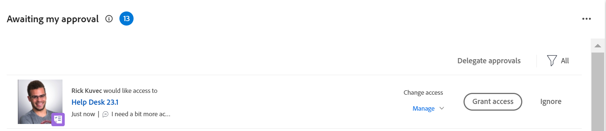

# Conceder acesso a objetos na área da Página inicial

<!--Audited: 10/2024-->

Os usuários podem solicitar acesso a objetos no Adobe Workfront.

Para obter mais informações sobre a solicitação de acesso, consulte [Solicitar acesso a objetos](../../workfront-basics/grant-and-request-access-to-objects/request-access.md).

Se você for o proprietário de um objeto, poderá conceder ou negar acesso aos itens da área da Página inicial.

## Requisitos de acesso

+++ Expanda para visualizar os requisitos de acesso da funcionalidade neste artigo. 

<table style="table-layout:auto"> 
 <col> 
 <col> 
 <tbody> 
  <tr> 
   <td role="rowheader">Pacote do Adobe Workfront</td> 
   <td> 
Qualquer 
 </td> 
  </tr> 
  <tr> 
   <td role="rowheader">Licença do Adobe Workfront</td> 
   <td> 
Padrão
 
   
Trabalho ou maior

   </td> 
  </tr> 
  <tr> 
   <td role="rowheader">Configurações de nível de acesso</td> 
   <td> 
Acesso de visualização ou superior a projetos, tarefas, problemas ou documentos
 </td> 
  </tr> 
  <tr> 
   <td role="rowheader">Permissões de objeto</td> 
   <td> 
Exibir permissões ou permissões superiores para projetos, tarefas, problemas ou documentos
 </td> 
  </tr> 
 </tbody> 
</table>

Para obter mais detalhes sobre as informações contidas nesta tabela, consulte [Requisitos de acesso na documentação do Workfront](/help/quicksilver/administration-and-setup/add-users/access-levels-and-object-permissions/access-level-requirements-in-documentation.md).

+++

## Conceder acesso a objetos na área da Página inicial

1. Clique no **Menu principal**  no canto superior direito da tela ou no **Menu principal**  no canto superior esquerdo, se disponível, em seguida clique em **Página inicial**
Ou
Clique no ícone **Página inicial**  no canto superior esquerdo do Adobe Workfront.

   >[!NOTE]
   >
   >O administrador do Workfront pode fazer as seguintes alterações no ícone Início do ambiente:
   >
   >* Substitua-a por uma imagem personalizada para ilustrar sua organização. Nesse caso, o ícone será diferente do mostrado neste artigo.
   >* Substituir a página vinculada a ela por uma página diferente. Nesse caso, clique no **Menu Principal**  no canto superior direito da página e clique em **Página Inicial**.

1. Faça o seguinte:

   1. Vá para o widget **Minhas aprovações** e localize a solicitação para obter mais acesso e clique em **Conceder acesso**.

      

   1. (Opcional) Para conceder um nível de acesso diferente do solicitado, clique no menu suspenso à esquerda do botão Conceder acesso e selecione o novo acesso e, em seguida, clique em **Conceder acesso**.

      A solicitação de acesso é concedida e desaparece da lista de solicitações de aprovação.

1. (Opcional) Clique em **Ignorar** para negar acesso. A solicitação de acesso não é concedida e desaparece da lista de solicitações de aprovação.

## Configurar notificações por email para solicitações de acesso

Você pode configurar se recebe notificações por email para solicitações de acesso. O administrador do Workfront pode desabilitar esta funcionalidade (conforme descrito em [Configurar notificações de eventos para todos no sistema](../../administration-and-setup/manage-workfront/emails/configure-event-notifications-for-everyone-in-the-system.md)).

1. Acesse seu perfil de usuário seguindo um destes procedimentos:

   * Clique no **Menu principal** , no canto superior direito da tela, e clique no seu nome.
   * Clique no **Menu principal** do Adobe , no canto superior direito, se disponível, e clique em **Perfil do Workfront**.

1. Clique no **Mais** ícone  do menu à direita do seu nome no cabeçalho e clique em **Editar**.
1. Clique em **Notificações** e selecione ou desmarque **Alguém solicitou acesso de mim** na seção **Ação Necessária**, dependendo se você deseja receber notificações por email quando outro usuário solicitar acesso a você ou não.

   Você pode ativar uma notificação diária ou instantânea.

1. Clique em **Salvar alterações**.
