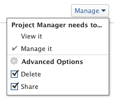

# Compartilhar relatórios, painéis e calendários

O administrador do Adobe Workfront concede aos usuários acesso para visualizar ou editar relatórios, painéis e calendários ao atribuírem níveis de acesso. Para obter mais informações sobre a concessão de acesso a relatórios, painéis e calendários, consulte [Conceder acesso a relatórios, painéis e calendários](../../administration-and-setup/add-users/configure-and-grant-access/grant-access-reports-dashboards-calendars.md).

Além do nível de acesso que os usuários recebem, você também pode conceder a eles permissões para Exibir ou gerenciar relatórios, painéis ou calendários específicos que você tem acesso a Compartilhar. Para obter informações sobre a concessão de permissões de compartilhamento de usuários em objetos, consulte [Visão geral do compartilhamento de permissões em objetos](../../workfront-basics/grant-and-request-access-to-objects/sharing-permissions-on-objects-overview.md).

As permissões são específicas a um item no Workfront e definem quais ações podem ser executadas nesse item.

Para obter informações sobre o que os usuários em cada nível de acesso podem fazer com problemas, consulte a seção [Relatórios](../../administration-and-setup/add-users/access-levels-and-object-permissions/functionality-available-for-each-object-type.md#reports) no artigo [Funcionalidade disponível para cada tipo de objeto](../../administration-and-setup/add-users/access-levels-and-object-permissions/functionality-available-for-each-object-type.md).

## Considerações sobre o compartilhamento de um relatório, painel ou calendário

Além das considerações abaixo, consulte também [Visão geral do compartilhamento de permissões em objetos](../../workfront-basics/grant-and-request-access-to-objects/sharing-permissions-on-objects-overview.md).

>[!NOTE]
>
>Um administrador do Workfront pode adicionar ou remover permissões de qualquer item no sistema, para todos os usuários, sem ser o proprietário desses itens.

* Por padrão, o criador de um relatório, painel ou calendário tem permissões de Gerenciar .
* O compartilhamento de relatórios, painéis e calendários é semelhante ao compartilhamento de qualquer outro objeto no Workfront.

   Para obter mais informações sobre como compartilhar objetos no Workfront, consulte [Compartilhar um objeto](../../workfront-basics/grant-and-request-access-to-objects/share-an-object.md).

   Consulte também os seguintes artigos para saber como compartilhar relatórios, painéis e calendários:

   * [Compartilhar um relatório no Adobe Workfront](../../reports-and-dashboards/reports/creating-and-managing-reports/share-report.md)
   * [Compartilhar um painel](../../reports-and-dashboards/dashboards/creating-and-managing-dashboards/share-dashboard.md)
   * [Compartilhar um relatório de calendário](../../reports-and-dashboards/reports/calendars/share-a-calendar-report.md)

* Você pode compartilhar relatórios e painéis individualmente, ou pode compartilhá-los em massa.

   Você pode compartilhar calendários somente individualmente. Não é possível compartilhá-los em massa.

* Não é possível compartilhar relatórios internos do sistema. Você só pode compartilhar relatórios personalizados.

   Para obter mais informações sobre como salvar um relatório de sistema como um novo relatório personalizado, consulte [Criar uma cópia de um relatório](../../reports-and-dashboards/reports/creating-and-managing-reports/create-copy-report.md).

* Você pode conceder as seguintes permissões a relatórios, painéis e calendários:

   * Exibir

      

   * Gerenciar

      

* Quando você compartilha um painel, os usuários têm permissões de Exibição por padrão para todos os relatórios, calendários e páginas externas no painel.
* Os usuários com uma licença de Solicitação não podem exibir um relatório do sistema inteiro. Um relatório deve ser compartilhado com os Solicitantes individualmente se eles precisarem exibi-lo.
* Se um relatório tiver um prompt e você o compartilhar publicamente, os usuários que acessam o relatório deverão estar conectados ao Workfront para poderem executar o relatório usando o prompt. Caso não consigam fazer logon no Workfront, o relatório será exibido sem o prompt aplicado.\
   Para obter mais informações sobre limitações de relatórios de compartilhamento com prompts, consulte a seção [Limitações do compartilhamento de relatórios solicitados](../../reports-and-dashboards/reports/creating-and-managing-reports/add-prompt-report.md#limitations-of-running-public-prompted-reports) no artigo [Adicionar um prompt a um relatório](../../reports-and-dashboards/reports/creating-and-managing-reports/add-prompt-report.md).

* Você pode remover permissões herdadas de um relatório ou calendário.

   Para obter mais informações sobre como remover permissões herdadas de objetos, consulte [Remover permissões de objetos](../../workfront-basics/grant-and-request-access-to-objects/remove-permissions-from-objects.md).

* Você também pode compartilhar um relatório ou um calendário publicamente ou em todo o sistema.

   Não é possível compartilhar um painel publicamente, mas é possível compartilhá-lo em todo o sistema.

   >[!CAUTION]
   >
   >Recomendamos que você tenha cuidado ao compartilhar um objeto contendo informações confidenciais com usuários externos. Isso permite que eles visualizem informações sem ser usuários da Workfront ou parte de sua organização.
