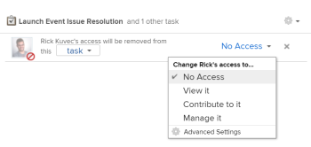

# Remover permissões de objetos

É possível remover as permissões de outros usuários em objetos que você tem acesso a Compartilhar. A remoção de permissões de objetos é idêntica para todos os objetos que podem ser compartilhados. 

Considerações semelhantes para compartilhamento de objetos se aplicam à remoção de permissões de objetos. Para obter mais informações, consulte a seção [Considerações sobre o compartilhamento de objetos](../../workfront-basics/grant-and-request-access-to-objects/sharing-permissions-on-objects-overview.md#consider) no artigo [Visão geral do compartilhamento de permissões em objetos](../../workfront-basics/grant-and-request-access-to-objects/sharing-permissions-on-objects-overview.md)

## Requisitos de acesso

<!--drafted for P&P:

<table style="table-layout:auto"> 
 <col> 
 <col> 
 <tbody> 
  <tr> 
   <td role="rowheader">Adobe Workfront plan*</td> 
   <td> 
Any 
 </td> 
  </tr> 
  <tr> 
   <td role="rowheader">Workfront license*</td> 
   <td> 
Current license: Contributor or higher

   Or  
   
Legacy license: Request or higher

   
<b>NOTE</b>

   
Some objects require a higher access than Request. 

   
   
For example, for the current license, a Contributor can share issues, but only Standard-license users can share a project.

   
   
For the legacy license, a Requestor can share issues, but only Workers or Planners can share a project.
 
   </td> 
  </tr> 
  <tr> 
   <td role="rowheader">Access level configurations*</td> 
   <td> 
View access or higher to the objects you want to share
 
<b>NOTE</b>
   
   If you still don't have access, ask your Workfront administrator if they set additional restrictions in your access level. For information on how a Workfront administrator can modify your access level, see <a href="../../administration-and-setup/add-users/configure-and-grant-access/create-modify-access-levels.md" class="MCXref xref">Create or modify custom access levels</a>.
 </td> 
  </tr> 
  <tr> 
   <td role="rowheader">Object permissions</td> 
   <td> 
View permissions or higher to the objects you want to share
 
Manage permissions to remove inherited permissions on objects
 
For information on requesting additional access, see <a href="../../workfront-basics/grant-and-request-access-to-objects/request-access.md" class="MCXref xref">Request access to objects </a>.
 </td> 
  </tr> 
 </tbody> 
</table>
-->

Você deve ter o seguinte para compartilhar objetos:

<table style="table-layout:auto"> 
 <col> 
 <col> 
 <tbody> 
  <tr> 
   <td role="rowheader">Plano Adobe Workfront*</td> 
   <td> 
Qualquer Um 
 </td> 
  </tr> 
  <tr> 
   <td role="rowheader">Licença da Workfront*</td> 
   <td> 
Solicitação ou superior

   
<b>Nota</b>

Alguns objetos exigem um acesso mais alto do que a Solicitação. Por exemplo, um Solicitante pode compartilhar problemas, mas somente Trabalhadores ou Planejadores podem compartilhar um projeto.

</td> 
  </tr> 
  <tr> 
   <td role="rowheader">Configurações de nível de acesso*</td> 
   <td> 
Exibir o acesso ou superior aos objetos que deseja compartilhar
 
<b>Nota</b>

Caso ainda não tenha acesso, pergunte ao administrador do Workfront se ele definiu restrições adicionais em seu nível de acesso. Para obter informações sobre como um administrador do Workfront pode modificar seu nível de acesso, consulte <a href="../../administration-and-setup/add-users/configure-and-grant-access/create-modify-access-levels.md" class="MCXref xref">Criar ou modificar níveis de acesso personalizados</a>.
 </td>
</tr> 
  <tr> 
   <td role="rowheader">Permissões de objeto</td> 
   <td> 
Exibir permissões ou superiores aos objetos que deseja compartilhar
 
Gerencie permissões para remover permissões herdadas em objetos
 
Para obter informações sobre como solicitar acesso adicional, consulte <a href="../../workfront-basics/grant-and-request-access-to-objects/request-access.md" class="MCXref xref">Solicitar acesso a objetos </a>.
 </td> 
  </tr> 
 </tbody> 
</table>

&#42;Para descobrir qual plano, tipo de licença ou acesso você tem, entre em contato com o administrador da Workfront.

## Remover entidades da lista de compartilhamento de um objeto {#remove-entities-from-the-sharing-list-of-an-object}

Você pode remover entidades (usuários, funções de trabalho, equipes, grupos, empresas) da lista de compartilhamento de um objeto. Isso remove as permissões do objeto.

1. Vá para o objeto que deseja compartilhar.

   Para obter informações sobre quais objetos podem ser compartilhados, consulte [Visão geral do compartilhamento de permissões em objetos](../../workfront-basics/grant-and-request-access-to-objects/sharing-permissions-on-objects-overview.md).

1. Clique no botão **Mais** ícone ao lado do nome do objeto, clique em **Compartilhamento** ou **Compartilhar.**

   

1. Clique no botão **x** ao lado do nome de um usuário, equipe, grupo, empresa, função de trabalho para removê-los na caixa de acesso ao objeto.

   

1. No `<User Name>`O acesso ao Workfront do será removido desse menu suspenso, selecione se deseja que o acesso seja removido apenas do objeto selecionado ou de todos os objetos filhos associados a ele.\
   Os seguintes cenários existem:

   * Se você remover a entidade somente do objeto, essa entidade perderá as permissões no objeto e as permissões herdadas para os objetos filhos. Se tiverem recebido permissões anteriormente para os itens filhos individualmente, eles manterão as mesmas permissões em todos os objetos filhos associados a eles quando você selecionar essa opção. 
   * Se você remover a entidade do objeto e todos os objetos filhos, essa entidade perderá as permissões para o objeto e para todos os objetos filhos, mesmo quando tiverem recebido anteriormente permissões individuais em cada objeto filho. 

1. Clique em **Salvar**.

## Remover permissões de vários objetos em massa

Você pode remover entidades (usuários, funções de job, equipes, grupos, empresas) de vários objetos de uma vez quando você os seleciona em massa em uma lista. 

>[!NOTE]
>
>Não é possível exibir o que as entidades de acesso têm para todos os objetos selecionados ao selecioná-los em massa. Você deve saber qual entidade deseja remover do compartilhamento dos objetos selecionados antes de remover suas permissões.

1. Vá para a lista de objetos que deseja compartilhar.

   Para obter informações sobre quais objetos podem ser compartilhados, consulte [Visão geral do compartilhamento de permissões em objetos](../../workfront-basics/grant-and-request-access-to-objects/sharing-permissions-on-objects-overview.md).

1. Selecione vários objetos na lista e clique no botão **Compartilhar** ícone na parte superior da lista.
1. Digite o nome do usuário, função, equipe, grupo ou empresa para os quais você deseja remover o acesso no **Editar `<Object Name>` acesso a** campo.
1. No menu suspenso de acesso, selecione **Sem acesso**.

   

1. No `<User Name>`O acesso ao Workfront do será removido desse menu suspenso, selecione se deseja que o acesso seja removido apenas dos objetos selecionados ou de todos os outros objetos filhos associados a ele.\
   Os seguintes cenários existem:

   * Se você remover a entidade somente do objeto, essa entidade perderá as permissões no objeto e as permissões herdadas para os objetos filhos. Se tiverem recebido permissões anteriormente para os itens filhos individualmente, eles manterão as mesmas permissões em todos os objetos filhos associados a eles quando você selecionar essa opção. 
   * Se você remover a entidade do objeto e todos os objetos filhos, essa entidade perderá as permissões para o objeto e para todos os objetos filhos, mesmo quando tiverem recebido anteriormente permissões individuais em cada objeto filho.

   **Exemplo:** Selecione se deseja remover permissões somente das tarefas selecionadas em uma lista ou também dos problemas e documentos anexados às tarefas.

   

1. (Opcional) Para alterar permissões em massa para vários objetos, selecione outro nível de compartilhamento para a entidade selecionada.

   Por exemplo, se eles tiverem permissões de Gerenciamento, selecione Contribute ou Exibir.

1. Clique em **Salvar**.

## Remover permissões herdadas

Permissões herdadas podem ser removidas de objetos, permitindo que os proprietários identifiquem especificamente quem terá acesso a objetos filhos, independentemente do acesso de um usuário a um objeto pai.

>[!IMPORTANT]
>
>Somente os usuários com permissão de Gerenciar podem remover permissões herdadas.

Para remover permissões herdadas:

1. Vá para um objeto para o qual tenha permissões de gerenciamento. Por exemplo, vá para uma tarefa .
1. Vá para a caixa de acesso do objeto, conforme descrito na [Remover entidades da lista de compartilhamento de um objeto](#remove-entities-from-the-sharing-list-of-an-object) neste artigo.
1. Selecione o **x** ao lado de **Permissão herdada** na caixa de compartilhamento para remover qualquer pessoa listada lá.

   

   Isso garante que ninguém que receba permissões para o objeto pai (por exemplo, o projeto) tenha permissões para essa tarefa por padrão. Você deve listar entidades individuais na lista de compartilhamento da tarefa para conceder permissões na tarefa.

   >[!TIP]
   >
   >Não é possível remover entidades individuais da lista Permissões herdadas. Você só pode desativar as Permissões herdadas para todas as entidades listadas.

1. Clique em **Salvar**. 

## Tornar um objeto privado

Se você compartilhou um objeto em todo o sistema ou compartilhou com usuários externos ao torná-lo público, é possível torná-lo privado novamente removendo as permissões públicas ou em todo o sistema. 

Para obter mais informações sobre como tornar um objeto disponível em todo o sistema ou publicamente, consulte [Compartilhar um objeto](../../workfront-basics/grant-and-request-access-to-objects/share-an-object.md).

Para tornar um objeto privado:

1. Vá para o objeto que deseja tornar privado.\
   Por exemplo, navegue até um relatório.
1. Clique em **Ações de Relatório**, em seguida **Compartilhamento**.

   

1. Clique em **Remover acesso público** para remover o acesso de usuários externos à visualização do relatório.
1. Clique em **Remova o acesso em todo o sistema** para interromper o compartilhamento com todos os usuários do Workfront. 
1. Clique em **Salvar**.
