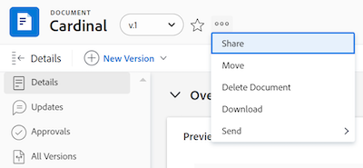

# Remover permissões de objetos

<!--Audited: 01/2024-->

Você pode remover as permissões de outros usuários nos objetos aos quais você tem acesso para compartilhar. A remoção de permissões de objetos é idêntica para todos os objetos que podem ser compartilhados.

Considerações semelhantes às dos objetos de compartilhamento se aplicam à remoção de permissões de objetos. Para obter mais informações, consulte a seção [Considerações sobre objetos de compartilhamento](../../workfront-basics/grant-and-request-access-to-objects/sharing-permissions-on-objects-overview.md#consider) no artigo [Visão geral das permissões de compartilhamento em objetos](../../workfront-basics/grant-and-request-access-to-objects/sharing-permissions-on-objects-overview.md)

## Requisitos de acesso

Você deve ter o seguinte para compartilhar objetos:

<table style="table-layout:auto"> 
 <col> 
 <col> 
 <tbody> 
  <tr> 
   <td role="rowheader">plano do Adobe Workfront</td> 
   <td> 
Qualquer 
 </td> 
  </tr> 
  <tr> 
   <td role="rowheader">Licença da Workfront*</td> 
   <td> 
Nova licença: Contributor ou superior

   Ou  
   
Licença atual: Solicitação ou superior

   
<b>Nota</b>

Alguns objetos exigem um acesso maior do que a Solicitação. 

Por exemplo, para a nova licença, um Colaborador pode compartilhar problemas, mas somente os usuários com licença Padrão podem compartilhar um projeto.

Para a licença atual, um Solicitante pode compartilhar ocorrências, mas somente Trabalhadores ou Planejadores podem compartilhar um projeto.
 
   </td> 
  </tr> 
  <tr> 
   <td role="rowheader">Configurações de nível de acesso</td> 
   <td> 
Exibir o acesso ou superior aos objetos que você deseja compartilhar
 </td> 
  </tr> 
  <tr> 
   <td role="rowheader">Permissões de objeto</td> 
   <td> 
Exibir permissões ou superiores aos objetos que você deseja compartilhar
 
Gerenciar permissões para remover permissões herdadas em objetos
  </td> 
  </tr> 
 </tbody> 
</table>

*Para descobrir que plano, tipo de licença ou acesso você tem, entre em contato com o administrador do Workfront. Para obter mais informações, consulte [Requisitos de acesso para a documentação do Workfront](/help/quicksilver/administration-and-setup/add-users/access-levels-and-object-permissions/access-level-requirements-in-documentation.md).

## Remover entidades da lista de compartilhamento de um objeto {#remove-entities-from-the-sharing-list-of-an-object}

Você pode remover entidades (usuários, funções de trabalho, equipes, grupos, empresas) da lista de compartilhamento de um objeto. Isso remove as permissões no objeto.

1. Vá para o objeto do qual deseja remover as permissões.

   Para obter informações sobre quais objetos podem ser compartilhados, consulte [Visão geral das permissões de compartilhamento em objetos](../../workfront-basics/grant-and-request-access-to-objects/sharing-permissions-on-objects-overview.md).

1. (Condicional) Para programas, portfólios e documentos, faça o seguinte:

   1. Clique no ícone **Mais** ao lado do nome do objeto e clique em **Compartilhamento** ou **Compartilhar.**

      

   1. Clique em **x** ao lado do nome de um usuário, equipe, grupo, empresa ou função de trabalho para removê-los na caixa de acesso do objeto.

      

   1. No **&lt; Nome do Usuário >, o acesso ao Workfront do será removido deste menu suspenso**. Selecione se deseja que o acesso seja removido apenas do objeto selecionado ou de todos os objetos filho associados a ele.

1. (Condicional) Para projetos, tarefas e problemas, faça o seguinte:

   1. Clique em **Compartilhar** à direita do nome do objeto.

      
   1. Localize o usuário, a função, a equipe, o grupo ou a empresa que deseja remover do objeto.
   1. Clique em **Remover**.
No menu suspenso **Remover &lt; Nome do Usuário > de**, selecione se deseja que o acesso seja removido apenas do objeto selecionado ou de todos os objetos filho associados a ele.

      

   Existem os seguintes cenários:

   * Se você remover a entidade somente do objeto, essa entidade perderá suas permissões no objeto e suas permissões herdadas nos objetos filhos. Se eles receberam permissões para os itens filhos individualmente, eles manterão as mesmas permissões em todos os objetos filhos associados a eles quando você selecionar essa opção.
   * Se você remover a entidade do objeto e de todos os objetos filho, ela perderá suas permissões para o objeto e para todos os objetos filho, mesmo quando tiver recebido permissão individual para cada objeto filho.

1. Clique em **Salvar**.

## Remover permissões de vários objetos em massa

É possível remover entidades (usuários, funções de trabalho, equipes, grupos, empresas) de vários objetos ao mesmo tempo em que você as seleciona em massa em uma lista.

>[!NOTE]
>
>Você não pode visualizar o que as entidades de acesso têm para todos os objetos selecionados ao selecioná-los em massa. Você deve saber qual entidade deseja remover do compartilhamento dos objetos selecionados antes de remover suas permissões.

1. Vá para a lista de objetos que você deseja compartilhar.

   Para obter informações sobre quais objetos podem ser compartilhados, consulte [Visão geral das permissões de compartilhamento em objetos](../../workfront-basics/grant-and-request-access-to-objects/sharing-permissions-on-objects-overview.md).

1. Selecione vários objetos na lista e clique no ícone Compartilhar **na parte superior da lista.**
1. Digite o nome do usuário, função, equipe, grupo ou empresa para o qual deseja remover o acesso no campo **Editar acesso de `<Object Name>` a**.
1. No menu suspenso de acesso, selecione **Sem acesso**.

   

1. No menu suspenso, o acesso ao Workfront de `<User Name>` será removido. Selecione se deseja que o acesso seja removido apenas dos objetos selecionados ou de todos os outros objetos filho associados a ele.\
   Existem os seguintes cenários:

   * Se você remover a entidade somente do objeto, essa entidade perderá suas permissões no objeto e suas permissões herdadas nos objetos filhos. Se eles receberam permissões para os itens filhos individualmente, eles manterão as mesmas permissões em todos os objetos filhos associados a eles quando você selecionar essa opção. 
   * Se você remover a entidade do objeto e de todos os objetos filho, ela perderá suas permissões para o objeto e para todos os objetos filho, mesmo quando tiver recebido permissão individual para cada objeto filho.

   **Exemplo:** Selecione se deseja remover permissões apenas para as tarefas selecionadas em uma lista ou também para os problemas e documentos anexados às tarefas.

   

1. (Opcional) Para alterar as permissões em massa para vários objetos, selecione outro nível de compartilhamento para a entidade selecionada.

   Por exemplo, se eles tiverem Gerenciar permissões, selecione Contribute ou Exibir.

1. Clique em **Salvar**.

## Remover permissões herdadas

As permissões herdadas podem ser removidas dos objetos, permitindo que os proprietários identifiquem especificamente quem terá acesso aos objetos filhos, independentemente do acesso de um usuário a um objeto pai.

>[!IMPORTANT]
>
>Somente usuários com a permissão Gerenciar podem remover permissões herdadas.

Para remover permissões herdadas:

1. Vá para um objeto para o qual você tenha permissões de gerenciamento. Por exemplo, vá para uma tarefa.
1. Vá para a caixa de acesso do objeto conforme descrito na seção [Remover entidades da lista de compartilhamento de um objeto](#remove-entities-from-the-sharing-list-of-an-object) deste artigo.
1. Selecione a **x** ao lado de **Permissão Herdada** na caixa de compartilhamento para remover qualquer pessoa listada lá.

   

   Isso garante que ninguém que receba permissões para o objeto principal (por exemplo, o projeto) tenha permissões para essa tarefa por padrão. Você deve listar  entidades individuais na lista de compartilhamento da tarefa para conceder permissões na tarefa.

   >[!TIP]
   >
   >Não é possível remover entidades individuais da lista de Permissões herdadas. Você só pode desativar as Permissões herdadas para todas as entidades listadas.

1. Clique em **Salvar**. 

## Tornar um objeto privado

Se você tiver compartilhado um objeto em todo o sistema ou se tiver compartilhado com usuários externos tornando-o público, poderá torná-lo privado novamente removendo as permissões em todo o sistema ou públicas. 

Para obter mais informações sobre como disponibilizar um objeto em todo o sistema ou publicamente, consulte [Compartilhar um objeto](../../workfront-basics/grant-and-request-access-to-objects/share-an-object.md).

Para tornar um objeto privado:

1. Vá para o objeto que deseja tornar privado.\
   Por exemplo, navegue até um relatório.
1. Clique em **Ações de Relatório** e depois em **Compartilhamento**.

   

1. Clique em **Remover acesso público** para remover o acesso de usuários externos à exibição do relatório.
1. Clique em **Remover acesso a todo o sistema** para interromper o compartilhamento com todos os usuários do Workfront. 
1. Clique em **Salvar**.
