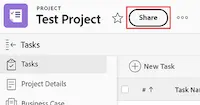

# Compartilhar um projeto

<!-- Audited: 1/2024 -->

O administrador do Adobe Workfront pode conceder acesso para visualizar ou editar projetos ao atribuir seu nível de acesso. Para obter mais informações, consulte [Conceder acesso aos projetos](../../administration-and-setup/add-users/configure-and-grant-access/grant-access-projects.md).

Juntamente com o nível de acesso concedido aos usuários, você também pode conceder a eles permissões para Exibir, Contribute ou Gerenciar projetos específicos que você tenha acesso para compartilhar.

As permissões são específicas a um item no Workfront e definem quais ações podem ser executadas nesse item.

## Requisitos de acesso

+++ Expanda para visualizar os requisitos de acesso para a funcionalidade neste artigo. 

<table style="table-layout:auto"> 
 <col> 
 <col> 
 <tbody> 
  <tr> 
   <td role="rowheader">Pacote do Adobe Workfront</td> 
   <td> 
Qualquer
 </td> 
  </tr> 
  <tr> 
   <td role="rowheader">Licença do Adobe Workfront</td> 
   <td> 
Standard
 
   
Trabalhar ou superior
 
   </td> 
  </tr> 
  <tr> 
   <td role="rowheader">Configurações de nível de acesso</td> 
   <td> 
Exibir o acesso ou superior aos objetos que você deseja compartilhar
 </td> 
  </tr> 
  <tr> 
   <td role="rowheader">Permissões de objeto</td> 
   <td> 
Exibir permissões ou superiores aos objetos que você deseja compartilhar
</td> 
  </tr> 
 </tbody> 
</table>

Para obter mais detalhes sobre as informações nesta tabela, consulte [Requisitos de acesso na documentação do Workfront](/help/quicksilver/administration-and-setup/add-users/access-levels-and-object-permissions/access-level-requirements-in-documentation.md).

+++

## Considerações sobre o compartilhamento de projetos

Além das considerações abaixo, consulte também [Visão geral das permissões de compartilhamento em objetos](../../workfront-basics/grant-and-request-access-to-objects/sharing-permissions-on-objects-overview.md).

* Por padrão, o criador de um projeto tem permissões para gerenciar o projeto e também é designado como o Proprietário do projeto. Se o projeto for atribuído a outro proprietário, esse usuário também terá permissões para gerenciar o projeto. Quando o criador (ou proprietário) do projeto compartilha o projeto com outros usuários, ele concede determinadas permissões a esses usuários para controlar o que eles podem fazer enquanto trabalham no projeto.

  No entanto, se o proprietário de um projeto não tiver uma licença Plan ou Standard, ele não terá acesso total para gerenciar o projeto. Somente um usuário com uma licença do Plan ou Standard pode ter permissões para gerenciar um projeto. Para obter mais informações, consulte [Como os níveis de acesso e as permissões funcionam juntos](../../administration-and-setup/add-users/access-levels-and-object-permissions/how-access-levels-permissions-work-together.md).

* Você pode compartilhar projetos individualmente ou vários deles de cada vez. O compartilhamento de projetos é idêntico ao compartilhamento de outros objetos. Para obter mais informações sobre como compartilhar itens no Workfront, consulte [Compartilhar um objeto](../../workfront-basics/grant-and-request-access-to-objects/share-an-object.md).
* Você pode conceder as seguintes permissões a um projeto:

   * Exibir
   * Gerenciar
   * Contribuir

* Quando você compartilha um projeto, todas as tarefas, problemas e documentos herdam as mesmas permissões, a menos que especificado de outra forma.

  Para obter informações sobre como gerenciar o acesso a tarefas e problemas no projeto com base nas permissões de um usuário para o projeto, consulte a seção [&#128279;](../../manage-work/projects/manage-projects/edit-projects.md#access) no artigo [Editar projetos](../../manage-work/projects/manage-projects/edit-projects.md).

  O administrador do Workfront pode especificar se os documentos devem herdar permissões de objetos superiores no nível de acesso do usuário. Para obter mais informações sobre como restringir permissões herdadas em documentos, consulte [Criar ou modificar níveis de acesso personalizados](../../administration-and-setup/add-users/configure-and-grant-access/create-modify-access-levels.md).

* Você pode remover permissões herdadas de um projeto para que os objetos filhos não as herdem. Para obter mais informações sobre como remover permissões herdadas de objetos, consulte [Remover permissões de objetos](../../workfront-basics/grant-and-request-access-to-objects/remove-permissions-from-objects.md).

## Limitações para diferentes tipos de licença

* Os usuários com uma licença de Trabalhador não têm permissões para gerenciar projetos. Para os funcionários, a maior permissão de compartilhamento é o Contribute.
* Os usuários com uma Solicitação de licença podem visualizar informações do projeto, mas têm acesso limitado ao projeto.
* Uma exceção à alteração do status de um projeto ocorre quando um usuário com permissões de Exibição ou Contribute também é incluído em um processo de aprovação. Eles podem aprovar o projeto, o que altera o status do projeto, mas o status é o status predefinido para aprovação ou rejeição.
* Para poder copiar um projeto, um usuário também deve ter acesso para criar projetos em seu Nível de acesso.

## Maneiras de compartilhar um projeto {#ways-to-share-a-project}

Você pode compartilhar um projeto das seguintes maneiras:

* Manualmente, seguindo um destes procedimentos:

   * Adicionar usuários à equipe do projeto. Quando você adiciona usuários à equipe do projeto, eles obtêm automaticamente permissões de Visualização para o projeto.\
     Para obter mais informações sobre como adicionar usuários a uma equipe de projeto, consulte a seção Adicionando usuários a uma equipe de projeto na [Visão geral da Equipe de Projeto](../../manage-work/projects/planning-a-project/project-team-overview.md).
   * Compartilhamento individual ou em massa de projetos ao usar a opção **Compartilhamento**.

* Automaticamente, seguindo um destes procedimentos:

   * Coloque um projeto em um **Portfolio** ou **Programa** que já esteja compartilhado com outras pessoas. Os usuários obtêm as mesmas permissões para o projeto que têm para o portfólio ou programa.\
     Para obter informações sobre como adicionar um projeto a um **Portfolio**, consulte [Adicionar projetos a um portfólio](../../manage-work/portfolios/create-and-manage-portfolios/add-projects-to-portfolios.md).\
     Para obter informações sobre como adicionar um projeto a um **Programa**, consulte [Adicionar um projeto a um programa](../../manage-work/portfolios/create-and-manage-programs/add-project-to-program.md).
Para obter informações sobre a exibição de permissões herdadas em um objeto, consulte [Exibir permissões herdadas em objetos](../../workfront-basics/grant-and-request-access-to-objects/view-inherited-permissions-on-objects.md).

   * Adicione entidades ao Compartilhamento de projeto em um modelo usado para criar o projeto. Para obter informações sobre como compartilhar projetos a partir de modelos, consulte [Compartilhar um modelo](../../workfront-basics/grant-and-request-access-to-objects/share-a-template.md).
   * Defina o modelo de acesso ao projeto.

     >[!TIP]
     >
     >Ao anexar ou salvar um modelo, você pode apagar as regras de Compartilhamento do projeto de modelo.

   * Editar um projeto e definir a configuração **Quando alguém tiver acesso a este projeto**. Para obter mais informações, consulte [Editar projetos](../../manage-work/projects/manage-projects/edit-projects.md).

<!--

(NOTE: drafted because I created new article and linked it above) 

To view what users have inherited the access on the project from a portfolio or a program, do the following:

<ol style="list-style-type: lower-alpha;">
<li value="1">Go to a project whose sharing permissions you want to view. </li>
<li value="2"> Click the <strong>More</strong> menu , then click <strong>Sharing</strong>. </li>
<li value="3"> 
Expand the <strong>Inherited Permissions</strong> list. 
 
This list displays the names of users that have access to either the portfolio or the program that the project belongs to and also have permissions to the project. 
  </li>
</ol>

-->

<!--
<ol data-mc-conditions="QuicksilverOrClassic.Draft mode">
<li value="1">Go to a project whose sharing permissions you want for all projects you create from scratch. (NOTE: drafted because linked above)&nbsp;</li>
<li value="2"> Click the More menu, then click <strong>Sharing</strong>. </li>
<li value="3"> 
In the Project Access box that displays, near the upper-right corner, click the gear icon , then click <strong>Set as my project access template</strong>.
 
The entities that are granted permissions on the selected project have the same permissions for all the projects you create from scratch in the future.
 
 The project access template overrides the sharing defaults granted to you by the Workfront administrator in your Access Level. For more information about specifying sharing defaults for projects in the Access Level, see <a href="../../administration-and-setup/add-users/configure-and-grant-access/grant-access-projects.md" class="MCXref xref">Grant access to projects</a>.
 </li>
<li value="4">Click <strong>Save</strong>.</li>
</ol>
-->

## Compartilhar um projeto

{{step1-to-projects}}

1. Na página **Projetos**, selecione o projeto que deseja compartilhar na lista. A página do projeto é aberta.

1. À direita do nome do projeto, clique em **Compartilhar**. A caixa de diálogo **Compartilhar [Nome do Projeto]** será aberta.

   

1. No campo **Conceder acesso ao projeto**, comece digitando o nome do usuário, equipe, função, grupo ou empresa com a qual deseja compartilhar o projeto e clique no nome quando ele aparecer na lista suspensa.

   >[!TIP]
   >
   >Você só pode compartilhar um projeto com usuários, equipes, funções ou empresas ativos.

1. (Opcional) Selecione o menu suspenso **Quem tem acesso** e selecione o nível de acesso do projeto:

   * **Somente pessoas convidadas podem acessá-lo:** Somente usuários convidados para o projeto podem acessá-lo (Padrão).
   * **Todos no sistema podem exibir**: todos os usuários do sistema podem exibir o projeto sem um convite.

1. (Opcional) Para aplicar automaticamente as configurações de acesso do projeto que você selecionou a todos os novos projetos, clique no ícone **Engrenagem**  e marque a caixa de seleção integrada com **Definir como meu modelo de acesso ao projeto**.

   >[!NOTE]
   >
   >O modelo de acesso ao projeto substitui os padrões de compartilhamento concedidos a você pelo administrador do Workfront em seu Nível de acesso.\
   >Para obter mais informações sobre como especificar padrões de compartilhamento para projetos no Nível de Acesso, consulte [Conceder acesso aos projetos](../../administration-and-setup/add-users/configure-and-grant-access/grant-access-projects.md)

   <!--
   >this note also appears in Understanding Project Permissions-->

1. Clique no menu suspenso à direita do nome do usuário e selecione o nível de permissão para este projeto:

   * **Exibir**: o usuário pode revisar e compartilhar o projeto.
   * **Contribute**: o usuário pode fazer atualizações, registrar informações, fazer pequenas edições e compartilhar o projeto (também inclui todas as permissões de exibição).
   * **Gerenciar**: o usuário tem acesso total ao projeto sem direitos administrativos, que são concedidos no nível de acesso (também inclui todas as permissões de Exibição e Contribute).

1. (Opcional) Clique no ícone de opções avançadas ao lado do nível de permissão que você concedeu para configurar permissões específicas no projeto.

   

1. (Opcional) Para compartilhar rapidamente o projeto usando um link, clique em **Copiar link** e encaminhe-o para o destinatário.

1. Clique em **Salvar**.

## Compartilhar projetos em massa

{{step1-to-projects}}

1. Na página **Projetos**, selecione a caixa à esquerda de cada projeto que você deseja compartilhar e clique no ícone **Compartilhar**  na parte superior da página. O modal de compartilhamento é aberto.

   

1. No campo **Conceder acesso ao projeto para**, comece digitando o nome do usuário, equipe, função, grupo ou empresa com a qual deseja compartilhar os projetos e clique no nome quando ele aparecer na lista suspensa.

   >[!TIP]
   >
   >Você só pode compartilhar projetos com usuários, equipes, funções ou empresas ativos.

1. (Opcional) Selecione o menu suspenso **Quem tem acesso** e selecione o nível de acesso dos projetos:

   * **Somente pessoas convidadas podem acessá-las:** Somente usuários convidados para os projetos podem acessá-las (Padrão).
   * **Todos no sistema podem exibir**: todos os usuários do sistema podem exibir os projetos sem um convite.

1. Clique no menu suspenso à direita do nome do usuário e selecione o nível de permissão para os projetos:

   * **Exibir**: o usuário pode revisar e compartilhar os projetos.
   * **Contribute**: o usuário pode fazer atualizações, registrar informações, fazer pequenas edições e compartilhar os projetos (também inclui todas as permissões de exibição).
   * **Gerenciar**: o usuário tem acesso total aos projetos sem direitos administrativos, que são concedidos no nível de acesso (também inclui todas as permissões de Exibição e Contribute).

1. (Opcional) Clique no ícone de opções avançadas ao lado do nível de permissão que você concedeu para configurar permissões específicas nos projetos.

   

1. Clique em **Salvar**.

<!--

<h2>Configure default permissions for a project</h2>

(NOTE: drafted because I added one more way to automatically share the project above in the bullet list and linked it to Edit Projects) 

As a project owner, you can configure the default permissions for View, Manage, and Contribute access that are used when sharing&nbsp;the project with others. When users share a project, the default permissions are used. Users can then adjust the default permissions when sharing the project, as described in <a title="Project Permissions" href="#ways-to-share-a-project" class="MCXref xref">Ways to share a project</a>. 

To configure the default permissions that are included with each access level:

<ol>
<li value="1">Go to the project where you want to set the default permissions.</li>
<li value="2"> 
Click the More menu , then click <strong>Edit</strong>. 
 
 
 </li>
<li value="3">Click <strong>Access</strong> in the list on the left.</li>
<li value="4"> 
In the <strong>When someone is given access to this PROJECT</strong> section, select permissions that you want to be available when users are given access to the project via sharing.
 
Ensure that any permissions that you want to include in the selected access level are selected and deselect any permissions that you do not want to include in the selected permissions level.
 
To view which permissions are available for each level, see&nbsp;<a title="Project Permissions" href="#Understanding_Project_Permissions" class="MCXref xref">Share a project in Adobe Workfront</a>.
 <note type="note">
The
<strong>Delete</strong> access in the
<strong>Manage</strong> permission level determines whether users can&nbsp;delete the project itself. Users with
<strong>Manage</strong> access to the project can delete tasks and issues within the project regardless of whether this option is selected, if they have
<strong>Manage</strong> permissions to the tasks and issues.&nbsp;
</note> </li>
<li value="5">Click <strong>Save Changes</strong>.</li>
</ol>

-->

## Opções de permissão do projeto

A tabela a seguir lista as permissões que os usuários podem conceder ao compartilhar um projeto. Para obter mais informações sobre o acesso que os usuários obtêm com base em suas licenças, consulte [Conceder acesso aos projetos](../../administration-and-setup/add-users/configure-and-grant-access/grant-access-projects.md).

<table border="1" cellspacing="15" cellpadding="1"> 
 <col> 
 <col> 
 <col> 
 <col> 
 <thead> 
  <tr> 
   <th> 
<strong>Ações</strong> 
 </th> 
   <th> 
<strong>Gerenciar</strong> 
 </th> 
   <th> 
<strong>Contribute</strong> 
 </th> 
   <th> 
<strong>Exibir</strong> 
 </th> 
  </tr> 
 </thead> 
 <tbody> 
  <tr> 
   <td> 
Adicionar formulário personalizado
 </td> 
   <td> 
✓
 </td> 
   <td> 
 
 </td> 
   <td> 
 
 </td> 
  </tr> 
  <tr> 
   <td> 
Atualizar campos personalizados
 </td> 
   <td> 
✓
 </td> 
   <td> 
✓
 </td> 
   <td> 
 
 </td> 
  </tr> 
  <tr> 
   <td> 
Adicionar Um Processo De Aprovação
 </td> 
   <td> 
✓
 </td> 
   <td> 
 
 </td> 
   <td> 
 
 </td> 
  </tr> 
  <tr> 
   <td> 
Aprovar um projeto
 </td> 
   <td> 
✓
 </td> 
   <td> 
✓
 </td> 
   <td> 
✓
 </td> 
  </tr> 
  <tr> 
   <td> 
Aprovar horas
 </td> 
   <td> 
✓
 </td> 
   <td> 
✓ 
 </td> 
   <td> 
 
 </td> 
  </tr> 
  <tr> 
   <td> 
Criar Um Projeto
 </td> 
   <td> 
✓
 </td> 
   <td> 
 
 </td> 
   <td> 
 
 </td> 
  </tr> 
  <tr> 
   <td> 
Adicionar documento(s)
 </td> 
   <td> 
✓
 </td> 
   <td> 
✓
 </td> 
   <td> 
✓
 </td> 
  </tr> 
  <tr> 
   <td> 
Adicionar problema(s)
 </td> 
   <td> 
✓
 </td> 
   <td> 
✓
 </td> 
   <td> 
✓
 </td> 
  </tr> 
  <tr> 
   <td> 
Adicionar tarefa(s)
 </td> 
   <td> 
✓
 </td> 
   <td> 
✓
 </td> 
   <td> 
 
 </td> 
  </tr> 
  <tr> 
   <td> 
Copiar Projeto
 </td> 
   <td> 
 
 </td> 
   <td> 
✓
 </td> 
   <td> 
 
 </td> 
  </tr> 
  <tr> 
   <td> 
Excluir Projeto
 </td> 
   <td> 
✓
 </td> 
   <td> 
 
 </td> 
   <td> 
 
 </td> 
  </tr> 
  <tr> 
   <td> 
Modificar Datas Planejadas
 </td> 
   <td> 
✓
 </td> 
   <td> 
 
 </td> 
   <td> 
 
 </td> 
  </tr> 
  <tr> 
   <td> 
Compartilhar projeto
 </td> 
   <td> 
✓
 </td> 
   <td> 
✓
 </td> 
   <td> 
✓
 </td> 
  </tr> 
  <tr> 
   <td> 
Compartilhe com todo o sistema
 </td> 
   <td> 
 
 </td> 
   <td> 
 
 </td> 
   <td> 
✓
 </td> 
  </tr> 
  <tr> 
   <td> 
Exibir Projeto
 </td> 
   <td> 
✓
 </td> 
   <td> 
✓
 </td> 
   <td> 
✓
 </td> 
  </tr> 
  <tr> 
   <td> 
Atualizações/comentários
 </td> 
   <td> 
✓
 </td> 
   <td> 
✓
 </td> 
   <td> 
✓
 </td> 
  </tr> 
  <tr> 
   <td> 
Alterar status
 </td> 
   <td> 
✓
 </td> 
   <td> 
 
 </td> 
   <td> 
 
 </td> 
  </tr> 
  <tr> 
   <td> 
Registre as horas
 </td> 
   <td> 
✓
 </td> 
   <td> 
✓
 </td> 
   <td> 
 
 </td> 
  </tr> 
  <tr> 
   <td> 
Editar Atribuições
 </td> 
   <td> 
✓
 </td> 
   <td> 
✓
 </td> 
   <td> 
 
 </td> 
  </tr> 
  <tr> 
   <td> 
Gerenciar Linha de Base
 </td> 
   <td> 
✓
 </td> 
   <td> 
 
 </td> 
   <td> 
 
 </td> 
  </tr> 
  <tr> 
   <td> 
Gerenciar riscos*
 </td> 
   <td> 
✓
 </td> 
   <td> 
 
 </td> 
   <td> 
 
 </td> 
  </tr> 
  <tr> 
   <td> 
Gerenciar finanças*
 </td> 
   <td> 
✓
 </td> 
   <td> 
 
 </td> 
   <td> 
 
 </td> 
  </tr> 
  <tr> 
   <td> 
Adicionar/ Editar Despesas*
 </td> 
   <td> 
✓
 </td> 
   <td> 
✓
 </td> 
   <td> 
 
 </td> 
  </tr> 
  <tr> 
   <td> 
Exibir finanças*
 </td> 
   <td> 
✓
 </td> 
   <td> 
✓
 </td> 
   <td> 
✓
 </td> 
  </tr> 
  <tr> 
   <td> 
Vincular Modelo
 </td> 
   <td> 
✓
 </td> 
   <td> 
 
 </td> 
   <td> 
 
 </td> 
  </tr> 
  <tr> 
   <td> 
Salvar como modelo
 </td> 
   <td> 
✓
 </td> 
   <td> 
✓
 </td> 
   <td> 
✓
 </td> 
  </tr> 
  <tr> 
   <td> 
Adicionar/Editar Business Case
 </td> 
   <td> 
✓
 </td> 
   <td> 
 
 </td> 
   <td> 
 
 </td> 
  </tr> 
  <tr> 
   <td> 
Editar detalhes do projeto
 </td> 
   <td> 
✓
 </td> 
   <td> 
 
 </td> 
   <td> 
 
 </td> 
  </tr> 
  <tr> 
   <td> 
Editar Equipe
 </td> 
   <td> 
✓
 </td> 
   <td> 
 
 </td> 
   <td> 
 
 </td> 
  </tr> 
  <tr> 
   <td> 
Exportar para o MS Project
 </td> 
   <td> 
✓
 </td> 
   <td> 
✓
 </td> 
   <td> 
✓
 </td> 
  </tr> 
  <tr> 
   <td> 
Recalcular Finanças/Linha de Tempo*
 </td> 
   <td> 
✓
 </td> 
   <td> 
 
 </td> 
   <td> 
 
 </td> 
  </tr> 
  <tr> 
   <td> 
Definir Propriedades da Fila
 </td> 
   <td> 
✓
 </td> 
   <td> 
 
 </td> 
   <td> 
  
 </td> 
  </tr> 
  <tr> 
   <td> 
Editar projeto em massa em uma lista
 </td> 
   <td> 
✓
 </td> 
   <td> </td> 
   <td> </td> 
  </tr> 
 </tbody> 
</table>

&#42;Os usuários sem acesso a dados financeiros não podem gerenciar riscos e finanças para projetos, mesmo que tenham acesso para Editar aos projetos. Para obter informações sobre acesso a dados financeiros, consulte [Conceder acesso a dados financeiros](../../administration-and-setup/add-users/configure-and-grant-access/grant-access-financial.md).
