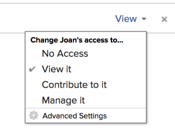

# Compartilhar um modelo

Como admin do Adobe Workfront, você pode conceder aos usuários acesso para visualizar ou editar modelos, definindo seus níveis de acesso. Um usuário precisa ter uma licença de plano para ter acesso à edição de modelos.

Para obter mais informações sobre como conceder acesso a modelos, consulte [Conceder acesso a modelos](../../administration-and-setup/add-users/configure-and-grant-access/grant-access-templates.md).

Juntamente com o nível de acesso concedido, um usuário também pode receber permissões para Exibir ou Gerenciar modelos específicos de outros usuários que os compartilham.

>[!NOTE]
>
>Os níveis de permissão funcionam dentro dos Níveis de acesso. Por exemplo, um usuário não pode receber permissões para Gerenciar um modelo se o nível de acesso permitir apenas que ele Visualize modelos.

As permissões são específicas a um item no Workfront e definem quais ações podem ser executadas nesse item.

## Considerações ao compartilhar um modelo

* Além das considerações abaixo, consulte também [Visão geral das permissões de compartilhamento em objetos](../../workfront-basics/grant-and-request-access-to-objects/sharing-permissions-on-objects-overview.md).
* Por padrão, o criador de um modelo, bem como o Proprietário do modelo, têm permissões de Gerenciamento para o modelo. Para obter informações sobre como designar um usuário como Proprietário do Modelo, consulte [Editar modelos de projeto](../../manage-work/projects/create-and-manage-templates/edit-templates.md).
* Você pode compartilhar o seguinte ao compartilhar um modelo:

   * O modelo

     Para obter mais informações sobre como compartilhar um modelo, consulte [Compartilhar modelos de projeto](../../manage-work/projects/create-and-manage-templates/share-project-template.md).

     Você pode conceder as seguintes permissões a um modelo:

      * Exibir
      * Gerenciar

   * Os projetos futuros que são criados usando o modelo. Você pode conceder aos projetos criados a partir de um modelo os mesmos níveis de permissões que você daria a um projeto individual.

     Para obter informações sobre como compartilhar um projeto de um modelo no nível do modelo, consulte [Compartilhar modelos de projeto](../../manage-work/projects/create-and-manage-templates/share-project-template.md).

* Quando você compartilha um modelo ou um projeto criado a partir do modelo, os usuários herdam as mesmas permissões para todos os objetos secundários associados ao modelo ou ao projeto, por padrão.

  Para obter mais informações sobre a hierarquia de objetos no Workfront, consulte   [Entender objetos no Adobe Workfront](../../workfront-basics/navigate-workfront/workfront-navigation/understand-objects.md).

* Quando você compartilha um modelo, todas as tarefas e documentos do modelo, bem como os problemas no projeto futuro criado a partir do modelo herdam as mesmas permissões, a menos que especificado de outra forma.

  Para obter informações sobre como gerenciar o acesso a tarefas e problemas de modelo no projeto com base nas permissões de um usuário para o projeto, consulte a seção [Acesso](../../manage-work/projects/create-and-manage-templates/edit-templates.md#access) no artigo [Editar modelos de projeto](../../manage-work/projects/create-and-manage-templates/edit-templates.md).

* O administrador do Workfront pode especificar se os documentos devem herdar permissões de objetos superiores no nível de acesso do usuário. Para obter mais informações sobre como restringir permissões herdadas em documentos, consulte [Criar ou modificar níveis de acesso personalizados](../../administration-and-setup/add-users/configure-and-grant-access/create-modify-access-levels.md).

* Não é possível compartilhar tarefas de modelo individualmente. O compartilhamento de um modelo também compartilha as tarefas do modelo. Compartilhar o projeto a partir do modelo também compartilha as tarefas futuras do projeto.

<!--

<h2>Share a template</h2>

(NOTE: drafted because this is also linked above: Share project templates >> which is an article in the Manage Work section>> Templates)  

<ol>
<li value="1"> 
Go to the template you want to share with other entities, click <strong>Template Actions</strong>, then <strong>Template Sharing</strong>. Or
 
Navigate to a list of templates, and select multiple templates from the list, then click <strong>Share Template</strong>.
 <note type="note">
If you select multiple templates, you cannot view who already has permissions to the individual templates.
</note> </li>
<li value="2"> 
Start typing the name of a user, group, team, job role, or company that you want to share the template with in the <strong>Give template access to</strong> or <strong>Edit template access for</strong> fields.
 
Select them when they appear in the list.
 <note type="tip">
You can share an object only with active users, teams,
roles, or companies.
</note> </li>
<li value="3">From the drop-down menu, select which level of permissions you want to grant: 
<ul>
<li>
<strong>View it</strong>: Users with these permissions are able to view the template and create a project using it, or attach it to an existing project.

</li>
<li><strong>Manage it</strong>: Users with these permissions are able to edit or delete the template.</li>
</ul></li>
<li value="4">(Optional) Click <strong>Advanced Settings</strong> to fine-tune your settings for each level of permissions.</li>
<li value="5">Click <strong>Save</strong>.</li>
</ol>
<h2>Share a project at the template level</h2>

You can share the future projects that are created using a template with users at the template level.

<ol>
<li value="1"> 
Go to the template whose future projects you want to share with other entities, click <strong>Template Actions</strong>, then <strong>Project Sharing</strong>.
 
Or
 
Navigate to a list of templates, and select multiple templates from the list, then click <strong>Share Project</strong>.
 <note type="note">
If you select multiple templates, you cannot view who already has project permissions to the individual templates.
</note> </li>
<li value="2"> 
Start typing and then select the name of a user, group, team, job role, or company with whom you want to share future projects created from the template in the <strong>Give project access to</strong> or <strong>Edit template access for</strong> fields.
 <note type="tip">
You can share an object only with active users, teams,
roles, or companies.
</note> </li>
<li value="3">From the drop-down menu, select which level of permissions you want to grant. Select from the following: 
<ul>
<li><strong>No access</strong>: You can specify which users will not have any access to the template. This option is available only when bulk sharing projects from templates.  </li>
<li><strong>View</strong>: Users with these permissions can view projects created from the template.</li>
<li><strong>Contribute</strong>: Users with these permissions can contribute to projects created from the template  </li>
<li><strong>Manage</strong>: Users with these permissions can manage or delete projects created from this template. </li>
</ul></li>
<li value="4">(Optional) Click <strong>Advanced Settings</strong> to fine-tune your settings for each level of permissions. </li>
<li value="5">Click <strong>Save</strong>.</li>
</ol>

-->

## Configurações avançadas para compartilhamento de modelo

A tabela a seguir mostra quais permissões você pode conceder aos usuários ao permitir que eles visualizem ou gerenciem um modelo. Para obter as instruções sobre como compartilhar um modelo, consulte a seção [Compartilhar um modelo](../../manage-work/projects/create-and-manage-templates/share-project-template.md#share) no artigo [Compartilhar modelos de projeto](../../manage-work/projects/create-and-manage-templates/share-project-template.md).

<table style="table-layout:auto"> 
 <col> 
 <col> 
 <col> 
 <thead> 
  <tr> 
   <th>Ações</th> 
   <th>Gerenciar</th> 
   <th>Exibir</th> 
  </tr> 
 </thead> 
 <tbody> 
  <tr> 
   <td>Copiar</td> 
   <td>✓</td> 
   <td>  </td> 
  </tr> 
  <tr> 
   <td>Excluir</td> 
   <td>✓</td> 
   <td>  </td> 
  </tr> 
  <tr> 
   <td>Editar detalhes do modelo</td> 
   <td>✓</td> 
   <td>  </td> 
  </tr> 
  <tr> 
   <td>Exibir Modelo</td> 
   <td>✓</td> 
   <td>✓</td> 
  </tr> 
  <tr> 
   <td>Compartilhar</td> 
   <td>✓</td> 
   <td>✓</td> 
  </tr> 
  <tr> 
   <td>Compartilhe com todo o sistema</td> 
   <td>  </td> 
   <td>✓</td> 
  </tr> 
  <tr data-mc-conditions=""> 
   <td> 
Adicionar documentos
 
Dica: às vezes, as pessoas adicionam documentos a um modelo de projeto pensando que estão adicionando a um projeto. Você pode evitar isso para os seus destinatários desativando essa configuração.
 </td> 
   <td>  </td> 
   <td>✓</td> 
  </tr> 
 </tbody> 
</table>

Para entender as permissões que você está concedendo aos usuários para projetos criados a partir de um modelo, consulte [Compartilhar um projeto no Adobe Workfront](../../workfront-basics/grant-and-request-access-to-objects/share-a-project.md).
