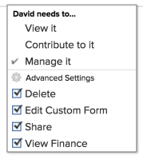

# Compartilhar um problema

O administrador do Adobe Workfront concede aos usuários acesso para visualizar ou editar problemas ao atribuírem níveis de acesso. Para obter mais informações sobre a concessão de acesso a problemas, consulte [Conceder acesso a problemas](../../administration-and-setup/add-users/configure-and-grant-access/grant-access-issues.md).

Além do nível de acesso que os usuários recebem, você também pode conceder permissões para Exibir, Contribuir ou Gerenciar problemas específicos que você tem acesso para compartilhar. Para obter mais informações sobre níveis de acesso e permissões, consulte [Como os níveis de acesso e as permissões funcionam em conjunto](../../administration-and-setup/add-users/access-levels-and-object-permissions/how-access-levels-permissions-work-together.md).

As permissões são específicas a um item no Workfront e definem quais ações podem ser executadas nesse item.

## Considerações sobre problemas de compartilhamento

Além das considerações abaixo, consulte também [Visão geral do compartilhamento de permissões em objetos](../../workfront-basics/grant-and-request-access-to-objects/sharing-permissions-on-objects-overview.md).

>[!NOTE]
>
>Um administrador do Workfront pode adicionar ou remover permissões de qualquer item no sistema, para todos os usuários, sem ser o proprietário desses itens.

* O criador de um problema tem permissões de gerenciamento para ele, por padrão.
* Você pode compartilhar problemas individualmente ou pode compartilhá-los vários de cada vez. O compartilhamento de problemas é idêntico ao compartilhamento de outros itens no Workfront. Para obter mais informações sobre como compartilhar itens no Workfront, consulte [Compartilhar um objeto](../../workfront-basics/grant-and-request-access-to-objects/share-an-object.md).
* Você pode conceder as seguintes permissões para um problema: 

   * Exibir

      

   * Gerenciar

      

   * Contribuir\
      

* Quando você compartilha um problema, todos os documentos anexados ao problema herdam as mesmas permissões.

   O administrador do Workfront pode especificar se os documentos devem herdar permissões de objetos mais altos no nível de acesso do usuário. Para obter mais informações sobre como restringir permissões herdadas em documentos, consulte [Criar ou modificar níveis de acesso personalizados](../../administration-and-setup/add-users/configure-and-grant-access/create-modify-access-levels.md).

* Você pode remover permissões herdadas de um problema. Para obter mais informações, consulte [Remover permissões de objetos](../../workfront-basics/grant-and-request-access-to-objects/remove-permissions-from-objects.md).

## Maneiras de compartilhar um problema

* Manualmente, o que é semelhante ao compartilhamento de qualquer outro objeto no Workfront. Para obter mais informações sobre como compartilhar objetos no Workfront, consulte [Compartilhar um objeto](../../workfront-basics/grant-and-request-access-to-objects/share-an-object.md).
* Automaticamente, executando um dos seguintes procedimentos:

   * Especifique as permissões em qualquer um dos objetos principais do problema: projeto, programa ou portfólio. Os problemas herdam as permissões de seus objetos pai. Para obter informações sobre como visualizar permissões herdadas em objetos, consulte [Exibir permissões herdadas em objetos](../../workfront-basics/grant-and-request-access-to-objects/view-inherited-permissions-on-objects.md).
   * Adicione entidades ao Compartilhamento de projeto em um modelo usado para criar o projeto em que o problema está. Para obter informações sobre o compartilhamento de projetos a partir de modelos, consulte [Compartilhar um modelo](../../workfront-basics/grant-and-request-access-to-objects/share-a-template.md).

   * Especifique as permissões em todos os problemas em um projeto ao editar o projeto. Para obter informações sobre como gerenciar o acesso a problemas ou solicitações no projeto com base nas permissões de um usuário para o projeto, consulte o  no artigo [Editar projetos](../../manage-work/projects/manage-projects/edit-projects.md).

      >[!TIP]
      >
      >Se você não especificar quais permissões de problema deseja que os usuários tenham quando forem atribuídos aos problemas no projeto, eles receberão as mesmas permissões que têm no projeto, por padrão.

   * Especifique as permissões que os usuários recebem sobre problemas que enviam em uma fila de solicitações ao criar uma fila de solicitações. Para obter mais informações, consulte [Criar uma fila de solicitações](../../manage-work/requests/create-and-manage-request-queues/create-request-queue.md).

      >[!IMPORTANT]
      >
      >As permissões são concedidas de forma diferente, dependendo se o projeto é publicado ou não como uma fila de solicitações:
      >
      >   
      >   
      >   * Quando um usuário envia uma solicitação para um projeto publicado como uma fila de solicitações, os usuários Contato principal e Informado por recebem a permissão especificada.
      >   * Quando um usuário envia uma solicitação para um projeto não publicado como uma fila de solicitações, o Contato principal (se diferente de Digitado por usuário) recebe a permissão especificada e o usuário Digitado por recebe as permissões Gerenciar para o problema.

<!--

<h2>Automatically share an issue at the project level</h2>

(NOTE: this info duplicates in Edit projects - linked there instead (above).)&nbsp;

As the Project Owner, you can grant permissions automatically to users as the issues are added to a project.

<ol>
<li value="1">Go to the project whose issues you want to share automatically.</li>
<li value="2"> Click the More menu , then click <strong>Edit</strong>. </li>
<li value="3">In the <strong>Edit Project</strong> box that displays, click <strong>Access</strong>.</li>
<li value="4">In the <strong>When someone is assigned to an ISSUE</strong> field, select from the following permissions levels:
<ul>
<li><strong>View</strong></li>
<li><strong>Contribute</strong></li>
<li><strong>Manage</strong> Now, when someone is assigned to an issue on the selected project, they are granted the specified permissions to the issue.&nbsp;</li>
</ul></li>
<li value="5">(Optional) Select the <strong>Also grant ... access to the project</strong> field to also grant View, Contribute, or Manage permissions to the projects to the user assigned to the issue</li>
<li value="6">In the <strong>When someone submits a REQUEST ...</strong> field, select from the following permissions levels:
<ul>
<li><strong>View</strong></li>
<li><strong>Contribute</strong></li>
<li>
<strong>Manage</strong>
<note type="important">

Permissions are granted differently depending on whether or not the project is published as a request queue:

<ul>
<li>When a user submits a request to a project published as a request queue, the Primary Contact and Entered By users are granted the permission specified.</li>
<li>When a user submits a request to a project not published as a request queue, the Primary Contact (if different from Entered By user) is granted the permission specified, and the Entered By user is granted Manage permissions to the issue.</li>
</ul>
</note></li>
</ul></li>
<li value="7"> 
(Optional) Select the <strong>People from the same company will inherit the same permissions for all requests</strong> field.
 
People from the same company as the user submitting the request are granted the same permissions on the requests as the user.&nbsp;
 </li>
<li value="8">Click <strong>Save Changes</strong>.</li>
</ol>

-->

<!--

<h2>Automatically share an issue in request queues</h2>

(NOTE: drafted because it's duplicated from Create a Request Queue which is linked above)&nbsp;

As the Project Owner, you can grant permissions automatically to users as the issues are submitted to a request queue.

<ol>
<li value="1">Go to the project whose issues you want to share automatically.</li>
<li value="2">Click <strong>Edit Project</strong>.</li>
<li value="3">Click <strong>More</strong> then click <strong>Queue Setup</strong>. </li>
<li value="4"> 
On the <strong>Queue Details</strong> sub-tab, in the drop-down menu under <strong>When someone makes a request, automatically grant</strong>, select from the following permissions levels:

<ul>
<li><strong>View Access</strong> </li>
<li><strong>Contribute Access</strong> </li>
<li> 
<strong>Manage Access</strong> 
 </li>
</ul> 
Now, when someone submits a request to the selected project, they are granted the specified permissions to the request.
 </li>
<li value="5"> 
(Optional) Select the <strong>People from the same company will inherit the same permissions for all requests</strong>.
 
People from the same company as the user submitting the request are granted the same permissions on the requests as the user.&nbsp;
 </li>
<li value="6">Click <strong>Save</strong>.</li>
</ol>

-->

## Permissões para problemas

A tabela a seguir exibe quais permissões você pode conceder aos usuários ao permitir que eles visualizem, colaborem ou gerenciem um problema:

<table style="table-layout:auto"> 
 <col> 
 <col> 
 <col> 
 <col> 
 <tbody> 
  <tr> 
   <td><strong>Ações</strong> </td> 
   <td><strong>Gerenciar</strong> </td> 
   <td><strong>Contribuir</strong> </td> 
   <td><strong>Exibir</strong> </td> 
  </tr> 
  <tr> 
   <td> 
Adicionar  problemas
 </td> 
   <td>✓</td> 
   <td> </td> 
   <td> </td> 
  </tr> 
  <tr> 
   <td>Excluir </td> 
   <td>✓</td> 
   <td> </td> 
   <td> </td> 
  </tr> 
  <tr> 
   <td>Anexar Formulário Personalizado</td> 
   <td>✓</td> 
   <td> </td> 
   <td> </td> 
  </tr> 
  <tr> 
   <td>Editar campos personalizados</td> 
   <td>✓</td> 
   <td>✓</td> 
   <td> </td> 
  </tr> 
  <tr> 
   <td>Aprovar problema</td> 
   <td>✓</td> 
   <td>✓</td> 
   <td>✓</td> 
  </tr> 
  <tr> 
   <td>Adicionar Um Processo De Aprovação</td> 
   <td>✓</td> 
   <td> </td> 
   <td> </td> 
  </tr> 
  <tr> 
   <td>Adicionar documentos</td> 
   <td>✓</td> 
   <td>✓</td> 
   <td>✓</td> 
  </tr> 
  <tr> 
   <td>Copiar Problema*</td> 
   <td>✓</td> 
   <td>✓</td> 
   <td>✓</td> 
  </tr> 
  <tr> 
   <td>Mover Problema</td> 
   <td>✓</td> 
   <td> </td> 
   <td> </td> 
  </tr> 
  <tr> 
   <td>Registre as horas</td> 
   <td>✓</td> 
   <td>✓</td> 
   <td> </td> 
  </tr> 
  <tr> 
   <td>Converter para Projeto*</td> 
   <td>✓</td> 
   <td> </td> 
   <td> </td> 
  </tr> 
  <tr> 
   <td>Aceitar Atribuição</td> 
   <td>✓</td> 
   <td>✓</td> 
   <td> </td> 
  </tr> 
  <tr> 
   <td>Atualizações/comentários</td> 
   <td>✓</td> 
   <td>✓</td> 
   <td>✓</td> 
  </tr> 
  <tr> 
   <td>Modificar Datas Planejadas</td> 
   <td>✓</td> 
   <td> </td> 
   <td> </td> 
  </tr> 
  <tr> 
   <td>Faça Atribuições</td> 
   <td>✓</td> 
   <td>✓</td> 
   <td> </td> 
  </tr> 
  <tr> 
   <td>Compartilhar</td> 
   <td>✓</td> 
   <td>✓</td> 
   <td>✓</td> 
  </tr> 
  <tr> 
   <td>Compartilhe com todo o sistema</td> 
   <td> </td> 
   <td> </td> 
   <td>✓</td> 
  </tr> 
 </tbody> 
</table>

&#42;Controlada pelos níveis de acesso e pelas permissões no projeto.
