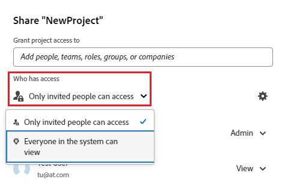

# Compartilhar um objeto

<!--Audited: 01/2024-->

O administrador do Adobe Workfront concede aos usuários acesso para visualizar ou editar objetos ao atribuir níveis de acesso. Para obter mais informações sobre como conceder acesso a objetos, consulte [Criar ou modificar níveis de acesso personalizados](../../administration-and-setup/add-users/configure-and-grant-access/create-modify-access-levels.md).

Juntamente com o nível de acesso que os usuários recebem, você também pode conceder a eles permissões para exibir ou editar objetos específicos que você criou ou ter acesso para compartilhar. Para obter mais informações sobre níveis de acesso e permissões, consulte [Como os níveis de acesso e as permissões funcionam juntos](../../administration-and-setup/add-users/access-levels-and-object-permissions/how-access-levels-permissions-work-together.md).

As permissões são específicas a um item no Workfront e definem quais ações podem ser executadas nesse item.

Para obter informações sobre o compartilhamento de permissões em objetos, consulte [Visão geral das permissões de compartilhamento em objetos](../../workfront-basics/grant-and-request-access-to-objects/sharing-permissions-on-objects-overview.md).

>[!NOTE]
>
>Um administrador do Workfront pode adicionar ou remover permissões a qualquer item no sistema, para todos os usuários, sem ser o proprietário desses itens.

Este artigo descreve como compartilhar os seguintes objetos:

* Projetos, tarefas, problemas
* Portfolio, programas
* Documentos

Para obter informações sobre como compartilhar todos os outros objetos no Workfront, consulte também os seguintes artigos:

* Para modelos, consulte [Compartilhar modelos de projeto](../../manage-work/projects/create-and-manage-templates/share-project-template.md).
* Para obter provas, consulte [Compartilhar uma Prova no Workfront Proof](../../workfront-proof/wp-work-proofsfiles/share-proofs-and-files/share-proof.md).
* Para relatórios, painéis e calendários, consulte os seguintes artigos:

   * [Compartilhar um relatório no Adobe Workfront](../../reports-and-dashboards/reports/creating-and-managing-reports/share-report.md)
   * [Compartilhar um painel](../../reports-and-dashboards/dashboards/creating-and-managing-dashboards/share-dashboard.md)
   * [Compartilhar um relatório de calendário](../../reports-and-dashboards/reports/calendars/share-a-calendar-report.md)

  Além disso, consulte [Compartilhar relatórios, painéis e calendários](../../workfront-basics/grant-and-request-access-to-objects/permissions-reports-dashboards-calendars.md) para obter informações gerais sobre como compartilhar relatórios, painéis e calendários.

* Para filtros, visualizações e agrupamentos, consulte [Compartilhar um filtro, visualização ou agrupamento](../../reports-and-dashboards/reports/reporting-elements/share-filter-view-grouping.md).
* Para pastas de documentos, consulte [Compartilhar uma pasta de documentos](../../workfront-basics/grant-and-request-access-to-objects/share-a-document-folder.md).
* Para planos, consulte [Compartilhar um plano no Planejador de Cenários](../../scenario-planner/share-a-plan.md).

  Isso requer uma licença adicional.

* Para metas, consulte [Compartilhar uma meta no Workfront Goals](../../workfront-goals/workfront-goals-settings/share-a-goal.md). Isso requer uma licença adicional.

## Requisitos de acesso

Você deve ter o seguinte para compartilhar objetos:

<table style="table-layout:auto"> 
 <col> 
 <col> 
 <tbody> 
  <tr> 
   <td role="rowheader">plano do Adobe Workfront</td> 
   <td> 
Qualquer 
 </td> 
  </tr> 
  <tr> 
   <td role="rowheader">Licença da Adobe Workfront*</td> 
   <td> 
Nova licença: Standard
 
   Ou
   
Licença atual: Comercial ou superior

   </td> 
  </tr> 
  <tr> 
   <td role="rowheader">Configurações de nível de acesso</td> 
   <td> 
Exibir o acesso ou superior aos objetos que você deseja compartilhar
 </td> 
  </tr> 
  <tr> 
   <td role="rowheader">Permissões de objeto</td> 
   <td> 
Exibir permissões ou superiores aos objetos que você deseja compartilhar
</td> 
  </tr> 
 </tbody> 
</table>

*Para descobrir que plano, tipo de licença ou acesso você tem, entre em contato com o administrador do Workfront. Para obter mais informações, consulte [Requisitos de acesso na documentação do Workfront](/help/quicksilver/administration-and-setup/add-users/access-levels-and-object-permissions/access-level-requirements-in-documentation.md).

## Compartilhar um projeto, tarefa ou problema da página

1. Vá para a página do projeto, tarefa ou problema que deseja compartilhar.

   Para obter informações sobre quais objetos podem ser compartilhados, consulte [Visão geral das permissões de compartilhamento em objetos](../../workfront-basics/grant-and-request-access-to-objects/sharing-permissions-on-objects-overview.md).

1. Clique no botão **Compartilhar** ao lado do nome do objeto.

   

1. Na caixa **Conceder &lt; object name > acesso a**, comece digitando o nome do usuário, da equipe, da função, do grupo ou da empresa com a qual deseja compartilhar o objeto e, em seguida, clique no nome quando ele aparecer na lista suspensa.

    {width=&quot;350&quot; }

   >[!TIP]
   >
   >Você pode compartilhar um objeto somente com usuários, equipes, funções ou empresas ativos.

   >[!TIP]
   >
   >Se você tiver várias entidades nomeadas de forma semelhante, todas serão listadas em seu tipo. Os nomes das entidades aparecem em ordem alfabética. No entanto, a ordem em que os tipos de entidade aparecem é aleatória.
   >

1. (Opcional) Repita a etapa 3 para cada usuário, equipe, função ou grupo ao qual deseja conceder acesso ao objeto.

1. Especifique as permissões para cada usuário, equipe, função, grupo ou empresa adicionada na Etapa 3 clicando no menu suspenso à direita do nome e selecionando o nível de permissão que deseja conceder.

   

   Para remover permissões de um objeto, consulte [Remover permissões de objetos](/help/quicksilver/workfront-basics/grant-and-request-access-to-objects/remove-permissions-from-objects.md).

   As seguintes opções estão disponíveis:

   * **Exibir:** usuários podem revisar e compartilhar o item.
   * **Contribute**: os usuários podem fazer atualizações, registrar informações, fazer pequenas edições e compartilhar, além de todas as permissões de Exibição.
   * **Gerenciar:** usuários têm acesso total ao objeto sem direitos administrativos (que são concedidos no nível de acesso). Além disso, eles também têm todas as permissões de Exibição e Contribute.

     >[!NOTE]
     >
     >O administrador do Workfront ou o criador do objeto tem a capacidade de remover permissões dessas entidades.

1. (Opcional) Clique no ícone de opções avançadas ao lado do nível de permissão que você concedeu para configurar permissões específicas no objeto.

   

   Exibir, Gerenciar e Contribute têm opções avançadas diferentes, dependendo do objeto selecionado.\
   Para obter mais informações sobre níveis de permissão, consulte [Visão geral das permissões de compartilhamento em objetos](../../workfront-basics/grant-and-request-access-to-objects/sharing-permissions-on-objects-overview.md).

1. (Opcional) Para disponibilizar este objeto para todos os usuários no sistema, clique no menu suspenso em **Quem tem acesso** e, no menu suspenso, clique em **Todos no sistema podem visualizar**.

   

   Todos os usuários podem ver o objeto com base nas permissões definidas.

1. (Opcional e condicional) Ao compartilhar um projeto, clique no ícone **Engrenagem**  e marque a caixa ao lado de **Definir como meu modelo de acesso ao projeto** para definir as permissões como um modelo.

   Depois de definir as permissões em um projeto, essas mesmas permissões são aplicadas automaticamente na próxima vez que você criar um projeto do zero.

   >[!NOTE]
   >
   >O modelo de acesso ao projeto substitui os padrões de compartilhamento concedidos a você pelo administrador do Workfront em seu Nível de acesso.\
   >Para obter mais informações sobre como especificar padrões de compartilhamento para projetos no Nível de Acesso, consulte [Conceder acesso aos projetos](../../administration-and-setup/add-users/configure-and-grant-access/grant-access-projects.md)

   <!--
   >this note also appears in Understanding Project Permissions-->

   Você pode especificar permissões nos projetos que serão criados a partir de um modelo quando você compartilhar o modelo. Para obter mais informações, consulte [Compartilhar modelos de projeto](../../manage-work/projects/create-and-manage-templates/share-project-template.md).

1. (Condicional) Para compartilhar o objeto com usuários externos, clique em **Copiar link** e distribua o link para usuários externos.

   Qualquer usuário com o link pode visualizar o objeto.

   >[!CAUTION]
   >
   >Recomendamos que você tenha cuidado ao compartilhar com usuários externos um objeto que contém informações confidenciais. Isso permite que eles visualizem informações sem ser um usuário da Workfront ou parte da organização.

1. Clique em **Salvar**.

## Compartilhar um documento, portfólio ou programa na página

1. Vá para o documento, portfólio ou página do programa que deseja compartilhar.

   Para obter informações sobre quais objetos podem ser compartilhados, consulte [Visão geral das permissões de compartilhamento em objetos](../../workfront-basics/grant-and-request-access-to-objects/sharing-permissions-on-objects-overview.md).

1. Para portfólios e programas:

   Clique no botão **Compartilhar** ao lado do nome do objeto.

   

   Ou

   Para documentos:

   Clique no ícone **Mais**  ao lado do nome do objeto e clique em **Compartilhar**.

   

1. Na caixa **Conceder a &lt; Nome do Objeto > acesso a**, comece digitando o nome do usuário, da equipe, da função, do grupo ou da empresa com a qual deseja compartilhar o objeto e, em seguida, clique no nome quando ele aparecer na lista suspensa.

    {width=&quot;350&quot; }

   >[!TIP]
   >
   >Você pode compartilhar um objeto somente com usuários, equipes, funções ou empresas ativos.

   >[!TIP]
   >
   >Se você tiver várias entidades nomeadas de forma semelhante, todas serão listadas em seu tipo. Os nomes das entidades aparecem em ordem alfabética. No entanto, a ordem em que os tipos de entidade aparecem é aleatória.
   >

1. (Opcional) Repita a etapa 3 para cada usuário, equipe, função ou grupo ao qual deseja conceder acesso ao objeto.

1. Especifique as permissões para cada usuário, equipe, função, grupo ou empresa adicionada na Etapa 3 clicando no menu suspenso e selecionando o nível de permissão que deseja conceder.

   Para remover permissões de um objeto, consulte [Remover permissões de objetos](/help/quicksilver/workfront-basics/grant-and-request-access-to-objects/remove-permissions-from-objects.md).

   As seguintes opções estão disponíveis:

   * **Exibir:** usuários podem revisar e compartilhar o item.
   * **Gerenciar:** usuários têm acesso total ao objeto sem direitos administrativos (que são concedidos no nível de acesso). Além disso, eles também têm todas as permissões de Exibição e Contribute.

     >[!NOTE]
     >
     >O administrador do Workfront ou o criador do objeto tem a capacidade de remover permissões dessas entidades.

     

1. (Opcional) Clique em **Configurações Avançadas** para configurar permissões específicas no objeto.

   Exibir, Gerenciar e Contribute têm opções avançadas diferentes, dependendo do objeto selecionado.\
   Para obter mais informações sobre os níveis de permissões, consulte [Visão geral das permissões de compartilhamento em objetos](../../workfront-basics/grant-and-request-access-to-objects/sharing-permissions-on-objects-overview.md).

   

1. (Opcional) Para disponibilizar este objeto para todos os usuários no sistema, clique no ícone **Engrenagem**  e, no menu suspenso, clique em **Tornar isto visível para todo o sistema**.

   Todos os usuários podem ver o objeto com base nas permissões definidas.

1. (Opcional) Para tornar o objeto público, clique em **Tornar público para usuários externos**.

   >[!TIP]
   >
   >Esta opção não está disponível para todos os objetos.

    {width=&quot;350&quot; }

1. (Condicional) Se você tornou o objeto público para usuários externos, clique em **copiar link** e distribua o link para usuários externos.

   Qualquer usuário com o link pode visualizar o objeto.

   >[!CAUTION]
   >
   >Recomendamos que você tenha cuidado ao compartilhar com usuários externos um objeto que contém informações confidenciais. Isso permite que eles visualizem informações sem ser um usuário da Workfront ou parte da organização.

1. Clique em **Salvar**.

## Compartilhar objetos únicos ou em massa de uma lista

1. Vá para a lista que contém o(s) objeto(s) que deseja compartilhar.

   Para obter informações sobre quais objetos podem ser compartilhados, consulte [Visão geral das permissões de compartilhamento em objetos](../../workfront-basics/grant-and-request-access-to-objects/sharing-permissions-on-objects-overview.md).

1. Clique na caixa de seleção ao lado do(s) objeto(s) que você deseja compartilhar e clique no **ícone Compartilhar**  na parte superior da página.

    {width=&quot;350&quot; }

1. Na janela **&lt; Objeto > Acesso**, comece digitando na caixa **Editar &lt; Nome do Objeto > acesso para** o nome do usuário, equipe, função, grupo ou empresa com quem deseja compartilhar o(s) objeto(s) e, em seguida, clique no nome quando ele aparecer na lista suspensa.

    {width=&quot;350&quot; }

   >[!TIP]
   >
   >Você pode compartilhar um objeto somente com usuários, equipes, funções ou empresas ativos.

   >[!TIP]
   >
   >Se você tiver várias entidades nomeadas de forma semelhante, todas serão listadas em seu tipo. Os nomes das entidades aparecem em ordem alfabética. No entanto, a ordem em que os tipos de entidade aparecem é aleatória.
   >

1. (Opcional) Repita a etapa 3 para cada usuário, equipe, função ou grupo ao qual deseja conceder acesso ao(s) objeto(s).

1. Especifique as permissões para cada usuário, equipe, função, grupo ou empresa adicionada na Etapa 3 clicando no menu suspenso à direita do nome e selecionando o nível de permissão que deseja conceder.

   Para remover permissões de um objeto, consulte [Remover permissões de objetos](/help/quicksilver/workfront-basics/grant-and-request-access-to-objects/remove-permissions-from-objects.md).

   

   As seguintes opções estão disponíveis:

   * **Exibir:** usuários podem revisar e compartilhar o item.
   * **Contribute**: os usuários podem fazer atualizações, registrar informações, fazer pequenas edições e compartilhar, além de todas as permissões de Exibição.

     >[!TIP]
     >
     >Você pode conceder permissões do Contribute somente para os seguintes objetos:
     >
     >   * Projetos
     >   * Tarefas
     >   * Problemas
     >  

   * **Gerenciar:** usuários têm acesso total ao objeto sem direitos administrativos (que são concedidos no nível de acesso). Além disso, eles também têm todas as permissões de Exibição e Contribute.

     >[!NOTE]
     >
     >O administrador do Workfront ou o criador do objeto tem a capacidade de remover permissões dessas entidades.

1. (Opcional) Clique em **Configurações Avançadas** para configurar permissões específicas no objeto.

   Exibir, Gerenciar e Contribute têm opções avançadas diferentes, dependendo do objeto selecionado.\
   Para obter mais informações sobre os níveis de permissões, consulte [Visão geral das permissões de compartilhamento em objetos](../../workfront-basics/grant-and-request-access-to-objects/sharing-permissions-on-objects-overview.md).

   

1. (Opcional) Para disponibilizar este objeto para todos os usuários no sistema, clique no ícone **Engrenagem**  e, no menu suspenso, clique em **Tornar isto visível para todo o sistema**.

   Todos os usuários podem ver os objetos com base nas permissões definidas.

1. (Opcional e condicional) Ao compartilhar um projeto, clique no ícone **Engrenagem**  e, no menu suspenso, clique em **Definir como meu modelo de acesso ao projeto** para definir as permissões como um modelo.

   Depois de definir as permissões em um projeto, essas mesmas permissões são aplicadas automaticamente na próxima vez que você criar um projeto do zero.

   >[!NOTE]
   >
   >O modelo de acesso ao projeto substitui os padrões de compartilhamento concedidos a você pelo administrador do Workfront em seu Nível de acesso.\
   >Para obter mais informações sobre como especificar padrões de compartilhamento para projetos no Nível de Acesso, consulte [Conceder acesso aos projetos](../../administration-and-setup/add-users/configure-and-grant-access/grant-access-projects.md)

   <!--
   >this note also appears in Understanding Project Permissions-->

   Você pode especificar permissões nos projetos que serão criados a partir de um modelo quando você compartilhar o modelo. Para obter mais informações, consulte [Compartilhar modelos de projeto](../../manage-work/projects/create-and-manage-templates/share-project-template.md).

1. (Opcional) Para tornar o(s) objeto(s) público(s), clique em **Tornar público para usuários externos**.

   >[!TIP]
   >
   >Esta opção não está disponível para todos os objetos.

    {width=&quot;350&quot; }

1. (Condicional) Se você tornou o(s) objeto(s) público(s) para usuários externos, clique em **copiar link** e distribua o link para usuários externos.

   Qualquer usuário com o link pode visualizar o objeto.

   >[!CAUTION]
   >
   >Recomendamos que você tenha cuidado ao compartilhar com usuários externos um objeto que contém informações confidenciais. Isso permite que eles visualizem informações sem ser um usuário da Workfront ou parte da organização.

1. Clique em **Salvar**.
