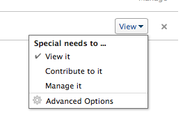
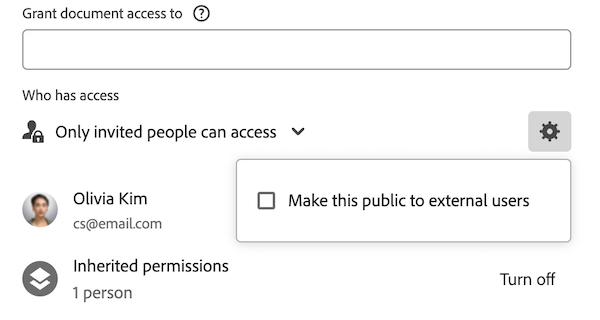

# Compartilhar um objeto

O administrador do Adobe Workfront concede aos usuários acesso para visualizar ou editar objetos ao atribuir níveis de acesso. Para obter mais informações sobre a concessão de acesso a objetos, consulte [Criar ou modificar níveis de acesso personalizados](../../administration-and-setup/add-users/configure-and-grant-access/create-modify-access-levels.md).

Juntamente com o nível de acesso que os usuários recebem, você também pode conceder a eles permissões para exibir ou editar objetos específicos que você criou ou ter acesso para compartilhar. Para obter mais informações sobre níveis de acesso e permissões, consulte [Como os níveis de acesso e as permissões funcionam juntos](../../administration-and-setup/add-users/access-levels-and-object-permissions/how-access-levels-permissions-work-together.md).

As permissões são específicas a um item no Workfront e definem quais ações podem ser executadas nesse item.

Para obter informações sobre o compartilhamento de permissões em objetos, consulte [Visão geral das permissões de compartilhamento em objetos](../../workfront-basics/grant-and-request-access-to-objects/sharing-permissions-on-objects-overview.md).

>[!NOTE]
>
>Um administrador do Workfront pode adicionar ou remover permissões a qualquer item no sistema, para todos os usuários, sem ser o proprietário desses itens.

Este artigo descreve como compartilhar os seguintes objetos: 

* Projetos, tarefas, problemas
* Portfolio, programas
* Documentos

Para obter informações sobre como compartilhar todos os outros objetos no Workfront, consulte também os seguintes artigos:

* Para modelos, consulte [Compartilhar modelos de projeto](../../manage-work/projects/create-and-manage-templates/share-project-template.md).
* Para obter provas, consulte [Compartilhar uma prova no Workfront Proof](../../workfront-proof/wp-work-proofsfiles/share-proofs-and-files/share-proof.md).
* Para relatórios, painéis e calendários, consulte os seguintes artigos:

   * [Compartilhar um relatório no Adobe Workfront](../../reports-and-dashboards/reports/creating-and-managing-reports/share-report.md)
   * [Compartilhar um painel](../../reports-and-dashboards/dashboards/creating-and-managing-dashboards/share-dashboard.md)
   * [Compartilhar um relatório de calendário](../../reports-and-dashboards/reports/calendars/share-a-calendar-report.md)

  Além disso, consulte [Compartilhar relatórios, painéis e calendários](../../workfront-basics/grant-and-request-access-to-objects/permissions-reports-dashboards-calendars.md) para obter informações gerais sobre o compartilhamento de relatórios, painéis e calendários. 

* Para filtros, visualizações e agrupamentos, consulte [Compartilhar um filtro, uma exibição ou um agrupamento](../../reports-and-dashboards/reports/reporting-elements/share-filter-view-grouping.md).
* Para pastas de documentos, consulte [Compartilhar uma pasta de documentos](../../workfront-basics/grant-and-request-access-to-objects/share-a-document-folder.md).
* Para ver os planos, consulte [Compartilhar um plano no Planejador de cenários](../../scenario-planner/share-a-plan.md).

  Isso requer uma licença adicional.

* Para metas, consulte [Compartilhar uma meta no Workfront Goals](../../workfront-goals/workfront-goals-settings/share-a-goal.md). Isso requer uma licença adicional.

## Requisitos de acesso

<!--drafted for P&P:

<table style="table-layout:auto"> 
 <col> 
 <col> 
 <tbody> 
  <tr> 
   <td role="rowheader">Adobe Workfront plan*</td> 
   <td> 
Any 
 </td> 
  </tr> 
  <tr> 
   <td role="rowheader">Adobe Workfront license*</td> 
   <td> 
Current license: Standard
 
   Or
   
Legacy license: Work or higher

   </td> 
  </tr> 
  <tr> 
   <td role="rowheader">Access level configurations*</td> 
   <td> 
View access or higher to the objects you want to share
 
<b>NOTE</b>
   
   If you still don't have access, ask your Workfront administrator if they set additional restrictions in your access level. For information on how a Workfront administrator can modify your access level, see <a href="../../administration-and-setup/add-users/configure-and-grant-access/create-modify-access-levels.md" class="MCXref xref">Create or modify custom access levels</a>.
 </td> 
  </tr> 
  <tr> 
   <td role="rowheader">Object permissions</td> 
   <td> 
View permissions or higher to the objects you want to share
 
For information on requesting additional access, see <a href="../../workfront-basics/grant-and-request-access-to-objects/request-access.md" class="MCXref xref">Request access to objects </a>.
 </td> 
  </tr> 
 </tbody> 
</table>
-->

Você deve ter o seguinte para compartilhar objetos:

<table style="table-layout:auto"> 
 <col> 
 <col> 
 <tbody> 
  <tr> 
   <td role="rowheader">plano do Adobe Workfront*</td> 
   <td> 
Qualquer Um 
 </td> 
  </tr> 
  <tr> 
   <td role="rowheader">Licença da Adobe Workfront*</td> 
   <td> 
Trabalhar ou superior
 </td> 
  </tr> 
  <tr> 
   <td role="rowheader">Configurações de nível de acesso*</td> 
   <td> 
Exibir o acesso ou superior aos objetos que você deseja compartilhar
 
<b>Nota</b>

Se você ainda não tiver acesso, pergunte ao administrador do Workfront se ele definiu restrições adicionais em seu nível de acesso. Para obter informações sobre como um administrador do Workfront pode modificar seu nível de acesso, consulte <a href="../../administration-and-setup/add-users/configure-and-grant-access/create-modify-access-levels.md" class="MCXref xref">Criar ou modificar níveis de acesso personalizados</a>.
 </td>
</tr> 
  <tr> 
   <td role="rowheader">Permissões de objeto</td> 
   <td> 
Exibir permissões ou superiores aos objetos que você deseja compartilhar
 
Para obter informações sobre como solicitar acesso adicional, consulte <a href="../../workfront-basics/grant-and-request-access-to-objects/request-access.md" class="MCXref xref">Solicitar acesso a objetos </a>.
 </td> 
  </tr> 
 </tbody> 
</table>

&#42;Para descobrir seu plano, tipo de licença ou acesso, entre em contato com o administrador do Workfront.

## Compartilhar um único objeto {#share-a-single-object}

1. Vá para o objeto que deseja compartilhar.

   Para obter informações sobre quais objetos podem ser compartilhados, consulte [Visão geral das permissões de compartilhamento em objetos](../../workfront-basics/grant-and-request-access-to-objects/sharing-permissions-on-objects-overview.md).
1. Para projetos, tarefas e problemas:

   Clique em **Compartilhar** ao lado do nome do objeto.

   

   OU

   Para documentos, portfólios e programas:

   Clique em **Mais** ícone ao lado do nome do objeto, clique em **Compartilhamento** ou **Compartilhar.**

   

1. No **Conceder `<Object Name>` acesso a** comece digitando o nome do usuário, da equipe, da função, do grupo ou da empresa com a qual deseja compartilhar o objeto e clique no nome quando ele aparecer na lista suspensa.

   Por exemplo, se você estiver compartilhando um projeto, use o **Conceder acesso ao projeto a** campo.

   >[!TIP]
   >
   >Você pode compartilhar um objeto somente com usuários, equipes, funções ou empresas ativos.

   

   >[!TIP]
   >
   >Se você tiver várias entidades nomeadas de forma semelhante, todas serão listadas em seu tipo. Os nomes das entidades aparecem em ordem alfabética. No entanto, a ordem em que os tipos de entidade aparecem é aleatória.
   >
   >
   >   >
   >

1. (Opcional) Repita a etapa 3 para cada usuário, equipe, função ou grupo ao qual deseja conceder acesso ao objeto.

   <!--
   <MadCap:conditionalText data-mc-conditions="QuicksilverOrClassic.Draft mode">
   (NOTE: esnure this stays accurate; in the editor it looks like step 4 but one step is conditioned entirely for one version or another)
   </MadCap:conditionalText>
   -->

1. Especifique as permissões para cada usuário, equipe, função, grupo ou empresa adicionada na Etapa 3 clicando no menu suspenso e selecionando o nível de permissão que deseja conceder.

   As seguintes opções estão disponíveis:

   * **Exibir:** Os usuários podem revisar e compartilhar o item. 
   * **Contribute****:** Os usuários podem fazer atualizações, registrar informações, fazer pequenas edições e compartilhar, além de todas as permissões de Exibição.

     >[!TIP]
     >
     >Você pode conceder permissões do Contribute somente para os seguintes objetos: 
     >
     >   
     >   
     * Projetos
     * Tarefas
     * Problemas
     >   
     >

   * **Gerenciar:**os usuários têm acesso total ao objeto sem direitos administrativos, que são concedidos no nível de acesso, além de todas as permissões de Exibição e Contribute.

     >[!NOTE]
     >
      O administrador do Workfront ou o criador do objeto tem a capacidade de remover permissões dessas entidades.

      

     

1. (Opcional) Clique em **Opções avançadas** para configurar permissões específicas no objeto.

   Exibir, Gerenciar e Contribute têm opções avançadas diferentes, dependendo do objeto selecionado.\
   Para obter mais informações sobre os níveis de permissões, consulte [Visão geral das permissões de compartilhamento em objetos](../../workfront-basics/grant-and-request-access-to-objects/sharing-permissions-on-objects-overview.md).

   

1. (Opcional) Para disponibilizar esse objeto a todos os usuários no sistema, clique no link **Engrenagem** ícone  e, no menu suspenso, clique em **Tornar isto visível em todo o sistema**.

   Todos os usuários podem ver o objeto com base nas permissões definidas.

1. (Opcional e condicional) Ao compartilhar um projeto, clique no link **Engrenagem** ícone e, no menu suspenso, clique em **Definir como meu modelo de acesso ao projeto** para definir as permissões como um modelo.\
   Depois de definir as permissões em um projeto, essas mesmas permissões são aplicadas automaticamente na próxima vez que você criar um projeto do zero.

   >[!NOTE]
   >
   O modelo de acesso ao projeto substitui os padrões de compartilhamento concedidos a você pelo administrador do Workfront em seu Nível de acesso.\
   Para obter mais informações sobre como especificar padrões de compartilhamento para projetos no Nível de acesso, consulte [Conceder acesso aos projetos](../../administration-and-setup/add-users/configure-and-grant-access/grant-access-projects.md) . >
   >
   <!--   >
   ><MadCap:conditionalText data-mc-conditions="QuicksilverOrClassic.Draft mode">   >
   >(NOTE: (this note also appears in Understanding Project Permissions.))   >
   ></MadCap:conditionalText>   >
   >-->   >
   >

   Você pode especificar permissões nos projetos que serão criados a partir de um modelo quando você compartilhar o modelo. Para obter mais informações, consulte [Compartilhar modelos de projeto](../../manage-work/projects/create-and-manage-templates/share-project-template.md).

1. (Opcional) Para tornar o objeto público, clique em **Tornar público para usuários externos**.

   >[!TIP]
   >
   Esta opção não está disponível para todos os objetos.

   

1. (Condicional) Se você tornou o objeto público para usuários externos, clique em **copiar link,** em seguida, distribua o link para usuários externos.\
   Qualquer usuário com o link pode visualizar o objeto.

   >[!CAUTION]
   >
   Recomendamos que você tenha cuidado ao compartilhar com usuários externos um objeto que contém informações confidenciais. Isso permite que eles visualizem informações sem ser um usuário da Workfront ou parte da organização.

1. Clique em **Salvar**.

## Compartilhar objetos em massa

Em uma lista de objetos, você pode compartilhar vários objetos de uma vez com outros usuários, equipes, grupos, funções de trabalho ou empresas.

>[!IMPORTANT]
>
Quando você compartilha objetos em massa, os nomes das entidades que têm permissões para os objetos individuais não são exibidos. Ao compartilhar objetos em massa, as entidades adicionadas à lista de compartilhamento são adicionadas aos objetos selecionados. Elas não substituem as entidades associadas aos objetos individuais. 

Para compartilhar objetos em massa:

1. Navegue até uma lista de objetos.
1. Selecione dois ou mais objetos na lista.
1. Clique em **Compartilhar** ícone .\
   Os usuários que já têm acesso ao objeto não são listados como disponíveis ao compartilhar em massa.

   >[!NOTE]
   >
   Se você não tiver permissões para compartilhar um objeto selecionado, a variável **Compartilhar** O botão não está visível.

1. No **Editar `<Object Name>` acesso para** comece digitando o nome de um usuário, equipe, grupo, função de trabalho ou empresa à qual deseja conceder permissões.

   Por exemplo, se você estiver compartilhando um projeto, use o **Conceder acesso ao projeto para** campo.

   

1. Continue compartilhando os objetos selecionados conforme descrito nas etapas 4 a 9 da seção [Compartilhar um único objeto](#share-a-single-object) neste artigo.

   <!--
   <MadCap:conditionalText data-mc-conditions="QuicksilverOrClassic.Draft mode">
   (NOTE: ensure these steps stay accurate; always look at them in the viewer; because of condiitoning, the steps numbers in the editor are different!!!!!!*****)
   </MadCap:conditionalText>
   -->

1. Clique em **Salvar**.
