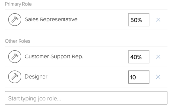

# Definir minhas configurações

<!-- Audited: 01/2024 -->

<!--

Edit the job role FTE percentage allocation blurbs when more functionality is released: now, it says that the % is that of the user's schedule, but it will be either the user's schedule or the system schedule.

-->

Seu perfil do [!DNL Adobe Workfront] contém informações sobre você (por exemplo, seu nome, endereço de email, endereço, número de telefone, cargo, etc.). Ele também contém informações sobre suas interações com o [!DNL Workfront] e outros usuários na sua empresa (por exemplo, suas configurações de notificações, as guias que você deseja exibir no [!DNL Workfront] ou suas funções de trabalho, gerentes e associações de grupos e equipes).

A maioria dessas informações já foi definida pelo administrador do [!DNL Workfront] quando sua conta do [!DNL Workfront] foi criada.

Dependendo do seu nível de acesso no [!DNL Workfront], você poderá editar algumas dessas informações definindo a área [!UICONTROL Minhas Configurações].

## Como os níveis de acesso afetam a edição da área [!UICONTROL Minhas Configurações]

Dependendo do nível de acesso, é possível ou não editar seções na área [!UICONTROL Minhas Configurações].

Alguns campos contidos em seções editáveis não podem ser editados, dependendo de outras configurações que podem ou não ser definidas no seu nível de acesso. Para obter mais informações sobre o acesso adicional necessário para editar alguns dos campos encontrados em [!UICONTROL Minhas Configurações], consulte as seções na área [Configurando as [!UICONTROL Minhas Configurações]](#configuring-the-my-settings-area).

Para descobrir seu nível de acesso, contate o administrador do [!DNL Workfront].

A grade a seguir mostra quais seções na área [!UICONTROL Minhas Configurações] estão visíveis ou podem ser editadas, dependendo do seu nível de acesso:

<table style="table-layout:auto"> 
 <col> 
 <col> 
 <col> 
 <col> 
 <col> 
 <col> 
 <col> 
 <thead> 
  <tr> 
   <th><strong>[!UICONTROL Minhas Configurações] Áreas</strong> </th> 
   <th><strong>Visível ou Editável</strong> </th> 
   <th><strong>[!UICONTROL Administrador do Sistema]</strong> </th> 
   <th><strong>[!UICONTROL Padrão] ou [!UICONTROL Planner]</strong> </th> 
   <th><strong>[!UICONTROL Worker]</strong> </th> 
   <th><strong>[!UICONTROL Light] ou [!UICONTROL Reviewer]</strong> </th> 
   <th><strong>[!UICONTROL Colaborador] ou [!UICONTROL Solicitante]</strong> </th> 
  </tr> 
 </thead> 
 <tbody> 
  <tr> 
   <td rowspan="2">[!UICONTROL Informações Pessoais]</td> 
   <td> 
Visível
 </td> 
   <td> 
✔
 </td> 
   <td> ✔</td> 
   <td>✔ </td> 
   <td>✔ </td> 
   <td> ✔</td> 
  </tr> 
  <tr> 
   <td> 
Editável
 </td> 
   <td> 
✔
 </td> 
   <td> ✔</td> 
   <td> ✔</td> 
   <td>✔ </td> 
   <td>✔ </td> 
  </tr> 
  <tr> 
   <td rowspan="2">[!UICONTROL Preferências]</td> 
   <td> 
Visível
 </td> 
   <td> 
✔
 </td> 
   <td> ✔</td> 
   <td>✔ </td> 
   <td>✔ </td> 
   <td>✔ </td> 
  </tr> 
  <tr> 
   <td> 
Editável
 </td> 
   <td> 
✔
 </td> 
   <td>✔ </td> 
   <td>✔ </td> 
   <td>✔ </td> 
   <td>✔ </td> 
  </tr> 
  <tr> 
   <td rowspan="2">[!UICONTROL Notificações]</td> 
   <td> 
Visível
 </td> 
   <td> 
✔
 </td> 
   <td>✔ </td> 
   <td>✔ </td> 
   <td> ✔</td> 
   <td>✔ </td> 
  </tr> 
  <tr> 
   <td> 
Editável
 </td> 
   <td> 
✔
 </td> 
   <td>✔ </td> 
   <td>✔ </td> 
   <td> ✔</td> 
   <td> ✔</td> 
  </tr> 
  <tr> 
   <td rowspan="2">[!UICONTROL Acesso]</td> 
   <td>Visível</td> 
   <td> ✔</td> 
   <td>✔ </td> 
   <td> </td> 
   <td> </td> 
   <td> </td> 
  </tr> 
  <tr> 
   <td>Editável</td> 
   <td> ✔</td> 
   <td> </td> 
   <td> </td> 
   <td> </td> 
   <td> </td> 
  </tr> 
  <tr> 
   <td rowspan="2">[!UICONTROL Organização]</td> 
   <td>Visível</td> 
   <td>✔</td> 
   <td>✔ </td> 
   <td> </td> 
   <td> </td> 
   <td> </td> 
  </tr> 
  <tr> 
   <td>Editável</td> 
   <td>✔</td> 
   <td>✔ </td> 
   <td> </td> 
   <td> </td> 
   <td> </td> 
  </tr> 
  <tr> 
   <td rowspan="2">[!UICONTROL Planejamento de Recursos]</td> 
   <td>Visível</td> 
   <td>✔</td> 
   <td>✔ </td> 
   <td> </td> 
   <td> </td> 
   <td> </td> 
  </tr> 
  <tr> 
   <td>Editável</td> 
   <td>✔</td> 
   <td>✔ </td> 
   <td> </td> 
   <td> </td> 
   <td> </td> 
  </tr> 
  <tr> 
   <td rowspan="2">[!UICONTROL Forms Personalizado]</td> 
   <td>Visível</td> 
   <td>✔</td> 
   <td>✔ </td> 
   <td>✔</td> 
   <td>✔ </td> 
   <td>✔ </td> 
  </tr> 
  <tr> 
   <td>Editável</td> 
   <td>✔ </td> 
   <td>✔ </td> 
   <td> </td> 
   <td> </td> 
   <td> </td> 
  </tr> 
  <tr> 
   <td rowspan="2">[!UICONTROL Comentário]</td> 
   <td>Visível</td> 
   <td>✔</td> 
   <td>✔ </td> 
   <td>✔ </td> 
   <td>✔ </td> 
   <td>✔ </td> 
  </tr> 
  <tr> 
   <td>Editável</td> 
   <td>✔ </td> 
   <td>✔ </td> 
   <td>✔ </td> 
   <td>✔ </td> 
   <td>✔ </td> 
  </tr> 
 </tbody> 
</table>

## Configurando a área [!UICONTROL Minhas Configurações]

{{step1-click-profile-pic}}

1. Clique no menu **[!UICONTROL Mais]** próximo ao seu nome no menu  e clique em **[!UICONTROL Editar]**.

1. Dependendo do seu nível de acesso, você pode atualizar as seguintes seções:

   * [Informações pessoais](#personal-info)
   * [Preferências](#preferences)
   * [Notificações](#notifications)
   * [Acesso](#access)
   * [Organização](#organization)
   * [Planejamento de recursos](#resource-planning)
   * [Formulários personalizados](#custom-form)
   * [Comentário](#comment)

1. Clique em **[!UICONTROL Salvar]**.

### [!UICONTROL Informações pessoais]

Esta seção inclui as seguintes subseções:

* [Informações básicas](#basic-info)
* [Informações profissionais](#job-info)
* [Informações para contato](#contact-info)

#### [!UICONTROL Informações básicas]

Essas informações já devem ter sido configuradas pelo administrador do [!DNL Workfront]. Todos os campos desta subseção são obrigatórios.

É possível alterar qualquer um dos itens a seguir nesta subseção:

<table style="table-layout:auto"> 
 <col> 
 <col> 
 <tbody> 
  <tr> 
   <td role="rowheader"><strong>[!UICONTROL Nome]</strong></td> 
   <td>Atualize seu nome. Este campo é obrigatório.</td> 
  </tr> 
  <tr> 
   <td role="rowheader"><strong>[!UICONTROL Sobrenome]</strong></td> 
   <td>Atualize seu sobrenome. Este campo é obrigatório.</td> 
  </tr> 
  <tr> 
   <td role="rowheader"><strong>[!UICONTROL Endereço de email]</strong></td> 
   <td> Atualize seu endereço de email. Este campo é obrigatório. Lembre-se de que seu endereço de email também é seu nome de usuário para [!DNL Workfront].</td> 
  </tr> 
  <tr> 
   <td role="rowheader"><strong>[!UICONTROL Alterar senha]</strong></td> 
   <td>Redefina sua senha nesta seção. Para obter mais informações sobre como redefinir sua senha, consulte <a href="../../../workfront-basics/manage-your-account-and-profile/managing-your-workfront-account/reset-your-password.md" class="MCXref xref">Redefinir sua senha</a>.</td> 
  </tr> 
 </tbody> 
</table>

<!--
  <tr> 
   <td role="rowheader"><strong>(Conditional) &lt;SSO Configuration> [!UICONTROL Username]</strong></td> 
   <td> If your [!DNL Workfront] administrator enabled an SSO integration with [!DNL Workfront], your SSO Username displays in this field. The type of SSO configuration enabled for your [!DNL Workfront] instance is visible in this field.</td> 
  </tr> 
  <tr> 
   <td role="rowheader"><strong>(Conditional) [!UICONTROL Only Allow &lt;SSO Configuration> Authentication]</strong></td> 
   <td> 
 If your [!DNL Workfront] administrator enabled an SSO integration with [!DNL Workfront] and has updated users for SSO, this field is selected by default. The type of SSO configuration enabled for your [!DNL Workfront] instance is visible in this field.
 
When this field is selected, you are required you to log into [!DNL Workfront] with your SSO credentials. Unchecking it will allow you to log in to [!DNL Workfront] with your [!DNL Workfront] credentials.
 
For more information about configuring [!DNL Workfront] with an SSO solution, see <a href="../../../administration-and-setup/add-users/single-sign-on/single-sign-on.md" class="MCXref xref">Single sign-on in [!DNL Workfront]: article index</a>. For more information about updating users for SSO, see <a href="../../../administration-and-setup/add-users/single-sign-on/update-users-sso.md" class="MCXref xref">Update users for single sign-on</a>.
 </td> 
  </tr>
-->

#### [!UICONTROL Informações do trabalho]

É possível alterar qualquer um dos itens a seguir nesta subseção:

<table style="table-layout:auto">
    <tr>
        <td><strong>[!UICONTROL Título]</strong></td>
        <td>Especifique seu título. Isso não é o mesmo que sua função de trabalho. Seu título não faz parte do agendamento de recursos, enquanto sua função de trabalho é. Seu título é exibido na interface do [!DNL Workfront] em todos os lugares que seu nome e seu avatar forem exibidos. É visível para todos que têm acesso para ver seu perfil de usuário.</td>
    </tr>
    <tr>
        <td><strong>[!UICONTROL Fale Comigo Sobre]</strong></td>
        <td>Especifique seus interesses profissionais neste campo.</td>
    </tr>
</table>

#### [!UICONTROL Informações de contato]

É possível alterar qualquer um dos itens a seguir nesta subseção:

<table style="table-layout:auto">
    <tr>
        <td><strong>[!UICONTROL Número de Telefone]</strong></td>
        <td> </td>
    </tr>
    <tr>
        <td><strong>[!UICONTROL Extensão]</strong></td>
        <td> </td>
    </tr>
    <tr>
        <td><strong>[!UICONTROL Número de Celular]</strong></td>
        <td> </td>
    </tr>
    <tr>
        <td><strong>[!UICONTROL Endereço]</strong></td>
        <td> </td>
    </tr>
    <tr>
        <td><strong>[!UICONTROL Cidade]</strong></td>
        <td> </td>
    </tr>
    <tr>
        <td><strong>[!UICONTROL Estado]</strong></td>
        <td> </td>
    </tr>
    <tr>
        <td><strong>[!UICONTROL CEP]</strong></td>
        <td> </td>
    </tr>
    <tr>
        <td><strong>[!UICONTROL País]</strong></td>
        <td> </td>
    </tr>
    <tr>
        <td><strong>[!UICONTROL Foto do perfil]</strong></td>
        <td>A foto do seu perfil se torna seu avatar e fica visível em todo o sistema [!DNL Workfront], onde quer que seu nome seja exibido.</td>
    </tr>
</table>

### [!UICONTROL Preferências]

Especifique o que deseja exibir na interface do [!DNL Workfront] nesta seção.

>[!NOTE]
>
>Os usuários com uma licença de [!UICONTROL Colaborador] ou [!UICONTROL Solicitante] não têm nenhum outro item do painel esquerdo disponível para adicionar ao seu [!UICONTROL Menu Principal], fora da área [!UICONTROL Solicitações]. Um administrador do [!DNL Workfront] pode atribuir usuários com uma licença de [!UICONTROL Colaborador] ou [!UICONTROL Solicitante] a um modelo de layout que inclua todas as outras áreas no [!UICONTROL Menu Principal]. Depois disso, eles poderão selecionar as áreas a serem exibidas em seu [!UICONTROL Menu Principal] editando seu perfil de usuário.

É possível alterar qualquer um dos itens a seguir nesta subseção:

<table style="table-layout:auto"> 
 <col> 
 <col> 
 <tbody>
  <tr> 
   <td role="rowheader"><strong>[!UICONTROL Fuso Horário]</strong> </td> 
   <td>
Especifique seu fuso horário. Isso controla o tempo mostrado nas mensagens de email de saída.

       
O fuso horário também afeta o que é exibido em um relatório de calendário PTO.
</td>
  </tr> 
  <tr> 
   <td role="rowheader"><strong>[!UICONTROL Local de Email]</strong> </td> 
   <td>
Especifique seu idioma preferido aqui. Controla o idioma, a data e o formato do número usados nas mensagens de email de saída.

   
<strong>OBSERVAÇÃO:</strong> quando sua organização está na Experiência unificada do Adobe, as preferências de idioma são armazenadas em seu perfil do Adobe e a localidade de email não é usada. Para obter mais informações, consulte <a href="/help/quicksilver/workfront-basics/supported-languages-in-workfront.md#change-the-adobe-experience-cloud-language">Alterar o idioma do Adobe Experience Cloud</a> no artigo <a href="/help/quicksilver/workfront-basics/supported-languages-in-workfront.md">Idiomas com suporte no Adobe Workfront</a>.
</td> 
  </tr>
  <tr> 
   <td role="rowheader"><strong>(Condicional) Gera provas automaticamente ao carregar documentos</strong></td> 
   <td>Selecione este campo para começar a gerar uma prova imediatamente após o documento ser carregado em [!DNL Workfront]. Esse campo está desativado por padrão e só pode ser atualizado por um administrador do Workfront. Este campo só estará disponível se sua empresa tiver comprado o componente Workfront Proof para Workfront e se você estiver habilitado como usuário de prova. Para obter mais informações sobre o Workfront Proof, consulte <a href="../../../review-and-approve-work/proofing/managing-proofs-within-workfront/manage-proofs-in-wf.md" class="MCXref xref">Gerenciar provas no Adobe Workfront</a>.
   
<b>Observação:</b> documentos carregados em uma solicitação não geram automaticamente uma prova. 
</td> 
  </tr> 
 </tbody> 
</table>

<!--
  <tr><td><strong>[!UICONTROL Send work I assign to myself to my Working On tab]</strong> </td>
  <td>Select this option if you want the status of work you assign to yourself to automatically be set to In Progress instead of New.</td>

  <strong>[!UICONTROLAutomatically set the task status to In Progress when tasks are self-assigned]</strong>: When this option is selected, work that you assign to yourself is automatically set to In Progress status instead of New.
  </tr>
-->

### [!UICONTROL Notificações]

Especifique quais notificações você deseja receber de [!DNL Workfront]. Para obter mais informações sobre como configurar notificações, consulte [Modificar suas próprias notificações por email](../../../workfront-basics/using-notifications/activate-or-deactivate-your-own-event-notifications.md).

### [!UICONTROL Access]

Seu acesso e outros componentes associados a ele são configurados pelo administrador do [!DNL Workfront], quando sua conta é configurada.

Somente um administrador do [!DNL Workfront] pode visualizar e editar todos os campos desta seção.

É possível alterar qualquer um dos itens a seguir nesta subseção:

<table style="table-layout:auto"> 
 <col> 
 <col> 
 <tbody> 
  <tr> 
   <td role="rowheader"><strong>[!UICONTROL Está Ativo]</strong> </td> 
   <td>Este campo é visível somente para um usuário que também é um administrador do [!DNL Workfront] e deve ser habilitado por padrão. Isso significa que o usuário está ativo e pode fazer logon no [!DNL Workfront]</td> 
  </tr> 
  <tr> 
   <td role="rowheader"><strong>[!UICONTROL Nível de Acesso]</strong> </td> 
   <td>Este campo está visível para usuários com nível de acesso [!UICONTROL Standard], [!UICONTROL Plan] ou [!UICONTROL Workfront administrator], e só pode ser editado para administradores [!DNL Workfront]. Se você for um administrador do [!DNL Workfront], tenha cuidado para não alterar seu nível de acesso para algo mais baixo ao modificar esse campo. </td> 
  </tr> 
  <tr> 
   <td role="rowheader"><strong>[!UICONTROL Modelo de layout]</strong> </td> 
   <td>Este campo é visível para usuários com nível de acesso [!UICONTROL Standard], [!UICONTROL Plan] ou [!UICONTROL [!DNL Workfront] administrator], e só pode ser editado para [!UICONTROL [!DNL Workfront] administradores] ou usuários com uma licença [!UICONTROL Standard] ou [!UICONTROL Plan] que também tenham acesso de usuário administrativo. Selecione um modelo de layout aqui para atualizar a aparência e o campo da interface do Workfront. Para obter mais informações sobre como configurar usuários com acesso administrativo, consulte <a href="../../../administration-and-setup/add-users/configure-and-grant-access/grant-access-other-users.md#configure-users-access-to-edit-users-using-a-custom-access-level" class="MCXref xref">Configurar acesso dos usuários para editar usuários usando um nível de acesso personalizado</a> em <a href="../../../administration-and-setup/add-users/configure-and-grant-access/grant-access-other-users.md" class="MCXref xref">Conceder acesso aos usuários</a>. Para obter mais informações sobre modelos de layout e como eles afetam sua interface, consulte <a href="../../../administration-and-setup/customize-workfront/use-layout-templates/create-and-manage-layout-templates.md" class="MCXref xref">Criar e gerenciar modelos de layout</a></td> 
  </tr> <!--
   <tr data-mc-conditions="QuicksilverOrClassic.Draft mode"> 
    <td role="rowheader"><strong>Log in as</strong> </td> 
    <td> 
<strong>Add access</strong> for a Workfront administrator or group administrator (associated with a group you are in) to log in as you. Select an <strong>Access expiration date</strong> for the login. 
 
You can repeat this to grant login access to multiple administrators.
 
The settings you choose in this section are visible only to you.
       <MadCap:conditionalText data-mc-conditions="QuicksilverOrClassic.Draft mode"> 
        Add a note about this being only for the Enterprise package if they decide to do it that way. Functionality that may come in a later sprint: If you want to be notified when the administrator logs in as you, select Receive an email when this user logs in. 
       </MadCap:conditionalText>
      
 </td> 
   </tr>
  --> 
  <tr> 
   <td role="rowheader"><strong>(Condicional) [!UICONTROL Usuário pode gerar provas (... de ... licenças de prova restantes)]</strong></td> 
   <td>Este campo só estará disponível se sua empresa usar um plano herdado [!DNL Workfront] e tiver comprado o componente [!DNL Workfront Proof]. Quando essa opção estiver selecionada, você será ativado como um usuário de prova. Ele também exibe o número de licenças de prova usadas em seu sistema do número total de licenças de prova adquiridas. Este campo é visível e editável apenas para usuários que também são administradores do [!DNL Workfront]. Para obter mais informações sobre as opções de plano para revisão de texto em [!DNL Workfront], consulte <a href="/help/quicksilver/administration-and-setup/manage-workfront/configure-proofing/access-to-proofing-functionality.md">Acesso à funcionalidade de revisão de texto em [!DNL Workfront]</a>.</td>
  </tr> 
  <tr> 
   <td role="rowheader"><strong>(Condicional) [!UICONTROL Perfil de Permissão]</strong></td> 
   <td> 
Este campo exibe o nível de acesso que você tem em [!DNL Workfront Proof]. Ela só estará disponível se:
 
    <ul> 
     <li>Sua empresa usa um plano [!DNL Workfront] herdado e adquiriu o componente [!DNL Workfront Proof] ou você tem uma licença do [!UICONTROL Standard], do [!UICONTROL Work] ou do [!UICONTROL Plan] em um plano [!DNL Workfront] mais recente.</li> 
     <li>Você está ativado como um usuário de prova.</li> 
    </ul> 
[!DNL Workfront] os administradores podem editar o campo para todos os usuários, exceto eles próprios, para que todos os usuários vejam o campo como somente visualização em seus próprios perfis. Para obter mais informações sobre o perfil de permissão, consulte <a href="../../../review-and-approve-work/proofing/proofing-overview/permission-profiles.md" class="MCXref xref">Visão geral do Perfil de Permissão de Prova</a>.
 </td> 
  </tr> 
 </tbody> 
</table>

### [!UICONTROL Organização]

Normalmente, essas informações são configuradas pelo administrador do [!DNL Workfront] quando ele cria a conta do [!DNL Workfront]. Você também pode atualizar informações sobre sua organização ou estrutura de organização nesta seção. Somente usuários com um nível de acesso [!UICONTROL Padrão], [!UICONTROL Plano] ou [!UICONTROL Administrador do Sistema] podem editar esta seção.

É possível alterar qualquer um dos itens a seguir nesta subseção:

<table style="table-layout:auto"> 
 <col> 
 <col> 
 <tbody> 
  <tr> 
   <td role="rowheader"><strong>[!UICONTROL Empresa]</strong></td> 
   <td>Selecione o nome da empresa à qual você pertence na lista suspensa.</td> 
  </tr> 
  <tr> 
   <td role="rowheader"><strong>(Condicional) [!UICONTROL Relata A]</strong></td> 
   <td>Depois de selecionar uma <strong>[!UICONTROL Company]</strong> para o seu perfil, você também pode especificar o nome do seu gerente neste campo. Você só pode especificar um nome aqui e recomendamos que especifique o nome do seu gerente imediato. Comece digitando o nome e clique para selecioná-lo quando ele for exibido na lista.</td> 
  </tr> 
  <tr> 
   <td role="rowheader"><strong>(Condicional) [!UICONTROL Relatórios Diretos]</strong></td> 
   <td>Depois de selecionar uma <strong>[!UICONTROL Company]</strong> para o seu perfil, você também pode especificar o nome dos seus subordinados diretos neste campo. Você pode especificar quantos subordinados diretos forem necessários aqui. Comece digitando seus nomes e clique em para selecioná-los quando eles aparecerem na lista.</td> 
  </tr> 
  <tr> 
   <td role="rowheader"><strong>[!UICONTROL Equipe Inicial]</strong> </td> 
   <td> 
Selecione uma <strong>[!UICONTROL Equipe]</strong> do menu suspenso. Este campo é visível para usuários com nível de acesso [!UICONTROL Standard], [!UICONTROL Plan] ou [!UICONTROL System Administrator], e só pode ser editado para [!DNL Workfront] administradores ou usuários com uma licença [!UICONTROL Standard] ou [!UICONTROL Plan] que também tenham acesso de usuário administrativo. Para obter mais informações sobre como configurar usuários com acesso administrativo, consulte <a href="../../../administration-and-setup/add-users/configure-and-grant-access/grant-access-other-users.md#configure-users-access-to-edit-users-using-a-custom-access-level" class="MCXref xref">Configurar acesso dos usuários para editar usuários usando um nível de acesso personalizado</a> em <a href="../../../administration-and-setup/add-users/configure-and-grant-access/grant-access-other-users.md" class="MCXref xref">Conceder acesso aos usuários</a>. 
 
A <strong>Equipe da Página Inicial</strong> poderá afetar a aparência da interface [!DNL Workfront], se um modelo de layout estiver associado à equipe. 
 
Para obter mais informações sobre equipes, consulte <a href="../../../people-teams-and-groups/create-and-manage-teams/teams-overview.md" class="MCXref xref">Visão geral das equipes</a>.
 </td>
  </tr> 
  <tr> 
   <td role="rowheader"><strong>[!UICONTROL Outras equipes]</strong> </td> 
   <td> 
Você pode pertencer a mais de uma equipe. Especifique as equipes adicionais às quais você pertence neste campo começando a digitar o nome de uma equipe e, em seguida, clique para selecioná-la quando ela for exibida na lista. Pertencer a muitas equipes pode gerar confusão sobre o trabalho atribuído às equipes. Para obter mais informações sobre equipes, consulte <a href="../../../people-teams-and-groups/create-and-manage-teams/teams-overview.md" class="MCXref xref">Visão geral das equipes</a>.
 
Este campo é visível para usuários com uma licença [!UICONTROL Standard], [!UICONTROL Plan] ou [!UICONTROL System Administrator] e só pode ser editado para [!DNL Workfront] administradores ou usuários com uma licença [!UICONTROL Standard] ou [!UICONTROL Plan] que também tenham acesso de usuário administrativo. Para obter mais informações sobre como configurar usuários com acesso administrativo, consulte <a href="../../../administration-and-setup/add-users/configure-and-grant-access/grant-access-other-users.md#configure-users-access-to-edit-users-using-a-custom-access-level" class="MCXref xref">Configurar acesso dos usuários para editar usuários usando um nível de acesso personalizado</a> em <a href="../../../administration-and-setup/add-users/configure-and-grant-access/grant-access-other-users.md" class="MCXref xref">Conceder acesso aos usuários</a>.
 </td>
  </tr> 
  <tr> 
   <td role="rowheader"><strong>[!UICONTROL Grupo Padrão]</strong> </td> 
   <td> 
Selecione um <strong>[!UICONTROL Grupo Padrão]</strong> no menu suspenso.
 
Observação: este campo é obrigatório. Você não pode ter um usuário não associado a um grupo. 
 
Este campo é visível para usuários com um nível de [!UICONTROL Padrão], [!UICONTROL Plano] ou [!UICONTROL Administrador do Sistema]. Para obter mais informações sobre quem pode editar o campo <strong>[!UICONTROL Grupo Padrão]</strong>, consulte <a href="/help/quicksilver/administration-and-setup/add-users/create-and-manage-users/edit-a-users-profile.md"class="MCXref xref">Editar perfil de usuário</a>. Seu <strong>[!UICONTROL Grupo Padrão]</strong> é o grupo padrão para todos os projetos e o <strong>[!UICONTROL Grupo Padrão]</strong> é o grupo padrão para todos os novos usuários que você criar. Todos os formulários personalizados que você criar serão compartilhados com seu <strong>[!UICONTROL Grupo Padrão]</strong> por padrão.
 
Para obter mais informações sobre grupos, consulte <a href="../../../administration-and-setup/manage-groups/groups-overview/groups.md" class="MCXref xref">Visão geral sobre grupos</a>.
 </td> 
  </tr> 
  <tr> 
   <td role="rowheader"><strong>[!UICONTROL Outros Grupos]</strong> </td> 
   <td> 
Você pode pertencer a vários grupos. Especifique os grupos adicionais aos quais você pertence neste campo, começando a digitar o nome de um grupo. Clique para selecioná-la quando ela for exibida na lista. Este campo é visível para usuários com nível de acesso [!UICONTROL Standard], [!UICONTROL Plan] ou [!UICONTROL System Administrator]. Para obter mais informações sobre quem pode editar o campo <strong>[!UICONTROL Outros Grupos]</strong>, consulte <a href="/help/quicksilver/administration-and-setup/add-users/create-and-manage-users/edit-a-users-profile.md"class="MCXref xref">Editar perfil de usuário</a>.
 
Para obter mais informações sobre grupos, consulte <a href="../../../administration-and-setup/manage-groups/groups-overview/groups.md" class="MCXref xref">Visão geral sobre grupos</a>.
 </td> 
  </tr> 
 </tbody> 
</table>

### [!UICONTROL Planejamento de recursos]

As informações de planejamento de recursos afetam a linha do tempo das atribuições de trabalho, o tempo registrado, o custo e a receita dos projetos em que você está. Normalmente, essa área é atualizada pelo administrador do [!DNL Workfront], por um gerente de projeto ou de recursos ou pelo gerente direto.

Use qualquer um dos seguintes itens nesta seção:

<table style="table-layout:auto"> 
 <col> 
 <col> 
 <tbody> 
  <tr> 
   <td role="rowheader"><strong>[!UICONTROL Definir data de desativação]</strong></td>
   <td>
Clique nesse botão se desejar agendar a desativação da conta após um período. Na <strong>[!UICONTROL Data de Desativação Agendada]</strong> que for exibida, especifique a data após a qual sua conta será desativada. Para obter informações sobre como desativar usuários, consulte <a href="../../../administration-and-setup/add-users/create-and-manage-users/deactivate-a-user.md#schedule-users-for-deactivation" class="MCXref xref">Agendar usuários para desativação</a> em <a href="../../../administration-and-setup/add-users/create-and-manage-users/deactivate-a-user.md" class="MCXref xref">Desativar ou reativar um usuário</a>. 

Você pode editar os campos de desativação da sua conta se tiver uma licença [!UICONTROL Standard] ou [!UICONTROL Plan] ou se for o administrador [!DNL Workfront]. 
</td> 
  </tr> 
  <tr> 
   <td role="rowheader"><strong>[!UICONTROL Função Primária]</strong></td> 
   <td> 
Essa é a principal função que você pode desempenhar no Workfront. Todas as tarefas e problemas aos quais você está atribuído também estão atribuídos a esta função de trabalho, por padrão. As funções de trabalho são essenciais no gerenciamento de recursos. Para obter mais informações sobre funções de trabalho, consulte <a href="../../../administration-and-setup/set-up-workfront/organizational-setup/create-manage-job-roles.md" class="MCXref xref">Criar e gerenciar funções de trabalho</a>.
 
Você pode atualizar este campo somente se tiver uma licença [!UICONTROL Standard] ou [!UICONTROL Plan] com acesso de usuário administrativo, ou se for um administrador [!DNL Workfront]. Para obter mais informações sobre como configurar usuários com acesso administrativo, consulte <a href="../../../administration-and-setup/add-users/configure-and-grant-access/grant-access-other-users.md#configure-users-access-to-edit-users-using-a-custom-access-level" class="MCXref xref">Configurar acesso dos usuários para editar usuários usando um nível de acesso personalizado</a> em <a href="../../../administration-and-setup/add-users/configure-and-grant-access/grant-access-other-users.md" class="MCXref xref">Conceder acesso aos usuários</a>.
 </td> 
  </tr> 
  <tr> 
   <td role="rowheader"><strong>(Condicional) Se você selecionou uma [!UICONTROL Função Primária], o campo [!UICONTROL Porcentagem de Disponibilidade FTE] será exibido.</strong></td> 
   <td>Especifique que porcentagem do seu tempo agendado está alocada para esta função de trabalho. O valor padrão da [!UICONTROL Porcentagem de Disponibilidade FTE] para a Função Primária é 100%.</td> 
  </tr> 
  <tr> 
   <td role="rowheader"><strong>[!UICONTROL Outras funções]</strong> </td> 
   <td> 
Você pode ter várias funções de trabalho em [!DNL Workfront]. As funções de trabalho são essenciais no gerenciamento de recursos. Para obter mais informações sobre funções de trabalho, consulte <a href="../../../administration-and-setup/set-up-workfront/organizational-setup/create-manage-job-roles.md" class="MCXref xref">Criar e gerenciar funções de trabalho</a>.
 
Você pode atualizar este campo somente se tiver uma licença [!UICONTROL Standard] ou [!UICONTROL Plan] com acesso de usuário administrativo, ou se for um administrador [!DNL Workfront]. Para obter mais informações sobre como configurar usuários com acesso administrativo, consulte <a href="../../../administration-and-setup/add-users/configure-and-grant-access/grant-access-other-users.md#access-to-edit" class="MCXref xref">Configurar acesso dos usuários para editar usuários usando um nível de acesso personalizado</a> em <a href="../../../administration-and-setup/add-users/configure-and-grant-access/grant-access-other-users.md" class="MCXref xref">Conceder acesso aos usuários</a>.
 </td> 
  </tr> 
  <tr> 
   <td role="rowheader"><strong>(Condicional) Se você selecionou uma ou várias Outras funções, o campo [!UICONTROL Porcentagem de disponibilidade de FTE] é exibido para cada função.</strong></td> 
   <td> 
Especifique que porcentagem do seu tempo agendado está alocada para cada função de trabalho. O valor padrão da [!UICONTROL Porcentagem de Disponibilidade FTE] para [!UICONTROL Outras Funções] é 0%.
 
  
 
Observação:  
     <ul> 
      <li>Se [!UICONTROL Outras Funções] tiverem 0% de Disponibilidade FTE, elas não serão exibidas no [!UICONTROL Resource Planner], a menos que os usuários sejam atribuídos a tarefas nessas funções.</li> 
      <li> 
A soma de todas as <strong>[!UICONTROL Porcentagens de Disponibilidade de FTE]</strong> para todas as funções deve ser igual a 100%. Cada [!UICONTROL Porcentagem de Disponibilidade FTE] calcula as [!UICONTROL Horas Disponíveis] para cada função por usuário no [!UICONTROL Resource Planner]. 
 
As [!UICONTROL Horas Disponíveis] para cada função por usuário dependem do tempo disponível para o usuário. O tempo disponível para o usuário é calculado por [!DNL Workfront], dependendo do método selecionado pelo administrador [!DNL Workfront] para calcular o FTE nas [!UICONTROL Preferências de Gerenciamento de Recursos]. Para obter mais informações sobre como calcular a disponibilidade do usuário, consulte <a href="../../../resource-mgmt/resource-planning/calculate-hours-fte-for-users-roles-resource-planner.md" class="MCXref xref">Visão geral do cálculo de horas e FTE para usuários e funções no Planejador de recursos</a>. Para obter mais informações sobre como configurar preferências de Gerenciamento de Recursos, consulte <a href="../../../administration-and-setup/set-up-workfront/configure-system-defaults/configure-resource-mgmt-preferences.md" class="MCXref xref">Configurar preferências de Gerenciamento de Recursos</a>.
 </li> 
     </ul> 
 </td> 
  </tr> 
  <tr> 
   <td role="rowheader"><strong>Agendar</strong></td> 
   <td> 
Somente [!DNL Workfront] administradores ou usuários com uma licença [!UICONTROL Standard] ou [!UICONTROL Plan] que também tenham acesso administrativo a folhas de horas e horas podem atualizar este campo. Para obter mais informações sobre acesso administrativo a planilhas de horas e horas, consulte a seção "Planilhas de horas e horas" em <a href="../../../administration-and-setup/add-users/configure-and-grant-access/grant-users-admin-access-certain-areas.md" class="MCXref xref">Conceder aos usuários acesso administrativo a determinadas áreas</a>.
 
Selecione a folha de horas correta para você no menu suspenso. Isso garante que suas folhas de horas sejam geradas automaticamente, de acordo com as especificações definidas pelo administrador do [!DNL Workfront]. 
 </td> 
  </tr> 
  <tr> 
   <td role="rowheader"><strong>[!UICONTROL Tipo de Hora Padrão]</strong> </td> 
   <td>Selecione o tipo de hora padrão. Esse é o tipo de hora que o sistema usa por padrão sempre que você faz logon no Workfront.</td> 
  </tr> 
  <tr> 
   <td role="rowheader"><strong>[!UICONTROL Tipos de Horas Disponíveis]</strong> </td> 
   <td>Selecione os tipos de horas que devem estar disponíveis para você selecionar, ao registrar o tempo. Os tipos de hora nesse menu suspenso são disponibilizados pelo administrador do [!DNL Workfront].</td> 
  </tr> 
  <tr> 
   <td role="rowheader"><strong>[!UICONTROL Pool de Recursos]</strong> </td> 
   <td>Selecione um conjunto de recursos ao qual você pertence. Este campo é somente para fins informativos e de geração de relatórios. Isso não afeta a programação ou o planejamento de recursos.</td> 
  </tr> 
  <tr> 
   <td role="rowheader"><strong>[!UICONTROL FTE]</strong> </td> 
   <td> 
O número especificado aqui é levado em conta para calcular sua disponibilidade com base no Agendamento Padrão apenas quando as [!UICONTROL Preferências de Gerenciamento de Recursos] no nível do sistema são definidas como <strong>[!UICONTROL O Agendamento Padrão]</strong>.
 
Por exemplo, se o valor de FTE for 0,5 e a [!UICONTROL Default Schedule] for 40 horas, você estará disponível para trabalhar 20 horas por semana.
 
Se as [!UICONTROL Preferências de Gerenciamento de Recursos] no nível do sistema forem definidas como <strong>[!UICONTROL A Agenda do Usuário]</strong>, o valor especificado aqui será ignorado e você estará disponível para trabalhar de acordo com o que está especificado na sua agenda. Nesse caso, o FTE do [!UICONTROL Resource Planner] é calculado pela seguinte fórmula: 
 
<code style="font-style: normal;">[!UICONTROL User Available FTE] = [!UICONTROL Hours from the Schedule of the User/ Default Schedule Hours]</code> 
 
Para obter mais informações sobre o cálculo de FTE do usuário, consulte <a href="../../../resource-mgmt/resource-planning/calculate-hours-fte-for-users-roles-resource-planner.md" class="MCXref xref">Visão geral do cálculo de horas e FTE para usuários e funções no Planejador de recursos</a>.
 
Para obter mais informações sobre como criar agendas em [!DNL Workfront], consulte <a href="../../../administration-and-setup/set-up-workfront/configure-timesheets-schedules/create-schedules.md" class="MCXref xref">Criar uma agenda</a>.
 
Para obter mais informações sobre como configurar as Preferências de Gerenciamento de Recursos, consulte <a href="../../../administration-and-setup/set-up-workfront/configure-system-defaults/configure-resource-mgmt-preferences.md" class="MCXref xref">Configurar preferências de Gerenciamento de Recursos</a>.
 </td> 
  </tr> 
  <tr> 
   <td role="rowheader"><strong>[!UICONTROL Custo por Hora]</strong> </td> 
   <td>Especifique a quantidade de custo por hora para o usuário. Para obter mais informações sobre o rastreamento de custos no [!DNL Workfront], consulte <a href="../../../manage-work/projects/project-finances/track-costs.md" class="MCXref xref">Rastrear custos</a>. Você não pode atualizar essas informações a menos que tenha acesso aos dados financeiros do seu nível de acesso ou se for um administrador do [!DNL Workfront]. Para obter mais informações sobre acesso financeiro, consulte <a href="../../../administration-and-setup/add-users/configure-and-grant-access/grant-access-financial.md" class="MCXref xref">Conceder acesso a dados financeiros</a>.</td> 
  </tr> 
  <tr> 
   <td role="rowheader"><strong>[!UICONTROL Cobrança por Hora]</strong> </td> 
   <td>Especifique o valor do faturamento por hora para o usuário. Para obter mais informações sobre o rastreamento de faturamento e receita, consulte <a href="../../../manage-work/projects/project-finances/billing-and-revenue-overview.md" class="MCXref xref">Visão Geral de Faturamento e Receita</a>. Não é possível atualizar essas informações, a menos que você tenha acesso aos dados financeiros do seu nível de acesso ou se for um administrador do [!DNL Workfront]. Para obter mais informações sobre acesso financeiro, consulte <a href="../../../administration-and-setup/add-users/configure-and-grant-access/grant-access-financial.md" class="MCXref xref">Conceder acesso a dados financeiros</a>.</td> 
  </tr> 
 </tbody> 
</table>

### [!UICONTROL Formulários personalizados]

Você pode associar um formulário personalizado ao seu perfil de usuário. Isso permite que você armazene informações adicionais para seu usuário que, de outra forma, não poderão ser armazenadas nos campos nativos [!DNL Workfront] descritos acima.

Você deve ter um dos seguintes direitos de acesso ou permissões para anexar um formulário personalizado ao seu perfil de usuário:

* Você é um administrador [!DNL Workfront].
* Você é um usuário de licença do [!UICONTROL Standard] ou do [!UICONTROL Plan] e o formulário personalizado de usuário é compartilhado com um de seus grupos.

Todos os usuários podem ver formulários personalizados que foram associados a seus perfis.

O administrador do [!DNL Workfront] deve configurar formulários personalizados para o objeto de usuário para que você possa anexar um formulário personalizado ao seu perfil de usuário. Para obter mais informações sobre como criar formulários personalizados, consulte [Criar um formulário personalizado](/help/quicksilver/administration-and-setup/customize-workfront/create-manage-custom-forms/form-designer/design-a-form/design-a-form.md).

### [!UICONTROL Comentário]

Você pode registrar um comentário no seu perfil de usuário, que está armazenado na guia [!UICONTROL Atualizações] do perfil.

Você pode clicar no ícone [!UICONTROL pessoas] para incluir outras pessoas na atualização.

Você pode clicar no ícone de [!UICONTROL bloqueio] para tornar esta atualização privada para os usuários que estão na mesma empresa que você.
