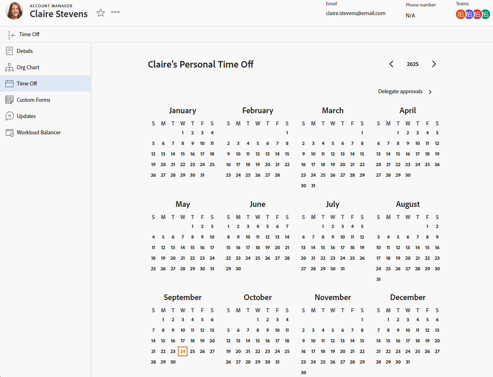

# Configurar folga pessoal

<!-- Audited: 12/2023 -->

As informações destacadas nesta página referem-se a funcionalidades que ainda não estão disponíveis. Ele está disponível somente no ambiente de Pré-visualização da Sandbox e está sendo lançado em uma implantação em fases para Produção.

O [!DNL Adobe Workfront] não foi projetado para replicar ou substituir seus sistemas existentes para gerenciar, acumular e rastrear o tempo livre pessoal.

No entanto, é importante indicar quando ocorre a folga aprovada, pois isso afeta seu agendamento e as [!UICONTROL Datas de conclusão planejadas] das tarefas às quais você está atribuído.

Por exemplo, se você estiver atribuído a uma tarefa com duração de duas semanas e planeja três dias de folga durante esse período, o [!DNL Workfront] adiciona três dias à linha do tempo da tarefa para considerar o tempo de folga.

As ferramentas de Gerenciamento de Recursos também usam sua folga pessoal para indicar quando você está disponível para ser programado para o trabalho.

>[!NOTE]
>
>Para garantir que não ocorram inconsistências com as datas para as quais você agenda a folga, recomendamos que o fuso horário do seu perfil de usuário corresponda ao da sua agenda. Para obter mais informações, consulte os seguintes artigos:
>
>* [Criar um agendamento](../../../administration-and-setup/set-up-workfront/configure-timesheets-schedules/create-schedules.md)
>* [Editar o perfil de um usuário](../../../administration-and-setup/add-users/create-and-manage-users/edit-a-users-profile.md)
>

## Requisitos de acesso

+++ Expanda para visualizar os requisitos de acesso para a funcionalidade neste artigo.

<table style="table-layout:auto"> 
 <col> 
 </col>
 <tbody> 
  <tr> 
   <td> Pacote do Adobe Workfront</td> 
   <td>
Qualquer
</td> 
  </tr> 
  <tr> 
   <td>Licença do Adobe Workfront</td> 
   <td> 
Para configurar suas folgas pessoais, você deve ter:

        
Padrão (para configurar seu tempo livre pessoal)

        
Trabalhar ou mais (para configurar seu tempo livre pessoal)
 </td>
  </tr> 
  <tr> 
   <td>Configurações de nível de acesso</td> 
   <td>
Para fazer alterações no calendário de folga de outro usuário, você deve ser o gerente desse usuário e ter acesso para Editar usuário.

   
<strong>OBSERVAÇÃO:</strong> se um gerente editar o calendário de folga pessoal de outro usuário, todas as entradas serão mostradas no fuso horário do usuário e não no fuso horário do gerente.
</td> 
  </tr> 
 </tbody> 
</table>

Para obter informações, consulte [Requisitos de acesso na documentação do Workfront](/help/quicksilver/administration-and-setup/add-users/access-levels-and-object-permissions/access-level-requirements-in-documentation.md).

+++

## Configurar folga pessoal em [!DNL Workfront]

{{step1-click-profile-pic}}

>[!NOTE]
>
>Se você estiver na Experiência unificada do Adobe, poderá acessar o perfil do Workfront clicando no menu de conta do Adobe (sua imagem de perfil) na área de navegação superior e escolhendo Perfil do Workfront.
>
>

1. No painel esquerdo, clique em **[!UICONTROL Folga]**.
1. Selecione a data desejada para sua folga pessoal.

   Imagem de exemplo no ambiente de Visualização:
   

   Imagem de amostra no ambiente de produção:
   

1. Selecione **[!UICONTROL Todo o dia]**, se você estiver tirando um dia de folga.

   Deixe a caixa de seleção desmarcada se estiver tirando menos de um dia inteiro de folga e indique as horas de início e término de sua folga.

1. Clique em **[!UICONTROL Salvar]**.

   Sua folga agora está visível no sistema [!DNL Workfront] nas ferramentas de gerenciamento de recursos, como o Planejador de recursos e o Balanceador de carga de trabalho. Quando você recebe um trabalho durante esse período, uma dica de ferramenta informa ao usuário que você programou uma folga.
