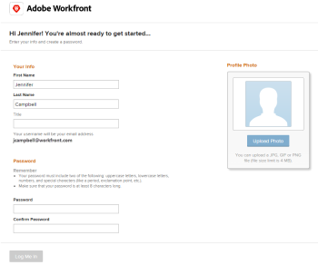

# Receba convites por email e crie uma senha para [!DNL Adobe Workfront]

## Requisitos de acesso

Você deve ter o seguinte acesso para executar as etapas deste artigo:

<table style="table-layout:auto"> 
 <col> 
 </col> 
 <col> 
 </col> 
 <tbody> 
  <tr> 
   <td role="rowheader"><strong>[!DNL Adobe Workfront] plano*</strong></td> 
   <td> 
Qualquer
 </td> 
  </tr> 
  <tr> 
   <td role="rowheader"><strong>[!DNL Adobe Workfront] licença*</strong></td> 
   <td> 
[!UICONTROL Solicitação] ou superior
 </td> 
  </tr> 
 </tbody> 
</table>

Para saber que tipo de plano ou licença você tem, contate o administrador do [!DNL Workfront].

## Receber convites por email

Quando um administrador do [!DNL Workfront] cria um novo usuário, o novo usuário pode receber um email de convite com base em vários fatores:

* Se a organização do usuário foi integrada ao [!DNL Adobe Admin Console]
* Se o usuário foi adicionado em [!DNL Workfront] ou em [!DNL Admin Console]
* Se o usuário tem acesso a outros produtos do [!DNL Adobe] ou se é um novo usuário do [!DNL Adobe]
* Se o administrador optou por enviar ao usuário um convite por email (aplica-se somente a organizações que ainda não estão no [!DNL Admin Console])

Para obter mais informações sobre como um administrador do [!DNL Workfront] envia convites por email ao criar novos usuários, consulte [Gerenciar convites por email para novos usuários](../../../administration-and-setup/manage-workfront/emails/manage-email-invitations.md).

Para obter mais informações sobre como um administrador do Workfront adiciona novos usuários a [!DNL Adobe Workfront], consulte [Adicionar usuários](../../../administration-and-setup/add-users/create-and-manage-users/add-users.md).

## Criar uma senha para [!DNL Workfront]

Como um novo usuário, depois que você receber o email de convite, poderá seguir o link no convite por email e terminar de criar sua conta do [!DNL Workfront] escolhendo uma senha.

>[!NOTE]
>
>O link no email é válido somente pela quantidade de dias especificada na área [!UICONTROL opções gerais] da página [!UICONTROL Convites] pelo administrador [!DNL Workfront].

Para criar uma senha para [!DNL Workfront] usando o email de convite:

1. Clique em **[!UICONTROL Introdução]** no email de convite da Workfront.

   

1. Especifique as seguintes informações:\
   **[!UICONTROL Nome]**: seu nome (deve ser preenchido previamente).\
   **[!UICONTROL Sobrenome]**: seu sobrenome (deve ser preenchido previamente).\
   **[!UICONTROL Título]**: seu título na organização.\
   **[!UICONTROL Senha]**: escolha uma senha para fazer logon no Workfront.\
   **[!UICONTROL Confirmar senha]**: Confirme sua senha do [!DNL Workfront].

1. Selecione **[!UICONTROL Aceito os Termos e Condições]**.
1. Clique Em **[!UICONTROL Fazer Meu Logon]**.\
   Isso conclui a criação da sua conta de usuário no Workfront.
