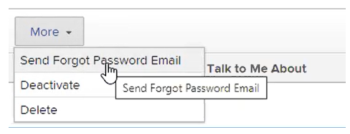

# Redefina a senha de um usuário com Autenticação Avançada

Quando a Autenticação aprimorada (eAuth) estiver ativada para sua [!DNL Workfront] Ambiente, a [!DNL Workfront] o administrador não pode redefinir as credenciais de logon de outro usuário. Isso difere de [!DNL Workfront] ambientes sem eAuth ou aqueles ambientes para os quais o Single Sign On (SSO) é ativado.

## Requisitos de acesso

Você deve ter o seguinte acesso para executar as etapas neste artigo:

<table style="table-layout:auto"> 
 <col> 
 <col> 
 <tbody> 
  <tr> 
   <td role="rowheader"><strong>[!DNL Adobe Workfront] plano*</strong></td> 
   <td> 
 Qualquer Um
 </td> 
  </tr> 
  <tr> 
   <td role="rowheader"><strong>[!DNL Adobe Workfront] licença*</strong></td> 
   <td> 
[!UICONTROL Plan]
 </td> 
  </tr> 
  <tr> 
   <td role="rowheader"><strong>Configurações de nível de acesso*</strong></td> 
   <td> 
Administrador do sistema 
 </td> 
  </tr> 
 </tbody> 
</table>

Para descobrir qual plano, tipo de licença ou acesso você tem, entre em contato com seu [!DNL Workfront] administrador.

## Redefinir a senha de um usuário em um ambiente habilitado para eAuth

1. Clique no botão **[!UICONTROL Menu principal]** ícone  no canto superior direito de [!DNL Workfront], depois clique em **[!UICONTROL Usuários]** .

   

1. Selecione o **[!UICONTROL Usuário]** que requer uma redefinição de senha.
   

1. Clique no botão **[!UICONTROL Mais] botão** que aparece depois que você escolheu o **[!UICONTROL Usuário]** e selecione o **[!UICONTROL Enviar e-mail de Esquecimento de Senha]** no menu suspenso.

   

Depois de selecionar o **[!UICONTROL Enviar e-mail de Esquecimento de Senha]** , um email é enviado para o usuário selecionado que contém instruções para que ele altere sua própria senha.

