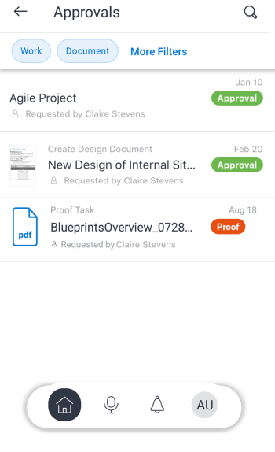

# Aprovações no aplicativo móvel [!DNL Adobe Workfront]

Você pode gerenciar aprovações atribuídas ou delegadas a você na área [!UICONTROL Aprovações] do aplicativo móvel [!DNL Adobe Workfront]. Na área [!UICONTROL aprovações], você pode aprovar:

<table style="table-layout:auto"> 
 <col> 
 <col> 
 <tbody> 
  <tr> 
   <td> 
    <ul> 
     <li>Trabalho (Tarefas e Problemas)</li> 
     <li>Documentos</li> 
     <li>Provas </li> 
    </ul> </td> 
   <td> 
    <ul> 
     <li>Planilhas de horas</li> 
     <li>Solicitações de Acesso</li> 
    </ul> </td> 
  </tr> 
 </tbody> 
</table>

As provas seguem um processo de aprovação separado. Você não pode aprovar uma prova de um item de trabalho ou aprovação de documento. Para obter informações sobre como revisar e aprovar provas, consulte [Revisar e tomar decisões sobre provas no [!DNL Adobe Workfront] aplicativo móvel](../../../workfront-basics/mobile-apps/using-the-workfront-mobile-app/work-with-proofs-in-mobile-app.md).

## Revisar uma aprovação

1. Selecione **[!UICONTROL Mostrar todas as aprovações]** na área [!UICONTROL Aprovações] de [!UICONTROL Meu Trabalho].

   Para obter informações sobre [!UICONTROL Meu Trabalho] no aplicativo móvel, consulte a seção [[!UICONTROL Meu Trabalho] no aplicativo móvel](../../../workfront-basics/mobile-apps/using-the-workfront-mobile-app/my-work-section-mobile.md).

1. Selecione uma aprovação na lista.

   

1. Revise as informações associadas à aprovação, como atualizações, documentos e detalhes.

   Este exemplo mostra uma aprovação de tarefa. Outros tipos de aprovação podem conter informações diferentes.

   

## Tomar uma decisão sobre uma aprovação

1. Abra a aprovação.
1. Selecione uma decisão. A lista de opções de decisão depende do tipo de aprovação que você está visualizando.

   | Ícone | Decisão |
   |---|---|
   |  | [!UICONTROL Aprovar] |
   |  | [!UICONTROL Aprovar com alterações] (disponível somente para documentos) |
   |  | [!UICONTROL Rejeitar] |

   {style="table-layout:auto"}

1. (Opcional) Selecione **[!UICONTROL Adicionar comentário]** na mensagem de confirmação, na parte inferior da tela, para adicionar comentários à decisão. Esses comentários aparecem nas atualizações para aprovação.\
   \
   Ou\
   Selecione a seta na parte superior esquerda da aprovação para voltar para a página [!UICONTROL Aprovações].
