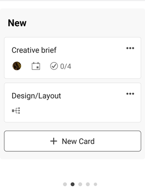

# [!DNL Adobe Workfront] [!UICONTROL Quadros] para dispositivos móveis

[!DNL Adobe Workfront] [!UICONTROL Quadros] são ferramentas flexíveis que permitem a colaboração em equipe, fornecendo acesso a um quadro compartilhado que contém colunas e cartões. Para obter informações adicionais sobre placas, consulte [Visão geral dos painéis](/help/quicksilver/agile/boards-overview.md).

No [!DNL Workfront] aplicativo móvel, você pode ver todos os quadros que criou ou aos quais foi adicionado na versão para desktop do [!DNL Workfront]. Você não pode criar um novo painel no aplicativo móvel.

Quaisquer alterações feitas nas colunas da placa e nos cartões no aplicativo também são refletidas na versão da placa para desktop.

Para fornecer feedback sobre painéis móveis, selecione o **[!UICONTROL Enviar]**  na parte superior de qualquer quadro e siga os prompts.

>[!NOTE]
>
>No momento, o aplicativo móvel é compatível com todos os tipos de quadros **exceto** Quadros de Processo de Iteração.

## Visualizar e filtrar a lista de quadros

1. Selecionar [!UICONTROL **Quadros**] na página inicial para ver uma lista de todas as placas que você criou ou às quais foi adicionado na versão para desktop do [!DNL Workfront].

   

1. Para classificar ou filtrar a lista de quadros, selecione [!UICONTROL **Mais filtros**].
1. Selecione uma destas opções:

   * Na seção Filtro, selecione [!UICONTROL **Arquivado**] para exibir quadros arquivados na lista. Somente as placas ativas são exibidas por padrão.
   * Na seção Classificar, selecione [!UICONTROL **Data de modificação**] ou [!UICONTROL **Nome**].
   * Na seção Ordem, selecione [!UICONTROL **Crescente**] ou [!UICONTROL **Decrescente**] para definir a ordem de classificação.

1. Selecionar [!UICONTROL **Aplicar**] ou  para aplicar os filtros e retornar à lista de quadros.

   É possível acessar essas opções a qualquer momento para alterá-las ou retornar às configurações padrão.

1. Para abrir um quadro, selecione-o na lista.

>[!NOTE]
>
>No momento, só é possível arquivar ou excluir uma placa da versão para desktop do [!DNL Workfront] [!UICONTROL Quadros], não do aplicativo móvel.

## Exibir conteúdo do quadro

Ao abrir um quadro, suas colunas e cartões são exibidos. Rolar horizontalmente para exibir todas as colunas e verticalmente para exibir todos os cartões em uma coluna.

Selecione e segure um cartão para movê-lo para outra coluna.

Se o quadro contiver uma coluna de entrada, ela aparecerá como a coluna mais à esquerda. Os cartões na coluna de entrada não são editáveis até que você os mova para outras colunas do quadro. Você pode selecionar um cartão para abrir a tarefa ou problema. Os filtros da coluna de entrada são controlados na versão da placa para desktop. Para obter mais informações, consulte [Adicionar uma coluna de entrada a um quadro](/help/quicksilver/agile/use-boards-agile-planning-tools/add-intake-column-to-board.md).

## Trabalhar com cartões conectados

Um cartão conectado é conectado a uma tarefa ou problema existente no [!DNL Workfront]. No aplicativo móvel, um cartão conectado é designado com o  ícone. Na imagem abaixo, a segunda placa é uma placa conectada.

Quando qualquer um dos detalhes a seguir é atualizado para o cartão em um local, ele é atualizado automaticamente no outro local:

* [!UICONTROL Nome]
* [!UICONTROL Descrição]
* [!UICONTROL Atribuídos]
* [!UICONTROL Status]

Por exemplo, se você atualizar o nome de um cartão conectado em um quadro no aplicativo móvel, ele também será atualizado na tarefa ou problema.

1. Selecione um cartão para ver seu nome, descrição, coluna, responsáveis, conexão, status, data de vencimento, estimativa, tags e itens da lista de verificação. Ao editar qualquer um desses detalhes, eles são salvos automaticamente. Selecione o X para fechar o cartão e retornar ao quadro.

   >[!NOTE]
   >
   >Você pode selecionar uma tag diferente no cartão, mas não pode criar novas tags no aplicativo móvel.

1. (Opcional) Para excluir um cartão, selecione a [!UICONTROL **Mais**] menu  no cartão e escolha [!UICONTROL **Excluir**]. Em seguida, selecione [!UICONTROL **Excluir**] na mensagem de confirmação.

## Trabalhar com cartões ad hoc

Um cartão ad hoc não está conectado a uma tarefa ou problema do Workfront. Na imagem abaixo, a primeira placa é uma placa ad hoc.

1. Selecione um cartão para ver seu nome, descrição, coluna, responsáveis, status, data de vencimento, estimativa, tags e itens da lista de verificação. Ao editar qualquer um desses detalhes, eles são salvos automaticamente. Selecione o X para fechar o cartão e retornar ao quadro.

   >[!NOTE]
   >
   >Você pode selecionar uma tag diferente no cartão, mas não pode criar novas tags no aplicativo móvel.

1. (Opcional) Para adicionar um novo cartão ad hoc, selecione [!UICONTROL **Novo cartão**] na coluna em que deseja adicionar o cartão e digite o nome do cartão. Para adicionar detalhes, selecione o cartão recém-adicionado.

1. Para copiar um cartão, selecione a variável [!UICONTROL **Mais**] menu  no cartão e escolha [!UICONTROL **Copiar**].

1. (Opcional) Para excluir um cartão, selecione a [!UICONTROL **Mais**] menu  no cartão e escolha [!UICONTROL **Excluir**]. Em seguida, selecione [!UICONTROL **Excluir**] na mensagem de confirmação.

## Gerenciar itens da lista de verificação em cartões

Os itens da lista de verificação estão disponíveis em cartões ad hoc e conectados.

1. Para adicionar um item de lista de verificação, abra o cartão e selecione [!UICONTROL **Novo item da lista de verificação**]. Informe o nome do item da lista de verificação. O contador no cartão é atualizado.
1. (Opcional) Para copiar um item da lista de verificação, abra o cartão, selecione a [!UICONTROL **Mais**] menu  no item e escolha [!UICONTROL **Copiar**]. Uma cópia do item é adicionada na parte inferior da lista.
1. (Opcional) Para excluir um item da lista de verificação, abra o cartão, selecione a [!UICONTROL **Mais**] menu  no item e escolha [!UICONTROL **Excluir**].
1. Para concluir um item da lista de verificação, abra o cartão e marque a caixa de seleção ao lado do nome do item.
O item está marcado como concluído, o contador no cartão atualiza para mostrar quantos itens da lista de verificação estão concluídos.

## Filtrar e pesquisar em um quadro

Você pode filtrar um cartão para exibir cartões atribuídos a determinadas pessoas ou pesquisar para localizar um cartão específico no quadro.

Quando os filtros são aplicados, um indicador é exibido no quadro . Selecione o ícone de filtro e escolha [!UICONTROL **Limpar tudo**] para remover todos os filtros do quadro.

### Filtrar um quadro por responsáveis

1. Selecione o filtro e o ícone de pesquisa .
1. Selecionar [!UICONTROL **Membros**] e escolha a pessoa ou pessoas cujos cartões você deseja ver. Também é possível exibir cartões não atribuídos.
1. Selecionar [!UICONTROL **Concluído**] ou .

### Filtrar um quadro por tags ([!DNL iOS] somente)

1. Selecione o filtro e o ícone de pesquisa .
1. Selecionar [!UICONTROL **Tags**] e escolha as tags que deseja ver.
1. Selecionar [!UICONTROL **Concluído**].

### Pesquisar em um quadro

1. Selecione o filtro e o ícone de pesquisa .
1. Digite um termo de pesquisa na caixa e selecione [!UICONTROL **Concluído**] ou .

   Todos os cartões que contêm o termo de pesquisa no título são exibidos.
Selecione o X para limpar a pesquisa.

   
