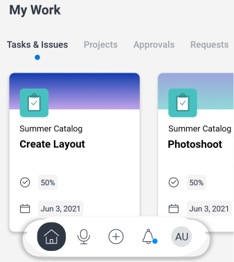

# Seção [!UICONTROL Meu Trabalho] no aplicativo móvel

A seção [!UICONTROL Meu Trabalho] da área [!UICONTROL Página Inicial] exibe suas tarefas, problemas, projetos, aprovações, solicitações e planilhas de horas.

>[!NOTE]
>
>[!UICONTROL Meu Trabalho] no aplicativo móvel é separado de [!UICONTROL Meu Trabalho] na versão para desktop do [!UICONTROL Adobe Workfront].

## Personalizar a seção [!UICONTROL Meu Trabalho]

Você pode escolher quais itens de menu exibir em [!UICONTROL Meu Trabalho] e alterar a ordem dos itens.

1. No menu flutuante, toque na foto ou nas iniciais para acessar o perfil.
1. Role até a seção **[!UICONTROL Configuração]** e toque em **[!UICONTROL Configurações]**.
1. Na página **[!UICONTROL Configurações]**, selecione e arraste os itens de menu para que fiquem na ordem correta na área [!UICONTROL Página inicial].
1. Toque no ícone azul de alternância para ocultar os itens de menu que não deseja exibir. Toque no ícone cinza de alternância para exibir o item novamente.

   >[!NOTE]
   >
   >O item de menu [!UICONTROL Tarefas e problemas] é sempre exibido e você não pode ocultá-lo.

   
