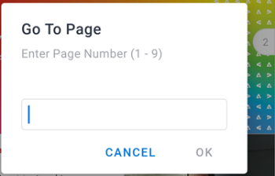

# Revisar e tomar decisões sobre provas no [!DNL Adobe Workfront] aplicativo móvel

Quando uma prova é atribuída a você para aprovação, ela aparece na lista de aprovações no aplicativo móvel. Você pode revisar a prova diretamente no aplicativo e tomar uma decisão sobre ela. Para obter informações sobre a revisão e aprovação de provas no [!DNL Adobe Workfront], consulte [Revisar provas no [!DNL Adobe Workfront]](../../../review-and-approve-work/proofing/reviewing-proofs-within-workfront/review-proofs-in-wf.md).

É possível adicionar comentários à prova e passar por um processo de revisão antes de tomar uma decisão final. Para obter informações sobre comentários, consulte [Comentário sobre provas em [!DNL iOS]](../../../workfront-basics/mobile-apps/using-the-workfront-mobile-app/comment-on-proofs-ios.md) ou [Comentário sobre provas em [!DNL Android]](../../../workfront-basics/mobile-apps/using-the-workfront-mobile-app/comment-on-proofs-android.md).

Seu acesso para revisar e aprovar provas é igual ao da [!DNL Adobe Workfront]. Para obter informações sobre recursos de prova, consulte [Perfis de permissões de prova em [!DNL Workfront Proof]](../../../workfront-proof/wp-acct-admin/account-settings/proof-perm-profiles-in-wp.md).

## Abrir e revisar uma prova

1. Abra a tarefa de aprovação de prova:

   * Selecione a tarefa de aprovação de prova no [!UICONTROL Aprovações] área de [!UICONTROL Meu trabalho].

      \
      Ou

   * Selecionar **[!UICONTROL Mostrar todas as aprovações]** no [!UICONTROL Aprovações] área de [!UICONTROL Meu trabalho]. Em seguida, selecione a tarefa proof approval na lista de todas as aprovações.

      Para obter informações sobre [!UICONTROL Meu trabalho] no aplicativo móvel, consulte [[!UICONTROL Meu trabalho] no aplicativo móvel](../../../workfront-basics/mobile-apps/using-the-workfront-mobile-app/my-work-section-mobile.md).

1. Na página Detalhes, selecione **[!UICONTROL Ir para prova]**.

   

1. Revise a prova do documento.
1. (Opcional) Selecione ![[!UICONTROL Ícone de Página única]](assets/mobile-proofpagingicon1-25x36.png) na parte superior direita do documento para alterar da exibição de página única para a exibição contínua. Selecionar ![[!UICONTROL Ícone de Página contínua]](assets/mobile-proofpagingicon2-25x25.png) para alterar de volta para a exibição de página única.

   Na exibição de página única, você rola a tela para a direita e para a esquerda para percorrer as páginas do documento. Na exibição contínua, você pode rolar para cima e para baixo para percorrer as páginas.

1. (Opcional) Vá para uma página específica usando o indicador de rolagem à direita:

   1. Toque no indicador de rolagem.
   1. Digite o número da página na caixa [!UICONTROL Ir para página] e selecione **[!UICONTROL OK]**.
   1. 

1. Selecione a seta na parte superior esquerda do documento para voltar para a [!UICONTROL Detalhes] página.
1. (Opcional) No [!UICONTROL Detalhes] selecione **[!UICONTROL Atualizações]** para ver todas as atualizações da prova, como quando foi criada e quando foi enviada para aprovação.

## Bloquear e desbloquear uma prova

Qualquer usuário atribuído como proprietário, autor ou moderador de prova pode bloquear uma prova para impedir que outras pessoas façam comentários ou tomem decisões sobre ela.

### Bloquear uma prova

1. Abra a prova do documento e selecione a **[!UICONTROL Mais]** menu  na parte superior direita do documento. Em seguida, selecione **[!UICONTROL Mais]**.
1. Selecionar **[!UICONTROL Bloquear documento]**.\
   A &quot;[!UICONTROL Bloqueado]&quot; aparece na parte superior do documento.

### Desbloquear uma prova

1. Abra a prova do documento e selecione a **[!UICONTROL Mais]** menu  na parte superior direita do documento. Em seguida, selecione **[!UICONTROL Mais]**.
1. Selecionar **[!UICONTROL Desbloquear documento]**.
1. Selecionar **[!UICONTROL Desbloquear]** na mensagem de confirmação.

## Tomar decisões sobre uma prova

Depois de revisar a prova do documento, você pode tomar uma decisão na própria prova. Se o proprietário da prova tiver bloqueado a prova, você não poderá tomar uma decisão.

### Tomar uma decisão na prova

1. Abra a prova do documento.
1. Selecionar o ícone de decisão ![[!UICONTROL Decisão] ícone](assets/mobile-proofcheckmarkdecisionicon-30x30.png) na parte superior direita do documento.
1. Selecione uma decisão na [!UICONTROL Tomar uma decisão] caixa.

   Algumas opções comuns de decisão são mostradas abaixo. A variável [!DNL Adobe Workfront] administrador ou [!UICONTROL Prova do Workfront] O administrador pode configurar a lista de opções de decisão. Para obter mais informações sobre como os administradores podem configurar decisões, consulte [Configurar opções de decisão de aprovação no Workfront Proof](../../../workfront-proof/wp-acct-admin/account-settings/configure-approval-decision-in-wp.md).

   <table style="table-layout:auto"> 
    <col> 
    <col> 
    <tbody> 
     <tr> 
      <td role="rowheader"><strong>[!UICONTROL Aprovado]</strong></td> 
      <td>A prova está pronta para ir até o próximo estágio do fluxo de trabalho.</td> 
     </tr> 
     <tr> 
      <td role="rowheader"><strong>[!UICONTROL Aprovado com alterações]</strong></td> 
      <td> 
A prova exige algumas alterações, mas você não precisa ver a revisão antes de passar para o próximo estágio do fluxo de trabalho.
 </td> 
     </tr> 
     <tr> 
      <td role="rowheader"><strong>[!UICONTROL Rejeitado]</strong></td> 
      <td>A prova é rejeitada e não avançará no fluxo de trabalho.</td> 
     </tr> 
    </tbody> 
   </table>

1. (Condicional) Se a variável [!DNL Adobe Workfront] administrador ou [!DNL Workfront Proof] o administrador adicionou uma lista de [!UICONTROL Motivos], selecione os motivos aplicáveis para sua decisão.

   Alguns motivos também podem exigir comentários para explicar por que você escolheu o motivo.

   Para obter mais informações sobre como os administradores podem configurar motivos, consulte  [Configurar opções de decisão de aprovação no [!DNL Workfront Proof]](../../../workfront-proof/wp-acct-admin/account-settings/configure-approval-decision-in-wp.md).

1. Selecionar **[!UICONTROL Enviar]**.

### Altere sua decisão na prova

1. Abra a prova do documento.
1. Selecionar o ícone de decisão ![[!UICONTROL Decisão] ícone](assets/mobile-proofcheckmarkdecisionicon-30x30.png) na parte superior direita do documento.

   A variável [!UICONTROL Tomar uma decisão] mostra sua decisão atual.

1. Selecione uma decisão diferente ou escolha **[!UICONTROL Limpar seleção]** para revogar a decisão.

   Para decisões com motivos, você pode escolher um motivo diferente ou remover o motivo.

1. Selecionar **[!UICONTROL Enviar]**.
