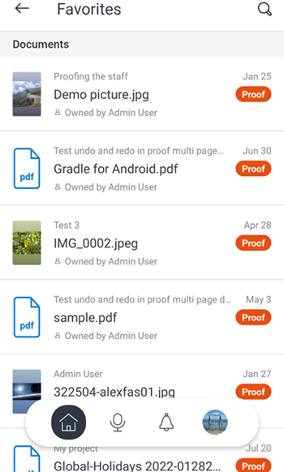

# [!DNL Adobe Workfront] por [!DNL Android]

A variável [!DNL Adobe Workfront] permite acessar seu trabalho em qualquer [!DNL Android] dispositivo. Você pode instalar e usar o [!DNL Workfront] aplicativo móvel em telefones e tablets em execução [!DNL Android] 5.0 ou posterior.

Para obter informações sobre como fazer logon no aplicativo móvel, consulte a seção [Faça logon no [!DNL Workfront] aplicativo móvel](../../../workfront-basics/manage-your-account-and-profile/managing-your-workfront-account/log-in-to-workfront.md#log) no artigo [Efetue logon no [!DNL Adobe Workfront]](../../../workfront-basics/manage-your-account-and-profile/managing-your-workfront-account/log-in-to-workfront.md).

## [!UICONTROL Página inicial]

A variável [!UICONTROL Início] permite trabalhar diretamente em tarefas, problemas e aprovações atribuídas a você. No [!UICONTROL Início] área do aplicativo, é possível:

<table style="table-layout:auto"> 
 <col> 
 <col> 
 <tbody> 
  <tr> 
   <td> 
    <ul> 
     <li>Começar a trabalhar em tarefas e problemas</li> 
     <li>Marcar tarefas e problemas como [!UICONTROL Concluído]</li> 
     <li>Reatribuir tarefas e problemas</li> 
     <li>Alterar a [!UICONTROL Data de Confirmação]</li> 
    </ul> </td> 
   <td> 
    <ul> 
     <li>Atualizar status de tarefas e problemas</li> 
     <li>Publicar na área Atualizações</li> 
     <li>Visualizar documentos</li> 
     <li>Anexar fotos</li> 
     <li> 
Criar uma solicitação ou uma tarefa rápida
 
Nota: As tarefas rápidas criadas na home page são tarefas pessoais, a menos que você opte por atribuir um projeto.
 </li> 
    </ul> </td> 
  </tr> 
 </tbody> 
</table>

Para obter mais informações, consulte [[!UICONTROL Início] widgets de área](../../../workfront-basics/mobile-apps/using-the-workfront-mobile-app/home-area-widgets-mobile.md) e [[!UICONTROL Meu trabalho] no aplicativo móvel](../../../workfront-basics/mobile-apps/using-the-workfront-mobile-app/my-work-section-mobile.md).

## [!UICONTROL Quadros]

A variável [!UICONTROL Quadros] permite acessar seu [!DNL Workfront] placas.

Para obter mais informações, consulte [[!DNL Adobe Workfront] [!UICONTROL Boards] para dispositivos móveis](/help/quicksilver/workfront-basics/mobile-apps/using-the-workfront-mobile-app/mobile-boards.md).

## [!UICONTROL Projetos]

A variável [!UICONTROL Projetos] permite que você interaja com e gerencie os projetos que possui e os projetos em que está. No [!UICONTROL projetos] área do aplicativo, é possível:

<table style="table-layout:auto"> 
 <col> 
 <col> 
 <tbody> 
  <tr> 
   <td> 
    <ul> 
     <li>Atualizar status do projeto</li> 
     <li>Exibir detalhes importantes do projeto</li> 
     <li>Publicar na área [!UICONTROL Atualizações]</li> 
     <li>Converter tarefas, problemas e solicitações em projetos</li> 
    </ul> </td> 
   <td> 
    <ul> 
     <li>Interagir com tarefas e problemas do projeto</li> 
     <li>Visualizar documentos</li> 
     <li>Anexar fotos</li> 
     <li> 
Criar uma tarefa rápida
 
Observação: tarefas criadas em um projeto são automaticamente atribuídas ao projeto em que você está. 
 </li> 
    </ul> </td> 
  </tr> 
 </tbody> 
</table>

## [!UICONTROL Aprovações]

A variável [!UICONTROL Aprovações] permite visualizar e aprovar aprovações atribuídas ou delegadas a você. No [!UICONTROL aprovações] é possível aprovar:

<table style="table-layout:auto">
 <col>
 <col>
 <tbody>
  <tr>
   <td>
    <ul>
     <li>Trabalho (Tarefas e Problemas)</li>
     <li>Documentos</li>
     <li>Provas </li>
    </ul> </td>
   <td>
    <ul>
     <li>Folhas de horas</li>
     <li>Solicitações de Acesso</li>
    </ul> </td>
  </tr>
 </tbody>
</table>

Para obter mais informações sobre aprovações, consulte [Aprovações no [!DNL Adobe Workfront] aplicativo móvel](../../../workfront-basics/mobile-apps/using-the-workfront-mobile-app/approvals-in-mobile-app.md).

Para obter informações sobre revisão e aprovação de provas, consulte [Revisar e tomar decisões sobre provas no [!DNL Adobe Workfront] aplicativo móvel](../../../workfront-basics/mobile-apps/using-the-workfront-mobile-app/work-with-proofs-in-mobile-app.md).

## [!UICONTROL Notificações]

A variável [!UICONTROL Notificação] permite visualizar e responder às notificações no aplicativo para o seu trabalho.

>[!NOTE]
>Os hiperlinks não estão disponíveis nas notificações de atualização, a menos que todo o conteúdo de uma nota seja um hiperlink sem texto de exibição.

## [!UICONTROL Solicitações]

A variável [!UICONTROL Solicitações] permite exibir detalhes sobre solicitações. No [!UICONTROL Solicitações] área do aplicativo, é possível:

<table style="table-layout:auto">
 <col>
 <col>
 <tbody>
  <tr>
   <td>
    <ul>
     <li>Reatribuir a solicitação</li>
     <li>Atualizar o status</li>
     <li>Ajustar a prioridade</li>
    </ul> </td>
   <td>
    <ul>
     <li>Publicar na área Atualizações</li>
     <li>Visualizar documentos</li>
     <li>Anexar fotos</li>
     <li>Salvar uma solicitação como rascunho</li>
    </ul> </td>
  </tr>
 </tbody>
</table>

## [!UICONTROL Folhas de horas]

A variável [!UICONTROL planilhas de horas] permite exibir detalhes sobre suas folhas de horas. Na área Folhas de horas do aplicativo, é possível:

* Publicar no [!UICONTROL Atualizações] área
* Ajustar tipos de horas
* Alterar o horário em que você fez logon
* Inserir comentários em sua folha de horas
* Fechar sua planilha de horas

## [!UICONTROL Favoritos]

Você pode acessar itens existentes na [!UICONTROL Favoritos] e adicionar novos itens ao menu Favoritos.

## [!UICONTROL Contatos]

A variável [!UICONTROL Contatos] permite exibir as informações de contato de todos os usuários em sua empresa.

## [!UICONTROL Configuração]

A variável [!UICONTROL Configuração] permite:

* Gerenciar suas configurações
* Exibir equipes atribuídas
* Configurar preferências de segurança
* Enviar feedback
* Acessar conteúdo da Ajuda
* Logout

## [!UICONTROL Assistente virtual]

O assistente virtual permite executar as seguintes tarefas por meio do comando de voz:

* [!UICONTROL Mostre-me]
* [!UICONTROL Excluir]
* [!UICONTROL Procurar]
* [!UICONTROL Ajude-me com os comandos]

Para obter mais informações sobre o Assistente virtual, consulte [Adobe [!DNL Workfront] assistente virtual do aplicativo móvel](../../../workfront-basics/mobile-apps/using-the-workfront-mobile-app/wf-mobile-virtual-assistant.md).

## [!UICONTROL Pins]

A variável [!UICONTROL Fixar] permite acessar os comandos do assistente virtual salvos, bem como os pins do navegador da web.

Para obter mais informações sobre o Assistente virtual, consulte [Adobe [!DNL Workfront] assistente virtual do aplicativo móvel](../../../workfront-basics/mobile-apps/using-the-workfront-mobile-app/wf-mobile-virtual-assistant.md).
