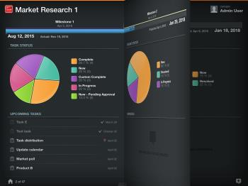

# Exibir projetos em [!UICONTROL Visualização do Adobe Workfront]

Por padrão, a lista de projetos exibida no [!DNL Adobe Workfront View] mostra os 100 projetos ativos mais recentes. A lista de projetos não é agrupada por nenhum critério.

## Requisitos de acesso

Você deve ter o seguinte acesso no [!DNL Workfront] para executar as etapas deste artigo:

<table style="table-layout:auto"> 
 <col> 
 </col> 
 <col> 
 </col> 
 <tbody> 
  <tr> 
   <td role="rowheader"><strong>[!DNL Adobe Workfront] plano*</strong></td> 
   <td> 
Qualquer Um
 </td> 
  </tr> 
  <tr> 
   <td role="rowheader"><strong>[!DNL Adobe Workfront] licença*</strong></td> 
   <td> 
[!UICONTROL Review] ou superior
 </td> 
  </tr> 
 </tbody> 
</table>

&#42;Para descobrir que plano, tipo de licença ou acesso você tem, entre em contato com o [!DNL Workfront] administrador.

## Alterar o agrupamento na lista de projetos

1. Na home page de [!DNL Workfront View], passe o dedo nos gráficos na parte superior da lista da direita para a esquerda para visualizar todos os critérios disponíveis para agrupar projetos.\
   ![[!DNL workfront_view_project_groupings_Adobe].png](assets/workfront-view-project-groupings-adobe-350x255.png)

1. Toque em um dos gráficos na parte superior da lista.\
   Selecionar de:

   * **[!UICONTROL Condição]**
   * **[!UICONTROL Proprietário]**
   * **[!UICONTROL Grupo]**
   * **[!UICONTROL Portfólio]**
   * **[!UICONTROL Progresso]**
   * **[!UICONTROL Status]**
   * **[!UICONTROL Patrocinador]**
Os projetos agora são listados agrupados pelos valores possíveis desses campos.
\
      Você pode agrupar projetos por um critério de cada vez. Os critérios são pré-carregados no aplicativo nos gráficos na parte superior da lista de projetos e não podem ser modificados.

## Exibir detalhes do projeto

Para exibir detalhes sobre um projeto no [!DNL Workfront View]:

1. Na home page de [!DNL Workfront] Para visualizar, toque em qualquer projeto na lista para visualizar os detalhes do projeto.\
   As informações do projeto são exibidas nos widgets disponíveis na tela.\
   Você pode ter até quatro widgets exibidos de uma vez e pode remover e adicionar widgets a cada projeto para exibir informações diferentes sobre o projeto.\
   Para obter mais informações sobre como adicionar widgets à [!UICONTROL Detalhes do projeto] exibir, consulte [Atualizar widgets na [!UICONTROL Detalhes do projeto] exibir](../../../workfront-basics/mobile-apps/using-workfront-view/update-widgets-in-workfront-view.md).

## Navegar pelos projetos no [!DNL Workfront View]

1. Toque no nome de um projeto na lista de projetos na [!DNL Workfront View] aplicativo.\
   As informações sobre o projeto são exibidas nos widgets carregados na tela.\
   Para obter mais informações sobre como adicionar widgets à [!UICONTROL Detalhes do projeto] exibir, consulte [Atualizar widgets na [!UICONTROL Detalhes do projeto] exibir](../../../workfront-basics/mobile-apps/using-workfront-view/update-widgets-in-workfront-view.md).

1. Deslize o dedo da direita para a esquerda para exibir o seguinte projeto na lista.\
   Os mesmos widgets são exibidos para cada projeto à medida que você rolar por eles.\
    
