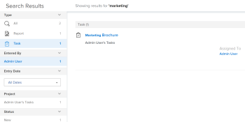
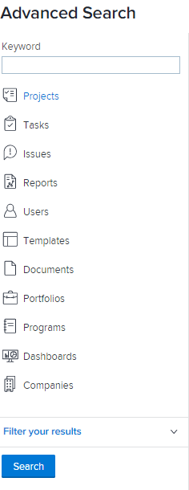

# Pesquisar [!DNL Adobe Workfront]

Você pode localizar facilmente os itens em [!DNL Adobe Workfront] ao pesquisá-los quando não for possível se lembrar da localização exata.

Você pode ver o [!UICONTROL Pesquisar] no canto superior direito de qualquer página no [!DNL Workfront].

Você deve ter permissões para Exibir um objeto antes de encontrá-lo em uma pesquisa. Por isso, os resultados da pesquisa variam de usuário para usuário.

## Requisitos de acesso

+++ Expanda esta seção para visualizar o acesso necessário para executar as etapas neste artigo.

<table style="table-layout:auto"> 
 <col> 
 <col> 
 <tbody> 
  <tr> 
   <td role="rowheader"><strong>[!DNL Adobe Workfront] plano*</strong></td> 
   <td> 
Qualquer Um
 </td> 
  </tr> 
  <tr> 
   <td role="rowheader"><strong>[!DNL Adobe Workfront] licença*</strong></td> 
   <td> 
Solicitação ou superior
 </td> 
  </tr> 
  <tr> 
   <td role="rowheader"><strong>Configurações de nível de acesso*</strong></td> 
   <td> 
Acesso à [!UICONTROL View] para o tipo de objeto 
 
Observação: Se ainda não tiver acesso, pergunte ao seu [!DNL Workfront] administrador se eles definirem restrições adicionais em seu nível de acesso. Para obter informações sobre como uma [!DNL Workfront] administrador pode modificar seu nível de acesso, consulte <a href="../../../administration-and-setup/add-users/configure-and-grant-access/create-modify-access-levels.md" class="MCXref xref">Criar ou modificar níveis de acesso personalizados</a>.
</td> 
  </tr> 
  <tr> 
   <td role="rowheader"><strong>Permissões de objeto</strong></td> 
   <td> 
Você deve ter permissões para Exibir um objeto antes de encontrá-lo em uma pesquisa.
 
Para obter informações sobre como solicitar acesso adicional, consulte <a href="../../../workfront-basics/grant-and-request-access-to-objects/request-access.md" class="MCXref xref">Solicitar acesso a objetos </a>.
 </td> 
  </tr> 
 </tbody> 
</table>

&#42;Para descobrir qual plano, tipo de licença ou acesso você tem, entre em contato com seu [!DNL Workfront] administrador.

+++

## Entender pesquisa

* [[!UICONTROL Objetos disponíveis para pesquisa]](#objects-available-for-search)
* [[!UICONTROL Campos disponíveis para pesquisa]](#fields-available-for-search)

### Objetos disponíveis para pesquisa

Você pode pesquisar os seguintes objetos no Workfront:

* Projetos
* Tarefas
* Problemas
* Relatórios
* Usuários
* Modelos
* Documentos
* Portfólios
* Programas
* Painéis
* Empresas
* Notas

### Campos disponíveis para pesquisa

Os campos disponíveis para pesquisa são baseados no tipo de pesquisa: Básico ou [!UICONTROL Pesquisa avançada].

* **Pesquisa básica**: Ao procurar objetos em uma pesquisa básica, [!DNL Workfront] procura texto que possa conter suas palavras-chave nos seguintes campos:

   * Nomes de objetos
   * Descrições
   * Campos de dados personalizados
   * Atualizações
   * Nomes de documentos (em pesquisas de documentos específicas e em uma pesquisa básica)

   Para obter mais informações sobre a pesquisa básica em [!DNL Workfront], consulte [Pesquisa básica](#basic-search) neste artigo.

* **[!UICONTROL Pesquisa avançada]**: Em um [!UICONTROL Pesquisa avançada], é possível configurar filtros para pesquisar campos não disponíveis na pesquisa básica. Por conseguinte, [!UICONTROL Pesquisa avançada] permite pesquisar qualquer campo no objeto .

   Para obter mais informações sobre [!UICONTROL Pesquisa avançada], consulte [Pesquisa avançada](#advanced-search) neste artigo.

>[!NOTE]
>
>Para executar uma [!UICONTROL Pesquisa avançada], você deve selecionar a variável [!UICONTROL Pesquisa avançada] ao iniciar a pesquisa. Não é possível refinar uma pesquisa básica em um [!UICONTROL Pesquisa avançada].

## Entender as limitações do [!DNL Workfront] pesquisas

Considere as seguintes limitações ao usar [!UICONTROL Pesquisar] em [!DNL Workfront]:

* As pesquisas não distinguem maiúsculas de minúsculas
* [!DNL Workfront] não corrige nem compreende erros de digitação
* Pesquisar em [!DNL Workfront] não suporta curingas
* Pesquisar em [!DNL Workfront] O suporta pesquisas de palavras parciais, mas não suporta pesquisas de subsequência de caracteres.\
   Por exemplo, a palavra-chave de pesquisa &quot;manter&quot; retornaria resultados incluindo a palavra &quot;padrão&quot;, mas não retornaria resultados incluindo a palavra &quot;entender&quot;.

## Pesquisar por várias palavras

Ao incluir várias palavras em uma pesquisa e encontrar somente objetos que correspondam a todas as palavras na caixa Pesquisar, digite as palavras em qualquer ordem.

Por exemplo, pesquisar por &quot;Demonstração de marketing&quot; (sem aspas) encontra objetos com os seguintes nomes:

* Demonstração de marketing
* Marketing de demonstração
* Demonstração da análise do mercado de janeiro

Ele também encontra objetos que podem ter &quot;Marketing&quot; no nome e &quot;Demonstração&quot; na descrição.

No entanto, você pode fazer o seguinte no [!UICONTROL Pesquisar] para ajustar os resultados da pesquisa exibidos:

<table style="table-layout:auto"> 
 <col> 
 <col> 
 <tbody> 
  <tr> 
   <td>Incluir aspas</td> 
   <td> 
Inserir palavras na ordem correta dentro de aspas duplas permite localizar somente objetos que sejam uma correspondência exata. Por exemplo, pesquisar por "Demonstração de marketing" (com aspas) encontra objetos com os seguintes nomes:
 
    <ul> 
     <li> Demonstração de marketing</li> 
     <li> Demonstração de marketing de janeiro</li> 
     <li>Plano de demonstração de marketing</li> 
    </ul> 
No entanto, essa pesquisa não encontraria um objeto com o nome "Demo Marketing".
 </td> 
  </tr> 
  <tr> 
   <td>Incluir OU</td> 
   <td> 
A conexão de palavras por "OU" (sem aspas) permite localizar apenas objetos que correspondam a pelo menos uma das palavras na caixa [!UICONTROL Pesquisar]. Essas palavras podem ser inseridas em qualquer ordem. Por exemplo, pesquisar por "Marketing OR Demo" (sem aspas) encontra objetos com os seguintes nomes:
 
    <ul> 
     <li> Demonstração da análise do mercado</li> 
     <li>Demonstração da análise do mercado de janeiro</li> 
     <li>Demonstração</li> 
     <li>Análise de mercado</li> 
    </ul> 
Observação: "OR" deve estar em maiúsculas. Caso contrário, será interpretado como outra palavra na frase que você está procurando.
 </td> 
  </tr> 
  <tr> 
   <td>Incluir E</td> 
   <td> 
A conexão de palavras por "AND" (sem aspas) permite encontrar apenas objetos que correspondem a todas as palavras na caixa [!UICONTROL Pesquisar]. Essas palavras podem ser inseridas em qualquer ordem. Por exemplo, pesquisar por "Marketing AND Demo" (sem aspas) encontra objetos com os seguintes nomes:
 
    <ul> 
     <li>Demonstração de marketing</li> 
     <li>Marketing de demonstração</li> 
     <li>Demonstração da análise do mercado de janeiro</li> 
    </ul> 
Observação: "AND" deve estar em maiúsculas. Caso contrário, será interpretado como outra palavra na frase que você está procurando. Da mesma forma, incluir "&amp;" (sem aspas) pesquisa somente por objetos que incluem o caractere "E" comercial (&amp;).
 </td> 
  </tr> 
 </tbody> 
</table>

## Usar pesquisa em [!DNL Workfront]

[!DNL Workfront] apresenta dois tipos de pesquisas: Básico e avançado. Use a pesquisa básica se desejar encontrar palavras-chave em campos de objeto comuns, como nome ou descrição. Use [!UICONTROL Pesquisa avançada] se desejar usar filtros para pesquisar outros campos de objeto.

* [Pesquisa Básica](#basic-search)
* [Busca Avançada](#advanced-search)

### Pesquisa Básica

Uma pesquisa básica permite procurar palavras-chave em todos os objetos do sistema ou em apenas um objeto de cada vez (como projetos). [!DNL Workfront] em seguida, a pesquisa por essas palavras-chave em alguns campos específicos. Você pode refinar seus resultados de pesquisa com base em outros campos específicos de objeto selecionados por [!DNL Workfront].

Para obter uma lista dos campos específicos pesquisados na pesquisa básica, consulte [Campos disponíveis para pesquisa](#fields-available-for-search) neste artigo.

>[!NOTE]
>
>Para executar uma [!UICONTROL Pesquisa avançada], você deve selecionar a variável [!UICONTROL Pesquisa avançada] ao iniciar a pesquisa. Não é possível refinar uma pesquisa básica em um [!UICONTROL Pesquisa avançada].

* [Realizar uma pesquisa básica](#perform-a-basic-search)
* [Refinar uma pesquisa básica](#refine-a-basic-search)

#### Realizar uma pesquisa básica

Você pode fazer uma pesquisa básica de uma das seguintes maneiras:

* Em todos os objetos do sistema (pesquisa geral).
* Em apenas um objeto de cada vez (pesquisa específica do objeto).

Para executar uma pesquisa básica:

1. Clique na lupa  no canto superior direito da página. Você também pode digitar **[!UICONTROL ALT + /]** ou **[!UICONTROL Opção + /]** para abrir o [!UICONTROL Pesquisar] menu.

1. (Opcional) Para pesquisar um objeto específico, clique no botão **[!UICONTROL Todos]** e selecione o objeto que deseja procurar.

   

1. No **[!UICONTROL Pesquisar]** , comece digitando as informações que está procurando.\
   Para obter informações sobre quais campos são pesquisados [!DNL Workfront], consulte [Entender pesquisa](#understand-search).\
   \
   Ao começar a digitar na barra de pesquisa, [!DNL Workfront] O faz recomendações com base no seu histórico de visualização e destaca a palavra-chave que você está procurando em azul.

1. Se o item que você está procurando for exibido na variável [!UICONTROL typeahead] clique nele.

   Ou

   Press **[!UICONTROL Enter]** para realizar uma pesquisa abrangente. Essa pesquisa consulta todo o banco de dados em vez dos itens visualizados mais recentemente.

   O [!UICONTROL Resultados da pesquisa] os slides de página são abertos a partir da esquerda e abrangem a maioria da página anterior.

   Se você realizou uma pesquisa geral, [!DNL Workfront] retorna resultados para qualquer objeto que corresponda ao termo de pesquisa em qualquer um dos campos pesquisados, conforme descrito em [Entender pesquisa](#understand-search). Os objetos que correspondem à pesquisa são exibidos em uma lista.

   >[!NOTE]
   >
   >Às vezes, as variações de uma palavra são exibidas na lista de itens encontrados.\
   >Por exemplo, pesquisar por &quot;marketing&quot; exibe objetos que contêm &quot;marketing&quot; ou &quot;mercado&quot; no nome.

1. (Opcional) Se sua pesquisa gerou muitos resultados, refine sua pesquisa conforme descrito em [Refinar uma pesquisa básica](#refine-a-basic-search).
1. (Opcional) Para retornar à página em que você estava antes da pesquisa, clique em **[!UICONTROL Fechar]** no canto superior direito.

>[!NOTE]
>
>O [!UICONTROL Resultados da pesquisa] página fica aberta somente quando está em foco. Clicar para sair da página ou abrir outra página fecha o [!UICONTROL Resultados da pesquisa] página.

#### Refinar uma pesquisa básica

Após realizar uma pesquisa básica, conforme descrito em [[!UICONTROL Realizar uma pesquisa básica]](#perform-a-basic-search)—você pode refinar a pesquisa.

Use a barra de ferramentas à esquerda dos resultados da pesquisa para restringir as informações que está procurando.

Para refinar uma pesquisa:

1. (Condicional) Se tiver realizado uma pesquisa geral, selecione o objeto que estava procurando na lista de objetos no canto superior esquerdo dos resultados.
1. Localize os campos disponíveis para os objetos exibidos na pesquisa na barra de ferramentas à esquerda dos resultados.\
   Os valores de cada campo são exibidos, classificados por contagem, até 10 valores para cada campo.
1. Clique dentro de qualquer campo disponível para encurtar a lista de resultados.\
   As seleções feitas são destacadas em azul, e os valores de campo que você não seleciona ficam ocultos.\
   Depois de selecionar cada novo valor, os resultados são atualizados dinamicamente à direita.\
   

1. (Opcional) Clique nos valores selecionados para desmarcá-los e exibir todos os valores para cada campo novamente.

### [!UICONTROL Busca Avançada]

[!UICONTROL Pesquisa avançada] permite pesquisar usando campos e filtros não disponíveis para pesquisa básica. Por exemplo, você pode pesquisar projetos com uma Prioridade específica ou Nome do proprietário do documento.

>[!NOTE]
>
>Para executar uma [!UICONTROL Pesquisa avançada], você deve selecionar a variável [!UICONTROL Pesquisa avançada] ao iniciar a pesquisa. Não é possível refinar uma pesquisa básica em um [!UICONTROL Pesquisa avançada].

* [Use a [!UICONTROL Pesquisa avançada]](#use-advanced-search)

#### Use a [!UICONTROL Pesquisa avançada]

Você pode usar [!UICONTROL Pesquisa avançada] para filtrar a pesquisa com base em critérios específicos.\
Esse tipo de pesquisa é útil quando não é possível lembrar uma palavra-chave associada a um objeto, mas você sabe algumas informações específicas sobre esse objeto (por exemplo: Prioridade do projeto, Nome do proprietário do documento etc.).

Para executar uma pesquisa avançada:

1. No canto superior direito de qualquer página em [!DNL Workfront], clique no botão **[!UICONTROL Pesquisar]** ícone . O [!DNL Search] será exibido.

1. Na parte inferior do [!UICONTROL Pesquisar] , clique em **[!UICONTROL Pesquisa avançada]**.\
   \
   O [!UICONTROL Pesquisa avançada] os slides de página abrem a partir da direita e abrangem a maioria da página anterior.

1. Selecione o tipo de objeto que você está procurando.\
   **[!UICONTROL Projetos]** é selecionada por padrão.

   

1. (Opcional) Digite uma palavra-chave no campo na parte superior da lista.
1. (Opcional) Clique em **[!UICONTROL Filtrar os resultados]** para filtrar os resultados da pesquisa com base em tipos de campos específicos, selecione um campo na lista. Se necessário, também selecione um valor para o campo .\
   Ou\
   Adicione um novo filtro.

1. Clique em **[!UICONTROL Pesquisar]**.\
   Uma lista de itens que correspondem à sua pesquisa é exibida à direita do [!UICONTROL Pesquisa avançada] barra de ferramentas.

1. (Opcional) Para retornar à página em que você estava antes da pesquisa, clique em **[!UICONTROL Fechar]** no canto superior direito.

>[!NOTE]
>
>O [!UICONTROL Resultados da pesquisa] página fica aberta somente quando está em foco. Clicar para sair da página ou abrir outra página fecha o [!UICONTROL Resultados da pesquisa] página.
