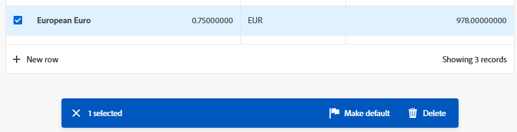

# Usar listas aprimoradas

{{preview-fast-release-general}}

As listas aprimoradas estão disponíveis em algumas áreas do Adobe Workfront. Essas listas usam um formato de tabela para exibir os itens de lista e têm uma aparência diferente das listas padrão. O gerenciamento de visualizações também é aprimorado, incluindo filtragem, agrupamento, gerenciamento de colunas e pesquisa.

Para obter informações sobre as listas padrão, consulte [Introdução a listas no Adobe Workfront](/help/quicksilver/workfront-basics/navigate-workfront/use-lists/view-items-in-a-list.md).

>[!NOTE]
>
>Cada lista aprimorada pode ser configurada de forma diferente para ajudar a exibir os dados necessários. Todas as listas não usarão todos os recursos descritos neste artigo e algumas listas podem ter recursos especializados que se aplicam somente a essa lista.

## Requisitos de acesso

+++ Expanda para visualizar os requisitos de acesso para a funcionalidade neste artigo.

<table style="table-layout:auto">
 <col> 
 <col>
 <tbody> 
  <tr> 
   <td>Pacote do Adobe Workfront</td> 
   <td>
Qualquer
</td> 
  </tr> 
  <tr> 
   <td>Licença do Adobe Workfront</td> 
   <td>
   
Colaborador ou superior

   
Solicitação ou superior
</td>
  </tr>
 </tbody> 
</table>

Para obter informações, consulte [Requisitos de acesso na documentação do Workfront](/help/quicksilver/administration-and-setup/add-users/access-levels-and-object-permissions/access-level-requirements-in-documentation.md).

+++

## Objetos que usam listas aprimoradas

Abaixo estão alguns tipos de listas de objetos do Workfront que usam o formato de lista aprimorado e algumas das áreas em que eles são exibidos por padrão quando você tem direitos para visualizar o objeto.

>[!NOTE]
>
>Esta lista não é abrangente. Cada uma dessas listas de objetos também pode aparecer em um relatório ou painel. Por exemplo, um relatório de Projeto ou um painel que contém um relatório de Projeto também exibe uma lista de projetos.

| lista do Workfront | Local da lista de objetos |
|--- |--- |
| Prioridades | <ul><li>Início > selecione o ícone Prioridades no menu esquerdo</li><li>Menu principal > Prioridades</li></ul> |
| Lista de solicitações | <ul><li>Solicitações (somente nova experiência)</li><li>Widget Minhas solicitações na página inicial</li></ul> |
| Lista de taxas de câmbio | <ul><li>Configuração > Preferências do Projeto > Taxas de Câmbio</li></ul> |

## Adicionar e editar itens em uma lista aprimorada

Dependendo da configuração da lista aprimorada, pode haver duas maneiras de adicionar um item à lista:

* Clique em um botão acima da lista. Essa opção abre uma caixa de diálogo onde você insere informações e as salva.
* Clique em **Nova linha** na parte inferior da lista. Essa opção adiciona uma nova linha à tabela e você insere informações em cada célula.

  As listas aprimoradas são compatíveis com estes tipos de campo:

   * Texto
   * Número
   * Moeda
   * Data
   * Data e hora
   * Menus suspensos de seleção única/múltipla
   * Typeahead
   * Parágrafo
   * Destinatário (um ou vários)
   * Seletor de cores

  Ao editar uma célula, cada tipo de campo tem suas próprias opções de edição.

Para editar um item na lista, clique duas vezes na célula que deseja editar e digite as informações. Algumas células podem ser somente leitura.

## Usar a barra de ações e o menu Mais em uma lista aprimorada

Quando você marca a caixa de seleção ao lado de um item na lista aprimorada, a barra de ação aparece na parte inferior da tela e mostra as ações que você pode realizar no item. Algumas ações podem ser específicas dessa lista e não aparecem em nenhuma outra lista.

>[!NOTE]
>
>Várias listas aprimoradas podem permitir a seleção de um único item, a edição em massa (seleção de mais de um item) ou nenhuma seleção de item.

Clique em um botão na barra de ações para realizar essa ação, como visualizar o item da lista, excluir o item ou editar o item.

Se nenhuma ação estiver disponível para o item selecionado, a barra de ação indicará &quot;Nenhuma ação disponível&quot;.

O menu **Mais** é o menu de três pontos que aparece ao lado de um campo principal em um item da lista quando você passa o mouse sobre ele. (O campo principal é a coluna mais à esquerda da tabela.)

Clique no menu para ver as ações adicionais do item. Algumas ações podem ser específicas dessa lista e não aparecem em nenhuma outra lista.

## Personalizar colunas em uma lista aprimorada

Algumas listas aprimoradas permitem ocultar e exibir colunas e reordenar as colunas.

1. Clique em **Colunas** acima da lista.

   

1. Use os botões para exibir ou ocultar colunas na lista.
1. Para reordenar as colunas, clique no ícone **Arrastar** e mova uma coluna para o local desejado. Mover colunas altera a lista automaticamente.

   >[!NOTE]
   >
   >O campo principal é a coluna mais à esquerda da tabela. Ela é fixada na primeira posição e não é possível alterar sua coluna. Se o número de colunas for grande, o campo principal é congelado à esquerda e, ao rolar a tela horizontalmente, você sempre o verá.
   >
   >O ícone ao lado de um nome de campo mostra o tipo de campo, como texto ou campo de data.

   Um indicador aparece no botão **Colunas** quando as colunas estão ocultas. O indicador não aparece ao reordenar colunas.

   

## Filtrar e agrupar itens em uma lista aprimorada

Os filtros ajudam a reduzir a quantidade de informações exibidas na lista. Agrupamentos separam os objetos na lista em áreas com base em critérios específicos.

### Usar filtros

1. Clique em **Filtro** acima da lista.
1. Na caixa Filtro, clique em **Adicionar condição**.
1. Selecione um campo para filtrar.
1. Selecione um modificador de filtro, como &quot;Tem qualquer um de&quot;, &quot;Não tem nenhum de&quot;, &quot;É antes&quot; ou &quot;É depois de&quot;. As opções do modificador são diferentes dependendo do tipo de campo pelo qual você está filtrando.
1. Selecione o valor ou os valores do campo. Dependendo do tipo de campo pelo qual você está filtrando, talvez seja solicitado que você selecione o item em uma lista, pesquise por ele ou use um calendário para selecionar um intervalo de datas.

   

   O filtro é aplicado automaticamente à lista.

1. Clique em **Adicionar condição** para adicionar outra condição ao filtro como uma instrução OR.
1. Quando o filtro for aplicado, você poderá abrir as opções **Filtro** novamente para alterar as opções de filtro ou limpar todos os filtros.

   Um indicador aparece no botão **Filtro** quando um filtro é aplicado à lista.

   

### Usar agrupamentos

1. Clique em **Grupo** acima da lista.
1. Selecione um agrupamento para organizar sua lista.

   

1. Quando o agrupamento é aplicado, você pode abrir as opções de Grupo novamente para recolher ou expandir todos os agrupamentos de uma vez, alterar o agrupamento para agrupar por um campo diferente ou limpar todos os agrupamentos.

   

   Um indicador aparece no botão **Grupo** quando um agrupamento é aplicado à lista.

   

## Classificar e pesquisar em uma lista aprimorada

Para classificar colunas individuais, vá para a coluna e clique na seta para baixo. Um ícone ao lado de um nome de coluna indica que a lista é classificada pelos valores dessa coluna e a direção da classificação.

>[!NOTE]
>
>Algumas colunas podem não ser classificáveis.

Para classificar seu trabalho em um agrupamento, abra o **Grupo** e selecione se deseja classificar em ordem crescente ou decrescente.

Para pesquisar, digite o termo de pesquisa no campo de pesquisa acima da lista. Os resultados são destacados na lista à medida que você digita.

