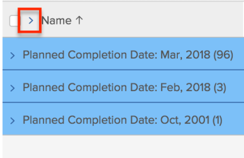

# Modificar como uma lista é exibida

Em [!DNL Adobe Workfront], você pode personalizar como uma lista é exibida para você. Outros usuários que visualizam a lista não visualizam suas alterações.

Você pode fazer as seguintes personalizações:

* O número de itens que são exibidos
* Largura ou ordem da coluna
* Se os agrupamentos são expandidos ou recolhidos

>[!NOTE]
>
>As alterações de exibição acima feitas são revertidas quando você desconecta do [!DNL Workfront] ou feche o navegador. Essas alterações também podem ser revertidas após um período de 8 horas.

Além das personalizações temporárias acima, você também pode ajustar quais colunas a lista classifica, qual [!DNL Workfront] mantém o mesmo depois que você desconecta ou fecha o navegador. No entanto, se alguém editar as opções de classificação na exibição de uma lista, a seleção de classificação anterior não será retida.

Para obter informações sobre como modificar as informações exibidas em sua lista, consulte [Elementos de relatório: filtros, visualizações e agrupamentos](../../../reports-and-dashboards/reports/reporting-elements/reporting-elements-filters-views-groupings.md).

## Requisitos de acesso

Você deve ter o seguinte acesso para executar as etapas neste artigo:

<table style="table-layout:auto"> 
 <col> 
 <col> 
 <tbody> 
  <tr> 
   <td role="rowheader"><strong>[!DNL Adobe Workfront] plano*</strong></td> 
   <td> 
Qualquer Um
 </td> 
  </tr> 
  <tr> 
   <td role="rowheader"><strong>[!DNL Adobe Workfront] licença*</strong></td> 
   <td> 
[!UICONTROL Solicitação] ou superior
 </td> 
  </tr> 
  <tr> 
   <td role="rowheader"><strong>Configurações de nível de acesso*</strong></td> 
   <td> 
Acesso à [!UICONTROL View] para a área na qual a lista está
 
Por exemplo, para modificar a visualização em um projeto, você precisa ter acesso à [!UICONTROL Exibição] para Projetos.
 
Observação: Se ainda não tiver acesso, pergunte ao seu [!DNL Workfront] administrador se eles definirem restrições adicionais em seu nível de acesso. Para obter informações sobre como uma [!DNL Workfront] administrador pode alterar seu nível de acesso, consulte <a href="../../../administration-and-setup/add-users/configure-and-grant-access/create-modify-access-levels.md" class="MCXref xref">Criar ou modificar níveis de acesso personalizados</a>.
 </td> 
  </tr> 
  <tr> 
   <td role="rowheader"><strong>Permissões de objeto</strong></td> 
   <td> 
[!UICONTROL View] ou permissões superiores para a exibição aplicada à lista
 
Para obter informações sobre como solicitar acesso adicional, consulte <a href="../../../workfront-basics/grant-and-request-access-to-objects/request-access.md" class="MCXref xref">Solicitar acesso a objetos </a>.
 </td> 
  </tr> 
 </tbody> 
</table>

&#42;Para descobrir qual plano, tipo de licença ou acesso você tem, entre em contato com seu [!DNL Workfront] administrador.

## Modificar como uma lista é exibida

1. Vá para a lista em [!DNL Workfront] que você deseja modificar.

   <!--
   
 
   <MadCap:conditionalText data-mc-conditions="QuicksilverOrClassic.Draft mode">
   By default, groupings are collapsed.
   </MadCap:conditionalText>
     

   -->

1. (Opcional e condicional) Se os agrupamentos na lista forem recolhidos e você quiser exibir mais informações, clique no agrupamento desejado para expandir a lista e exibir as informações listadas nela.

   Ou

   Para expandir todos os agrupamentos, clique na seta à direita da caixa de seleção no cabeçalho da coluna.

   

1. (Opcional e condicional) Se quiser mostrar um número específico de itens na tela, clique no botão **[!UICONTROL Mostrando]** menu suspenso no canto inferior direito do ecrã e selecione para apresentar **100**, **250**, **500**, **[!UICONTROL Todos]** ou **2000** itens.

   

   >[!TIP]
   >
   >Por padrão, 2.000 itens são exibidos para listas atualizadas e 100 itens são exibidos para listas herdadas. Se a lista contiver mais de 2.000 itens, não será possível exibir todos os itens em uma página.
   >
   >
   >Para obter o melhor desempenho em listas grandes onde os objetos contêm campos de texto formatados, recomendamos limitar esse número a 250.
   >
   >
   >Para obter mais informações sobre os 2 tipos de lista, consulte a seção [A diferença entre as listas atualizadas e herdadas](../../../workfront-basics/navigate-workfront/use-lists/view-items-in-a-list.md#updated) no artigo [Introdução a listas em [!DNL Adobe Workfront]](../../../workfront-basics/navigate-workfront/use-lists/view-items-in-a-list.md).

   Os resultados da lista são paginados para mostrar o número selecionado de itens por página. Você pode acessar os resultados em outras páginas clicando nas setas para trás e para a frente ou selecionando uma página específica.

1. Para redimensionar a largura de uma coluna, passe o mouse sobre a linha que separa 2 colunas, em seguida, clique em para arrastá-la até a largura desejada.

   A coluna é redimensionada até que o cache seja limpo no navegador ou até que você o redimensione manualmente novamente.

1. Para reorganizar as colunas em uma lista, passe o mouse sobre um cabeçalho de coluna para exibir a ferramenta manual e, em seguida, clique em para arrastar a coluna para onde deseja que ela seja exibida.

   A posição da coluna é salva até que você atualize a página.\
   Para obter mais informações sobre como personalizar a largura e a ordem das colunas em uma lista, consulte o artigo [Modificar a largura e a ordem da coluna](../../../reports-and-dashboards/reports/reporting-elements/modify-column-width-order.md).

1. Para ajustar a ordem de classificação de uma lista, clique em um cabeçalho de coluna para selecioná-la, em seguida, pressione e mantenha pressionada a tecla CMD (em [!DNL Mac]) ou a tecla CTRL (ativada [!DNL Windows]) no teclado e selecione até 2 cabeçalhos de coluna adicionais para classificá-los.

   A lista é classificada por cada uma das colunas selecionadas na ordem da sua seleção.

   Todas as modificações feitas na lista são salvas instantaneamente.

   >[!NOTE]
   >
   >Se você estiver classificando grupos na [!UICONTROL Grupos] área em [!UICONTROL Configuração], a exibição de hierarquia de grupos e seus subgrupos não é dividida quando você altera a forma como a lista é classificada — os subgrupos permanecem com seus grupos pai. A lista é classificada primeiro por grupos de nível superior. Em seguida, em cada grupo pai, a lista de subgrupos que estão no mesmo nível é classificada em conjunto.
