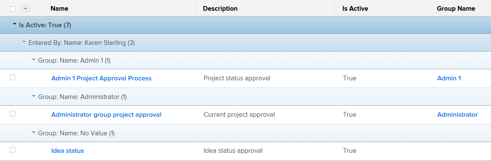

# Introdução a listas em [!DNL Adobe Workfront]

<!--
{{highlighted-preview}}
-->

É possível exibir listas de objetos em [!DNL Adobe Workfront] para obter informações sobre eles, como datas de início e de vencimento, usuários atribuídos a eles e outros objetos associados a eles.

Veja a seguir algumas características das listas em [!DNL Workfront]:

* As listas atualizam automaticamente a cada cinco minutos para atualizar as informações que outros usuários do sistema estão atualizando em outro lugar.
* Algumas áreas em [!DNL Workfront] são pré-configuradas com listas padrão de objetos.

   Você pode personalizar a maioria dessas listas pré-configuradas.

* A [!DNL Workfront] o administrador pode criar listas personalizadas para aplicar a várias áreas de [!DNL Workfront].

   Para obter mais informações sobre como criar listas no nível do sistema, consulte o artigo [Criar, editar e compartilhar filtros, exibições e agrupamentos padrão](../../../administration-and-setup/set-up-workfront/configure-system-defaults/create-and-share-default-fvgs.md).

## Requisitos de acesso

Você deve ter o seguinte acesso para executar as etapas neste artigo:

<table style="table-layout:auto"> 
 <col> 
 <col> 
 <tbody> 
  <tr> 
   <td role="rowheader"><strong>[!DNL Adobe Workfront] plano*</strong></td> 
   <td> 
Qualquer Um
 </td> 
  </tr> 
  <tr> 
   <td role="rowheader"><strong>[!DNL Adobe Workfront] licença*</strong></td> 
   <td> 
[!UICONTROL Solicitação] ou superior
 </td> 
  </tr> 
  <tr> 
   <td role="rowheader"><strong>Configurações de nível de acesso*</strong></td> 
   <td> 
[!UICONTROL View] ou acesso superior a filtros, visualizações, agrupamentos
 
Para itens na área [!UICONTROL Configuração], é necessário acesso administrativo para o item ou o nível de acesso [!UICONTROL System Administrator].
 
Observação: Se ainda não tiver acesso, pergunte ao seu [!DNL Workfront] administrador se eles definirem restrições adicionais em seu nível de acesso. Para obter informações sobre como uma [!DNL Workfront] administrador pode alterar seu nível de acesso, consulte <a href="../../../administration-and-setup/add-users/configure-and-grant-access/create-modify-access-levels.md" class="MCXref xref">Criar ou modificar níveis de acesso personalizados</a>.
 </td> 
  </tr> 
  <tr> 
   <td role="rowheader"><strong>Permissões de objeto</strong></td> 
   <td> 
[!UICONTROL View] ou permissões superiores com acesso para compartilhar
 
Para obter informações sobre como solicitar acesso adicional, consulte <a href="../../../workfront-basics/grant-and-request-access-to-objects/request-access.md" class="MCXref xref">Solicitar acesso a objetos </a>.
 </td>
  </tr> 
 </tbody> 
</table>

Para descobrir qual plano, tipo de licença ou acesso você tem, entre em contato com seu [!DNL Workfront] administrador.

## Listas de objetos

Abaixo estão alguns tipos de listas de objetos que você pode encontrar em [!DNL Workfront] e algumas das áreas onde elas são exibidas por padrão quando você tem direitos de exibir um objeto.

>[!NOTE]
>
>* Esta lista não é abrangente. Cada uma dessas listas de objetos também pode aparecer em um relatório ou painel. Por exemplo, um relatório de Projeto ou um painel que contém um relatório de Projeto também exibe uma lista de projetos.
>* Nesta lista, &quot;selecionar&quot; significa que você precisa clicar no nome do item, não na caixa de seleção à esquerda do nome.

<table style="table-layout:auto"> 
 <col> 
 <col> 
 <thead> 
  <tr> 
   <th><strong>[!DNL Workfront] lista</strong></th> 
   <th><strong>Localização da lista de objetos</strong></th> 
  </tr> 
 </thead> 
 <tbody> 
  <tr> 
   <td>Lista de carteiras</td> 
   <td> 
    <ul> 
     <li> 
[!UICONTROL Portfolio]
 </li> 
    </ul> </td> 
  </tr> 
  <tr> 
   <td>Lista de programas</td> 
   <td> 
    <ul> 
     <li> 
[!UICONTROL Portfolio] &gt;[!UICONTROL selecionar um portfólio] &gt;[!UICONTROL Programas]
 </li> 
     <li data-mc-conditions="QuicksilverOrClassic.Quicksilver"> 
[!UICONTROL Programas]
 </li> 
    </ul> </td> 
  </tr> 
  <tr> 
   <td>Lista de projetos</td> 
   <td> 
    <ul> 
     <li> 
[!UICONTROL Projetos]
 </li> 
     <li> 
[!UICONTROL Portfolio] &gt;[!UICONTROL selecionar um portfólio] &gt;[!UICONTROL Projetos]
 </li> 
     <li> 
[!UICONTROL Portfolio] &gt;[!UICONTROL selecionar um portfólio] &gt;[!UICONTROL Programas] &gt;[!UICONTROL selecionar um programa] &gt;[!UICONTROL Projetos]
 </li> 
    </ul> </td> 
  </tr> 
  <tr> 
   <td>Lista de tarefas</td> 
   <td> 
    <ul> 
     <li> 
[!UICONTROL Projetos] &gt; [!UICONTROL selecionar um projeto] &gt; [!UICONTROL Tarefas]
 </li> 
     <li> 
[!UICONTROL Projetos] &gt;[!UICONTROL selecionar um projeto] &gt;[!UICONTROL Tarefas] &gt;[!UICONTROL selecionar uma tarefa] &gt;[!UICONTROL Subtarefas]
 </li> 
     <li> 
[!UICONTROL Projetos] &gt; [!UICONTROL selecionar um projeto] &gt;[!UICONTROL Tarefas] &gt;[!UICONTROL selecionar uma tarefa] &gt; [!UICONTROL Predecessores*]
 </li> 
    </ul> </td> 
  </tr> 
  <tr> 
   <td>Lista de problemas</td> 
   <td> 
    <ul> 
     <li> 
[!UICONTROL Projetos] &gt; [!UICONTROL selecionar] um projeto &gt;[!UICONTROL Problemas]
 </li> 
     <li> 
[!UICONTROL Projetos] &gt; [!UICONTROL selecionar um projeto] &gt;[!UICONTROL Tarefas] &gt;[!UICONTROL selecionar uma tarefa] &gt; [!UICONTROL Problemas]
 </li> 
     <li> 
[!UICONTROL Projetos] &gt; [!UICONTROL selecionar um projeto] &gt;[!UICONTROL Tarefas] &gt;[!UICONTROL selecionar uma tarefa] &gt;[!UICONTROL Subtarefas] &gt; [!UICONTROL selecionar uma tarefa] &gt; [!UICONTROL Problemas]
 </li> 
    </ul> </td> 
  </tr> 
  <tr> 
   <td>Lista de relatórios</td> 
   <td> 
    <ul> 
     <li> 
  [!UICONTROL Relatórios]  
 </li> 
    </ul> </td> 
  </tr> 
  <tr> 
   <td>Lista de painéis</td> 
   <td> 
    <ul> 
     <li> 
[!UICONTROL Painéis]
 </li> 
    </ul> </td> 
  </tr> 
  <tr> 
   <td>Lista de iterações</td> 
   <td> 
    <ul> 
     <li> 
[!UICONTROL Equipes] &gt; [!UICONTROL Iterações]
 </li> 
    </ul> </td> 
  </tr> 
  <tr> 
   <td>Lista de usuários</td> 
   <td> 
    <ul> 
     <li> 
[!UICONTROL Usuários]
 </li> 
    </ul> </td> 
  </tr> 
  <tr> 
   <td>Lista de documentos</td> 
   <td> 
    <ul> 
     <li> 
[!UICONTROL Documentos]
 </li> 
     <li> 
[!UICONTROL Portfolio] &gt; [!UICONTROL selecionar um portfólio] &gt; [!UICONTROL Documentos]
 </li> 
     <li> 
[!UICONTROL Portfolio] &gt; [!UICONTROL selecionar um portfólio] &gt;[!UICONTROL Programas] &gt;[!UICONTROL selecionar um programa] &gt;[!UICONTROL Documentos]
 </li> 
     <li> 
[!UICONTROL Projetos] &gt; [!UICONTROL selecionar um projeto] &gt;[!UICONTROL Documentos]
 </li> 
     <li> 
[!UICONTROL Projetos] &gt; [!UICONTROL selecionar um projeto] &gt;[!UICONTROL Tarefas] &gt;[!UICONTROL selecionar uma tarefa] &gt; [!UICONTROL Documentos]
 </li> 
     <li> 
[!UICONTROL Projetos] &gt; [!UICONTROL selecionar] um projeto &gt; [!UICONTROL Problemas] &gt;[!UICONTROL selecionar um problema] &gt; [!UICONTROL Documentos]
 </li> 
    </ul> </td> 
  </tr> 
  <tr> 
   <td>Lista de folhas de horas</td> 
   <td> 
    <ul> 
     <li> 
[!UICONTROL Folha de tempo] s &gt; [!UICONTROL Todas as folhas de tempo]*
 </li> 
    </ul> </td> 
  </tr> 
  <tr> 
   <td>Lista de taxas de faturação</td> 
   <td> 
    <ul> 
     <li> 
[!UICONTROL Projetos] &gt;[!UICONTROL selecionar um projeto] &gt;[!UICONTROL Taxas de faturamento*]
 </li> 
    </ul> </td> 
  </tr> 
  <tr> 
   <td>Lista de registros de faturação</td> 
   <td> 
    <ul> 
     <li> 
[!UICONTROL Projetos] &gt; [!UICONTROL selecionar um projeto] &gt; [!UICONTROL Registros de cobrança]
 </li> 
    </ul> </td> 
  </tr> 
  <tr> 
   <td>Lista de riscos</td> 
   <td> 
    <ul> 
     <li> 
[!UICONTROL Projetos] &gt; [!UICONTROL selecionar um projeto] &gt;[!UICONTROL Riscos]
 </li> 
    </ul> </td> 
  </tr> 
  <tr> 
   <td>Lista de despesas</td> 
   <td> 
    <ul> 
     <li> 
[!UICONTROL Projetos] &gt;[!UICONTROL selecionar] um projeto &gt;[!UICONTROL Despesas]
 </li> 
     <li> 
[!UICONTROL Projetos] &gt; [!UICONTROL selecionar um projeto] &gt;[!UICONTROL Tarefas] &gt;[!UICONTROL selecionar uma tarefa] &gt;[!UICONTROL Despesas]
 </li> 
    </ul> </td> 
  </tr> 
  <tr> 
   <td>Lista de entradas por hora</td> 
   <td> 
    <ul> 
     <li> 
[!UICONTROL Projetos] &gt;[!UICONTROL selecionar um projeto
 </li> 
     <li> 
[!UICONTROL Projetos] &gt;[!UICONTROL selecionar um projeto] &gt;[!UICONTROL Tarefas] &gt;[!UICONTROL selecionar uma tarefa] &gt;[!UICONTROL Hours]
 </li> 
     <li> 
[!UICONTROL Projetos] &gt;[!UICONTROL selecionar] um projeto &gt;[!UICONTROL Problemas] &gt;[!UICONTROL selecionar] um problema &gt;[!UICONTROL Hours]
 </li>
    </ul> </td> 
  </tr>
  <tr> 
   <td class="preview">Lista de formulários personalizados</td> 
   <td> 
    <ul> 
     <li class="preview"> 
[!UICONTROL Configuração] &gt;[!UICONTROL Forms personalizado]

     <!--Remove the following note box when this goes to Production. Or do this when the Preview highlighting becomes available.-->
     
<b>OBSERVAÇÃO</b>: No momento, isso está disponível somente no ambiente de Visualização
 </li> 
    </ul> </td> 
  </tr> 
  <tr> 
    <td>Lista de grupos ou subgrupos</td> 
   <td> 
    <ul> 
     <li> 
[!UICONTROL Configuração] &gt;[!UICONTROL Grupos]
 </li>
     <li> 
[!UICONTROL Configuração] &gt;[!UICONTROL Grupos] &gt;[!UICONTROL selecionar o grupo pai] &gt;[!UICONTROL Subgrupos] </li> 
    </ul> </td> 
  </tr> 
  <tr> 
   <td>Lista de equipes</td> 
   <td> 
    <ul> 
     <li> 
[!UICONTROL Configuração] &gt;[!UICONTROL Equipes]
 </li> 
    </ul> </td> 
  </tr>
  <tr> 
   <td>Lista de empresas</td> 
   <td> 
    <ul> 
     <li> 
[!UICONTROL Configuração] &gt;[!UICONTROL Empresas]
 </li> 
    </ul> </td> 
  </tr>
  <tr> 
   <td>Lista de programações</td> 
   <td> 
    <ul> 
     <li> 
[!UICONTROL Configuração] &gt;[!UICONTROL Agendamentos]
 </li> 
    </ul> </td> 
  </tr>
  <tr> 
   <td>Lista de modelos de layout</td> 
   <td> 
    <ul> 
     <li> 
[!UICONTROL Configuração] &gt;[!UICONTROL Modelos de layout]
 </li> 
    </ul> </td> 
  </tr>
 </tbody> 
</table>

Não é possível personalizar a lista na área especificada. A [!DNL Workfront] O administrador pode criar uma lista personalizada no nível do sistema ou criar um relatório para esse objeto se o nível de acesso permitir que você tenha acesso para editar relatórios.

## Elementos de lista

Uma lista contém determinados elementos que definem seu formato e as informações exibidas. Você pode encontrar vários elementos da lista do sistema que estão disponíveis por padrão. Você também pode criar elementos personalizados para atender às suas necessidades.

>[!NOTE]
>
>Quando você seleciona um novo filtro, visualização ou agrupamento em uma lista, essa seleção é retida mesmo se você sair de [!DNL Workfront] ou feche o navegador.

Estes são os elementos de uma lista:

<table style="table-layout:auto"> 
 <col> 
 <col> 
 <thead> 
  <tr> 
   <th><strong>Elemento</strong></th> 
   <th><strong>Explicação</strong></th> 
  </tr> 
 </thead> 
 <tbody> 
  <tr> 
   <td><strong>[!UICONTROL Filtro]</strong></td> 
   <td> 
Os filtros mantêm informações desnecessárias fora de uma lista, com base nos critérios especificados. 
 
Para obter mais informações, consulte <a href="../../../reports-and-dashboards/reports/reporting-elements/filters-overview.md" class="MCXref xref">Visão geral dos filtros em [!DNL Adobe Workfront]</a>.
 </td> 
  </tr> 
  <tr> 
   <td><strong>[!UICONTROL View]</strong></td> 
   <td> 
As exibições definem quais campos (colunas) você exibe na tela.
 
Para obter mais informações, consulte <a href="../../../reports-and-dashboards/reports/reporting-elements/views-overview.md" class="MCXref xref">Visão geral das exibições em [!DNL Adobe Workfront]</a>.
 </td> 
  </tr> 
  <tr> 
   <td><strong>[!UICONTROL Agrupamento]</strong></td> 
   <td> 
Os agrupamentos separam os objetos na lista em áreas com base nos critérios especificados.
 
Por exemplo, os problemas em uma lista podem ser exibidos em seções por status ou prioridade.
 
É possível ter até três camadas de agrupamentos em um agrupamento padrão e adicionar uma quarta camada se estiver configurando um agrupamento no modo de texto.
 
Para obter mais informações sobre agrupamentos, consulte <a href="../../../reports-and-dashboards/reports/reporting-elements/groupings-overview.md" class="MCXref xref">Visão geral dos agrupamentos em [!DNL Adobe Workfront]</a>.
 
Para obter mais informações sobre o modo de texto, consulte <a href="../../../reports-and-dashboards/reports/text-mode/understand-text-mode.md" class="MCXref xref">Visão geral do modo de texto</a>.
 </td> 
  </tr> 
 </tbody> 
</table>

Esses elementos são exibidos na parte superior de cada lista por padrão. Eles são fixos e não se movem à medida que você percorre a lista. Passe o mouse sobre o ícone de cada elemento para identificá-los.

Você pode personalizar elementos de lista nas seguintes áreas e compartilhá-los com outros usuários:

* Qualquer lista padrão do sistema encontrada na seção [Introdução a listas em [!DNL Adobe Workfront]](#default-workfront-lists) neste artigo
* Qualquer relatório compartilhado com você

Os elementos de construção de listas são os mesmos que os elementos de construção de relatórios.

Para obter mais informações sobre como criar e personalizar os elementos de construção de listas e relatórios, consulte [Elementos de relatório: filtros, visualizações e agrupamentos](../../../reports-and-dashboards/reports/reporting-elements/reporting-elements-filters-views-groupings.md).

## Listar ações

Você pode concluir as seguintes ações em uma lista:

<table style="table-layout:auto"> 
 <col> 
 <col> 
 <thead> 
  <tr> 
   <th><strong>Ação</strong></th> 
   <th><strong>Informações</strong></th> 
  </tr> 
 </thead> 
 <tbody> 
  <tr> 
   <td><strong>Edição em linha</strong> </td> 
   <td> 
Edite objetos e suas informações diretamente na lista.
 
Para obter mais informações, consulte <a href="../../../workfront-basics/navigate-workfront/use-lists/inline-edit-objects.md" class="MCXref xref">Itens de edição em linha em uma lista em [!DNL Adobe Workfront]</a>.
 </td> 
  </tr> 
  <tr data-mc-conditions="QuicksilverOrClassic.Quicksilver"> 
   <td><strong>Atualização com o [!UICONTROL Resumo]</strong> </td> 
   <td> 
Atualize tarefas e problemas no nível do projeto usando o painel [!UICONTROL Resumo].
 
Dica: O Resumo não está disponível para todos os objetos e não está disponível nos relatórios de Tarefa ou de Problema.
 
Para obter mais informações, consulte <a href="../../../workfront-basics/the-new-workfront-experience/summary-overview.md" class="MCXref xref">Visão geral do resumo</a>.
 </td> 
  </tr> 
  <tr> 
   <td><strong>Personalizar exibição de lista</strong> </td> 
   <td> 
Personalize a aparência de uma lista, organização de coluna, ordem de classificação de itens ou número de itens que são exibidos.
 
Observação: As alterações feitas no número de itens a serem exibidos em uma página são revertidas quando você sai de [!DNL Workfront] ou feche o navegador. As alterações também podem ser revertidas após um período de 8 horas.
 
Para obter mais informações, consulte <a href="../../../workfront-basics/navigate-workfront/use-lists/modify-list-display.md" class="MCXref xref">Modificar como uma lista é exibida</a>.
 </td> 
  </tr> 
  <tr> 
   <td><strong>Filtro rápido</strong> </td> 
   <td> 
Aplique um filtro rápido para encontrar apenas itens importantes para você, para que possa revisá-los, atualizá-los ou compartilhá-los com outras pessoas rapidamente.
 
Importante: Você pode encontrar itens que contêm uma palavra de pesquisa usando o filtro rápido, independentemente de esse item estar visível na sua tela ou será exibido depois de rolar para a parte inferior da página. Ao usar os recursos de pesquisa do seu navegador, você pode encontrar apenas itens que já estão visíveis na tela. Se a lista tiver várias páginas, os filtros rápidos encontrarão apenas os itens na página atual.
 
Para obter mais informações, consulte <a href="../../../workfront-basics/navigate-workfront/use-lists/apply-quick-filter-list.md" class="MCXref xref">Aplicar o filtro rápido a uma lista</a>.
 </td> 
  </tr> 
  <tr> 
   <td><strong>Exportar</strong> </td> 
   <td> 
Exportar uma lista de objetos de [!DNL Workfront]. Quando uma lista contém mais de 2000 itens, exportar a lista é a única maneira de revisar todos os itens em uma página.
 
Para obter mais informações sobre como exportar uma lista, consulte <a href="../../../workfront-basics/navigate-workfront/use-lists/export-lists.md" class="MCXref xref">Exportar uma lista</a>. Para obter mais informações sobre formatos e limites de exportação, consulte <a href="../../../reports-and-dashboards/reports/creating-and-managing-reports/export-data.md" class="MCXref xref">Exportar dados</a>.
 </td> 
  </tr> 
 </tbody> 
</table>

### Barra de ferramentas Lista

A tabela a seguir lista muitos dos ícones disponíveis na barra de ferramentas e indica o que acontece quando você clica neles:

<table style="table-layout:auto"> 
 <col> 
 <col> 
 <col> 
 <tbody> 
  <tr> 
   <td><strong>Ícone</strong></td> 
   <td><strong>Descrição</strong></td> 
   <td><strong>Ao clicar</strong></td> 
  </tr> 
  <tr> 
   <td>  </td> 
   <td>[!UICONTROL Adicionar item ou usuário]</td> 
   <td>Abra mais opções incluindo a adição de um novo item ou usuário.</td> 
  </tr> 
  <tr> 
   <td>  </td> 
   <td>[!UICONTROL Inserir tarefa acima]</td> 
   <td> 
Insira uma tarefa acima da tarefa selecionada.
 
Isso está disponível somente para tarefas. 
 </td> 
  </tr> 
  <tr> 
   <td>  </td> 
   <td>[!UICONTROL Inserir tarefa abaixo]</td> 
   <td> 
Insira uma tarefa abaixo da tarefa selecionada.
 
Isso está disponível somente para tarefas. 
 </td> 
  </tr> 
  <tr> 
   <td>  </td> 
   <td>[!UICONTROL Editar]</td> 
   <td>Editar o item selecionado.</td> 
  </tr> 
  <tr> 
   <td>  </td> 
   <td>[!UICONTROL Copiar]</td> 
   <td>Copiar o item selecionado.</td> 
  </tr> 
  <tr> 
   <td>  </td> 
   <td>[!UICONTROL Excluir]</td> 
   <td>Excluir o item selecionado.</td> 
  </tr> 
  <tr> 
   <td>  </td> 
   <td>[!UICONTROL Adicionar a]</td> 
   <td> 
Abra a caixa de diálogo para adicionar o problema selecionado a uma iteração.
 
Isso está disponível somente para problemas.
 </td> 
  </tr> 
  <tr> 
   <td>  </td> 
   <td>[!UICONTROL Compartilhar]</td> 
   <td>Compartilhar o item selecionado.</td> 
  </tr> 
  <tr> 
   <td>  </td> 
   <td>[!UICONTROL Recuar e tarefas pendentes] </td> 
   <td> 
Recuar ou diminuir o avanço da tarefa selecionada. 
 
Isso está disponível somente para tarefas. 
 </td> 
  </tr> 
  <tr> 
   <td></a> </td> 
   <td>[!UICONTROL Mais]</td> 
   <td>Abra opções adicionais para o item selecionado.</td> 
  </tr> 
  <tr> 
   <td> 
  
 </td> 
   <td> 
[!UICONTROL Quick filter] 
 </td> 
   <td> 
Abra a caixa de pesquisa de filtro rápido para localizar itens na lista exibida.
 </td> 
  </tr> 
  <tr> 
   <td>  </td> 
   <td>[!UICONTROL Exportar]</td> 
   <td>Exporte a lista para arquivos PDF, Excel ou delimitados por tabulação.</td> 
  </tr> 
  <tr> 
   <td>  </td> 
   <td>[!UICONTROL Visualização ágil]</td> 
   <td>Exiba a lista na exibição ágil. Isso está disponível somente para tarefas.</td> 
  </tr> 
  <tr> 
   <td>  </td> 
   <td>[!UICONTROL Gráfico de Gantt]</td> 
   <td> 
Exiba a lista na exibição [!UICONTROL Gantt Chart].
 
Isso está disponível somente para projetos e tarefas.
 </td> 
  </tr> 
  <tr data-mc-conditions=""> 
   <td>  
  
 </td> 
   <td>Menu suspenso [!UICONTROL Filtro]</td> 
   <td> 
Exiba uma lista de filtros e opções adicionais para gerenciar filtros, incluindo a criação de um. 
 
Em uma pequena tela, o nome do Filtro é substituído pelo ícone de filtro. Um ponto azul é exibido no ícone Filtro quando você aplica qualquer filtro diferente de "[!UICONTROL Tudo]".
 </td> 
  </tr> 
  <tr data-mc-conditions=""> 
   <td>  
  
 </td> 
   <td>Menu suspenso [!UICONTROL View]</td> 
   <td> 
Exiba uma lista de exibições e opções adicionais para gerenciar exibições, incluindo a criação de uma. 
 
Em uma pequena tela, o nome da Exibição é substituído pelo ícone [!UICONTROL exibição]. Um ponto azul é exibido no ícone [!UICONTROL View] quando você aplica qualquer exibição diferente do "[!UICONTROL Standard]".
 </td> 
  </tr> 
  <tr data-mc-conditions=""> 
   <td>  
  
 </td> 
   <td>Menu suspenso [!UICONTROL Grouping]</td> 
   <td> 
Exiba uma lista de agrupamentos e opções adicionais para gerenciar agrupamentos, incluindo a criação de um. 
 
Em uma pequena tela, o nome Grouping é substituído pelo ícone [!UICONTROL grouping] . Um ponto azul é exibido no ícone [!UICONTROL Grouping] quando você aplica qualquer agrupamento diferente de "[!UICONTROL Nothing]".
 </td> 
  </tr> 
  <tr data-mc-conditions=""> 
   <td>  </td> 
   <td> 
[!UICONTROL Modo Plano]
 </td> 
   <td> 
Escolha se deseja salvar automaticamente ou manualmente as alterações feitas em uma lista de tarefas. 
 
Para obter informações sobre como editar tarefas em uma lista, consulte <a href="/help/quicksilver/manage-work/tasks/manage-tasks/edit-tasks-in-a-list.md" class="MCXref xref">Editar tarefas em uma lista</a>. 
 
Isso está disponível somente para tarefas.
 </td> 
  </tr> 
  <tr> 
   <td>  </td> 
   <td>[!UICONTROL Resumo]</td> 
   <td> 
Exibir ou ocultar a caixa [!UICONTROL Resumo] para o item selecionado.
 
Isso está disponível somente para tarefas e problemas.
 
Para obter informações sobre o painel [!UICONTROL Resumo] no novo [!DNL Adobe Workfront] experiência, consulte <a href="/help/quicksilver/workfront-basics/the-new-workfront-experience/summary-overview.md" class="MCXref xref">Visão geral do resumo</a>.
 </td> 
  </tr> 
  <tr> 
   <td>  </td> 
   <td>[!UICONTROL Remover]</td> 
   <td>Remova algo da lista. Por exemplo, como administrador de grupo que gerencia associações de grupo ou subgrupo, remova um membro do grupo como explicado em <a href="/help/quicksilver/administration-and-setup/manage-groups/create-and-manage-groups/view-and-manage-a-groups-memberships.md" class="MCXref xref">Exibir e gerenciar as associações de um grupo</a>.</td> 
  </tr> 
  <tr> 
   <td>  </td> 
   <td>[!UICONTROL Comentário] /[!UICONTROL Atualização]</td> 
   <td> 
Digite um comentário ou atualização.
 </td> 
  </tr> 
 </tbody> 
</table>

## A diferença entre listas e relatórios

Listas e relatórios são grades que contêm informações sobre um tipo de objeto.

A tabela a seguir descreve as semelhanças e diferenças entre listas e relatórios:

<table style="table-layout:auto"> 
 <col> 
 <col> 
 <col> 
 <thead> 
  <tr> 
   <th><strong>Funcionalidade</strong> </th> 
   <th><strong>Lista</strong> </th> 
   <th><strong>Relatório</strong> </th> 
  </tr> 
 </thead> 
 <tbody> 
  <tr> 
   <td> 
Qualquer pessoa pode criá-los
 </td> 
   <td>✓* </td> 
   <td> </td> 
  </tr> 
  <tr> 
   <td> 
Somente um [!DNL Workfront] administrador e usuários com uma licença do [!UICONTROL Plan] podem criá-los
 </td> 
   <td> </td> 
   <td>✓**</td> 
  </tr> 
  <tr> 
   <td> 
Um conjunto padrão está disponível em [!DNL Workfront]
 </td> 
   <td>✓</td> 
   <td>✓</td> 
  </tr> 
  <tr> 
   <td> 
Personalizável no modo padrão
 </td> 
   <td>✓</td> 
   <td>✓</td> 
  </tr> 
  <tr> 
   <td> 
Personalizável no modo de texto
 </td> 
   <td>✓</td> 
   <td>✓</td> 
  </tr> 
  <tr> 
   <td> 
Você pode compartilhá-los com outros usuários
 </td> 
   <td>✓</td> 
   <td>✓</td> 
  </tr> 
  <tr> 
   <td> 
Você pode compartilhá-los em todo o sistema
 </td> 
   <td>✓</td> 
   <td> ✓ </td> 
  </tr> 
  <tr> 
   <td> 
Você pode compartilhá-los fora do sistema
 </td> 
   <td> </td> 
   <td>✓ </td> 
  </tr> 
  <tr> 
   <td> 
É possível exportar para .pdf, [!DNL Excel]e Formatos delimitados por tabulação
 </td> 
   <td>✓</td> 
   <td> ✓ </td> 
  </tr> 
  <tr> 
   <td> 
Você pode agendá-los para entrega em um email
 </td> 
   <td> </td> 
   <td>✓ </td> 
  </tr> 
  <tr> 
   <td> 
Você pode adicionar a um modelo de layout
 </td> 
   <td>✓</td> 
   <td> </td> 
  </tr> 
  <tr> 
   <td> 
Você pode adicioná-las a seções personalizadas 
 </td> 
   <td> </td> 
   <td>✓</td> 
  </tr> 
  <tr> 
   <td> 
Você pode adicioná-los a um painel
 </td> 
   <td> ✓*** </td> 
   <td>✓</td> 
  </tr> 
  <tr> 
   <td> 
Você pode usar prompts para personalizar o que eles exibem
 </td> 
   <td> </td> 
   <td>✓</td> 
  </tr> 
  <tr> 
   <td> 
Você pode exibi-los em um gráfico
 </td> 
   <td> </td> 
   <td>✓</td> 
  </tr> 
  <tr> 
   <td> 
É possível editar objetos em linha neles
 </td> 
   <td>✓</td> 
   <td>✓</td> 
  </tr> 
 </tbody> 
</table>

Você deve ter acesso a filtros, visualizações e agrupamentos para poder criá-los. Para obter mais informações, consulte [Conceder acesso a filtros, visualizações e agrupamentos](../../../administration-and-setup/add-users/configure-and-grant-access/grant-access-fvg.md).

Você deve ter acesso a filtros, visualizações e agrupamentos, bem como a relatórios, painéis e calendários para poder criá-los. Para obter mais informações, consulte [Conceder acesso a relatórios, painéis e calendários](../../../administration-and-setup/add-users/configure-and-grant-access/grant-access-reports-dashboards-calendars.md).

Você pode personalizar listas para relatórios colocados em um painel somente se o criador do relatório tiver configurado os elementos da lista para ficarem visíveis no painel.

>[!NOTE]
>
>Não é possível adicionar uma lista a um painel sem criar um relatório e adicioná-lo primeiro ao painel.

Para obter mais informações sobre como criar um relatório, consulte [Criar um relatório personalizado](../../../reports-and-dashboards/reports/creating-and-managing-reports/create-custom-report.md). Para obter informações sobre como criar seções personalizadas , consulte [Criar guias ou seções personalizadas](../../../workfront-basics/manage-your-account-and-profile/configuring-your-user-profile/create-custom-tabs.md).

## A diferença entre as listas atualizadas e herdadas

Há dois tipos de listas no [!DNL Workfront]:

* Listas herdadas

   

* Listas atualizadas

   

Ambos os tipos de listas são exibidos na variável [!DNL Adobe Workfront].

Todas as listas e relatórios na [!DNL Adobe Workfront] são listas atualizadas, exceto para o seguinte:

* Listas na [!UICONTROL Configuração] area
* Listas na [!UICONTROL Relatórios] area

A tabela a seguir mostra algumas das diferenças entre as listas herdadas e atualizadas em [!DNL Workfront]:

<!--
 [Legacy does not equal Classic. Legacy lists appear in NWE and Classic. Updated lists appear in NWE and Classic.]
-->

<table style="table-layout:auto"> 
 <col> 
 <col> 
 <tbody> 
  <tr> 
   <td><b>Listas herdadas</b></td> 
   <td><b>Listas atualizadas</b></td> 
  </tr> 
  <tr> 
   <td> 
Fontes herdadas, cabeçalhos de coluna, esquema de cores de agrupamento azul
 </td> 
   <td> 
Fontes atualizadas, cabeçalhos de coluna, esquema de cores de agrupamento cinza
 </td> 
  </tr> 
  <tr> 
   <td> 
Edição em linha mais lenta
 </td> 
   <td> 
Edição em linha mais rápida
 </td> 
  </tr> 
  <tr> 
   <td> 
Exibir <strong>100</strong> itens por padrão
 </td> 
   <td> 
Exibir <strong>Todos</strong> ou até <strong>2000</strong> itens por padrão
 </td> 
  </tr> 
  <tr> 
   <td> 
Use CTRL+F para localizar itens em uma lista
 </td> 
   <td> 
Use filtros rápidos para encontrar rapidamente informações em uma grande lista
 
Para obter informações sobre o uso de filtros rápidos em listas, consulte <a href="../../../workfront-basics/navigate-workfront/use-lists/apply-quick-filter-list.md" class="MCXref xref">Aplicar o filtro rápido a uma lista</a>.
 </td> 
  </tr> 
  <tr> 
   <td>Não é possível editar campos personalizados em linha com a formatação Rich Text.</td> 
   <td> 
O texto em campos personalizados com formatação pode ser configurado para permitir negrito, itálico, sublinhado, marcadores, numeração, hiperlinks e aspas de bloco.
 
Para obter mais informações, consulte <a href="../../../administration-and-setup/customize-workfront/create-manage-custom-forms/create-or-edit-a-custom-form.md" class="MCXref xref">Criar ou editar um formulário personalizado</a>.
 </td> 
  </tr> 
  <tr> 
   <td>A formatação condicional pode alterar a cor do texto dos links em uma lista</td> 
   <td>Não é possível aplicar alterações de cor de texto a links em uma lista</td> 
  </tr> 
 </tbody> 
</table>
