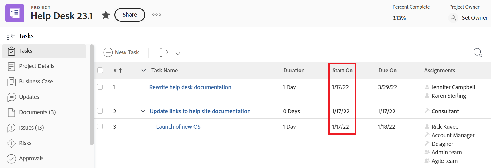
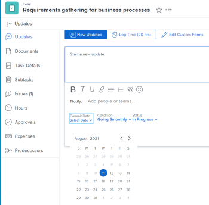

# Visão geral do projeto, tarefa e datas de ocorrência em [!DNL Adobe Workfront]

<!--

(NOTE: consider expanding on this article with ALL dates for PTIs - Hand off dates, Approval Dates, etc) 

-->

Este artigo fornece definições para as datas mais comuns associadas a projetos, tarefas e problemas em [!DNL Adobe Workfront]. As imagens incluídas aqui são exemplos de onde as datas são exibidas no Workfront e não são exaustivas. Há outras áreas que exibem as datas. Todas as datas também estão visíveis em projetos, tarefas e relatórios e listas de emissão.

Para obter informações sobre relatórios e listas, consulte os seguintes artigos:

* [Introdução a listas em [!DNL Adobe Workfront]](../../../workfront-basics/navigate-workfront/use-lists/view-items-in-a-list.md)
* [Introdução aos relatórios em [!DNL Adobe Workfront]](../../../reports-and-dashboards/reports/reporting/get-started-reports-workfront.md)

Para obter mais informações sobre campos de projeto, tarefa e emissão, consulte [Glossário de [!DNL Adobe Workfront] terminologia](../../../workfront-basics/navigate-workfront/workfront-navigation/workfront-terminology-glossary.md).

## [!UICONTROL Data de início planejado]

O [!UICONTROL Data de início planejada] é a data em que um projeto, tarefa ou problema está planejado para iniciar.

Dependendo do [!UICONTROL Restrição de tarefa], talvez você não consiga editar a variável [!UICONTROL Data de início planejada] de uma tarefa. Dependendo do [!UICONTROL Modo de agendamento] do projeto, talvez você não consiga editar a variável [!UICONTROL Data de início planejada] de um projeto.

Para obter mais informações, consulte [Visão geral do projeto [!UICONTROL Data de início planejada]](../../../manage-work/projects/planning-a-project/project-planned-start-date.md).

## [!UICONTROL Data de conclusão planejada]

O [!UICONTROL Data de Conclusão Planejada] ou [!UICONTROL Devido a] data é a data em que um projeto, tarefa ou problema está planejado para ser concluído.

Dependendo do [!UICONTROL Restrição de tarefa], talvez você não consiga editar a variável [!UICONTROL Data de Conclusão Planejada] de uma tarefa. Dependendo do [!UICONTROL Modo de agendamento] do projeto, talvez você não consiga editar a variável [!UICONTROL Data de Conclusão Planejada] de um projeto.

O [!UICONTROL Data de Conclusão Planejada] é exibido como Data de vencimento em algumas áreas de [!DNL Workfront].

Para obter mais informações, consulte os seguintes artigos:

* [Visão geral da tarefa [!UICONTROL Data de Conclusão Planejada]](../../../manage-work/tasks/task-information/task-planned-completion-date.md)
* [Definir o projeto [!UICONTROL Data de Conclusão Planejada]](../../../manage-work/projects/planning-a-project/project-planned-completion-date.md)
* [Visão geral do problema [!UICONTROL Data de Conclusão Planejada]](../../../manage-work/issues/issue-information/issue-planned-completion-date.md)

## [!UICONTROL Data de Entrada]

O [!UICONTROL Data de entrada] é a data em que um projeto, tarefa ou problema foi criado no Workfront.

O [!UICONTROL Data de entrada] não influencia a linha do tempo de projetos, tarefas ou problemas, mas é importante para fins de rastreamento e relatórios. [!DNL Workfront] gera automaticamente a variável [!UICONTROL Data de entrada] quando o objeto é criado e não é possível editá-lo manualmente.

## [!UICONTROL Data do Início Efetivo]

O [!UICONTROL Data de início real] é a data em que um usuário realmente começa a trabalhar em um projeto, tarefa ou problema. O [!UICONTROL Data de início real] fica vazio quando o projeto, a tarefa ou o problema é criado.

Você pode indicar manualmente quando o trabalho foi iniciado em uma tarefa ou problema, ou [!UICONTROL Data de início real] preenche automaticamente quando o status da tarefa ou da emissão muda de [!UICONTROL Novo] para [!UICONTROL Em Andamento] ou [!UICONTROL Concluído]. O [!UICONTROL Data de início real] de um projeto coincide com a data em que a primeira tarefa do projeto é iniciada.

>[!TIP]
>
>O [!UICONTROL Data de início real] pode não corresponder a um [!UICONTROL Data de início planejada] de um projeto, tarefa ou problema porque o usuário pode iniciar o trabalho mais tarde ou mais cedo do que a data planejada.

Para obter mais informações, consulte [Visão geral do projeto [!UICONTROL Data de início real]](../../../manage-work/projects/planning-a-project/project-actual-start-date.md).

>[!NOTE]
>
>O [!UICONTROL Deve Iniciar em] ou as restrições de Datas fixas afetam a função [!UICONTROL Data de início planejada] de uma tarefa, não da [!UICONTROL Data de início real]. Isso atualiza o [!UICONTROL Data de início planejada] para uma data especificada. O [!UICONTROL Data de início real] é atualizado independentemente do [!UICONTROL Data de início planejada], conforme descrito acima.

## [!UICONTROL Data de Término Efetivo]

O [!UICONTROL Data de conclusão real] é a data em que um usuário realmente conclui um projeto, tarefa ou problema. O [!UICONTROL Data de conclusão real] fica vazio quando o projeto, a tarefa ou o problema é criado.

Você pode indicar manualmente quando o trabalho é concluído em uma tarefa ou em um problema, ou [!UICONTROL Data de Conclusão Real] preenche automaticamente quando qualquer um dos seguintes itens ocorrer:

* O status do projeto, da tarefa ou da emissão é alterado para [!UICONTROL Concluído], [!UICONTROL Fechado]ou [!UICONTROL Resolvido].
* A porcentagem de conclusão da tarefa ou do projeto é de 100%.

O [!UICONTROL Data de conclusão real] de um projeto coincide com a data em que a primeira tarefa do projeto é concluída.

>[!TIP]
>
>O [!UICONTROL Data de conclusão real] pode não corresponder ao [!UICONTROL Data de Conclusão Planejada].

Para obter mais informações, consulte [Visão geral do projeto [!UICONTROL Data de conclusão real]](../../../manage-work/projects/planning-a-project/project-actual-completion-date.md).

## [!UICONTROL Data de confirmação]

O [!UICONTROL Data de confirmação] é a data pela qual um usuário atribuído à tarefa ou um problema se compromete a concluir a tarefa ou o problema. Isso é diferente do [!UICONTROL Data de Conclusão Planejada], uma vez que se trata de uma estimativa mais realista da data de conclusão, dada apenas pelo utilizador responsável pelo trabalho. Para obter mais informações, consulte [[!UICONTROL Data de confirmação] visão geral](../../../manage-work/projects/updating-work-in-a-project/overview-of-commit-dates.md).

>[!NOTE]
>
>Alteração do [!UICONTROL Data de confirmação] afeta [!UICONTROL Data de Conclusão Projetada] mas não a [!UICONTROL Data de Conclusão Planejada] de uma tarefa ou de um problema. O gerente de projeto pode usar as alterações feitas por um destinatário no [!UICONTROL Data de confirmação] para atualizar o [!UICONTROL Data de Conclusão Planejada] de uma tarefa ou de um problema.

## [!UICONTROL Data de Início Projetada]

O [!UICONTROL Data Inicial Projetada] é uma data em tempo real de quando o projeto, a tarefa ou a emissão e leva em conta todos os atrasos. Esta é uma Data inicial mais precisa para o projeto, tarefa ou emissão do que a [!UICONTROL Data de início planejada]. O [!UICONTROL Data de início planejada] não leva em conta atrasos ou datas passadas.

Quando você planeja um projeto pela primeira vez, a variável [!UICONTROL Data de início planejada] e [!UICONTROL Data Inicial Projetada] das tarefas e do projeto são idênticas. Como os atrasos podem ocorrer ou as tarefas podem ser concluídas anteriormente, a variável [!UICONTROL Data Inicial Projetada] pode se tornar diferente do [!UICONTROL Data de início planejada].

Para uma tarefa, um [!UICONTROL Data Inicial Projetada] pode também diferir da sua [!UICONTROL Data de início planejada] quando um dos seus antecessores está atrasado.

>[!TIP]
>
>Você pode visualizar o [!UICONTROL Data Inicial Projetada] de um problema somente em uma lista ou relatório.

Para obter mais informações, consulte [Visão geral do projeto [!UICONTROL Data Inicial Projetada]](../../../manage-work/projects/planning-a-project/project-projected-start-date.md).

## P[!UICONTROL Data de conclusão projetada]

O [!UICONTROL Data de Conclusão Projetada] é um indicador calculado em tempo real de quando o projeto, a tarefa ou o problema será concluído. Quando o projeto, a tarefa ou o problema é marcado como Concluído, a variável [!UICONTROL Data de Conclusão Projetada] alterações à data da [!UICONTROL Data de conclusão real].

Se tudo correr bem e conforme planejado, a variável [!UICONTROL Data de conclusão prevista] deve corresponder ao [!UICONTROL Data de Conclusão Planejada]. Caso contrário, devido aos atrasos nas tarefas do antecessor, a variável [!UICONTROL Data de Conclusão Projetada] pode se tornar diferente do [!UICONTROL Data de Conclusão Planejada].

Para obter mais informações, consulte [Visão geral da [!UICONTROL Data de Conclusão Projetada] para projetos, tarefas e problemas](../../../manage-work/projects/planning-a-project/project-projected-completion-date.md).

## [!UICONTROL Data de entrada de hora]

Ao registrar o tempo para projetos, tarefas e problemas para indicar quanto tempo real (em horas) você gastou trabalhando no projeto, tarefa ou problema, o tempo em que você registra se torna o [!UICONTROL Horas reais] do projeto, tarefa ou emissão.

A data para a qual você registra a hora é a [!UICONTROL Data de entrada de hora] na entrada de hora.

>[!TIP]
>
>O [!UICONTROL Data de entrada de hora] é diferente do [!UICONTROL Data de entrada] na medida em que não é a data em que o log de hora foi criado, mas a data à qual você deseja associar as horas.

Você pode registrar a hora no [!UICONTROL projeto], [!UICONTROL tarefa]ou [!UICONTROL atualizações de edição] ou na seção [!UICONTROL Horas] seção . Ao fazer logon na [!UICONTROL Horas] , é possível especificar manualmente a Data de entrada da hora e o usuário ao qual as horas pertencem.

Para obter mais informações, consulte [Tempo de registro](../../../timesheets/create-and-manage-timesheets/log-time.md).

>[!TIP]
>
>Recomendamos o registro de tempo em tarefas e problemas de trabalho, em vez de tarefas ou projetos principais. O tempo de logon nas tarefas de trabalho é acumulado até as tarefas pai e o projeto como [!UICONTROL Horas reais] para as tarefas pai e o projeto. O tempo de logon nos problemas é acumulado no projeto como [!UICONTROL Horas reais] para o projeto.

Você pode visualizar o [!UICONTROL Datas de entrada de hora] em relatórios e listas de horas.

