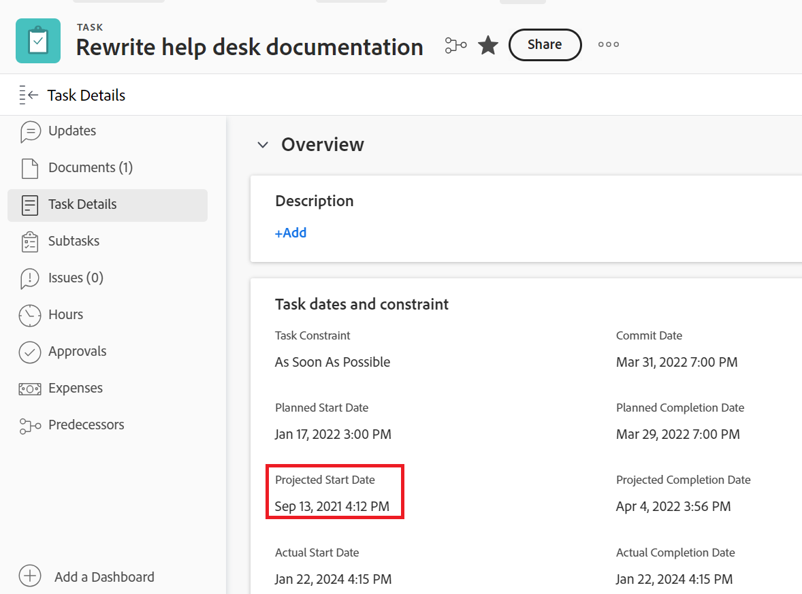

# Visão geral das datas de Projeto, Tarefa e Problema em [!DNL Workfront]

<!-- Audited: 05/2024 -->

<!--

(NOTE: consider expanding on this article with ALL dates for PTIs - Hand off dates, Approval Dates, etc) 

-->

Este artigo fornece definições para as datas mais comuns associadas a projetos, tarefas e problemas no [!DNL Adobe Workfront]. As imagens incluídas aqui são exemplos de onde as datas são exibidas no Workfront e não são exaustivas. Há outras áreas que exibem as datas. Todas as datas também estão visíveis nos relatórios e listas de projetos, tarefas e problemas.

Para obter informações sobre relatórios e listas, consulte os seguintes artigos:

* [Introdução a listas em  [!DNL Adobe Workfront]](../../../workfront-basics/navigate-workfront/use-lists/view-items-in-a-list.md)
* [Introdução a relatórios](../../../reports-and-dashboards/reports/reporting/get-started-reports-workfront.md)

Para obter mais informações sobre campos de projeto, tarefa e problema, consulte [Glossário de [!DNL Adobe Workfront] terminologia](../../../workfront-basics/navigate-workfront/workfront-navigation/workfront-terminology-glossary.md).

## [!UICONTROL Data de Início Planejada]

A [!UICONTROL Data de Início Planejada] é a data em que um projeto, tarefa ou problema está planejado para começar.

Dependendo da [!UICONTROL Restrição de Tarefa], talvez você não consiga editar a [!UICONTROL Data de Início Planejada] de uma tarefa. Dependendo do [!UICONTROL Modo de Agendamento] do projeto, talvez você não possa editar a [!UICONTROL Data de Início Planejada] de um projeto.

Para obter mais informações, consulte [Visão geral do projeto [!UICONTROL Data de Início Planejada]](../../../manage-work/projects/planning-a-project/project-planned-start-date.md).

## [!UICONTROL Data de Término Planejada]

A [!UICONTROL Data de Conclusão Planejada] ou a data [!UICONTROL De Término] é a data em que há planos para a conclusão de um projeto, tarefa ou problema.

Dependendo da [!UICONTROL Restrição de Tarefa], talvez você não consiga editar a [!UICONTROL Data de Conclusão Planejada] de uma tarefa. Dependendo do [!UICONTROL Modo de Agendamento] do projeto, talvez você não possa editar a [!UICONTROL Data de Conclusão Planejada] de um projeto.

A [!UICONTROL Data de conclusão planejada] é exibida como a data de vencimento em algumas áreas de [!DNL Workfront].

Para obter mais informações, consulte os seguintes artigos:

* [Visão geral da tarefa [!UICONTROL Data de conclusão planejada]](../../../manage-work/tasks/task-information/task-planned-completion-date.md)
* [Definir a [!UICONTROL Data de Término Planejada] do projeto](../../../manage-work/projects/planning-a-project/project-planned-completion-date.md)
* [Visão geral do problema [!UICONTROL Data de conclusão planejada]](../../../manage-work/issues/issue-information/issue-planned-completion-date.md)

## [!UICONTROL Data de entrada]

A [!UICONTROL Data de Entrada] é a data em que um projeto, tarefa ou problema foi criado no Workfront.

A [!UICONTROL Data de Entrada] não influencia a linha do tempo de projetos, tarefas ou problemas, mas é importante para fins de rastreamento e relatórios. [!DNL Workfront] gera automaticamente a [!UICONTROL Data de Entrada] quando o objeto é criado e você não pode editá-lo manualmente.

## [!UICONTROL Data de Início Efetivo]

A [!UICONTROL Data de Início Efetivo] é a data em que um usuário começa realmente a trabalhar em um projeto, tarefa ou problema. A [!UICONTROL Data de Início Efetiva] fica vazia quando o projeto, tarefa ou problema é criado.

Você pode indicar manualmente quando o trabalho começou em uma tarefa ou um problema, ou a [!UICONTROL Data de Início Efetivo] é preenchida automaticamente quando o status da tarefa ou do problema muda de [!UICONTROL Novo] para [!UICONTROL Em Andamento] ou [!UICONTROL Concluído]. A [!UICONTROL Data de Início Efetivo] de um projeto coincide com a data em que a primeira tarefa do projeto começa.

>[!TIP]
>
>A [!UICONTROL Data de Início Efetivo] pode não corresponder à [!UICONTROL Data de Início Planejada] de um projeto, tarefa ou problema porque o usuário pode começar a trabalhar mais tarde ou antes da data planejada.

Para obter mais informações, consulte [Visão Geral do projeto [!UICONTROL Data de Início Efetivo]](../../../manage-work/projects/planning-a-project/project-actual-start-date.md).

>[!NOTE]
>
>A [!UICONTROL Data de Início] ou as restrições de Datas Fixas afetam a [!UICONTROL Data de Início Planejada] de uma tarefa, não a [!UICONTROL Data de Início Efetivo]. Isto atualizará a [!UICONTROL Data de Início Planejada] para uma data que você especificar. A [!UICONTROL Data de Início Efetivo] é atualizada independentemente da [!UICONTROL Data de Início Planejada], conforme descrito acima.

## [!UICONTROL Data de Término Efetivo]

A [!UICONTROL Data de Término Efetivo] é a data em que um usuário realmente conclui um projeto, tarefa ou problema. A [!UICONTROL Data de Término Efetivo] fica vazia quando o projeto, tarefa ou problema é criado.

Você pode indicar manualmente quando o trabalho é concluído em uma tarefa ou problema, ou a [!UICONTROL Data de Término Efetivo] é preenchida automaticamente quando qualquer uma das seguintes situações ocorrer:

* O status do projeto, da tarefa ou do problema muda para [!UICONTROL Concluído], [!UICONTROL Fechado] ou [!UICONTROL Resolvido].
* A porcentagem concluída da tarefa ou do projeto é 100%.

A [!UICONTROL Data de Término Efetivo] de um projeto coincide com a data em que você concluiu a última tarefa do projeto.

>[!TIP]
>
>A [!UICONTROL Data de Término Efetivo] pode não corresponder à [!UICONTROL Data de Término Planejada].

Para obter mais informações, consulte [Visão geral do projeto [!UICONTROL Data de Término Efetivo]](../../../manage-work/projects/planning-a-project/project-actual-completion-date.md).

## [!UICONTROL Data de confirmação]

A [!UICONTROL Data de Confirmação] é a data na qual um usuário atribuído a uma tarefa ou problema confirma a conclusão da tarefa ou do problema. Isso é diferente da [!UICONTROL Data de conclusão planejada], pois é uma estimativa mais realista da data de conclusão fornecida somente pelo usuário responsável pelo trabalho. Para obter mais informações, consulte [[!UICONTROL Data de confirmação] visão geral](../../../manage-work/projects/updating-work-in-a-project/overview-of-commit-dates.md).

>[!NOTE]
>
>Alterar a [!UICONTROL Data de Confirmação] afeta a [!UICONTROL Data de Conclusão Projetada], mas não a [!UICONTROL Data de Conclusão Planejada] de uma tarefa ou um problema. O gerente de projeto pode usar as alterações feitas por um signatário na [!UICONTROL Data de Confirmação] para atualizar a [!UICONTROL Data de Conclusão Planejada] de uma tarefa ou um problema.

## [!UICONTROL Data de Início Projetada]

A [!UICONTROL Data de Início Projetada] é uma data em tempo real em que o projeto, tarefa ou problema começa e leva em consideração todos os atrasos. Esta é uma Data de Início mais precisa para o projeto, tarefa ou problema do que a [!UICONTROL Data de Início Planejada]. A [!UICONTROL Data de Início Planejada] não considera atrasos ou datas passadas.

Quando você planeja um projeto pela primeira vez, a [!UICONTROL Data de Início Planejada] e a [!UICONTROL Data de Início Projetada] das tarefas e do projeto são idênticas. Como podem ocorrer atrasos ou as tarefas podem ser concluídas anteriormente, a [!UICONTROL Data de Início Projetada] pode se tornar diferente da [!UICONTROL Data de Início Planejada].

Para uma tarefa, uma [!UICONTROL Data de Início Projetada] também pode diferir de sua [!UICONTROL Data de Início Planejada] quando um de seus predecessores estiver atrasado no agendamento.

>[!TIP]
>
>Você pode exibir a [!UICONTROL Data de Início Projetada] de um problema somente em uma lista ou relatório.

Para obter mais informações, consulte [Visão geral do projeto [!UICONTROL Data de Início Projetada]](../../../manage-work/projects/planning-a-project/project-projected-start-date.md).

## [!UICONTROL Data de Término Projetada]

A [!UICONTROL Data de Conclusão Projetada] é um indicador calculado em tempo real de quando o projeto, tarefa ou problema será concluído. Quando o projeto, tarefa ou problema é marcado como Concluído, a [!UICONTROL Data de Conclusão Projetada] muda para a data da [!UICONTROL Data de Conclusão Efetiva].

Se tudo correr bem e conforme planejado, a [!UICONTROL Data de conclusão projetada] deve corresponder à [!UICONTROL Data de conclusão planejada]. Caso contrário, devido a atrasos nas tarefas predecessoras, a [!UICONTROL Data de Conclusão Projetada] pode se tornar diferente da [!UICONTROL Data de Conclusão Planejada].

Para obter mais informações, consulte [Visão geral da [!UICONTROL Data de conclusão projetada] para projetos, tarefas e problemas](../../../manage-work/projects/planning-a-project/project-projected-completion-date.md).

## [!UICONTROL Data de Entrada da Hora]

Quando você registra horas para projetos, tarefas e problemas para indicar quanto tempo real (em horas) você gasta trabalhando no projeto, tarefa ou problema, o tempo que você registra torna-se as [!UICONTROL Horas efetivas] do projeto, tarefa ou problema.

A data para a qual você registra a hora é o campo [!UICONTROL Data de Entrada da Hora] na entrada da hora. Algumas listas e relatórios de horas exibem a Data de entrada da hora como Data.

>[!TIP]
>
>A [!UICONTROL Data de Entrada da Hora] é diferente da [!UICONTROL Data de Entrada], pois não é a data em que o log de horas foi criado, mas sim a data à qual você deseja associar as horas.

Você pode registrar e visualizar o tempo nas seguintes áreas do Workfront:

* Registre o tempo de exibição na seção [!UICONTROL projeto], [!UICONTROL tarefa] ou [!UICONTROL atualizações de problemas] ou na seção [!UICONTROL Horas]. Ao registrar horas na seção [!UICONTROL Hours] , você pode especificar manualmente a Data de Entrada da Hora e o usuário ao qual as horas pertencem.

  

  Para obter mais informações, consulte [Log time](../../../timesheets/create-and-manage-timesheets/log-time.md).

  >[!TIP]
  >
  >Recomendamos registrar tempo em tarefas e problemas de trabalho, em vez de tarefas ou projetos principais. O tempo registrado nas tarefas de trabalho totaliza as tarefas pai e o projeto como [!UICONTROL Horas Reais] para as tarefas pai e o projeto. O tempo registrado nos problemas é acumulado no projeto como [!UICONTROL Horas efetivas] para o projeto.

* Registrar o tempo no fluxo de atualização de uma tarefa ou problema.

  

* Exiba as [!UICONTROL Datas de Entrada da Hora] em relatórios e listas de horas.

  
