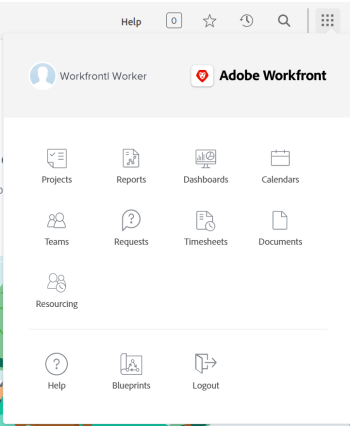

# Compreender a navegação de um usuário de licença do [!UICONTROL Trabalho]

O [!UICONTROL Menu Principal] é alterado com o nível de acesso atribuído a você pelo administrador do [!DNL Adobe Workfront]. Por padrão, você recebe acesso somente às áreas que incluem a funcionalidade permitida pelo seu nível de acesso. Para entender os componentes do layout padrão de cada nível de acesso, consulte [Sobre o layout padrão [!DNL Adobe Workfront] 2&rbrace;.](../../../administration-and-setup/customize-workfront/use-layout-templates/about-the-default-wf-layout.md)

## Entender o [!UICONTROL Menu Principal] padrão de um Trabalhador

Como um [!UICONTROL Trabalhador], sua principal responsabilidade é concluir o trabalho. As áreas no [!UICONTROL Menu Principal] que estão visíveis para você permitem fazer isso.

As seguintes áreas estão incluídas no layout padrão de um [!UICONTROL Trabalhador]:

* **[!UICONTROL Página inicial]**: tarefas e problemas atribuídos a você são exibidos aqui. Esta é a página de aterrissagem padrão de um Trabalhador. No entanto, ela não aparece no [!UICONTROL Menu Principal], a menos que um administrador do Workfront a adicione ao modelo de layout.  Para obter informações, consulte [Introdução à [!UICONTROL Página inicial]](../../../workfront-basics/using-home/using-the-home-area/get-started-with-home.md).

* **[!UICONTROL Projetos]**: os projetos compartilhados com você são exibidos aqui. Para obter informações, consulte [Projetos: índice do artigo](../../../manage-work/projects/projects-overview.md).

* **[!UICONTROL Relatórios]**: os relatórios compartilhados com você são exibidos aqui. Para obter informações, consulte [Relatórios](../../../reports-and-dashboards/reports/reports-overview.md).

* **[!UICONTROL Painéis]**: os painéis compartilhados com você são exibidos aqui. Para obter informações, consulte [Painéis](../../../reports-and-dashboards/dashboards/dashboards-overview.md).

* **[!UICONTROL Calendários]**: os calendários compartilhados com você são exibidos aqui. Para obter informações, consulte [Calendários: índice do artigo](../../../reports-and-dashboards/reports/calendars/calendars.md).

* **[!UICONTROL Equipes]**: tarefas e problemas atribuídos às suas equipes são exibidos nesta área. Como Trabalhador, você é o único usuário [!DNL Workfront] que vê a área [!UICONTROL Equipes] por padrão.

  Para obter informações, consulte [Criar e gerenciar equipes](../../../people-teams-and-groups/create-and-manage-teams/create-and-mange-teams.md).

* **[!UICONTROL Solicitações]**: você pode enviar solicitações e revisar solicitações que você ou os membros da sua equipe enviaram aqui. Para obter informações, consulte [Solicitações](../../../manage-work/requests/requests-overview.md).

* **[!UICONTROL Folhas de horas]**: você pode acessar suas folhas de horas atuais, futuras ou antigas aqui. Para obter informações, consulte [Folhas de horas: índice do artigo](../../../timesheets/timesheets-all.md).

* **[!UICONTROL Documentos]**: você pode carregar documentos ou revisar documentos compartilhados com você, aqui. Para obter informações, consulte [Documentos](../../../documents/documents-overview.md).

* **[!UICONTROL Recursos]**: você pode exibir a alocação de recursos nas ferramentas de Planejamento de Recursos e exibir Conjuntos de Recursos aqui. Para obter informações, consulte [Gerenciar recursos](../../../resource-mgmt/manage-resources.md).

* **[!UICONTROL Quadros]**: trabalhe com flexibilidade e colaboração com os membros da equipe usando quadros compartilhados que contêm colunas e cartões que refletem o trabalho que você deseja realizar. Para obter informações, consulte [Introdução a quadros: índice do artigo](../../../agile/get-started-with-boards/get-started-with-boards.md).

* **[!UICONTROL Blueprints]**: examine os blueprints existentes no sistema e solicite a instalação de um, caso o administrador do [!DNL Workfront] tenha configurado a fila de solicitações para blueprints. Para obter mais informações, consulte [Visão geral dos blueprints](../../../administration-and-setup/blueprints/blueprints-overview.md).

## Personalizar o [!UICONTROL Menu Principal] padrão

O administrador do [!DNL Workfront] pode modificar o layout padrão do [!DNL Workfront] atribuindo um modelo de layout. Para obter mais informações sobre como trabalhar com modelos de layout, consulte [Personalizar o [!UICONTROL Menu Principal] usando um modelo de layout](../../../administration-and-setup/customize-workfront/use-layout-templates/customize-main-menu.md).
