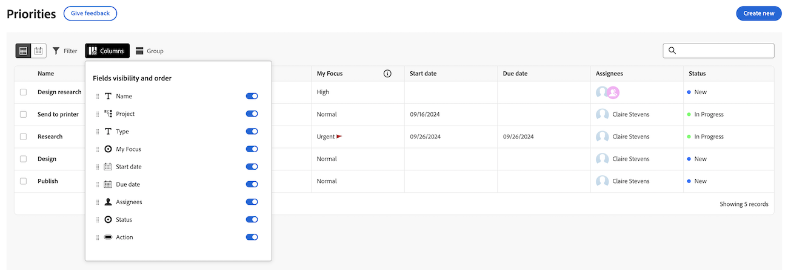
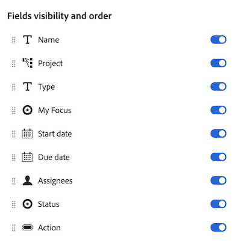

# Personalizar as colunas da lista de trabalho de prioridades

Você pode personalizar as colunas na lista de trabalho em Prioridades para respaldar a maneira como você trabalha.

Prioridades exibe os itens de trabalho atribuídos a você. Não é possível ver os itens de trabalho atribuídos à sua equipe.

>[!NOTE]
>
>No momento, não é possível adicionar dados personalizados a colunas.

## Requisitos de acesso

+++ Expanda para visualizar os requisitos de acesso para a funcionalidade neste artigo.

<table style="table-layout:auto"> 
 <col> 
 </col> 
 <col> 
 </col> 
 <tbody> 
  <tr> 
   <td role="rowheader"><strong>Pacote do Adobe Workfront</strong></td> 
   <td> 
Qualquer
 </td> 
  </tr> 
  <tr> 
   <td role="rowheader"><strong>Licença do Adobe Workfront</strong></td> 
   <td> 
   
Revisor ou superior

   
Leve ou superior
 
   </td> 
  </tr> 
  <tr> 
   <td role="rowheader"><strong>Configurações de nível de acesso</strong></td> 
   <td> 
Acesso de Visualização ou Edição para o objeto no qual a atualização está
</td> 
  </tr> 
  <tr> 
   <td role="rowheader"><strong>Permissões de objeto</strong></td> 
   <td> 
Visualizar acesso ao objeto
</td> 
  </tr> 
 </tbody> 
</table>

Para obter mais detalhes sobre as informações nesta tabela, consulte [Requisitos de acesso na documentação do Workfront](/help/quicksilver/administration-and-setup/add-users/access-levels-and-object-permissions/access-level-requirements-in-documentation.md).

+++

## Personalizar as colunas da lista de trabalho de prioridades

### Ativar ou desativar colunas

{{step1-to-priorities}}

1. Clique em **Colunas** no lado esquerdo da tela.
   
1. Use os botões para ativar ou desativar colunas na lista de trabalho.

### Reordenar as colunas

{{step1-to-priorities}}

1. Clique em **Colunas** no lado esquerdo da tela.
1. Clique no ícone **Arrastar** e mova a coluna para o local desejado. A movimentação de colunas atualiza a lista de trabalho automaticamente.
   

>[!NOTE]
>
>A coluna Name está fixa e não pode ser movida.
