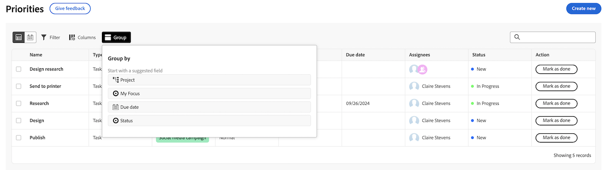

# Filtre e agrupe seu trabalho com Prioridades

As informações destacadas nesta página referem-se a funcionalidades que ainda não estão disponíveis. Ele está disponível somente no ambiente de Pré-visualização da Sandbox.

Você pode usar filtros para encontrar o trabalho que está procurando e, em seguida, aplicar um agrupamento para mantê-lo organizado.

## Requisitos de acesso

+++ Expanda para visualizar os requisitos de acesso para a funcionalidade neste artigo.

Você deve ter o seguinte acesso para executar as etapas deste artigo:

<table style="table-layout:auto"> 
 <col> 
 </col> 
 <col> 
 </col> 
 <tbody> 
  <tr> 
   <td role="rowheader"><strong>plano do Adobe Workfront</strong></td> 
   <td> 
Qualquer
 </td> 
  </tr> 
  <tr> 
   <td role="rowheader"><strong>Licença da Adobe Workfront*</strong></td> 
   <td> 
   
Atual: solicitação ou superior

   
Novo: Colaborador ou superior
 
   </td> 
  </tr> 
  <tr> 
   <td role="rowheader"><strong>Configurações de nível de acesso</strong></td> 
   <td> 
Acesso de Visualização ou Edição para o objeto no qual a atualização está
</td> 
  </tr> 
  <tr> 
   <td role="rowheader"><strong>Permissões de objeto</strong></td> 
   <td> 
Visualizar acesso ao objeto
</td> 
  </tr> 
 </tbody> 
</table>

*Para obter mais informações, consulte [Requisitos de acesso na documentação do Workfront](/help/quicksilver/administration-and-setup/add-users/access-levels-and-object-permissions/access-level-requirements-in-documentation.md).

+++

## Filtre e agrupe seu trabalho com Prioridades na Produção

### Filtrar seu trabalho

Você pode filtrar tarefas e problemas atribuídos a você.

{{step1-to-priorities}}

1. Clique em **Filtros** na parte superior direita da lista de trabalho.
1. Selecione um ou vários filtros para restringir seus itens de trabalho.
   

+++Expanda para ver informações detalhadas sobre os filtros disponíveis
<table>
  <tbody>
   <tr>
   <th>Filtro</th>
   <th>Descrição</th>
   </tr>
    <tr>
      <td>Em desenvolvimento</td>
      <td>Exibe itens nos quais você está trabalhando no momento</td>
    </tr>
    <tr>
      <td>Pronto para iniciar</td>
      <td>Exibe itens com 
      <ul>
      <li>Sem predecessores incompletos ou restrições de tarefa</li>
      
e

      <li>A Data de Início Planejada está no passado ou em até duas semanas no futuro</li>
      </ul>
      </td>
    </tr>
    <tr>
      <td>Não está pronto</td>
      <td>Exibe itens que possuem
       <ul>
      <li>Predecessoras incompletas ou restrições de tarefa que impedem o trabalho no item</li>
      
ou

      <li>A Data de Início Planejada mais de duas semanas no futuro</li>
      </ul>
       </td>
    </tr>
    <tr>
      <td>Solicitado</td>
      <td>Exibe problemas nos quais você não começou a trabalhar</td>
    </tr>
      <td>Concluído</td>
      <td>Exibe o trabalho concluído nas últimas duas semanas. Essa opção de filtro não inclui aprovações.</td>
    </tr>
    <tr>
    <td>Projeto</td>
    <td>Exibe projetos que contêm tarefas ou problemas aos quais você foi atribuído</td>
    </tr>
    <tr>
    <td>Data final</td>
    <td>Exibe o trabalho pela Data de Término Planejada</td>
    </tr>
    <tr>
    <td>Status</td>
    <td>Exibe tarefas ou problemas nos status novo, em andamento e concluído</td>
    </tr>
    <tr>
    <td>Meu foco</td>
    <td>Exibe tarefas ou problemas no que têm níveis de foco atribuídos. Os níveis de foco são atribuídos e gerenciados pelo usuário individual.</td>
    </tr>
  </tbody>
</table>

+++

1. (Opcional) Clique em **Voltar ao padrão** para redefinir sua seleção.

### Agrupar seu trabalho

{{step1-to-priorities}}

1. Clique em **Grupos** na parte superior direita da lista de trabalho.
1. Selecione um grupo para organizar sua lista de trabalho
   

+++Expanda para ver informações detalhadas sobre grupos disponíveis

| Grupo | Descrição |
|-----------|-------------|
| Nenhum(a) | Isso remove agrupamentos da lista de trabalho. |
| Meu foco | Isso agrupa itens com base no nível de foco atribuído. |
| Semana do prazo | Isso agrupa itens com base na semana de vencimento. As datas de vencimento são determinadas pela Data de conclusão planejada. |
| Status | Isso agrupa itens pelos seguintes status: Novo, Em andamento, Concluído.  Observação: no momento, você não pode usar status personalizados em Prioridades. |
| Projeto | Isso agrupa itens por projeto. |

+++

### Classifique seu trabalho

Para classificar seu trabalho, abra o **Grupo** e clique em **Classificar em ordem crescente** ou **Classificar em ordem decrescente**.

>[!IMPORTANT]
>
>A opção de classificação estará temporariamente indisponível se você tiver um grupo aplicado.

### Expandir ou recolher todas as seções

Para expandir ou recolher todas as seções, abra **Grupo** e clique em **Expandir tudo** ou **Recolher tudo**.

## Filtre e agrupe seu trabalho com Prioridades na Pré-visualização

### Filtrar seu trabalho

Você pode filtrar tarefas e problemas atribuídos a você.

{{step1-to-priorities}}

1. Clique em **Filtros** na parte superior esquerda da lista de trabalho.
1. Selecione um ou vários filtros para restringir seus itens de trabalho.
   

+++Expanda para ver informações detalhadas sobre os filtros disponíveis
<table>
  <tbody>
   <tr>
   <th>Filtro</th>
   <th>Descrição</th>
   </tr>
    <tr>
      <td>Em desenvolvimento</td>
      <td>Exibe itens nos quais você está trabalhando no momento</td>
    </tr>
    <tr>
      <td>Pronto para iniciar</td>
      <td>Exibe itens com 
      <ul>
      <li>Sem predecessores incompletos ou restrições de tarefa</li>
      
e

      <li>A Data de Início Planejada está no passado ou em até duas semanas no futuro</li>
      </ul>
      </td>
    </tr>
    <tr>
      <td>Não está pronto</td>
      <td>Exibe itens que possuem
       <ul>
      <li>Predecessoras incompletas ou restrições de tarefa que impedem o trabalho no item</li>
      
ou

      <li>A Data de Início Planejada mais de duas semanas no futuro</li>
      </ul>
       </td>
    </tr>
    <tr>
      <td>Solicitado</td>
      <td>Exibe problemas nos quais você não começou a trabalhar</td>
    </tr>
      <td>Concluído</td>
      <td>Exibe o trabalho concluído nas últimas duas semanas. Essa opção de filtro não inclui aprovações.</td>
    </tr>
    <tr>
    <td>Projeto</td>
    <td>Exibe projetos que contêm tarefas ou problemas aos quais você foi atribuído</td>
    </tr>
    <tr>
    <td>Data final</td>
    <td>Exibe o trabalho pela Data de Término Planejada</td>
    </tr>
    <tr>
    <td>Status</td>
    <td>Exibe tarefas ou problemas nos status novo, em andamento e concluído</td>
    </tr>
    <tr>
    <td>Meu foco</td>
    <td>Exibe tarefas ou problemas no que têm níveis de foco atribuídos. Os níveis de foco são atribuídos e gerenciados pelo usuário individual.</td>
    </tr>
  </tbody>
</table>

+++

1. (Opcional) Clique em **Voltar ao padrão** para redefinir sua seleção.

### Agrupar seu trabalho

{{step1-to-priorities}}

1. Clique em **Grupos** na parte superior esquerda da lista de trabalho.
1. Selecione um grupo para organizar sua lista de trabalho
   

+++Expanda para ver informações detalhadas sobre grupos disponíveis

| Grupo | Descrição |
|-----------|-------------|
| Projeto | Isso agrupa itens por projeto. |
| Meu foco | Isso agrupa itens com base no nível de foco atribuído. |
| Semana do prazo | Isso agrupa itens com base na semana de vencimento. As datas de vencimento são determinadas pela Data de conclusão planejada. |
| Status | Isso agrupa itens pelos seguintes status: Novo, Em andamento, Concluído.  Observação: no momento, você não pode usar status personalizados em Prioridades. |

+++

### Classifique seu trabalho

**Classificar em grupos**

Para classificar seu trabalho em um grupo, abra o **Grupo** e clique em **Classificar em ordem crescente** ou **Classificar em ordem decrescente**.

**Classificar colunas**

Para classificar colunas individuais, vá para a coluna e clique na seta para baixo.

### Expandir ou recolher todas as seções do grupo

Para expandir ou recolher todas as seções de grupo, abra **Grupo** e clique em **Expandir tudo** ou **Recolher tudo**.

