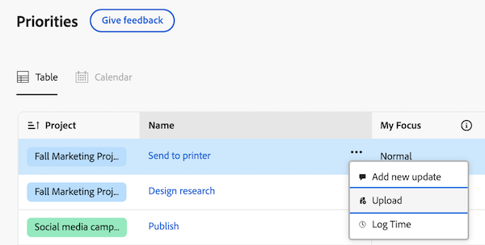
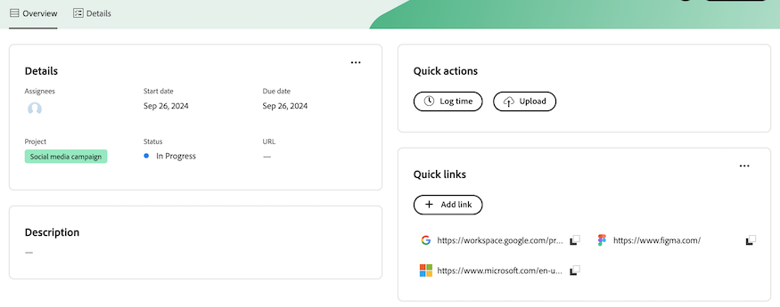

# Introdução às prioridades

As prioridades são uma experiência simplificada e intuitiva personalizada para proprietários de tarefas. As prioridades serão distribuídas em fases, começando pela lista de trabalho.

Com as Prioridades, você pode aproveitar

* Gerencie e priorize tarefas diárias: organize seu dia ou semana com a navegação consolidada para maior clareza
* Maior produtividade: acesse o contexto do projeto e execute tarefas com mais rapidez e menos cliques
* Recursos personalizados: aproveite os recursos criados exclusivamente para proprietários de tarefas

## Encontre e organize seu trabalho

Em Prioridades, você pode filtrar e agrupar seu trabalho para ajudá-lo a gerenciar prazos e priorizar o que é importante para você. Você também pode identificar rapidamente o trabalho urgente com a coluna Meu foco.

### Encontre seu trabalho com filtros

Encontre o seu trabalho mais importante com filtros. Você pode filtrar tarefas e problemas atribuídos a você das seguintes maneiras:

<table>
  <tbody>
   <tr>
   <th>Filtro</th>
   <th>Descrição</th>
   </tr>
    <tr>
      <td>Trabalhando em</td>
      <td>Exibe itens nos quais você está trabalhando no momento</td>
    </tr>
    <tr>
      <td>Pronto para iniciar</td>
      <td>Exibe itens com 
      <ul>
      <li>Sem predecessores incompletos ou restrições de tarefa</li>
      
e

      <li>A Data de Início Planejada está no passado ou em até duas semanas no futuro</li>
      </ul>
      </td>
    </tr>
    <tr>
      <td>Não está pronto</td>
      <td>Exibe itens que possuem
       <ul>
      <li>Predecessoras incompletas ou restrições de tarefa que impedem o trabalho no item</li>
      
ou

      <li>A Data de Início Planejada mais de duas semanas no futuro</li>
      </ul>
       </td>
    </tr>
    <tr>
      <td>Solicitado</td>
      <td>Exibe problemas nos quais você não começou a trabalhar</td>
    </tr>
      <td>Concluído</td>
      <td>Exibe o trabalho concluído nas últimas duas semanas. Essa opção de filtro não inclui aprovações.</td>
    </tr>
    <tr>
    <td>Projeto</td>
    <td>Exibe projetos que contêm tarefas ou problemas aos quais você foi atribuído</td>
    </tr>
    <tr>
    <td>Data final</td>
    <td>Exibe o trabalho pela Data de Término Planejada</td>
    </tr>
    <tr>
    <td>Status</td>
    <td>Exibe tarefas ou problemas nos status novo, em andamento e concluído</td>
    </tr>
  </tbody>
</table>

### Organize seu trabalho com Grupos

Após filtrar o trabalho, você pode agrupar itens com base em

* Nenhum(a)
* Semana do prazo
* Status
* Projeto

<!--For more information, see [Find and organize your work in Priorities]().-->

### Priorizar itens de trabalho importantes com Meu Foco

Meu foco é uma coluna na lista de trabalho que ajuda a priorizar seu trabalho. O valor Meu foco é pessoal e não afeta dados de projetos, tarefas ou problemas. Você pode usar os seguintes níveis de foco:

* Urgente
* Principal
* Secundário
* Normal (padrão)

Depois de atribuir níveis de foco aos itens de trabalho, você pode classificar a coluna para exibir itens urgentes na parte superior da lista de trabalho.

<!--For more information, see [Prioritize important work items with My Focus]().-->

### Usar o modo de exibição Calendário [!BADGE Em breve]{type=Informative}

A exibição de Calendário fornecerá uma representação visual de suas tarefas e problemas. Você poderá escolher entre uma visualização de dia, semana ou mês. Você também poderá filtrar itens de maneira semelhante à lista de trabalho.

## Trabalhar em tarefas e problemas

Em Prioridades, você pode atualizar itens de trabalho para manter os detalhes dos itens de trabalho atualizados, registrar horas para rastrear as horas de trabalho com precisão, fazer upload de ativos sem precisar navegar para um projeto e adicionar links rápidos para facilitar o acesso aos recursos usados com frequência.

>[!NOTE]
>
>As licenças Light, Review, Contributor e Requestor têm acesso limitado às Prioridades. Para obter mais informações sobre como esses tipos de licença podem interagir com tarefas e problemas, consulte
>
>* [Acesso a objetos e áreas pelo para novas licenças](/help/quicksilver/administration-and-setup/add-users/how-access-levels-work/access-to-objects-areas-license-types.md)
>* [Funcionalidade disponível para cada tipo de objeto para novos níveis de acesso](/help/quicksilver/administration-and-setup/add-users/how-access-levels-work/functionality-available-for-objects.md)
>* [Acesso a objetos e áreas por tipo de licença](/help/quicksilver/administration-and-setup/add-users/access-levels-and-object-permissions/access-to-objects-and-areas-by-license-type.md)
>* [Funcionalidade disponível para cada tipo de objeto](/help/quicksilver/administration-and-setup/add-users/access-levels-and-object-permissions/functionality-available-for-each-object-type.md)

### Adicionar e exibir atualizações

Adicione uma atualização em uma tarefa ou problema para comunicar seu progresso a outras pessoas.

A seção Atualizações mostra atualizações de sistema e até 200 das atualizações mais recentes feitas pelos usuários nos últimos 90 dias.

<!--For more information, see [Add and view updates in Priorities]().-->

### Registrar de tempo

Você pode registrar o tempo dos itens de trabalho para indicar o número de horas que você gasta trabalhando neles. Você também pode registrar horas que não estejam relacionadas ao trabalho, como férias, licença médica ou tempo gasto em reuniões. O horário registrado é exibido em sua folha de horas.

<!--For more information, see [Log time in Priorities]().-->

### Fazer upload de arquivos

Fazer upload de arquivos diretamente na área Documentos da tarefa ou problema sem precisar navegar até um Projeto. Ao fazer upload de um arquivo do Prioridades, você pode

* Selecionar uma pasta existente
* Fazer upload do arquivo com um comentário de fluxo de atualização
* Adicionar mais arquivos
* Importar arquivos de integrações de documentos conectadas

<!--For more information, see [Upload files in Priorities]().-->

### Exibir documentos [!BADGE Em breve]{type=Informative}

A guia Documentos permitirá exibir todos os arquivos relacionados a um item de trabalho. Você poderá filtrar documentos por nome, tipo de arquivo ou pessoa e classificar por nome e data de upload.

Você também poderá abrir o documento ou a prova.

### Adicionar links rápidos

Você pode incorporar links usados com frequência na página de detalhes do item de trabalho. Os Links rápidos permitem visitar ou copiar rapidamente o link.

<!--For more information, see [Add and manage quick links in Priorities]().-->

### Revisar e aprovar ativos [!BADGE Em breve]{type=Informative}

A capacidade de revisar e aprovar ativos está no roteiro de prioridades.

Por enquanto, recomendamos usar os widgets Aguardando minha aprovação e Todas as aprovações na Nova página inicial.

Para obter mais informações, consulte [Adicionar, editar ou remover widgets na Nova Página Inicial](/help/quicksilver/workfront-basics/using-home/new-home/add-edit-remove-widgets-in-new-home.md).

## Use o recurso Alcance-me para ver o que você perdeu [!BADGE Em breve]{type=Informative}

Use o recurso Alcance-me para ver o que você perdeu. Pegar-me resumirá as atualizações, os documentos carregados, as aprovações e outras alterações importantes sobre seus projetos dentro dos seguintes prazos: 24 horas, 3 dias, 7 dias.

## Considerações

* No momento, os administradores do Workfront não podem personalizar prioridades por meio do Modelo de layout.
* O acesso às tarefas em Prioridades é feito em todas as guias. Planejamos adicionar guias adicionais, como Documentos, Subtarefas, Aprovações, etc., no futuro. Diga-nos que você precisa desses itens enviando comentários usando o botão **Fornecer Comentários**.

