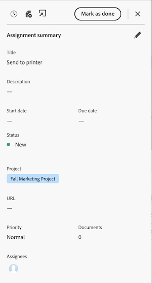

# Mudar da Página inicial herdada para Prioridades

A página inicial herdada será removida do Workfront em 17/10 com a versão do quarto trimestre. Este artigo fornece informações sobre qual funcionalidade estará disponível em Prioridades, bem como recomendações para os administradores do Workfront que migram os usuários para Prioridades.

Para obter mais informações sobre a descontinuação da Página inicial herdada, consulte o [Guia de descontinuação da página inicial herdada](/help/quicksilver/product-announcements/announcements/legacy-home-deprecation.md).

## Entenda o que está mudando de Página inicial herdada para Prioridades

### Lista de trabalho

#### Organizar trabalho

A exibição de tabela Prioridades exibe tarefas e problemas atribuídos a você ou a sua equipe. Você pode filtrar e agrupar seu trabalho usando o seguinte:

| **Filtro** | **Agrupamento** |
|------------|-----------|
| - Trabalhando em   - Pronto para iniciar   - Não está pronto   - Solicitado   - Concluído   - Projeto   - Data de Vencimento   - Status | - Nenhum   - Semana de Vencimento   - Status   - Projeto |

**Opções de agrupamento e filtro herdado da página inicial não disponíveis em Prioridades**

Filtros

* Concluído - renomeado para Concluído em Prioridades

Agrupamento

* Data de conclusão planejada - renomeada para Data de vencimento em Prioridades
* Início planejado
* Data de confirmação
* Minhas Prioridades

#### Delegar trabalho

Os usuários não podem delegar ou exibir trabalho delegado em Prioridades no momento. No entanto, os usuários ainda podem delegar trabalho da Nova página inicial nos seguintes widgets:

* Meu trabalho
* Minhas tarefas
* Meus problemas
* Aguardando minhas aprovações

Os usuários podem exibir o trabalho delegado da Nova página inicial nos seguintes widgets

* Widget Meu trabalho usando o filtro Delegado a mim
* Aguardando minhas aprovações usando o filtro Aprovações delegadas

#### Usar a exibição de calendário

Uma visualização de substituição de calendário não está disponível no momento, mas está no roteiro para Prioridades.

#### Criar uma tarefa pessoal

Os usuários não podem criar tarefas pessoais ou itens de tarefa pendentes em Prioridades.

#### Adicionar itens à Minha Prioridade

Os usuários podem priorizar o trabalho com a nova coluna Meu foco. A coluna Meu foco é exclusiva de cada usuário e não afeta dados de tarefas, problemas ou produtos.

Os usuários podem sinalizar trabalhos de alta prioridade com as seguintes opções:

* Urgente
* Principal
* Secundário
* Normal (padrão)

#### Exibir aprovações que enviei

Os usuários não podem visualizar as aprovações que enviaram em Prioridades. Como solução, os usuários podem visualizar essas informações no widget Minhas aprovações na Página inicial usando a opção de filtro Aprovações que enviei.

### Exibir aprovações e solicitações de equipe

Os usuários não podem interagir com aprovações e solicitações de equipe em Prioridades. No entanto, é possível gerenciar solicitações de aprovação e de equipe na Nova página inicial usando os seguintes widgets:

* Minha aprovação
* Todas as aprovações
* Solicitações de equipe

### Atualizar itens de trabalho

#### Atualizar formulários personalizados

Os usuários podem atualizar formulários personalizados na visualização de tarefa clicando no nome da tarefa, navegando até a guia Detalhes e rolando até a parte inferior da página.

#### Usar o painel Resumo

O painel Resumo é exibido para tarefas e problemas. No Resumo, os usuários podem

* Registrar de tempo
* Carregar um arquivo
* Acesse a guia Detalhes em Prioridades
* Atualizar informações de tarefas e problemas

<!--Can admins customize this? It looks different from the task/issue summary in other areas. -->

#### Abrir o painel Resumo

Na guia **Tabela**, clique na célula de nome do item de trabalho. Ao clicar no nome do item de trabalho, você é levado à página Detalhes e não abre o painel Resumo.

## Preparar para a descontinuação

* Compartilhe o artigo [Introdução às Prioridades](/help/quicksilver/workfront-basics/priorities/get-started-with-priorities.md) com os usuários finais.
* As prioridades serão ativadas por padrão. Os administradores do Workfront podem desativar as Prioridades em Configurar > Sistema > Preferências.
* No momento, os administradores do Workfront não podem personalizar prioridades por meio do Modelo de layout.

### Artigos de ajuda para usuários finais

* [Introdução às prioridades](/help/quicksilver/workfront-basics/priorities/get-started-with-priorities.md)