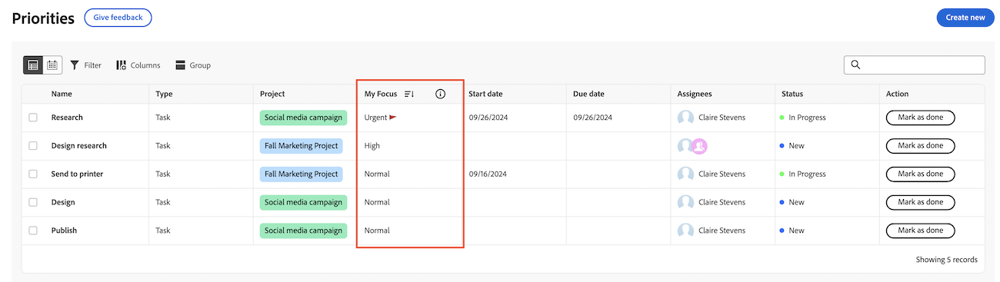

# Priorizar itens de trabalho importantes

Você pode usar a coluna Meu foco para priorizar seu trabalho. A coluna Meu foco é um valor pessoal e não afeta a prioridade definida na tarefa ou no problema.

## Priorize seu trabalho com a coluna Meu foco

{{step1-to-priorities}}

1. Localize o item de trabalho no qual você deseja se concentrar.
1. Na coluna **Meu foco**, escolha um dos seguintes níveis de foco:

   | Foco | Descrição |
   |-----------|-------------|
   | **Urgente** | Urgente é para itens de trabalho que exigem atenção imediata. Os itens de trabalho urgentes devem ter prioridade sobre todos os outros e ser abordados o mais rapidamente possível. |
   | **Alta** | Alto é para itens de trabalho importantes que você planeja resolver após a conclusão do trabalho urgente. |
   | **Normal** | O normal é para itens de trabalho de rotina nos quais você trabalhará depois que itens Urgentes e de Alta prioridade forem concluídos. Esse é o padrão para tarefas e problemas. |
   | **Baixo** | Baixa é para itens de trabalho que não precisam de atenção imediata e podem ser adiados até que todos os itens de trabalho de prioridade mais alta sejam concluídos. |

   

   >[!TIP]
   >
   >Você pode Filtrar e Agrupar seu trabalho por níveis de foco.
