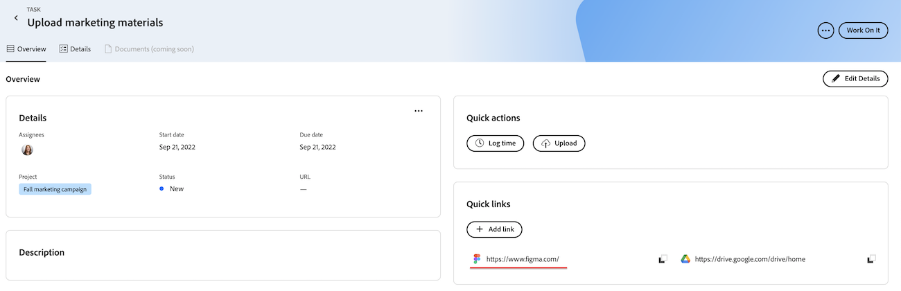
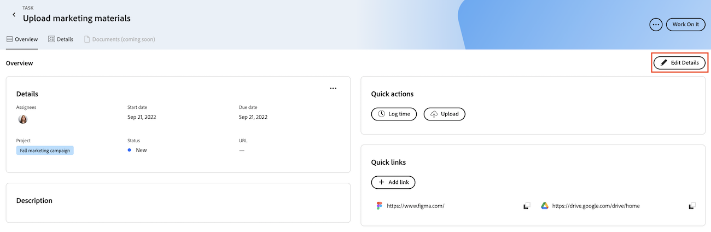

# Adicionar e gerenciar links rápidos em Prioridades

Você pode salvar links que visita com frequência em uma tarefa ou problema e acessar na guia Visão geral em Prioridades.

Prioridades exibe os itens de trabalho atribuídos a você. Não é possível ver os itens de trabalho atribuídos à sua equipe.

## Requisitos de acesso

+++ Expanda para visualizar os requisitos de acesso da funcionalidade neste artigo.

<table style="table-layout:auto"> 
 <col> 
 </col> 
 <col> 
 </col> 
 <tbody> 
  <tr> 
   <td role="rowheader"><strong>Pacote do Adobe Workfront</strong></td> 
   <td> 
Qualquer
 </td> 
  </tr> 
  <tr> 
   <td role="rowheader"><strong>Licença do Adobe Workfront</strong></td> 
   <td> 
   
Solicitação ou superior para problemas; Trabalho ou superior para tarefas

   
Colaborador ou problemas maiores; Leve ou superior para tarefas
 
   </td> 
  </tr> 
  <tr> 
   <td role="rowheader"><strong>Configurações de nível de acesso</strong></td> 
   <td> 
Acesso de Visualização ou Edição para o objeto no qual a atualização está
</td> 
  </tr> 
  <tr> 
   <td role="rowheader"><strong>Permissões de objeto</strong></td> 
   <td> 
Visualizar acesso ao objeto
</td> 
  </tr> 
 </tbody> 
</table>

Para obter mais informações, consulte [Requisitos de acesso na documentação do Workfront](/help/quicksilver/administration-and-setup/add-users/access-levels-and-object-permissions/access-level-requirements-in-documentation.md).

+++

## Adicionar links rápidos em Prioridades

{{step1-to-priorities}}

1. Clique em um nome de item de trabalho para abrir a página **Visão geral**.
1. Na seção **Links rápidos**, clique em **Adicionar link**.
1. Cole a URL na caixa **Adicionar link**.
1. Clique em **Salvar**.
   

## Copiar um link rápido para a área de transferência

{{step1-to-priorities}}

1. Clique em um nome de item de trabalho para abrir a página **Visão geral**.
1. Na seção **Links rápidos**, localize o link que deseja copiar.
1. Clique no ícone **Copiar**.
   

## Abrir um link rápido

{{step1-to-priorities}}

1. Clique em um nome de item de trabalho para abrir a página **Visão geral**.
1. Na seção **Links rápidos**, localize o link que deseja abrir.
1. Clique no link. O link é aberto em uma nova guia.
   

## Excluir Links Rápidos

{{step1-to-priorities}}

1. Clique em um nome de item de trabalho para abrir a página **Visão geral**.
1. Clique em **Editar detalhes** no canto superior direito da tela.
   
1. Localize o link que deseja remover e clique no ícone **Excluir** .
