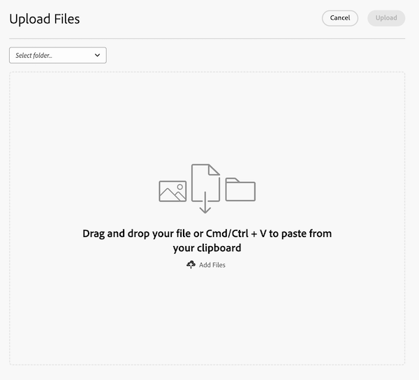

# Fazer upload de arquivos em Prioridades

Você pode fazer upload de arquivos da lista de trabalho Prioridades ou de itens de trabalho individuais. Os arquivos carregados de Prioridades são exibidos na guia Documentos do item de trabalho.

## Requisitos de acesso

+++ Expanda para visualizar os requisitos de acesso para a funcionalidade neste artigo.

Você deve ter o seguinte:

<table style="table-layout:auto"> 
 <col> 
 <col> 
 <tbody> 
  <tr> 
   <td role="rowheader">plano do Adobe Workfront*</td> 
   <td> 
 Qualquer
 </td> 
  </tr> 
  <tr> 
   <td role="rowheader">Licenças da Adobe Workfront*</td> 
   <td> 
   
Novo: Colaborador ou superior
 
   
Atual: solicitação ou superior
 </td> 
  </tr> 
  <tr> 
   <td role="rowheader">Configurações de nível de acesso*</td> 
   <td> 
Editar acesso a documentos
 
Observação: se você ainda não tiver acesso, pergunte ao administrador do Workfront se ele definiu restrições adicionais em seu nível de acesso. Para obter informações sobre como um administrador do Workfront pode modificar seu nível de acesso, consulte <a href="../../administration-and-setup/add-users/configure-and-grant-access/create-modify-access-levels.md" class="MCXref xref">Criar ou modificar níveis de acesso personalizados</a>.
 </td> 
  </tr> 
 </tbody> 
</table>

Para descobrir seu plano, tipo de licença ou acesso, entre em contato com o administrador do Workfront.

+++

## Fazer upload de um arquivo da lista de trabalho

{{step1-to-priorities}}

1. Passe o cursor do mouse sobre o nome e clique em **Carregar**.
   
   <!--new screen for prod -->
1. (Opcional) Selecione uma pasta.
1. Arraste e solte o arquivo ou pressione Cmd/Ctrl + V para colar da área de transferência
ou
Clique em **Adicionar arquivos** para procurar arquivos ou importar arquivos de um provedor de Document Cloud.
   
1. (Opcional) Adicione um comentário.
1. (Opcional) Adicione mais arquivos.

   >[!NOTE]
   >
   >Arquivos adicionais são carregados como documentos separados.
1. Clique em **Carregar**.
   

## Fazer upload de um arquivo em um item de trabalho

{{step1-to-priorities}}

1. Clique no nome de um item de trabalho para abrir a página Visão geral.
1. Na seção **Ações rápidas**, clique em **Carregar**.
1. (Opcional) Selecione uma pasta.
1. Arraste e solte o arquivo ou pressione Cmd/Ctrl + V para colar da área de transferência
ou
Clique em **Adicionar arquivos** para procurar arquivos ou importar arquivos de um provedor de Document Cloud.
   
1. (Opcional) Adicione um comentário.
1. (Opcional) Adicione mais arquivos.

   >[!NOTE]
   >
   >Arquivos adicionais são carregados como documentos separados.
1. Clique em **Carregar**.
   
