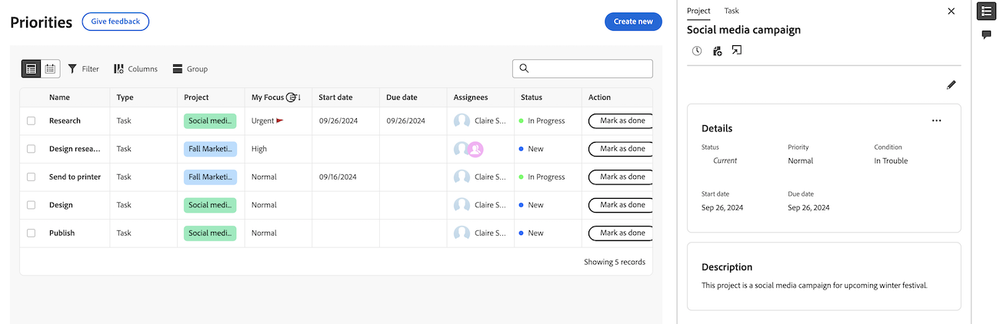

# Exibir detalhes do projeto e do item de trabalho em Prioridades

Você pode exibir detalhes do projeto, da tarefa e do problema na lista de trabalho de prioridades.

Prioridades exibe os itens de trabalho atribuídos a você. Não é possível ver os itens de trabalho atribuídos à sua equipe.

>[!IMPORTANT]
>
>Os projetos devem estar no status Atual ou em um status que seja igual a atual para que possam exibir os projetos, bem como suas tarefas e problemas secundários.

## Requisitos de acesso

+++ Expanda para visualizar os requisitos de acesso para a funcionalidade neste artigo.

<table style="table-layout:auto"> 
 <col> 
 </col> 
 <col> 
 </col> 
 <tbody> 
  <tr> 
   <td role="rowheader"><strong>Pacote do Adobe Workfront</strong></td> 
   <td> 
Qualquer
 </td> 
  </tr> 
  <tr> 
   <td role="rowheader"><strong>Licença do Adobe Workfront</strong></td> 
   <td> 
   
Revisor ou superior

   
Leve ou superior
 
   </td> 
  </tr> 
  <tr> 
   <td role="rowheader"><strong>Configurações de nível de acesso</strong></td> 
   <td> 
Acesso de Visualização ou Edição para o objeto no qual a atualização está
</td> 
  </tr> 
  <tr> 
   <td role="rowheader"><strong>Permissões de objeto</strong></td> 
   <td> 
Visualizar acesso ao objeto
</td> 
  </tr> 
 </tbody> 
</table>

Para obter mais informações, consulte [Requisitos de acesso na documentação do Workfront](/help/quicksilver/administration-and-setup/add-users/access-levels-and-object-permissions/access-level-requirements-in-documentation.md).

+++

## Exibir detalhes no painel lateral da lista de trabalho

### Exibir detalhes do projeto

{{step1-to-priorities}}

1. Na lista de trabalho, passe o mouse sobre o nome do item de trabalho e clique no ícone **Resumo** .
1. Clique em **Projeto** na parte superior do painel Resumo. Aqui você pode
   * Exibir e editar detalhes e descrição do projeto
   * Exibir e adicionar comentários ao projeto
   * Registrar de tempo
   * Adicionar um arquivo
   * Ir diretamente para o projeto

   

### Exibir detalhes da tarefa

{{step1-to-priorities}}

1. Na lista de trabalho, passe o mouse sobre o nome do trabalho e clique no ícone **Resumo** .
1. Tarefa é selecionada por padrão. Aqui você pode
   * Exibir e editar detalhes e descrição do projeto e da tarefa
   * Exibir e adicionar comentários ao projeto
   * Exibir e adicionar documentos
   * Criar uma prova
   * Registrar de tempo
   * Adicionar um arquivo
   * Adicionar links rápidos

   

### Exibir detalhes do problema

{{step1-to-priorities}}

1. Na lista de trabalho, passe o mouse sobre o nome do trabalho e clique no ícone **Resumo** .

1. Problema é selecionado por padrão. Aqui você pode:
   * Exibir e editar detalhes e descrição do projeto e do problema
   * Exibir e adicionar comentários ao projeto
   * Exibir e adicionar documentos
   * Criar uma prova
      * Registrar de tempo
      * Adicionar um arquivo
      * Adicionar links rápidos

   

## Exibir detalhes na página Detalhes

Você pode exibir atualizações em tempo real na página Detalhes de uma tarefa ou problema. Você também pode ver se outros estão visualizando a página ao mesmo tempo que você com indicadores de presença em tempo real.

### Exibir detalhes do item de trabalho

{{step1-to-priorities}}

1. Na lista de trabalho, clique no nome do item de trabalho. Na página Detalhes, é possível

* Exibir e editar detalhes e descrição do projeto
* Exibir e adicionar comentários ao projeto
* Exibir e adicionar documentos
* Criar uma prova
* Registrar de tempo
* Adicionar um arquivo
* Adicionar links rápidos

<!-- screenshot for prod-->
