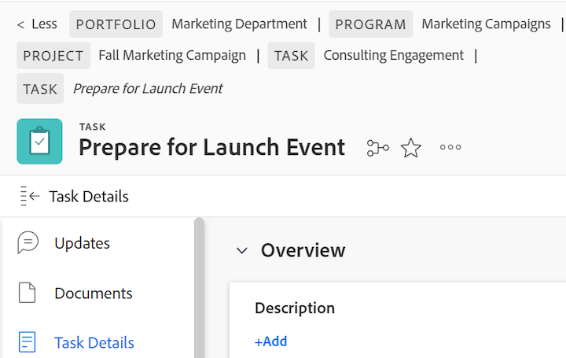

# Visão geral da navegação estrutural

As navegações estruturais exibem a hierarquia de navegação completa para todos os tipos de objeto. Cada objeto no caminho de navegação estrutural tem um rótulo que exibe o tipo de objeto. A página que você está atualmente exibe no cabeçalho da página e no final do caminho de navegação estrutural em itálico. No exemplo abaixo, esta é a tarefa &quot;[!UICONTROL Compartilhar com a Equipe da Marca]&quot;.

 recolhida

Quando há muitos objetos no caminho de navegação estrutural ou a largura da tela proíbe que a hierarquia de navegação completa seja exibida, o caminho recolhe algumas navegações estruturais e agrupa esses objetos no início do caminho de navegação estrutural. O projeto e a página do objeto atual estão sempre visíveis no caminho da navegação estrutural.

Por exemplo, &quot;mais 3&quot; na imagem acima indica que 3 objetos não são exibidos. Esses itens podem estar localizados acima do nível do projeto ou entre o projeto e a página atual.

Clicar em &quot;[!UICONTROL mais]&quot; permite expandir a hierarquia completa. Você pode clicar em &quot;[!UICONTROL Menos]&quot; para recolher o caminho de navegação estrutural novamente.

Você também pode usar as seguintes teclas para navegar pela navegação estrutural:

<table style="table-layout:auto"> 
 <col> 
 <col> 
 <tbody> 
  <tr> 
   <td role="rowheader"><strong>Guia</strong> </td> 
   <td> 
Navegar para cada item na navegação estrutural
 </td> 
  </tr> 
  <tr> 
   <td role="rowheader"><strong>Inserir</strong> </td> 
   <td> 
Expandir um caminho de navegação estrutural recolhido, recolher um caminho de navegação estrutural expandido e abrir uma nova página quando estiver em um link de objeto
 </td> 
  </tr> 
 </tbody> 
</table>

<!--drafted: this is no longer possible, since we removed Campaigns, but it might come back as part of Maestro: 

## Multi-object breadcrumbs

>[!NOTE]
>
>The information in this article is available only in the Preview environment when you participate in the [!UICONTROL Campaigns] beta program. The functionality described here might not be fully available yet. For more information about current available features and how to enroll, see [Campaigns beta].

Some objects can belong to multiple parent objects. For example, a project can belong to multiple campaigns. In this case, all the campaigns that the project belongs to display in the breadcrumb.

The multi-object listing in the breadcrumb (for example, the campaigns) displays the number of parent objects which expands into a list to display all the campaigns that the project is associated with. For more information, see [Add objects to a campaign](../../manage-work/campaigns/add-objects-to-a-campaign.md).

-->

## Acessar um objeto principal pela navegação estrutural

Para obter informações sobre objetos pai em [!DNL Workfront], consulte [Entender objetos em [!DNL Adobe Workfront]](../../workfront-basics/navigate-workfront/workfront-navigation/understand-objects.md).

1. (Condicional) Se você não vir o objeto para o qual deseja navegar em um caminho de navegação estrutural recolhido, clique em **[!UICONTROL mais]** e localize o objeto.

   >[!NOTE]
   >
   >Se você não tiver permissão para um objeto, ele não estará visível na navegação estrutural.

1. Clique em qualquer objeto no caminho da navegação estrutural para acessá-lo.

   A página do objeto é aberta.
