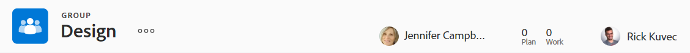

# Visão geral dos cabeçalhos de objeto

Você pode visualizar informações rapidamente sobre objetos em [!DNL Adobe Workfront] ao revisar seu cabeçalho.

Além do nome do objeto, o cabeçalho pode incluir o proprietário do objeto, o status ou o percentual concluído.

[!DNL Workfront] dá prioridade ao nome do objeto, alocando o máximo de espaço possível para ele no cabeçalho. Quando um nome de objeto é muito longo, ele fica truncado. Para exibir o nome completo de um objeto, você pode passar o mouse sobre ele.

## Acessar o cabeçalho de um objeto

O acesso ao cabeçalho de um objeto em [!DNL Workfront] é idêntico para todos os objetos que o possuem.

Por exemplo, para acessar o cabeçalho de um projeto:

1. Ir para um projeto.\
   O cabeçalho é exibido na parte superior da página e contém o nome do projeto.

   

## Visão geral do cabeçalho da [!UICONTROL Página inicial]

Os seguintes cabeçalhos estão disponíveis na Página inicial:

* Tarefa: Para obter mais informações sobre como usar este cabeçalho, consulte a [Visão geral do cabeçalho da tarefa](#task-header-overview) neste artigo.
* Problema: Para obter mais informações sobre como usar este cabeçalho, consulte a [Visão geral do cabeçalho de Problemas](#issue-header-overview) neste artigo.

## Cabeçalhos personalizáveis

O [!DNL Workfront] ou o administrador de grupo pode personalizar o cabeçalho de projetos, tarefas e problemas usando um modelo de layout.

Este artigo descreve os cabeçalhos padrão para todos os objetos, incluindo projetos, tarefas e problemas.

Para obter informações sobre como personalizar informações no cabeçalho de um objeto, consulte [Personalizar cabeçalhos de objetos usando um modelo de layout](../../administration-and-setup/customize-workfront/use-layout-templates/customize-object-headers.md).

## Visão geral do cabeçalho do projeto

O cabeçalho do projeto exibe as seguintes informações, por padrão:

<table style="table-layout:auto"> 
 <col> 
 <col> 
 <thead> 
  <tr> 
   <th>Informações do cabeçalho</th> 
   <th>Notas</th> 
  </tr> 
 </thead> 
 <tbody> 
  <tr> 
   <td role="rowheader">Navegação estrutural com objetos principais</td> 
   <td>Se o projeto estiver associado a um programa ou portfólio, ele será exibido na navegação estrutural no canto superior esquerdo do cabeçalho. Clicar no nome do pai abre esse objeto pai.</td> 
  </tr> 
  <tr data-mc-conditions=""> 
   <td role="rowheader">Ícone de objeto </td> 
   <td> 
O ícone do [!UICONTROL Project] violeta  é exibido à esquerda do nome do projeto.
 </td> 
  </tr> 
  <tr> 
   <td role="rowheader">Nome do projeto</td> 
   <td>Você pode editar o nome do projeto no cabeçalho.</td> 
  </tr> 
  <tr> 
   <td role="rowheader">Nome do tipo de objeto</td> 
   <td> 
O texto "[!UICONTROL PROJECT]" é exibido acima do nome do projeto no cabeçalho.
 </td> 
  </tr> 
  <tr> 
   <td role="rowheader">A área de ações da tarefa</td> 
   <td> 
Ao lado do nome do projeto, a área ações é exibida.
 
  
  </td> 
  </tr> 
  <tr> 
   <td role="rowheader">[!UICONTROL Porcentagem Concluída]</td> 
   <td>Não é possível editar a porcentagem concluída do projeto no cabeçalho.</td> 
  </tr> 
  <tr> 
   <td role="rowheader">[!UICONTROL Proprietário do Projeto]</td> 
   <td> 
Você pode editar o [!UICONTROL Proprietário do projeto] no cabeçalho.
 </td> 
  </tr> 
  <tr> 
   <td role="rowheader">[!UICONTROL Data de Término Planejada] </td> 
   <td> 
Você pode editar a [!UICONTROL Data de conclusão planejada] e a hora no cabeçalho se o projeto estiver agendado a partir da [!UICONTROL Data de conclusão]. Se o projeto estiver agendado a partir da [!UICONTROL Data de Início], essas informações serão atualizadas a partir das tarefas no projeto.
 </td> 
  </tr> 
  <tr> 
   <td role="rowheader">[!UICONTROL Condição] </td> 
   <td> 
Ao definir o [!UICONTROL Condição Tipo] do projeto para Manual, você pode atualizar o projeto [!UICONTROL Condição] no cabeçalho.
</td> 
  </tr> 
  <tr> 
   <td role="rowheader">[!UICONTROL Status]</td> 
   <td>Você pode editar o projeto [!UICONTROL Status] no cabeçalho.</td> 
  </tr> 
  <tr> 
   <td role="rowheader">A área [!UICONTROL Approvals]</td> 
   <td> 
Quando você for um dos aprovadores, use os seguintes ícones para gerenciar as aprovações do projeto:
 
  </img> [!UICONTROL Aprovar]
 
  </img> [!UICONTROL Rejeitar]
 
  </img> [!UICONTROL Retroceder]
 
Se você não for um aprovador, clique no ícone [!UICONTROL Mais]  para exibir informações sobre a etapa de aprovação atual.
 
Para saber mais sobre aprovações, consulte <a href="../../review-and-approve-work/manage-approvals/approval-process-in-workfront.md" class="MCXref xref">Visão geral do processo de aprovação</a>.
 </td> 
  </tr> 
 </tbody> 
</table>

## Visão geral do cabeçalho da tarefa

O cabeçalho da tarefa inclui as seguintes informações, por padrão:

<table style="table-layout:auto"> 
 <col> 
 <col> 
 <thead> 
  <tr> 
   <th>Informações do cabeçalho</th> 
   <th>Notas</th> 
  </tr> 
 </thead> 
 <tbody> 
  <tr> 
   <td role="rowheader">Navegação estrutural com objetos principais</td> 
   <td> 
Os objetos principais da tarefa são exibidos na navegação estrutural. Clicar no nome do pai abre esse objeto pai.
 
Para obter mais informações, consulte <a href="../../workfront-basics/the-new-workfront-experience/breadcrumb-overview.md" class="MCXref xref">Visão geral da navegação estrutural</a>.
 </td> 
  </tr> 
  <tr data-mc-conditions=""> 
   <td role="rowheader">Ícone de objeto </td> 
   <td> 
O ícone verde [!UICONTROL Tarefa]  é exibido à esquerda do nome da tarefa.
 </td> 
  </tr> 
  <tr> 
   <td role="rowheader">Nome da tarefa</td> 
   <td>É possível editar o nome da tarefa no cabeçalho.</td> 
  </tr> 
  <tr> 
   <td role="rowheader">Nome do tipo de objeto</td> 
   <td> 
O texto "[!UICONTROL TAREFA]" é exibido acima do nome da tarefa no cabeçalho.
 </td> 
  </tr> 
  <tr> 
   <td role="rowheader">A área de ações da tarefa</td> 
   <td> 
Ao lado do nome da tarefa, a área [!UICONTROL ações] é exibida.
 
  
 
Se o ícone Dependência for exibido, você poderá clicar no ícone para ver quaisquer predecessores ou sucessores da tarefa.
 </td> 
  </tr> 
  <tr> 
   <td role="rowheader">[!UICONTROL Porcentagem Concluída]</td> 
   <td>Você pode editar o percentual concluído da tarefa no cabeçalho.</td> 
  </tr> 
  <tr> 
   <td role="rowheader">[!UICONTROL Atribuições]</td> 
   <td>É possível editar os atribuídos de uma tarefa no cabeçalho.</td> 
  </tr> 
  <tr> 
   <td role="rowheader"> 
Botão [!UICONTROL Trabalhar na Tarefa], [!UICONTROL Concluído] ou [!UICONTROL Iniciar Tarefa]
 </td> 
   <td> 
Se a tarefa for atribuída a você, clique no botão [!UICONTROL Trabalhar nela] ou [!UICONTROL Iniciar Tarefa] para indicar que você está trabalhando na tarefa ou no botão [!UICONTROL Concluído] para indicar que você concluiu a tarefa.
 
Para obter informações sobre a substituição do botão [!UICONTROL Trabalhar Nele] por um botão [!UICONTROL Iniciar Tarefa], consulte <a href="../../people-teams-and-groups/create-and-manage-teams/work-on-it-button-to-start-button.md" class="MCXref xref">Substituir o botão [!UICONTROL Trabalhar Nele] por um botão [!UICONTROL Iniciar]</a>.
 </td> 
  </tr> 
  <tr> 
   <td role="rowheader">[!UICONTROL Data de Término Planejada]</td> 
   <td> 
Você pode editar a tarefa [!UICONTROL Data de Término Planejada] e a hora no cabeçalho.
 
Dica: observe que a [!UICONTROL Data de Confirmação] não está visível no cabeçalho. Você pode exibi-lo na página [!UICONTROL Detalhes].
 </td> 
  </tr> 
  <tr> 
   <td role="rowheader">[!UICONTROL Status]</td> 
   <td>Você pode editar a tarefa [!UICONTROL Status] no cabeçalho.</td> 
  </tr> 
  <tr> 
   <td role="rowheader">A área [!UICONTROL Approvals]</td> 
   <td> 
Quando você for um dos aprovadores, use os seguintes ícones para gerenciar as aprovações da tarefa:
 
  </img> [!UICONTROL Aprovar]
 
  </img> [!UICONTROL Rejeitar]
 
  </img> [!UICONTROL Retroceder]
 
Se você não for um aprovador, clique no ícone [!UICONTROL Mais]  para exibir informações sobre a etapa de aprovação atual.
 
Para saber mais sobre aprovações, consulte <a href="../../review-and-approve-work/manage-approvals/approval-process-in-workfront.md" class="MCXref xref">Visão geral do processo de aprovação</a>.
 </td> 
  </tr> 
 </tbody> 
</table>

## Visão geral do cabeçalho do problema

O cabeçalho do problema inclui as seguintes informações, por padrão:

<table style="table-layout:auto"> 
 <col> 
 <col> 
 <thead> 
  <tr> 
   <th>Informações do cabeçalho</th> 
   <th>Notas</th> 
  </tr> 
 </thead> 
 <tbody> 
  <tr> 
   <td role="rowheader">Navegação estrutural com objetos principais</td> 
   <td> 
Os objetos principais do problema são exibidos na navegação estrutural. Clicar no nome do pai abre esse objeto pai.
 
Para obter mais informações, consulte <a href="../../workfront-basics/the-new-workfront-experience/breadcrumb-overview.md" class="MCXref xref">Visão geral da navegação estrutural</a>.
 </td> 
  </tr> 
  <tr> 
   <td role="rowheader">Ícone de objeto </td> 
   <td> 
O ícone rosa [!UICONTROL Issue]  é exibido à esquerda do nome do problema.
 </td> 
  </tr> 
  <tr> 
   <td role="rowheader">Nome do problema</td> 
   <td>Você pode editar o nome do problema no cabeçalho.</td> 
  </tr> 
  <tr> 
   <td role="rowheader">Nome do tipo de objeto</td> 
   <td> 
O texto "[!UICONTROL PROBLEMA]" é exibido acima do nome do problema no cabeçalho.
 </td> 
  </tr> 
  <tr> 
   <td role="rowheader">A área de ações da questão</td> 
   <td> 
Ao lado do nome do problema, a área [!UICONTROL ações] é exibida.
 
  
 
Se o ícone [!UICONTROL Dependência] for exibido, você poderá clicar no ícone para ver quaisquer predecessores ou sucessores do problema.
  </td> 
  </tr> 
  <tr> 
   <td role="rowheader">[!UICONTROL Porcentagem Concluída]</td> 
   <td> 
Você pode editar o percentual concluído do problema no cabeçalho.
 </td> 
  </tr> 
  <tr> 
   <td role="rowheader">[!UICONTROL Atribuições]</td> 
   <td>Você pode editar os atribuídos de uma ocorrência no cabeçalho.</td> 
  </tr> 
  <tr> 
   <td role="rowheader">[!UICONTROL Trabalhar nisso], [!UICONTROL Concluído], ou botão [!UICONTROL Iniciar Problema]</td> 
   <td>Se o problema for atribuído a você, clique no botão [!UICONTROL Trabalhar no Problema] ou [!UICONTROL Iniciar Problema] para indicar que você está trabalhando no problema agora ou no botão [!UICONTROL Concluído] para indicar que você concluiu o problema.Para obter informações sobre a substituição do botão [!UICONTROL Trabalhar Nele] por um botão [!UICONTROL Iniciar Tarefa], consulte <a href="../../people-teams-and-groups/create-and-manage-teams/work-on-it-button-to-start-button.md" class="MCXref xref">Substituir o botão [!UICONTROL Trabalhar Nele] por um botão [!UICONTROL Iniciar]</a>.</td> 
  </tr> 
  <tr> 
   <td role="rowheader">[!UICONTROL Data de Término Planejada]</td> 
   <td> 
Você pode editar o problema [!UICONTROL Data de Término Planejada] e hora no cabeçalho.
 
Dica: observe que a [!UICONTROL Data de Confirmação] não está visível no cabeçalho. Você pode exibi-lo na página [!UICONTROL Detalhes].
 </td> 
  </tr> 
  <tr> 
   <td role="rowheader">[!UICONTROL Status]</td> 
   <td>Você pode editar o problema [!UICONTROL Status] no cabeçalho.</td> 
  </tr> 
  <tr> 
   <td role="rowheader">A área [!UICONTROL Approvals]</td> 
   <td> 
Quando você for um dos aprovadores, use os seguintes ícones para gerenciar as aprovações da ocorrência:
 
  [!UICONTROL Aprovar]
 
  [!UICONTROL Rejeitar]
 
  [!UICONTROL Retroceder]
 
Se você não for um aprovador, clique no ícone [!UICONTROL Mais]  para exibir informações sobre a etapa de aprovação atual.
 
Para saber mais sobre aprovações, consulte <a href="../../review-and-approve-work/manage-approvals/approval-process-in-workfront.md" class="MCXref xref">Visão geral do processo de aprovação</a>.
 </td> 
  </tr> 
 </tbody> 
</table>

## Visão geral do cabeçalho do programa

O cabeçalho do programa exibe as seguintes informações:

<table style="table-layout:auto"> 
 <col> 
 <col> 
 <thead> 
  <tr> 
   <th>Informações do cabeçalho</th> 
   <th>Notas</th> 
  </tr> 
 </thead> 
 <tbody> 
  <tr> 
   <td role="rowheader">Navegação estrutural com o nome do Portfolio</td> 
   <td> 
Você pode acessar o [!UICONTROL Portfolio] a partir do cabeçalho do [!UICONTROL Program]. Clicar no nome do pai abre esse objeto pai.
 
Para obter mais informações, consulte <a href="../../workfront-basics/the-new-workfront-experience/breadcrumb-overview.md" class="MCXref xref">Visão geral da navegação estrutural</a>.
 </td> 
  </tr> 
  <tr> 
   <td role="rowheader">Ícone de objeto </td> 
   <td> 
O ícone laranja  do [!UICONTROL Program] é exibido à esquerda do nome do programa.
 </td> 
  </tr> 
  <tr> 
   <td role="rowheader">Nome do programa</td> 
   <td>É possível editar o nome do programa no cabeçalho.</td> 
  </tr> 
  <tr> 
   <td role="rowheader">Nome do tipo de objeto</td> 
   <td> 
Se o programa estiver marcado como [!UICONTROL Ativo], o texto "[!UICONTROL PROGRAMA]" será exibido acima do nome do programa no cabeçalho.
 </td> 
  </tr> 
  <tr> 
   <td role="rowheader">Status de ativação</td> 
   <td> 
Se o programa estiver desativado, o texto "[!UICONTROL PROGRAM DEACTIVATED]" será exibido acima do nome do programa no cabeçalho.
 </td> 
  </tr> 
  <tr> 
   <td role="rowheader">Domínio de ação do programa</td> 
   <td> 
Ao lado do nome do programa, a área [!UICONTROL ações] é exibida.
 
  
 </td> 
  </tr> 
  <tr> 
   <td role="rowheader">[!UICONTROL Porcentagem Concluída]</td> 
   <td> 
Não é possível editar a [!UICONTROL Porcentagem Concluída] do programa no cabeçalho. Essas informações são atualizadas a partir dos projetos no programa.
 
Dica: por padrão, a porcentagem concluída do programa é uma média dos valores de porcentagem concluída dos projetos em um [!UICONTROL Atual] ou [!UICONTROL Status Aprovado] que pertencem ao programa.
 </td> 
  </tr> 
  <tr> 
   <td role="rowheader">[!UICONTROL Gerenciador de Programas]</td> 
   <td> 
Você pode editar o [!UICONTROL Gerenciador de Programas] no cabeçalho. É o mesmo que [!UICONTROL Proprietário do Programa].
 </td> 
  </tr> 
  <tr> 
   <td role="rowheader">[!UICONTROL Data de Término Planejada]</td> 
   <td>Não é possível editar o programa [!UICONTROL Data de conclusão planejada] no cabeçalho. Essas informações são atualizadas a partir da [!UICONTROL Data de conclusão planejada] dos projetos no programa.</td> 
  </tr> 
  <tr> 
   <td role="rowheader">[!UICONTROL Condição de Projetos Ativos]</td> 
   <td>Este é um cálculo de qual porcentagem de projetos ativos no programa tem a [!UICONTROL Condição] definida como [!UICONTROL No Destino], [!UICONTROL Em Risco] ou [!UICONTROL Em Problema].</td> 
  </tr> 
 </tbody> 
</table>

## visão geral do cabeçalho de Portfolio {#portfolio-header-overview}

O cabeçalho do portfólio inclui as seguintes informações:

<table style="table-layout:auto"> 
 <col> 
 <col> 
 <thead> 
  <tr> 
   <th>Informações do cabeçalho</th> 
   <th>Notas</th> 
  </tr> 
 </thead> 
 <tbody> 
  <tr> 
   <td role="rowheader">Ícone de objeto </td> 
   <td> 
O ícone azul [!UICONTROL Portfolio] é exibido à esquerda do nome do portfólio.
 </td> 
  </tr> 
  <tr> 
   <td role="rowheader">Nome do portfólio</td> 
   <td>Você pode editar o nome do portfólio no cabeçalho.</td> 
  </tr> 
  <tr> 
   <td role="rowheader">Nome do tipo de objeto</td> 
   <td> 
Se o portfólio estiver marcado como ativo, o texto "[!UICONTROL PORTFOLIO]" será exibido acima do nome do portfólio no cabeçalho.
 </td> 
  </tr> 
  <tr> 
   <td role="rowheader">Status de ativação</td> 
   <td> 
Se o portfólio estiver desativado, o texto "[!UICONTROL PORTFOLIO DESATIVADO]" será exibido acima do nome do portfólio no cabeçalho.
 </td> 
  </tr> 
  <tr> 
   <td role="rowheader">A área [!UICONTROL actions] do portfólio</td> 
   <td> 
Ao lado do nome do portfólio, a área [!UICONTROL actions] é exibida.
 
  
</td> 
  </tr> 
  <tr> 
   <td role="rowheader">[!UICONTROL Gerenciador de Portfolio]</td> 
   <td>Você pode editar o [!UICONTROL Gerenciador de Portfolio] no cabeçalho. É o mesmo que [!UICONTROL Portfolio Owner].</td> 
  </tr> 
  <tr> 
   <td role="rowheader">[!UICONTROL No Prazo]</td> 
   <td>Este é um cálculo de qual porcentagem de projetos no portfólio está no momento no prazo.</td> 
  </tr> 
  <tr> 
   <td role="rowheader">[!UICONTROL Na Estimativa]</td> 
   <td>Este é um cálculo de qual porcentagem dos projetos no portfólio está atualmente no orçamento.</td> 
  </tr> 
  <tr> 
   <td role="rowheader">[!UICONTROL Alinhado]</td> 
   <td>Este é um cálculo de qual porcentagem dos projetos no portfólio está alinhada ao portfólio.</td> 
  </tr> 
  <tr> 
   <td role="rowheader">[!UICONTROL ROI]</td> 
   <td>Este é o cálculo do [!UICONTROL Retorno sobre o Investimento] para todos os projetos no portfólio.</td> 
  </tr> 
  <tr> 
   <td role="rowheader">[!UICONTROL Valor de Rede]</td> 
   <td>Este é o cálculo do [!UICONTROL Valor Líquido] para todos os projetos no portfólio.</td> 
  </tr> 
 </tbody> 
</table>

## Visão geral do cabeçalho do modelo {#template-header-overview}

O cabeçalho do modelo exibe as seguintes informações:

<table style="table-layout:auto"> 
 <col> 
 <col> 
 <thead> 
  <tr> 
   <th>Informações do cabeçalho</th> 
   <th>Notas</th> 
  </tr> 
 </thead> 
 <tbody> 
  <tr> 
   <td role="rowheader">Ícone de objeto </td> 
   <td> 
O ícone verde [!UICONTROL Modelo] é exibido à esquerda do nome do modelo.
 </td> 
  </tr> 
  <tr> 
   <td role="rowheader">Nome do modelo</td> 
   <td>É possível editar o nome do template no cabeçalho.</td> 
  </tr> 
  <tr> 
   <td role="rowheader">Nome do tipo de objeto</td> 
   <td> 
Se o modelo estiver marcado como ativo, o texto "[!UICONTROL TEMPLATE]" será exibido acima do nome do Modelo no cabeçalho.
 </td> 
  </tr> 
  <tr> 
   <td role="rowheader">Status de ativação</td> 
   <td> 
Se o modelo estiver desativado, o texto "[!UICONTROL TEMPLATE DEACTIVATED]" será exibido acima do nome do modelo no cabeçalho.
 </td> 
  </tr> 
  <tr> 
   <td role="rowheader">A área de ações do modelo</td> 
   <td> 
Ao lado do nome do modelo, a área de ações é exibida.
 
  
 </td> 
  </tr> 
  <tr> 
   <td role="rowheader">[!UICONTROL Proprietário do Modelo]</td> 
   <td>É possível editar o campo [!UICONTROL Proprietário do modelo] no cabeçalho.</td> 
  </tr> 
  <tr> 
   <td role="rowheader">[!UICONTROL Duração]</td> 
   <td>A duração do modelo. Não é possível editar esse campo no cabeçalho.</td> 
  </tr> 
 </tbody> 
</table>

## Visão geral do cabeçalho da Tarefa de modelo

O cabeçalho da tarefa de modelo exibe as seguintes informações:

<table style="table-layout:auto"> 
 <col> 
 <col> 
 <thead> 
  <tr> 
   <th>Informações do cabeçalho</th> 
   <th>Notas</th> 
  </tr> 
 </thead> 
 <tbody> 
  <tr> 
   <td role="rowheader">Navegação estrutural para objetos principais</td> 
   <td> 
Os objetos pai da tarefa de modelo são exibidos na navegação estrutural. Clicar no nome de um objeto pai abre esse objeto pai.
 
Para obter mais informações, consulte <a href="../../workfront-basics/the-new-workfront-experience/breadcrumb-overview.md" class="MCXref xref">Visão geral da navegação estrutural</a>.
 </td> 
  </tr> 
  <tr> 
   <td role="rowheader">Ícone de objeto </td> 
   <td> 
O ícone verde [!UICONTROL Tarefa] é exibido à esquerda do nome do modelo de tarefa.
 </td> 
  </tr> 
  <tr> 
   <td role="rowheader">Nome da tarefa de modelo</td> 
   <td>Você pode editar o nome do modelo de tarefa no cabeçalho.</td> 
  </tr> 
  <tr> 
   <td role="rowheader">Nome do tipo de objeto</td> 
   <td> 
O texto "[!UICONTROL MODELO DE TAREFA]" é exibido acima do nome da tarefa de modelo no cabeçalho.
 </td> 
  </tr> 
  <tr> 
   <td role="rowheader">A área de ações da tarefa de modelo</td> 
   <td> 
Ao lado do nome da tarefa de modelo, é exibida a área ações.
 
  
 </td> 
  </tr> 
  <tr> 
   <td role="rowheader">[!UICONTROL Atribuições]</td> 
   <td>Você pode editar as [!UICONTROL Atribuições] da tarefa de modelo no cabeçalho.</td> 
  </tr> 
  <tr> 
   <td role="rowheader">[!UICONTROL Dia de Término]</td> 
   <td>Este é o dia na duração do modelo em que a tarefa do modelo deve ser concluída.</td> 
  </tr> 
 </tbody> 
</table>

## Visão geral do cabeçalho do registro de cobrança

O cabeçalho do registro de faturamento exibe as seguintes informações:

<table style="table-layout:auto"> 
 <col> 
 <col> 
 <thead> 
  <tr> 
   <th>Informações do cabeçalho</th> 
   <th>Notas</th> 
  </tr> 
 </thead> 
 <tbody> 
  <tr> 
   <td role="rowheader">Navegação estrutural para objetos principais</td> 
   <td> 
Os objetos principais do registro de cobrança são exibidos na navegação estrutural. Clicar no nome de um objeto pai abre esse objeto pai.
 
Para obter mais informações, consulte <a href="../../workfront-basics/the-new-workfront-experience/breadcrumb-overview.md" class="MCXref xref">Visão geral da navegação estrutural</a>.
 </td> 
  </tr> 
  <tr> 
   <td role="rowheader">Ícone de objeto </td> 
   <td> 
O ícone azul [!UICONTROL Registro de Cobrança]  é exibido à esquerda do nome do registro de cobrança.
 </td> 
  </tr> 
  <tr> 
   <td role="rowheader">Nome do registro de cobrança</td> 
   <td>É possível editar o nome do registro de cobrança no cabeçalho.</td> 
  </tr> 
  <tr> 
   <td role="rowheader">Nome do tipo de objeto</td> 
   <td> 
O texto "[!UICONTROL REGISTRO DE COBRANÇA]" é exibido acima do nome do registro de cobrança no cabeçalho.
 </td> 
  </tr> 
  <tr> 
   <td role="rowheader">A área de ações do registro de cobrança</td> 
   <td> 
Ao lado do nome do registro de cobrança, o menu [!UICONTROL Mais]  é exibido, o que permite selecionar as seguintes opções:
 
    <ul> 
     <li> 
[!UICONTROL Editar]
 </li> 
     <li> 
 
 </li> 
    </ul> </td> 
  </tr> 
  <tr> 
   <td role="rowheader">[!UICONTROL Total de Registros de Cobrança]</td> 
   <td>Este é o valor total do registro de cobrança. Não é possível editar esse campo.</td> 
  </tr> 
  <tr> 
   <td role="rowheader">[!UICONTROL Data de Cobrança]</td> 
   <td>Esta é a data em que o registro de cobrança foi criado, a menos que tenha sido alterado manualmente quando o registro de cobrança foi criado. É possível editar a [!UICONTROL Data de cobrança] no cabeçalho.</td> 
  </tr> 
  <tr> 
   <td role="rowheader">[!UICONTROL Status]</td> 
   <td> 
Quando o registro de cobrança tem um status de [!UICONTROL Faturado], não é mais possível editá-lo.
 
Você pode editar o Status do registro de cobrança no cabeçalho.
 </td> 
  </tr> 
 </tbody> 
</table>

## Visão geral do cabeçalho do usuário

O cabeçalho do usuário exibe as seguintes informações:

<table style="table-layout:auto"> 
 <col> 
 <col> 
 <thead> 
  <tr> 
   <th>Informações do cabeçalho</th> 
   <th>Notas</th> 
  </tr> 
 </thead> 
 <tbody> 
  <tr> 
   <td role="rowheader">Imagem do perfil do usuário</td> 
   <td>Não é possível atualizar a imagem do perfil no cabeçalho.</td> 
  </tr> 
  <tr> 
   <td role="rowheader">Nome do usuário e cargo</td> 
   <td> 
 O título do usuário é exibido em todas as letras maiúsculas acima do nome. Não é possível editar o nome do usuário no cabeçalho.
 </td> 
  </tr> <!--
   <tr> 
    <td role="rowheader">Name of the object type</td> 
    <td> 
The name of the object type does not display.
 </td> 
   </tr>
  --> 
  <tr> 
   <td role="rowheader">Status de ativação</td> 
   <td> 
Se o usuário tiver sido desativado, todo o texto e a imagem do perfil no cabeçalho ficarão esmaecidos.
 </td> 
  </tr> 
  <tr> 
   <td role="rowheader">A área de ações do usuário</td> 
   <td> 
Ao lado do nome do usuário, a área de ações é exibida.
 
  
</td> 
  </tr> 
  <tr> 
   <td role="rowheader">Endereço de email</td> 
   <td>Não é possível editar o endereço de email no cabeçalho. Normalmente, esse também é o nome de usuário.</td> 
  </tr> 
  <tr> 
   <td role="rowheader">Telefone</td> 
   <td>Não é possível editar o número de telefone no cabeçalho.</td> 
  </tr> 
  <tr> 
   <td role="rowheader">Equipes</td> 
   <td> 
Você pode exibir as equipes às quais o usuário pertence. Passe o mouse sobre um avatar da equipe para exibir o nome da equipe. Não é possível editar as equipes no cabeçalho.
 </td> 
  </tr> 
 </tbody> 
</table>

## Visão geral do cabeçalho da equipe

O cabeçalho do grupo mostra as seguintes informações:

<table style="table-layout:auto"> 
 <col> 
 <col> 
 <thead> 
  <tr> 
   <th>Informações do cabeçalho</th> 
   <th>Notas</th> 
  </tr> 
 </thead> 
 <tbody> 
  <tr> 
   <td role="rowheader">Ícone de objeto </td> 
   <td> 
O ícone roxo [!UICONTROL Team]  é exibido à esquerda do nome da equipe.
 </td> 
  </tr> 
  <tr> 
   <td role="rowheader">Nome da equipe</td> 
   <td>Você pode editar o nome da equipe no cabeçalho.</td> 
  </tr> 
  <tr> 
   <td role="rowheader">Nome do tipo de objeto</td> 
   <td> 
O texto "[!UICONTROL EQUIPE]" é exibido acima do nome da equipe no cabeçalho.
 </td> 
  </tr> 
  <tr> 
   <td role="rowheader">A área de ações da equipe</td> 
   <td> 
Ao lado do nome do grupo, aparece a área [!UICONTROL ações].
 
  
</td> 
  </tr> 
  <tr> 
   <td role="rowheader">Imagens do perfil do membro da equipe</td> 
   <td>As imagens de perfil dos membros da equipe. Passe o mouse sobre uma imagem para exibir o nome do usuário.</td> 
  </tr> 
  <tr> 
   <td role="rowheader">Descrição</td> 
   <td>Esta é uma breve descrição sobre os membros da equipe. Não é possível editar a descrição da equipe no cabeçalho.</td> 
  </tr> 
 </tbody> 
</table>

## Visão geral do cabeçalho de iteração

O cabeçalho da iteração exibe as seguintes informações:

<table style="table-layout:auto"> 
 <col> 
 <col> 
 <thead> 
  <tr> 
   <th>Informações do cabeçalho</th> 
   <th>Notas</th> 
  </tr> 
 </thead> 
 <tbody> 
  <tr> 
   <td role="rowheader">Ícone de objeto </td> 
   <td> 
O ícone laranja [!UICONTROL Iteration]  é exibido à esquerda do nome da iteração.
 </td> 
  </tr> 
  <tr> 
   <td role="rowheader">Nome da iteração</td> 
   <td>É possível editar o nome da iteração no cabeçalho.</td> 
  </tr> 
  <tr> 
   <td role="rowheader">Nome do tipo de objeto</td> 
   <td> 
O texto "[!UICONTROL ITERATION]" é exibido acima do nome da iteração no cabeçalho.
 </td> 
  </tr> 
  <tr> 
   <td role="rowheader">A área de ações da iteração</td> 
   <td> 
No canto superior direito do cabeçalho, a área ações é exibida.
 
  
</td> 
  </tr> 
  <tr> 
   <td role="rowheader">Proprietário</td> 
   <td>Este é o [!UICONTROL Proprietário] da iteração. Não é possível editar o [!UICONTROL Proprietário] no cabeçalho.</td> 
  </tr> 
  <tr> 
   <td role="rowheader">[!UICONTROL Linha do Tempo]</td> 
   <td>A [!UICONTROL Linha do Tempo] mostra as datas de início e término da iteração. Não é possível editar a [!UICONTROL Linha do Tempo] no cabeçalho.</td> 
  </tr> 
  <tr> 
   <td role="rowheader">[!UICONTROL Equipe]</td> 
   <td>Não é possível editar a equipe da iteração no cabeçalho. Ao clicar no nome da equipe, você é direcionado para a página da equipe.</td> 
  </tr> 
 </tbody> 
</table>

## Visão geral do cabeçalho do grupo

O cabeçalho do grupo exibe as seguintes informações:

<table style="table-layout:auto"> 
 <col> 
 <col> 
 <thead> 
  <tr> 
   <th>Informações do cabeçalho</th> 
   <th>Notas</th> 
  </tr> 
 </thead> 
 <tbody> 
  <tr> 
   <td role="rowheader">Ícone de objeto </td> 
   <td> 
O ícone laranja  do [!UICONTROL Group] é exibido à esquerda do nome do grupo.
 </td> 
  </tr> 
  <tr> 
   <td role="rowheader">Nome do grupo</td> 
   <td>Você pode editar o nome do grupo no cabeçalho.</td> 
  </tr> 
  <tr> 
   <td role="rowheader">Nome do tipo de objeto</td> 
   <td> 
O texto "[!UICONTROL GROUP]" é exibido acima do nome do grupo no cabeçalho.
 </td> 
  </tr> 
  <tr> 
   <td role="rowheader">A área [!UICONTROL actions] do grupo</td> 
   <td> 
Ao lado do nome do grupo, é exibido o menu [!UICONTROL Mais] , que permite selecionar as seguintes opções:
 
    <ul> 
     <li> 
[!UICONTROL Editar]
 </li> 
     <li> 
[!UICONTROL Copiar]
 </li> 
     <li> 
[!UICONTROL Excluir]
 </li> 
    </ul> </td> 
  </tr> 
  <tr> 
   <td role="rowheader">[!UICONTROL Líder de negócios]</td> 
   <td>Você pode editar o [!UICONTROL Líder de negócios] no cabeçalho.</td> 
  </tr> 
  <tr> 
   <td role="rowheader">[!UICONTROL Licenças em uso] </td> 
   <td> 
A caixa [!UICONTROL Licenças em uso] exibe o número de usuários de licença do [!UICONTROL Plano] e do [!UICONTROL Trabalho] no grupo e seus subgrupos. Você pode clicar nos números para ver essas informações para todos os 5 tipos de licença.
 
Para obter mais informações, consulte <a href="../../administration-and-setup/manage-groups/create-and-manage-groups/view-number-licenses-allocated-used-group.md" class="MCXref xref">Exibir o número de licenças alocadas e usadas em um grupo na nova experiência [!DNL Adobe Workfront]</a>.
 </td> 
  </tr> 
  <tr> 
   <td role="rowheader">[!UICONTROL Administradores de Grupos]</td> 
   <td>Você pode editar os Administradores de grupo no cabeçalho.</td> 
  </tr> 
 </tbody> 
</table>

## Visão geral do cabeçalho do documento

O cabeçalho do documento exibe as seguintes informações:

<table style="table-layout:auto"> 
 <col> 
 <col> 
 <thead> 
  <tr> 
   <th>Informações do cabeçalho</th> 
   <th>Notas</th> 
  </tr> 
 </thead> 
 <tbody> 
  <tr> 
   <td role="rowheader">Navegação estrutural com objetos principais</td> 
   <td> 
Os objetos principais do documento são exibidos na navegação estrutural. Clicar no nome de um objeto pai abre esse objeto pai.
 
Para obter mais informações, consulte <a href="../../workfront-basics/the-new-workfront-experience/breadcrumb-overview.md" class="MCXref xref">Visão geral da navegação estrutural</a>.
 </td> 
  </tr> 
  <tr> 
   <td role="rowheader">Ícone de objeto </td> 
   <td> 
O ícone azul [!UICONTROL Documento]  é exibido à esquerda do nome do documento.
 </td> 
  </tr> 
  <tr> 
   <td role="rowheader">Nome do documento</td> 
   <td>É possível editar o nome do documento no cabeçalho.</td> 
  </tr> 
  <tr> 
   <td role="rowheader">Nome do tipo de objeto</td> 
   <td> 
O texto "[!UICONTROL DOCUMENT]" é exibido acima do nome do documento no cabeçalho.
 </td> 
  </tr> 
  <tr> 
   <td role="rowheader">A área de ações do documento</td> 
   <td> 
Ao lado do nome do documento, a área de ações é exibida.
 
  
</td> 
  </tr> 
  <tr> 
   <td role="rowheader">A área de aprovação [!UICONTROL Decision]</td> 
   <td> A área [!UICONTROL Decisões] é exibida no canto superior direito do cabeçalho do Documento. Essa área difere com base na fase de aprovação e se você é um aprovador, revisor ou nenhum dos dois. <ul><li> 
Se você for um aprovador, poderá usar os seguintes ícones para gerenciar as aprovações do documento:
 
  [!UICONTROL Aprovar]
 
  [!UICONTROL Retroceder]
 
  [!UICONTROL Rejeitar]
 
Para obter mais informações sobre decisões de aprovação, consulte <a href="../../review-and-approve-work/manage-approvals/approving-work.md" class="MCXref xref">Aprovando trabalho</a>.</li><li>
Se você for um revisor, poderá clicar no botão Concluir minha revisão para indicar que revisou o documento.

Para obter mais informações sobre como revisar um documento, consulte <a href="../../review-and-approve-work/document-reviews-and-approvals/review-and-approve-documents/review-a-document.md" class="MCXref xref">Revisar um documento</a>.
</li><li>Caso contrário, essa área mostrará o status atual de revisão e aprovação do documento.</li><ul>
 </td> 
  </tr> 
 </tbody> 
</table>

## Visão geral do cabeçalho da empresa {#company-header-overview}

O cabeçalho da empresa exibe as seguintes informações:

<table style="table-layout:auto"> 
 <col> 
 <col> 
 <thead> 
  <tr> 
   <th>Informações do cabeçalho</th> 
   <th>Notas</th> 
  </tr> 
 </thead> 
 <tbody> 
  <tr> 
   <td role="rowheader">Ícone de objeto </td> 
   <td> 
O ícone azul [!UICONTROL Company]  é exibido à esquerda do nome da empresa.
 </td> 
  </tr> 
  <tr> 
   <td role="rowheader">Nome da empresa</td> 
   <td>É possível editar o nome da empresa no cabeçalho.</td> 
  </tr> 
  <tr> 
   <td role="rowheader">Nome do tipo de objeto</td> 
   <td> 
O texto "[!UICONTROL COMPANY]" é exibido acima do nome da empresa no cabeçalho.
 </td> 
  </tr> 
  <tr> 
   <td role="rowheader">A área de ações da empresa</td> 
   <td> 
Ao lado do nome da empresa, é exibido o menu [!UICONTROL Mais] , que permite selecionar as seguintes opções:
 
    <ul> 
     <li> 
[!UICONTROL Editar]
 </li> 
     <li> 
[!UICONTROL Excluir Empresa]
 </li> 
    </ul> </td> 
  </tr> 
 </tbody> 
</table>

## Visão geral do cabeçalho do plano

Planos são objetos de [!DNL Workfront Scenario Planner]. Para obter informações sobre [!DNL Scenario Planner], consulte [A [!DNL Scenario Planner] visão geral](../../scenario-planner/scenario-planner-overview.md).

O cabeçalho do plano exibe as seguintes informações:

<table style="table-layout:auto"> 
 <col> 
 <col> 
 <thead> 
  <tr> 
   <th>Informações do cabeçalho</th> 
   <th>Notas</th> 
  </tr> 
 </thead> 
 <tbody> 
  <tr> 
   <td role="rowheader">Retornar aos planos</td> 
   <td>Ao clicar neste link, você será direcionado para a lista [!UICONTROL Plans].</td> 
  </tr> 
  <tr> 
   <td role="rowheader">Ícone de objeto </td> 
   <td> 
O ícone azul [!UICONTROL Plan] é exibido à esquerda do nome do plano.
 </td> 
  </tr> 
  <tr> 
   <td role="rowheader">Nome do plano</td> 
   <td>É possível editar o nome do plano no cabeçalho.</td> 
  </tr> 
  <tr> 
   <td role="rowheader">Nome do tipo de objeto</td> 
   <td> 
O texto "[!UICONTROL PLAN]" é exibido acima do nome do plano no cabeçalho.
 </td> 
  </tr> 
  <tr> 
   <td role="rowheader">A área de ações do plano</td> 
   <td> 
Ao lado do nome do plano, é exibida a área ações.
 
  
</td> 
  </tr> 
  <tr> 
   <td role="rowheader">Ações adicionais do plano</td> 
   <td> 
Abaixo do nome do plano e da área de ações, você pode concluir as seguintes ações:
 
    <ul> 
     <li> 
<strong>[!UICONTROL Mostrar conflitos]</strong>: Clicar nesta opção mostra ou oculta conflitos nas iniciativas.
 </li> 
     <li> 
<strong>[!UICONTROL Comparar cenários]</strong>: Clicar neste link mostra uma comparação lado a lado dos cenários criados.
 </li> 
     <li> 
<strong>[!UICONTROL Seleção de cenário]</strong>: nesse menu suspenso, você pode copiar um cenário ou selecionar para exibir um cenário diferente.
 </li> 
    </ul> </td> 
  </tr> 
  <tr> 
   <td role="rowheader">Informações sobre a função de trabalho</td> 
   <td>Na caixa [!UICONTROL Função de Trabalho], você pode ver quantas funções de trabalho estão disponíveis para o plano em comparação com quantas são necessárias. Clicar na caixa permite ajustar as funções de trabalho disponíveis.</td> 
  </tr> 
  <tr> 
   <td role="rowheader">Informações do [!UICONTROL Financial]</td> 
   <td>Na caixa [!UICONTROL Financial], é possível ver o orçamento, o custo e a porcentagem de utilização do plano. Clicar na caixa permite ajustar a quantia de orçamento e determinar se os custos de pessoas estão incluídos no plano.</td> 
  </tr> 
  <tr> 
   <td role="rowheader">[!UICONTROL Valor de Rede]</td> 
   <td>Na caixa [!UICONTROL Valor Líquido], é possível ver o valor líquido do plano com base no orçamento e nos custos inseridos para o plano.</td> 
  </tr> 
  <tr> 
   <td role="rowheader">Informações de [!UICONTROL Compartilhado com]</td> 
   <td>Os usuários com acesso para exibir ou gerenciar o plano são exibidos no canto superior direito do cabeçalho. Passar o mouse sobre as imagens de perfil exibe os nomes.</td> 
  </tr> 
  <tr> 
   <td role="rowheader">[!UICONTROL Ir para Publish]</td> 
   <td>Ao clicar em [!UICONTROL Ir para Publish], você pode criar ou atualizar um projeto vinculado a uma iniciativa no cenário que está visualizando.</td> 
  </tr> 
 </tbody> 
</table>

## Visão geral do cabeçalho da meta

Você pode criar metas estratégicas quando sua empresa tem acesso às Metas do Workfront. Para obter mais informações sobre [!DNL Workfront Goals], consulte [Introdução a  [!DNL Adobe Workfront Goals]](../../workfront-goals/goal-management/getting-started-with-wf-goals.md).

O cabeçalho da meta exibe as seguintes informações:

<table style="table-layout:auto"> 
 <col> 
 <col> 
 <thead> 
  <tr> 
   <th>Informações do cabeçalho</th> 
   <th>Notas</th> 
  </tr> 
 </thead> 
 <tbody> 
  <tr> 
   <td role="rowheader">Ícone de objeto </td> 
   <td> 
O ícone [!UICONTROL Goal] violeta  é exibido à esquerda do nome da meta.
 </td> 
  </tr> 
  <tr> 
   <td role="rowheader">Nome da meta</td> 
   <td>É possível editar o nome da meta no cabeçalho.</td> 
  </tr> 
  <tr> 
   <td role="rowheader">Nome do tipo de objeto</td> 
   <td> 
O texto "[!UICONTROL GOAL]" é exibido acima do nome da meta no cabeçalho.
 </td> 
  </tr> 
  <tr> 
   <td role="rowheader">A área de ações da meta</td> 
   <td> 
Ao lado do nome da meta, a área de ações é exibida.
 
  

   Você pode executar as seguintes ações na área ações da meta:
   <ul><li>[!UICONTROL Editar]</li>
   <li>[!UICONTROL Copiar meta]</li>
   <li>[!UICONTROL Excluir meta]</li>
   <li>[!UICONTROL Compartilhar]</li>
   <li>[!UICONTROL Ativar] ou [!UICONTROL Desativar]</li>
   <li>[!UICONTROL Fechar] ou [!UICONTROL Reabrir]</li>
   </td> 
  </tr> 
  <tr> 
   <td role="rowheader">[!UICONTROL Progresso]</td> 
   <td>A porcentagem da meta de progresso, indicando quanto da meta foi concluída. Não é possível atualizar o progresso da meta. O Workfront a calcula com base no progresso de cada indicador de progresso na meta.</td> 
  </tr> 
  <tr> 
   <td role="rowheader">[!UICONTROL Proprietário]</td> 
   <td>Este é o proprietário da meta. Você pode atualizar manualmente o proprietário da meta. Usuários, equipes, grupos ou sua organização podem ser proprietários de metas.</td> 
  </tr> 
  <tr> 
   <td role="rowheader">[!UICONTROL Período]</td> 
   <td>O período durante o qual a meta deve ser concluída. </td> 
  </tr> 
  <tr> 
   <td role="rowheader">[!UICONTROL Condição]</td> 
   <td>A condição da meta indica se a meta está no destino para ser concluída no prazo ou se está atrasada </td> 
  </tr> 
  <tr> 
   <td role="rowheader">[!UICONTROL Status]</td> 
   <td>Indica se a meta está ativa, nova ou fechada. Não é possível atualizar manualmente o Status da meta. Para obter mais informações, consulte <a href="../../workfront-goals/goal-management/goal-status-overview.md" class="MCXref xref">Visão geral do Status da Meta em [!DNL Adobe Workfront Goals]</a></td> 
  </tr> 
 </tbody> 
</table>