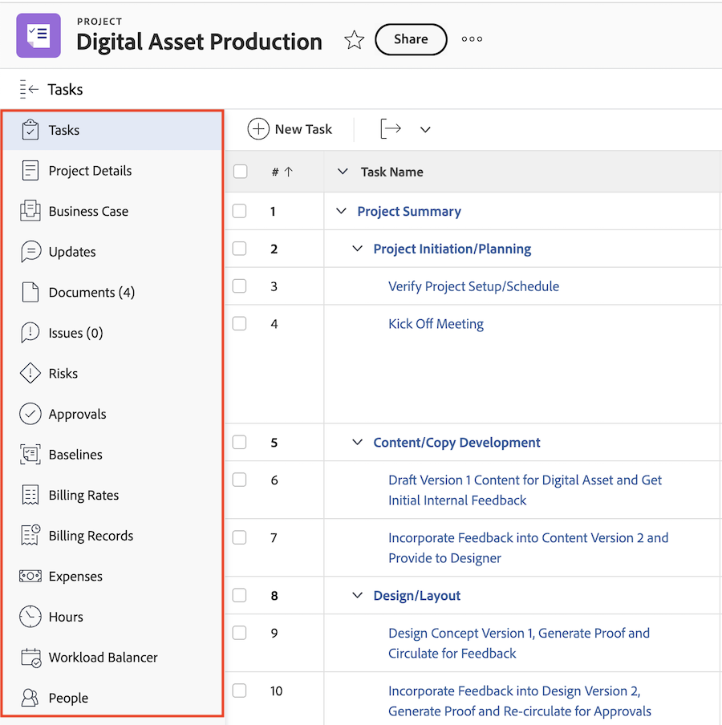

# Navegação à esquerda em [!DNL Adobe Workfront]

A maioria das áreas e objetos no WF usam um painel de navegação simples no lado esquerdo da tela. Estes são os benefícios da navegação no painel esquerdo:

* Ele permite um melhor gerenciamento do espaço da tela.
* O administrador do [!DNL Workfront] pode ocultar qualquer seção no painel esquerdo, exceto os detalhes do objeto, usando modelos de layout.

  Para obter informações sobre como usar modelos de layout, consulte o artigo [Criar e gerenciar modelos de layout](../../administration-and-setup/customize-workfront/use-layout-templates/create-and-manage-layout-templates.md).

* É possível alterar facilmente a ordem das seções na navegação à esquerda sem abrir telas adicionais, arrastando-as e soltando-as na ordem desejada.

  Para obter mais informações, consulte a seguinte seção neste artigo: [Use o painel de navegação esquerdo](#use-the-left-navigation-panel).

* Você pode personalizar o painel esquerdo adicionando um painel.

## Requisitos de acesso

Você deve ter o seguinte acesso para executar as etapas deste artigo:

<table style="table-layout:auto"> 
 <col> 
 </col> 
 <col> 
 </col> 
 <tbody> 
  <tr> 
   <td role="rowheader"><strong>[!DNL Adobe Workfront] plano*</strong></td> 
   <td> 
Qualquer
 </td> 
  </tr> 
  <tr> 
   <td role="rowheader"><strong>[!DNL Adobe Workfront] licença*</strong></td> 
   <td> 
[!UICONTROL Solicitação] ou superior
 </td> 
  </tr> 
 </tbody> 
</table>

&#42;Para saber que tipo de plano ou licença você tem, contate o administrador do [!DNL Workfront].

## Seções padrão no painel de navegação esquerdo

Você pode acessar mais informações sobre objetos ou áreas no painel esquerdo para vários objetos ou áreas no Adobe Workfront.

Dependendo do objeto ou da área em que você navegou, as seções que aparecem no painel esquerdo são diferentes.

O painel esquerdo está disponível para os seguintes objetos:

* Projeto
* Tarefa
* Problema
* Portfólio
* Programa
* Modelo
* Modelo de Tarefa
* Iteração
* Usuário
* Equipe
* Grupo
* Meta

>[!IMPORTANT]
>
>Se o painel esquerdo exibir apenas uma seção por padrão, como **[!UICONTROL Todos os projetos]** na área **[!UICONTROL Projetos]**, um administrador do [!DNL Workfront] deverá adicionar pelo menos uma seção personalizada a esta área ao criar um modelo de layout e atribuir você a esse modelo antes que o painel esquerdo seja exibido nessa área.\
>Para obter informações sobre como um administrador do [!DNL Workfront] personaliza o painel esquerdo em um modelo de layout, consulte [Personalizar o painel esquerdo usando um modelo de layout](../../administration-and-setup/customize-workfront/use-layout-templates/customize-left-panel.md).

O painel esquerdo está disponível para as seguintes áreas:

* [Seções padrão na área [!UICONTROL Painéis]](#default-sections-in-the-dashboards-area)
* [Seções padrão na área [!UICONTROL Solicitações]](#default-sections-in-the-requests-area)
* [Seções padrão na área [!UICONTROL Recursos]](#default-sections-in-the-resourcing-area)
* [Seções padrão na área [!UICONTROL Projetos]](#default-sections-in-the-projects-area)
* [Seções padrão na área [!UICONTROL Folhas de horas]](#default-sections-in-the-timesheets-area)
* [Seções padrão na área  [!DNL Goals] ](#default-sections-in-the-goals-area)

### Seções padrão na área [!UICONTROL Painéis]

As seguintes seções são exibidas no painel esquerdo da área **[!UICONTROL Painéis]**:

<table style="table-layout:auto">
    <tr>
        <td><strong>[!UICONTROL Meus Painéis]</strong></td>
        <td>Exibe os painéis que você criou.</td>
    </tr>
    <tr>
        <td><strong>[!UICONTROL Painéis Compartilhados]</strong></td>
        <td>Exibe os painéis criados por outros usuários e compartilhados com você.</td>
    </tr>
    <tr>
        <td><strong>[!UICONTROL Todos os Painéis]</strong></td>
        <td>Exibe os painéis que você ou outros usuários criaram, e que você tem permissões para pelo menos Exibir.</td>
    </tr>
</table>

Para saber como usar o painel esquerdo na área Painéis, consulte a seção [Usar o painel de navegação esquerdo](#use-the-left-navigation-panel) neste artigo.

### Seções padrão na área [!UICONTROL Solicitações]

<table style="table-layout:auto">
    <tr>
        <td><strong>[!UICONTROL Enviado]</strong></td>
        <td>Exibe solicitações que você ou outros usuários enviaram e que você tem permissão para pelo menos Exibir. Use os filtros no canto superior direito da lista de solicitações para exibir suas solicitações ou solicitações que outras pessoas enviaram e você tem acesso para visualizar.</td>
    </tr>
    <tr>
        <td><strong>[!UICONTROL Rascunhos]</strong></td>
        <td>Exibe solicitações que você iniciou, mas que ainda não foram enviadas. [!DNL Workfront] salva automaticamente qualquer nova solicitação na pasta Rascunhos, depois que você seleciona o tópico da fila.</td>
    </tr>
</table>

Para saber como usar o painel esquerdo na área [!UICONTROL Solicitações], consulte a seção [Usar o painel de navegação esquerdo](#use-the-left-navigation-panel) neste artigo.

### Seções padrão na área [!UICONTROL Recursos]

As seguintes seções são exibidas no painel esquerdo para a área **[!UICONTROL Recursos]**:

<table style="table-layout:auto"> 
 <col> 
 <col> 
 <tbody> 
  <tr> 
   <td role="rowheader"><strong>Planejador</strong></td> 
   <td>Exibe o Planejador de recursos. Use essa área para planejar seus recursos em vários projetos. Para obter informações sobre como usar o Planejador de Recursos, consulte <a href="../../resource-mgmt/resource-planning/get-started-resource-planning.md" class="MCXref xref">Introdução ao Planejamento de Recursos</a>.</td> 
  </tr> 
  <tr> 
   <td role="rowheader"><strong>[!UICONTROL Balanceador de Carga de Trabalho]</strong></td> 
   <td>Exibe o Balanceador de carga de trabalho. Use essa área para atribuir trabalho real aos seus recursos.  
   Para obter informações sobre como usar recursos de agendamento, consulte <a href="../../resource-mgmt/workload-balancer/assign-work-in-workload-balancer.md" class="MCXref xref">Visão geral da atribuição de trabalho no Balanceador de carga de trabalho</a>.</td> 
  </tr> 
  <tr> 
   <td role="rowheader"><strong>Utilização</strong></td> 
   <td>Exibe o Relatório de Utilização. Para obter informações sobre como ler o Relatório de Utilização, consulte <a href="../../reports-and-dashboards/reports/using-built-in-reports/resource-utilization-report.md" class="MCXref xref">Visão Geral do Relatório de Utilização de Recursos</a>.</td> 
  </tr> 
  <tr> 
   <td role="rowheader"><strong>Conjuntos de Recursos</strong></td> 
   <td>Exibe todos os Conjuntos de recursos no Workfront. Para obter informações sobre Conjuntos de Recursos, consulte <a href="../../resource-mgmt/resource-planning/resource-pools/work-with-resource-pools.md" class="MCXref xref"> Visão geral dos conjuntos de recursos </a>.</td>
  </tr> 
 </tbody> 
</table>

Para saber como usar o painel esquerdo na área [!UICONTROL Recursos], consulte a seção [Usar o painel de navegação esquerdo](#use-the-left-navigation-panel) neste artigo.

### Seções padrão na área [!UICONTROL Projetos]

As seções a seguir são exibidas no painel esquerdo da área **[!UICONTROL Projetos]**:

<table style="table-layout:auto">
    <tr>
        <td><strong>[!UICONTROL Todos os Projetos]</strong></td>
        <td>Exibe todos os projetos que você tem acesso para visualizar. Use o menu suspenso [!UICONTROL Filtro] para alterar os projetos que deseja exibir</td>
    </tr>
    <tr>
        <td><strong>[!UICONTROL Seções personalizadas]</strong></td>
        <td>Você pode exibir todas as seções personalizadas que o administrador do [!DNL Workfront] adicionou ao painel esquerdo para a área [!UICONTROL Projetos] no Modelo de Layout. As seções personalizadas têm nomes que foram personalizados para o seu ambiente.</td>
    </tr>
</table>

Para saber como usar o painel esquerdo na área [!UICONTROL Projetos], consulte a seção [Usar o painel de navegação esquerdo](#use-the-left-navigation-panel) neste artigo.

### Seções padrão na área [!UICONTROL Folhas de horas]

As seguintes seções são exibidas no painel esquerdo para a área **[!UICONTROL Folhas de horas]**:

<table style="table-layout:auto">
    <tr>
        <td><strong>[!UICONTROL Minhas Planilhas de Horas]</strong></td>
        <td>Exibe todas as planilhas de horas ativas por padrão. Para exibir planilhas de horas enviadas ou fechadas, selecione [!UICONTROL Enviado] ou [!UICONTROL Tudo] no menu suspenso [!UICONTROL Filtro].</td>
    </tr>
    <tr>
        <td><strong>[!UICONTROL Planilha de Horas que eu Aprovar]</strong></td>
        <td>Exibe planilhas de horas que foram submetidas para sua aprovação, por padrão. Para exibir planilhas de horas ativas ou todas onde você é o aprovador, selecione [!UICONTROL Ativo] ou Aplicativo no menu suspenso Filtro.</td>
    </tr>
    <tr>
        <td><strong>[!UICONTROL Todas as Planilhas de Horas]</strong></td>
        <td>Exibe todas as planilhas de horas que você tem acesso para visualizar, com base nos filtros selecionados na área de Filtro à esquerda.</td>
    </tr>
</table>

Para saber como usar o painel esquerdo na área [!UICONTROL Folhas de horas], consulte a seção [Usar o painel de navegação esquerdo](#use-the-left-navigation-panel) neste artigo.

### Seções padrão na área [!DNL Goals]

>[!NOTE]
>
>O acesso às metas do exige uma licença adicional. Para obter informações sobre [!DNL Workfront Goals], consulte [[!DNL Adobe Workfront Goals] visão geral](../../workfront-goals/goal-management/wf-goals-overview.md).

As seguintes seções são exibidas no painel esquerdo para a área **[!UICONTROL Metas]**:

<table style="table-layout:auto">
    <tr>
        <td><strong>[!UICONTROL Lista de Metas]</strong></td>
        <td>Exibe todas as metas que você tem acesso para visualizar. Para obter mais informações, consulte <a href="../../workfront-goals/goal-review-and-workfront-goals-sections/manage-goals-in-goal-list.md">Gerenciar metas na [!UICONTROL Lista de Metas] de [!DNL Adobe Workfront Goals]</a>.</td>
    </tr>
    <tr>
        <td><strong>[!UICONTROL Gráficos]</strong></td>
        <td>Exibe o desempenho de suas metas em gráficos. Para obter mais informações, consulte <a href="../../workfront-goals/goal-review-and-workfront-goals-sections/review-goal-graphs.md">Revisar gráficos para entender as tendências de progresso da meta em [!DNL Adobe Workfront] Metas</a>.</td>
    </tr>
    <tr>
        <td><strong>[!UICONTROL Alinhamento de Metas]</strong></td>
        <td>Exibe o alinhamento das metas entre si em uma hierarquia. Para obter mais informações, consulte <a href="../../workfront-goals/goal-alignment/goal-alignment-overview.md">Visão geral do alinhamento da meta em [!DNL Adobe Workfront Goals]</a>.</td>
    </tr>
    </table>

<!--
   Drafted - removed from UI 
   <table>
    <tr>
        <td><strong>[!UICONTROL Pulse]</strong></td>
        <td>Displays a quick overview of all active goals and their progress. For more information, see <a href="../../workfront-goals/goal-review-and-workfront-goals-sections/review-goals-in-pulse.md">Review goals in the [!UICONTROL [!DNL Adobe Workfront Goals] Pulse] section</a>.
        
This section has been removed from the Preview environment.

        </td>
    </tr>
    <tr>
        <td><strong>[!UICONTROL Check-in]</strong></td>
        <td>Displays a quick overview of your active goals and their progress. For more information, see <a href="../../workfront-goals/goal-review-and-workfront-goals-sections/check-in-goals.md">Update goal progress in [!DNL Adobe Workfront Goals]</a>.
        
This section has been removed from the Preview environment.

        </td>
    </tr>
</table>
-->
Para saber como usar o painel esquerdo na área [!UICONTROL Metas], consulte a seção [Usar o painel de navegação esquerdo](#use-the-left-navigation-panel) neste artigo.

## Usar o painel de navegação esquerdo

Encontrar e editar informações no painel esquerdo é semelhante para esses objetos. As opções disponíveis no painel esquerdo são diferentes, dependendo do objeto que você acessa.

Para saber quais seções estão disponíveis para áreas específicas, consulte [[!UICONTROL Seções padrão] no painel de navegação esquerdo](#default-sections-in-the-left-navigation-panel).

1. Clique no ícone **[!UICONTROL do]** Menu principal e clique no nome de um objeto para acessá-lo.

   A página do objeto é exibida.

1. (Condicional) Se você selecionou uma área que contém uma lista de objetos, como **[!UICONTROL Projetos]** ou **[!UICONTROL Portfólios]**, você deve fazer o seguinte para acessar a navegação no painel esquerdo:

   1. Clique em um objeto na lista.
   1. (Opcional) Na navegação do painel esquerdo, você pode selecionar outro objeto no painel esquerdo, como **[!UICONTROL Tarefas]** ou **[!UICONTROL Problemas]** em um projeto, para acessar uma lista de objetos e clicar no nome do objeto específico.\

      A página do objeto é exibida.

1. Na página do objeto, clique em qualquer uma das seções no painel esquerdo para exibir ou editar as informações nessa seção.

   Você deve ter permissões para editar o objeto antes de poder editar as informações.

   

1. (Opcional) Para adicionar um link rápido do painel, clique em **[!UICONTROL Adicionar painel]** na parte inferior do painel esquerdo e, em seguida, faça o seguinte:

   1. Digite um nome para o painel no campo **[!UICONTROL Nome do link rápido]**.
   1. Comece digitando o nome de um painel existente no campo **[!UICONTROL Escolha um painel]** e clique no painel quando ele for exibido na lista.

      >[!TIP]
      >
      >Você deve criar o painel antes que ele apareça na lista.

1. (Opcional) Para remover um link rápido do painel, passe o mouse sobre o painel na navegação à esquerda e clique no ícone **Remover**  quando ele aparecer.

1. (Opcional) Para alterar a ordem de uma seção no painel esquerdo, clique no ícone **[!UICONTROL de]** Arrastar à direita de uma seção e arraste-a para cima ou para baixo.

   

1. (Opcional) Para fechar o painel esquerdo, clique no ícone **[!UICONTROL de]** Recolher.

   >[!NOTE]
   >
   >Ao recolher o painel esquerdo, [!DNL Workfront] mantém sua preferência mesmo quando você navega para outro objeto [!DNL Workfront]. Para expandir o painel esquerdo novamente, clique no ícone **[!UICONTROL Expandir]** .
