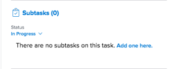

# [!UICONTROL Resumo] visão geral

Você pode usar o [!UICONTROL Resumo] painel para revisar e atualizar informações do item de trabalho diretamente de uma lista de tarefas, problemas, documentos ou de outras áreas de [!DNL Adobe Workfront] que exibem tarefas e problemas.

A tabela a seguir exibe as áreas onde você pode localizar e usar o [!UICONTROL Resumo] painel:

<table style="table-layout:auto"> 
 <col data-mc-conditions=""> 
 <tbody> 
  <tr> 
   <td>Tarefas</td> 
  </tr> 
  <tr> 
   <td> 
Listas de tarefas em um
 
    <ul> 
     <li>Projeto</li> 
     <li>Subtarefa</li> 
    </ul> </td> 
  </tr> 
  <tr> 
   <td>Tarefas nas áreas de trabalho [!UICONTROL não atribuído] e [!UICONTROL atribuído] da [!DNL Workload Balancer]</td> 
  </tr> 
  <tr data-mc-conditions=""> 
   <td>Problemas</td> 
  </tr> 
  <tr data-mc-conditions=""> 
   <td> 
Listas de problemas em um
 
    <ul> 
     <li>Projeto</li> 
     <li>Tarefa</li> 
     <li>Subtarefa</li> 
    </ul> </td> 
  </tr> 
  <tr data-mc-conditions=""> 
   <td>Problemas na área [!UICONTROL Trabalho atribuído] da [!DNL Workload Balancer]</td> 
  </tr> 
  <tr data-mc-conditions=""> 
   <td>Problemas na seção [!UICONTROL Enviado] da área [!UICONTROL Solicitações]</td> 
  </tr> 
  <tr data-mc-conditions=""> 
   <td>Documentos</td> 
  </tr> 
  <tr data-mc-conditions=""> 
   <td>Área [!UICONTROL Documentos]</td> 
  </tr> 
  <tr data-mc-conditions=""> 
   <td>Seção [!UICONTROL Documentos] de qualquer objeto (projeto, tarefa, emissão, programa, portfólio, modelo, tarefa do modelo, usuário)</td> 
  </tr> 
 </tbody> 
</table>

<!--

Workfront administrators can customize the Summary in the Layout Template. For more information, see <a href="../../administration-and-setup/customize-workfront/use-layout-templates/create-and-manage-layout-templates.md" class="MCXref xref">Create and manage layout templates</a>.

-->

Este artigo descreve como acessar e usar o [!UICONTROL Resumo] painel para tarefas e problemas em listas.

Para obter informações sobre como acessar o [!UICONTROL Resumo] no [!DNL Workload Balancer], consulte [Atualize os itens de trabalho na [!DNL Workload Balancer] usando o [!UICONTROL Resumo]](../../resource-mgmt/workload-balancer/update-items-in-summary-panel-in-workload-balancer.md).

Para obter informações sobre como acessar o [!UICONTROL Resumo] para documentos, consulte [[!UICONTROL Resumo] visão geral dos documentos](../../documents/managing-documents/summary-for-documents.md).

## Requisitos de acesso

Você deve ter o seguinte acesso para executar as etapas neste artigo:

<table style="table-layout:auto"> 
 <col> 
 <col> 
 <tbody> 
  <tr> 
   <td role="rowheader"><strong>[!DNL Adobe Workfront] plano*</strong></td> 
   <td> 
Qualquer Um
 </td> 
  </tr> 
  <tr> 
   <td role="rowheader"><strong>[!DNL Adobe Workfront] licença*</strong></td> 
   <td> 
[!UICONTROL Solicitação] ou superior
 </td> 
  </tr> 
  <tr> 
   <td role="rowheader"><strong>Configurações de nível de acesso*</strong></td> 
   <td> 
[!UICONTROL View] ou acesso superior a Tarefas, Problemas, Documentos
 
[!UICONTROL Exibir] ou acesso superior a quaisquer objetos para os quais deseja exibir documentos' [!UICONTROL Resumo]
 
Observação: Se ainda não tiver acesso, pergunte ao seu [!DNL Workfront] administrador se eles definirem restrições adicionais em seu nível de acesso. Para obter informações sobre como uma [!DNL Workfront] administrador pode modificar seu nível de acesso, consulte <a href="../../administration-and-setup/add-users/configure-and-grant-access/create-modify-access-levels.md" class="MCXref xref">Criar ou modificar níveis de acesso personalizados</a>.
 </td> 
  </tr> 
  <tr> 
   <td role="rowheader"><strong>Permissões de objeto</strong></td> 
   <td> 
[!UICONTROL View] ou permissões superiores para uma tarefa, problema ou documento
 
Para obter informações sobre como solicitar acesso adicional, consulte <a href="../../workfront-basics/grant-and-request-access-to-objects/request-access.md" class="MCXref xref">Solicitar acesso a objetos </a>.
 </td> 
  </tr> 
 </tbody> 
</table>

&#42;Para descobrir qual plano, tipo de licença ou acesso você tem, entre em contato com seu [!DNL Workfront] administrador.

## Visualize o [!UICONTROL Resumo] em uma lista de tarefas ou problemas

1. Vá para uma tarefa ou problema e selecione um item na lista.
1. Clique no botão **[!UICONTROL Resumo]** ícone 

   ou

   Clique no botão **[!UICONTROL Abrir resumo]** ícone  no [!UICONTROL Enviado] da seção [!UICONTROL Solicitações] área.

   Após abrir o Resumo, ele permanece aberto à medida que você clica ou seleciona outras tarefas ou problemas e permanece aberto até que você o feche manualmente.

   >[!TIP]
   >
   >Você só pode selecionar uma tarefa ou um problema por vez para exibir seus detalhes na [!UICONTROL Resumo] painel.

   

1. (Opcional) Para fechar o [!UICONTROL Resumo] , execute um dos seguintes procedimentos:

   * Em uma lista de tarefas ou problemas, clique no botão **[!UICONTROL Abrir resumo]** ícone 

      Ou

      Clique no botão **X** no canto superior direito do [!UICONTROL Resumo] painel.

   * No [!UICONTROL Enviado] da seção [!UICONTROL Solicitações] clique no botão **[!UICONTROL Fechar resumo]** ícone 

      Ou

      Clique no botão **X** no canto superior direito do painel Resumo.

## [!UICONTROL Percentual concluído]

Use a barra de progresso na parte superior do [!UICONTROL Resumo] para atualizar a porcentagem concluída para a tarefa ou problema selecionado. Insira um número ou arraste a barra até a porcentagem correta.

## [!UICONTROL Atualizações]

Use o [!UICONTROL Atualizações] da seção [!UICONTROL Resumo] para exibir atualizações recentes e fazer atualizações na tarefa ou problema selecionado. Clique em **[!UICONTROL Ver tudo]** para acessar diretamente o [!UICONTROL Atualizações] na tarefa.

## [!UICONTROL Documentos]

Use o [!UICONTROL Documentos] da seção [!UICONTROL Resumo] para ver documentos anexados à tarefa ou edição que você selecionou. Clique na miniatura para abrir uma visualização de documento. Para acessar diretamente o [!UICONTROL Documentos] na tarefa ou problema, clique no botão **[!UICONTROL Documentos]** título.

## [!UICONTROL Detalhes]

Use o [!UICONTROL Detalhes] da seção [!UICONTROL Resumo] para exibir detalhes de itens de trabalho de alto nível, fazer atribuições ou adicionar datas de início. Clique em **[!UICONTROL Ver tudo]** para acessar diretamente o [!UICONTROL Detalhes] na tarefa ou problema.

>[!NOTE]
>
>Os campos que aparecem nesta seção são os mesmos campos que aparecem no painel direito na página inicial. Você pode personalizar esses campos [Personalizar [!UICONTROL Início] e [!UICONTROL Resumo] uso de um modelo de layout](../../administration-and-setup/customize-workfront/use-layout-templates/customize-home-summary-layout-template.md).

## [!UICONTROL Subtarefas]

Esta seção só está disponível para tarefas. Use o [!UICONTROL Subtarefas] da seção [!UICONTROL Resumo] para visualizar [!UICONTROL Novo], [!UICONTROL Em Andamento]e [!UICONTROL Fechado] subtarefas na tarefa selecionada. Clique no botão **[!UICONTROL Status]** menu suspenso para alternar entre status. Para acessar diretamente o [!UICONTROL Subtarefas] na tarefa, clique no botão **[!UICONTROL Subtarefas]**&#x200B; título.

Se você não tiver adicionado subtarefas à tarefa, clique em **[!UICONTROL Adicione um aqui]** para acessar diretamente o [!UICONTROL Subtarefas] na tarefa.

## [!UICONTROL Horas]

Use o [!UICONTROL Horas] da seção [!UICONTROL Resumo] para registrar horas na tarefa ou problema selecionado. Clique em **[!UICONTROL Hora de registro]** e insira suas horas. Para ir diretamente para a guia Hours na tarefa ou problema, clique no botão **[!UICONTROL Horas]** título.

A contagem de horas na [!UICONTROL Resumo] exibe as horas que você registra. Outros usuários terão totais de horas diferentes na [!UICONTROL Resumo] dependendo do tempo em que fazem logon na tarefa.

Se não houver planos [!UICONTROL horas] na tarefa ou problema e você tiver registrado o tempo, a barra de horas exibe vermelho.

## Aprovações

Use o [!UICONTROL Aprovações] da seção [!UICONTROL Resumo] para exibir aprovações anexadas à tarefa ou emissão selecionada. Se você não tiver adicionado aprovações, selecione uma aprovação existente no menu suspenso ou clique em **[!UICONTROL Criar processo de aprovação de uso único]** para acessar diretamente o [!UICONTROL Aprovações] na tarefa ou problema.

Para acessar diretamente o [!UICONTROL Aprovações] na tarefa ou problema, clique no botão **[!UICONTROL Aprovações]** título.

