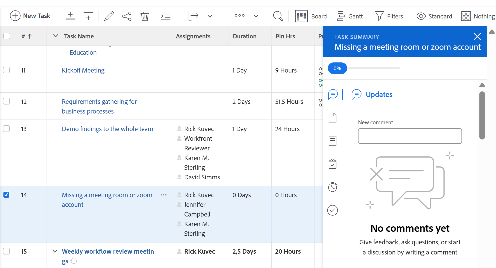
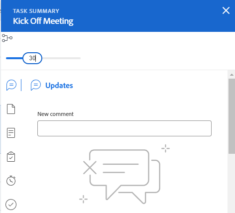
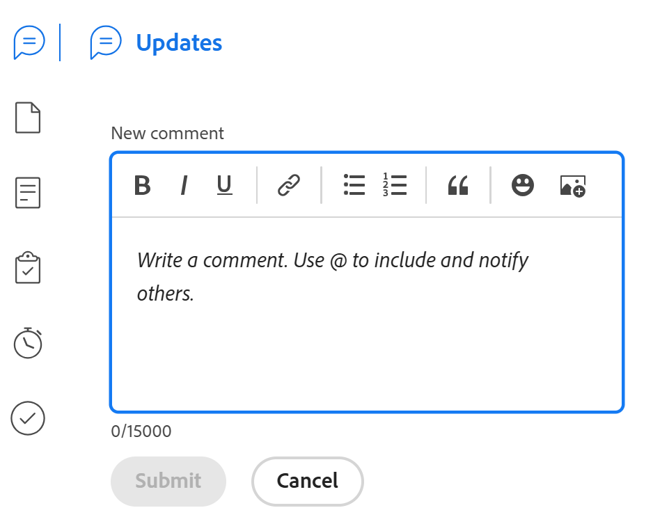
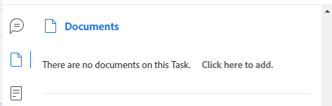
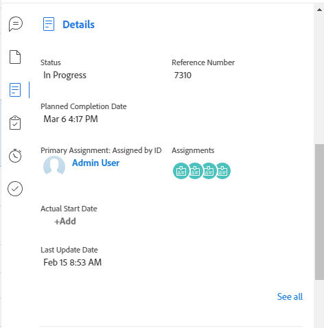
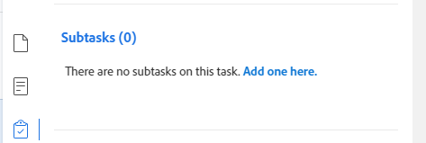
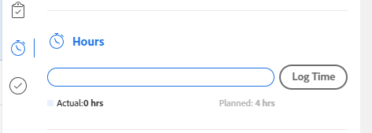
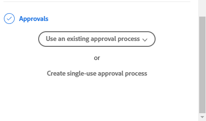

# Visão geral do [!UICONTROL Resumo]

<!--The highlighted information on this page refers to functionality not yet generally available. It is available only in the Preview environment for all customers or in Production for customers who enabled fast releases. 

For information about fast releases, see [Enable or disable fast releases for your organization](/help/quicksilver/administration-and-setup/set-up-workfront/configure-system-defaults/enable-fast-release-process.md).

For information about the current release schedule, see [Second Quarter 2024 release overview](/help/quicksilver/product-announcements/product-releases/24-q2-release-activity/24-q2-release-overview.md). -->

Você pode usar o painel [!UICONTROL Resumo] para revisar e atualizar informações de item de trabalho diretamente de uma lista de tarefas, problemas, documentos ou de outras áreas do [!DNL Adobe Workfront] que exibem tarefas e problemas.

O administrador do Workfront ou de grupo pode modificar as áreas e os campos exibidos no painel Resumo. Eles podem adicionar até 16 campos ao painel Resumo.

>[!IMPORTANT]
>
>Recomendamos adicionar campos que você deve atualizar com frequência no Painel de resumo, para que possa acessá-los e atualizá-los facilmente sem acessar a página principal do objeto.
>
>Por exemplo, você pode adicionar os seguintes campos atualizados com frequência aos painéis Resumo de tarefas e problemas:
>
>* Status
>* Percentual concluído
>* Data de confirmação
>* Data de conclusão planejada
>* Condição

A tabela a seguir exibe as áreas em que é possível localizar e usar o painel [!UICONTROL Resumo]:

<table style="table-layout:auto"> 
 <col data-mc-conditions=""> 
 <tbody> 
  <tr> 
   <td><b>Tarefas</b></td> 
  </tr> 
  <tr> 
   <td> 
Listas de tarefas em um
 
    <ul> 
     <li>Projeto</li> 
     <li>Subtarefa</li> 
    </ul> </td> 
  </tr> 
  <tr> 
   <td>Tarefas nas áreas de trabalho [!UICONTROL Não Atribuído] e [!UICONTROL Atribuído] do Balanceador de Carga de Trabalho </td> 
  </tr> 
   <tr> 
   <td>Tarefas em um [!UICONTROL Timesheet]</td> 
  </tr> 
  <tr data-mc-conditions=""> 
   <td><b>Problemas</b></td> 
  </tr> 
  <tr data-mc-conditions=""> 
   <td> 
Listas de ocorrências em um
 
    <ul> 
     <li>Projeto</li> 
     <li>Tarefa</li> 
     <li>Subtarefa</li> 
    </ul> </td> 
  </tr> 
  <tr data-mc-conditions=""> 
   <td>Problemas na área [!UICONTROL Trabalho atribuído] do [!UICONTROL Balanceador de carga de trabalho]</td> 
  </tr> 
  <tr data-mc-conditions=""> 
   <td>Problemas na seção [!UICONTROL Submetido] da área [!UICONTROL Requests]</td> 
  </tr> 
</tr> 
   <tr> 
   <td>Problemas em uma [!UICONTROL Planilha de Horas]</td> 
  </tr>

<tr data-mc-conditions=""> 
   <td><b>Documentos</b></td> 
  </tr> 
  <tr data-mc-conditions=""> 
   <td>Área [!UICONTROL Documentos]</td> 
  </tr> 
  <tr data-mc-conditions=""> 
   <td>Seção [!UICONTROL Documentos] de qualquer objeto (projeto, tarefa, problema, programa, portfólio, modelo, tarefa de modelo, usuário)</td> 
  </tr> 
 </tbody> 
</table>

<!--

Workfront administrators can customize the Summary in the Layout Template. For more information, see <a href="../../administration-and-setup/customize-workfront/use-layout-templates/create-and-manage-layout-templates.md" class="MCXref xref">Create and manage layout templates</a>.

-->

Este artigo descreve como acessar e usar o painel [!UICONTROL Resumo] para tarefas e problemas em listas.

Para obter informações sobre como acessar o [!UICONTROL Resumo] no [!UICONTROL Balanceador de carga de trabalho], consulte [Atualizar itens de trabalho no [!UICONTROL Balanceador de carga de trabalho] usando o [!UICONTROL Resumo]](../../resource-mgmt/workload-balancer/update-items-in-summary-panel-in-workload-balancer.md).

Para obter informações sobre como acessar o [!UICONTROL Resumo] dos documentos, consulte a visão geral do [[!UICONTROL Resumo] dos documentos](../../documents/managing-documents/summary-for-documents.md).

## Exibir o painel [!UICONTROL Resumo] em uma lista de tarefas ou problemas

1. Vá para uma tarefa ou ocorrência e selecione um item na lista.
1. Clique no ícone **[!UICONTROL Resumo]** 

   ou

   Clique no ícone **[!UICONTROL Abrir Resumo]**  na seção [!UICONTROL Enviados] da área [!UICONTROL Solicitações].

   Depois de abrir o Resumo, ele permanece aberto quando você clica ou seleciona outras tarefas ou problemas e permanece aberto até que você o feche manualmente.

   >[!TIP]
   >
   >Você só pode selecionar uma tarefa ou um problema por vez para exibir seus detalhes no painel [!UICONTROL Resumo].

   

1. (Opcional) Para fechar o painel [!UICONTROL Resumo], siga um destes procedimentos:

   * Em uma lista de tarefas ou problemas, clique no ícone **[!UICONTROL Abrir Resumo]** ícone 

     Ou

     Clique no ícone **X** no canto superior direito do painel [!UICONTROL Resumo].

   * Na seção [!UICONTROL Enviado] da área [!UICONTROL Solicitações], clique no ícone **[!UICONTROL Fechar Resumo]** 

     Ou

     Clique no ícone **X** no canto superior direito do painel Resumo.

## [!UICONTROL Percentual concluído]

Use a bolha azul de progresso na parte superior do [!UICONTROL Resumo] para atualizar a porcentagem concluída da tarefa ou problema selecionado. Digite um número ou arraste a bolha para a porcentagem correta.

Quando você arrasta e solta a bolha no painel Resumo, a Porcentagem concluída é atualizada em incrementos de um ponto. Não é possível inserir um número decimal.

## [!UICONTROL Atualizações]

Use a seção [!UICONTROL Atualizações] do [!UICONTROL Resumo] para exibir atualizações recentes e fazer atualizações sobre a tarefa ou problema selecionado. Clique em **[!UICONTROL Ver tudo]** para ir diretamente para a guia [!UICONTROL Atualizações] na tarefa.

## [!UICONTROL Documentos]

Use a seção [!UICONTROL Documentos] do [!UICONTROL Resumo] para ver os documentos anexados à tarefa ou ocorrência selecionada. Clique na miniatura para abrir a visualização de um documento. Para ir diretamente para a guia [!UICONTROL Documentos] na tarefa ou ocorrência, clique no título **[!UICONTROL Documentos]**.

## [!UICONTROL Detalhes]

Use a seção [!UICONTROL Detalhes] do [!UICONTROL Resumo] para exibir detalhes de item de trabalho de alto nível, fazer atribuições ou adicionar datas de início. Clique em **[!UICONTROL Ver tudo]** para ir diretamente para a guia [!UICONTROL Detalhes] na tarefa ou problema.

## [!UICONTROL Subtarefas]

Esta seção só está disponível para tarefas. Use a seção [!UICONTROL Subtarefas] do [!UICONTROL Resumo] para exibir as subtarefas [!UICONTROL Novas], [!UICONTROL Em Andamento] e [!UICONTROL Fechadas] na tarefa selecionada. Clique no menu suspenso **[!UICONTROL Status]** para alternar entre os status. Para ir diretamente para a guia [!UICONTROL Subtarefas] na tarefa, clique no &#x200B; **[!UICONTROL Subtarefas]**.

Se você não tiver adicionado subtarefas à tarefa, clique em **[!UICONTROL Adicionar uma aqui]** para ir diretamente para a guia [!UICONTROL Subtarefas] da tarefa.

## [!UICONTROL Horas]

Use a seção [!UICONTROL Horas] do [!UICONTROL Resumo] para registrar horas na tarefa ou problema selecionado. Clique em **[!UICONTROL Horário do Log]** e insira suas horas. Para ir diretamente para a guia Horas na tarefa ou ocorrência, clique no título **[!UICONTROL Horas]**.

A contagem de horas no [!UICONTROL Resumo] exibe as horas que você registra. Outros usuários terão totais de horas diferentes no [!UICONTROL Resumo], dependendo da hora em que fizerem logon na tarefa.

Se não houver [!UICONTROL horas] planejadas na tarefa ou problema e você tiver registrado tempo, a barra de horas será exibida em vermelho.

## Aprovações

Use a seção [!UICONTROL Aprovações] do [!UICONTROL Resumo] para exibir as aprovações anexadas à tarefa ou ocorrência selecionada. Se você não adicionou nenhuma aprovação, selecione uma aprovação existente no menu suspenso ou clique em **[!UICONTROL Criar processo de aprovação de uso único]** para ir diretamente para a guia [!UICONTROL Aprovações] na tarefa ou ocorrência.

Para ir diretamente para a guia [!UICONTROL Aprovações] na tarefa ou ocorrência, clique no título **[!UICONTROL Aprovações]**.

