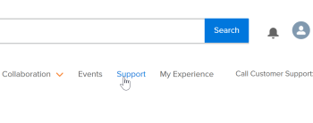

# Entre em contato com o Suporte ao cliente

<!--Audited: 12/2023-->

<!--

(We need to keep this as a standalone article. It is linked in multiple articles and FAQs.)

-->

Como um [!DNL Adobe Workfront] cliente, você pode entrar em contato com o [!DNL Workfront] Equipe de suporte ao cliente por telefone ou enviando um tíquete online.

>[!NOTE]
>
>Para problemas críticos, entre em contato com [!DNL Workfront] Suporte ao cliente por telefone.

## Fone

Você pode entrar em contato [!DNL Workfront Customer Support] 7 dias por semana, 24 horas por dia, através dos seguintes números:

* EUA: 844-306-HELP(4357)
* EMEA: +44 1256 274200
* Austrália: +61 1800 849259

## Web

É possível enviar um tíquete de suporte do autoatendimento [!DNL Experience League] portal.

>[!IMPORTANT]
>
>Somente contatos de suporte autorizados (ou usuários autorizados) podem enviar tíquetes de suporte online.

1. No [[!DNL Experience League]](https://experienceleague.adobe.com) site, clique em **[!UICONTROL Suporte]**  na parte superior da página.

   

   A variável [!UICONTROL Suporte] é aberta.

   No [!UICONTROL Suporte] home page, você pode navegar até os casos de suporte abertos, registrar um novo caso, exibir o início [!UICONTROL Suporte] ou acesse fontes de aprendizado adicionais.

1. Para enviar um caso, selecione a opção **[!UICONTROL Abrir um caso de suporte]** e, em seguida, clique em **[!UICONTROL Sign] Entrada**.

1. Clique em **[!UICONTROL Caso aberto]** na barra lateral esquerda.

<!--
   
-->

A variável [!UICONTROL criação de caso] será aberta uma página onde você poderá inserir o nome do seu produto ([!DNL Adobe Workfront], [!DNL Adobe Workfront Fusion], etc.), título da ocorrência e descrição da ocorrência.

>[!TIP]
>
>Seja o mais descritivo possível ao descrever o problema que você está enfrentando para nos ajudar a acelerar o processo de solução de problemas.

1. Preencha as informações dos seguintes campos para obter detalhes mais específicos:

   * **[!UICONTROL Prioridade de caso]** ([!UICONTROL Baixa], [!UICONTROL Medium], [!UICONTROL Alta], [!UICONTROL Crítico])
   * **[!UICONTROL Produto da Ocorrência]** ([!UICONTROL DAM], [!DNL Fusion], [!DNL Goals], etc.)
   * **[!UICONTROL Ambiente]** ([!UICONTROL Produção], [!UICONTROL Visualizar], [!UICONTROL Sandbox], etc.)
   * **[!UICONTROL Região do Cliente]** (Américas, EMEA, APAC)

1. Faça upload de todos os arquivos relevantes e clique em **[!UICONTROL Enviar caso]**.

   O processo é apresentado, e a [!UICONTROL Meus casos] é exibida.

   <!--
   
   -->

Em caso de dúvidas ou problemas ao enviar uma solicitação, entre em contato com a equipe de Suporte ao cliente.

## Exibir e gerenciar os casos de suporte

1. Navegue até a **[!UICONTROL Meus casos]** página. Esta página é aberta quando você envia um caso ou você pode abri-la clicando em **[!UICONTROL Meus casos]** no painel de navegação esquerdo.

1. (Opcional) Use as opções na parte superior da página para filtrar por **Produto ([!DNL Experience Cloud] solução)** ou caso **[!UICONTROL Status]** ([!UICONTROL Abertura] ou Closed). Você também pode usar a variável [!UICONTROL pesquisa] para procurar palavras-chave relacionadas aos casos de suporte.

1. (Opcional) Para exibir mais detalhes sobre um caso, clique no link **Número do caso** para acessá-lo.

   A visualização de caso é aberta.

1. (Opcional) Na exibição de caso, revise os comentários mais recentes com o proprietário do caso atribuído e adicione anexos ou respostas adicionais.

1. (Opcional) Para encaminhar o caso, clique em **[!UICONTROL Escalonar para o gerenciamento]** no lado direito da página, em **[!UICONTROL Detalhe da Ocorrência].

1. Clique em **[!UICONTROL Fechar caso]** botão para fechar o caso.

<!--drafted: I took the information above from this blog post by Jon Chen (on September 13, 2022): https://experienceleaguecommunities.adobe.com/t5/workfront-blogs/how-to-submit-a-support-ticket-on-experience-league/ba-p/461737)

- this is the information that was there before - pointing to WorkfrontOne: 

If you are logged in as an Authorized Support Contact, you can contact Workfront Customer Support through the Workfront One site and create a case, formally called a ticket.

1. Log in to [**one.workfront.com**](https://one.workfront.com/) as an Authorized Support Contact.
1. On the **Home** page, click **Support**.

   

   The Customer Support page displays.

   >[!NOTE]
   >
   >If you don't see the Support option on the Home page, you are not an Authorized Support Contact. Your Workfront administrator can contact Workfront Customer Support and request you be added an Authorized Support Contact. If you are the only Workfront administrator for your organization, contact the Workfront Support team by phone.

1. Complete the fields in the **Create a Support Case** form. All fields are required.  

   <table style="table-layout:auto">
    <tr>
        <td><strong>Subject</strong></td>
        <td>Type a brief question or explanation of the issue you are experiencing.</td>
    </tr>
    <tr>
        <td><strong>Description</strong></td>
        <td>Type a detailed description of the issue. Include as much information as possible.</td>
    </tr>
    <tr>
        <td><strong>Priority</strong></td>
        <td> </td>
    </tr>
    <tr>
        <td><strong>Case Product</strong></td>
        <td>Select the product in which you are experiencing the issue. If the issue is not related to a specific product, select None.</td>
    </tr>
    <tr>
        <td><strong>Product Area</strong></td>
        <td>Select the area of the product that best relates to the issue. If the related area is not listed in the drop-down menu, select Not Listed.</td>
    </tr>
    <tr>
        <td><strong>Environment</strong></td>
        <td>Select the environment in which the issue occurs. If you are seeing the issue in both the Production and Sandbox environments, please select Production.</td>
    </tr>
    <tr>
        <td><strong>Customer Region</strong></td>
        <td> </td>
    </tr>
   </table>

1. (Optional) Attach a file, such as an image or video file.

   1. At the bottom of the form, click **Upload File**.
   1. Click **Upload File**, then browse for and select the desired file.

      

   1. Click **Done** to upload the file to the case.

1. Click **Submit** to submit the case to Workfront Customer Support.

-->

