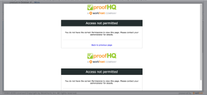

# [!UICONTROL [!DNL Workfront] Gerente de prova] solução de problemas de permissões

A seguir estão os perfis de permissão disponíveis em [!DNL Adobe Workfront] para usuários de comprovação:

* [!UICONTROL Administrador]
* [!UICONTROL Supervisor]
* [!UICONTROL Gerente]

<!--For detailed information about these options and how to configure them, see .-->

Ao conceder a um usuário [!UICONTROL Gerente] , as seguintes informações de solução de problemas estão disponíveis:

* **PROBLEMA:** Usuários com [!UICONTROL Gerente] As permissões do não podem visualizar provas criadas por outros usuários. Em vez disso, eles veem o [!UICONTROL Acesso negado] tela.

   

   **SOLUÇÃO:** Usuários com [!UICONTROL Gerente] as permissões do devem ser adicionadas explicitamente às provas. Provas devem ser sempre criadas através do [!UICONTROL Opções de Prova avançada] e os usuários devem sempre ser adicionados por meio dessa opção.

* **PROBLEMA:** Usuários com [!UICONTROL Gerente] as permissões do não podem adicionar versões de prova às provas criadas por outros usuários (possivelmente, elas poderiam enviar uma prova no conjunto de documentos, mas as versões NÃO estariam conectadas ao conjunto original criado por outro usuário).\
   **SOLUÇÃO:** Usuários com [!UICONTROL Gerente] permissões podem enviar as versões para a prova de outro usuário somente se o usuário com [!UICONTROL Gerente] permissões quando ambos os itens a seguir:

   * Adicionado explicitamente às provas
   * Definir como [!UICONTROL Autores] (função de prova) nas provas

* **PROBLEMA:** Usuários com [!UICONTROL Gerente] As permissões do não podem editar comentários de outros usuários em uma prova que eles não possuem ou que não criaram.\
   **SOLUÇÃO:** Se os usuários com [!UICONTROL Gerente] as permissões do não são proprietárias das provas, mas devem poder editar comentários, adicioná-los como [!UICONTROL Autores] (ou [!UICONTROL Moderadores]).\
   Esses três tipos de permissões estão disponíveis em [!DNL Workfront] para [!UICONTROL Planejador], [!UICONTROL Trabalhadores], [!UICONTROL Solicitante], [!UICONTROL Revisor] licenças do tipo. Administrador do sistema ou administrador de usuários em [!DNL Workfront] pode editar perfis de usuários e ajustar [!DNL Workfront Proof] permissões de lá.
