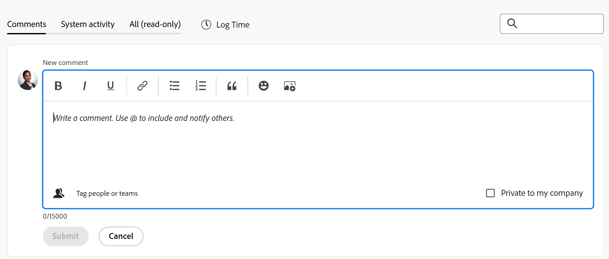

# Atualizar trabalho

{{highlighted-preview}}

<!-- Audited: 1/2024 -->

<!--take "legacy" and "new commenting" references out when we remove the legacy - April 2024???-->

<!--The highlighted information on this page refers to functionality not yet generally available. It is available only in the Preview environment for all customers. 

For information about the current release schedule, see [First Quarter 2024 release overview](../../product-announcements/product-releases/24-q1-release-activity/24-q1-release-overview.md). -->

<!--
After the monthly releases to Production, the same features are also available in the Production environment for customers who enabled fast releases.   
For information about fast releases, see [Enable or disable fast releases for your organization](../../administration-and-setup/set-up-workfront/configure-system-defaults/enable-fast-release-process.md)  
-->

>[!IMPORTANT]
>
>No momento, estamos reprojetando a experiência de comentários no Adobe Workfront.
>
>Dependendo dos objetos para os quais você acessa a experiência de comentários, você pode ver a seguinte funcionalidade para a seção Atualizações:
>* A nova experiência
>* A experiência herdada
>* A experiência nova e herdada
>
>Para obter mais informações sobre a nova experiência de comentários e sua disponibilidade, consulte [Nova experiência de comentários](../../product-announcements/betas/new-commenting-experience-beta/unified-commenting-experience.md).
>
>A nova experiência de comentários está disponível somente para a seção Atualizações de objetos do Workfront e não está disponível ao acessar atualizações das seguintes áreas:
>
> * Início
> * Painel Resumo em listas
> * Painel Resumo em Planilhas de Horas
> * Painel Resumo no Balanceador de carga de trabalho
>
>A nova experiência de comentários está disponível no painel Resumo em listas, folhas de horas e o Balanceador de carga de trabalho no ambiente de Pré-visualização.

<!-- with October 26 release: add somewhere this, and decide where we need to keep information about the legacy commenting. Should we create an article about iterations comments like we have for goals and cards?!:

>[!NOTE]
>
>Iterations display the legacy commenting experience.-->

<!--old message, before Auhust 17: 

>[!NOTE]
>
>We are currently redesigning the commenting experience in Adobe Workfront.
>
>For more information about the new commenting experience, see [New commenting experience](../../product-announcements/betas/new-commenting-experience-beta/unified-commenting-experience.md). 
>
>You can access the new experience for the following objects:
> * Issues, projects, tasks, and documents.
>
>     This is available when you enable the commenting Beta experience.
>
>     This functionality is available only for the Updates section, and it is not available for the following areas:
>
>     * Home
>     * Summary panel in lists
>     * Summary panel in timesheets
>
> * Goals, cards in the Boards area
>
>   The new commenting experience is the only experience for goals and cards. You must have an additional license to access Workfront Goals. For more information, see [Requirements to use Workfront Goals](../../workfront-goals/goal-management/access-needed-for-wf-goals.md). 
>
>     You can add and view updates to cards in the Boards area when you enable the Comments and System Activity sections on a card. For more information, see [Add an ad hoc card to a board](../../agile/get-started-with-boards/add-card-to-board.md).
-->

## Considerações sobre a atualização do trabalho

* Você pode adicionar comentários à maioria dos objetos no Adobe Workfront na seção Atualizações. Para obter mais informações sobre quais objetos exibem a seção Atualizações, consulte [Visão geral da seção Atualizações](../updating-work-items-and-viewing-updates/updates-tab-overview.md).

* Você pode adicionar comentários a objetos do Workfront de outros aplicativos integrados ao Workfront ou do aplicativo móvel Workfront.

  Nem todos os aplicativos integrados ao Workfront podem adicionar comentários a objetos do Workfront.

  Nem todos os recursos disponíveis na seção Atualizações de um objeto no Workfront estão disponíveis em outros aplicativos, ao acessar objetos do Workfront pelo aplicativo. Por exemplo, os recursos de Rich Text ou tornar um comentário privado para a Empresa de alguém podem não estar disponíveis ao adicionar comentários a um objeto do Workfront a partir de um aplicativo de terceiros.

* Você pode se comunicar sobre o progresso em um objeto do Workfront (projeto, tarefa ou problema), conforme comenta no objeto. Os usuários atribuídos ou inscritos no objeto podem receber uma notificação sobre sua atualização. Qualquer pessoa com acesso de Visualização ao objeto pode visualizar sua atualização.

* É possível marcar os usuários para chamar a atenção deles para a atualização. Os usuários marcados receberão uma notificação no aplicativo e um email sobre a atualização.

  >[!TIP]
  >
  >   Na nova experiência de comentários, os proprietários dos comentários são marcados automaticamente. Para obter mais informações, consulte [Marcar outros usuários em atualizações](../../workfront-basics/updating-work-items-and-viewing-updates/tag-others-on-updates.md).
  <!--take the "in the new commenting experience" out when this is the only experience-->

* Você pode adicionar um comentário a um objeto que pode ser exibido ou pode fazer logon como administrador de grupo ou da Workfront e adicionar um comentário em nome de outro usuário. Para obter mais informações, consulte [Fazer logon como outro usuário](../../administration-and-setup/add-users/create-and-manage-users/log-in-as-another-user.md).

* Você pode adicionar uma atualização a projetos, tarefas e problemas nas seguintes áreas do Workfront:

   * De um objeto do Workfront, na seção Atualizações
   * Na área Início (para tarefas e problemas)
   * No painel Resumo, em uma lista de objetos, uma folha de horas ou no Balanceador de carga de trabalho (para tarefas e problemas)

As informações nesta página descrevem como comentar em objetos do Workfront e como você atualiza projetos, tarefas e problemas ao adicionar comentários a eles.

<!--take this out (below) when we remove legacy out of the application-->

Para obter informações sobre comentários sobre metas, consulte [Gerenciar comentários de meta em Metas do Adobe Workfront](../../workfront-goals/goal-management/manage-goal-comments.md). Você deve ter uma licença adicional para acessar o Workfront Goals.

Para obter informações sobre comentários em cartões na área Quadros, consulte [Adicionar um cartão ad hoc a um quadro](../../agile/get-started-with-boards/add-card-to-board.md).

## Requisitos de acesso

Você deve ter o seguinte acesso para executar as etapas deste artigo:

<table style="table-layout:auto"> 
 <col> 
 </col> 
 <col> 
 </col> 
 <tbody> 
  <tr> 
   <td role="rowheader"><strong>plano do Adobe Workfront</strong></td> 
   <td> 
Qualquer
 </td> 
  </tr> 
  <tr> 
   <td role="rowheader"><strong>Licença do Adobe Workfront</strong></td> 
   <td> 
   
Atual: solicitação ou superior para ocorrências e documentos; Revisão ou superior para todos os outros objetos

   
Novo: Colaborador ou superior para problemas e documentos: Claro ou superior para todos os outros objetos
 
   </td> 
  </tr> 
  <tr> 
   <td role="rowheader"><strong>Configurações de nível de acesso</strong></td> 
   <td> 
Acesso de Visualização ou Edição para o objeto no qual a atualização está
</td> 
  </tr> 
  <tr> 
   <td role="rowheader"><strong>Permissões de objeto</strong></td> 
   <td> 
Visualizar acesso ao objeto
</td> 
  </tr> 
 </tbody> 
</table>

Para obter mais detalhes sobre as informações nesta tabela, consulte [Requisitos de acesso na documentação do Workfront](/help/quicksilver/administration-and-setup/add-users/access-levels-and-object-permissions/access-level-requirements-in-documentation.md).

## Adicionar uma atualização a um item de trabalho

Adicionar uma atualização a um item de trabalho difere dependendo da versão da seção Atualizações usada.

Você pode adicionar atualizações aos seguintes objetos:

* Projetos
* Tarefas
* Problemas
* Programas
* Portfólios
* Modelos
* Modelos de tarefa
* Usuários
* Planilhas de horas
* Equipes
* Metas
* Cartões na área Quadros
* Iterações

### Adicionar uma atualização a um item de trabalho na seção Atualizações herdadas

>[!IMPORTANT]
>
>As informações nesta página descrevem como você atualiza projetos, tarefas e problemas.

1. Vá para o item de trabalho para o qual deseja fornecer uma atualização (como um projeto, tarefa ou problema).
1. Clique em **Atualizações** seção.
1. (Condicional) Se estiver ativado, clique na guia **Novo comentário** no canto superior direito da seção Atualizações para desativá-la e ativar a experiência de comentários herdada.
1. Clique em **Iniciar uma nova atualização,** em seguida, digite a atualização.
1. (Opcional) Use as opções na barra de ferramentas de Rich Text para formatar o texto, adicionar emojis, links ou imagens à atualização e aprimorar o conteúdo. Para obter mais informações, consulte [Usar Rich Text em uma atualização do Workfront](#use-rich-text-in-a-workfront-update) neste artigo.
1. (Opcional) Atualize qualquer uma das seguintes informações sobre o item de trabalho:

   <table style="table-layout:auto"> 
    <col> 
    <col> 
    <tbody> 
     <tr> 
      <td role="rowheader"><strong>Notificar</strong></td> 
      <td>Identifique os usuários que devem ser notificados sobre a atualização. Os usuários atribuídos ou inscritos no objeto recebem automaticamente uma notificação quando uma atualização é feita. 
Para obter informações sobre como incluir outras pessoas em uma atualização, consulte <a href="../../workfront-basics/updating-work-items-and-viewing-updates/tag-others-on-updates.md" class="MCXref xref">Marcar outros usuários em atualizações</a>.
</td> 
     </tr> 
     <tr> 
      <td role="rowheader"><strong>Data de confirmação</strong></td> 
      <td>No seletor de datas, selecione a data em que você confirma a conclusão do item de trabalho. Para obter informações sobre a Data de confirmação, consulte <a href="../../manage-work/projects/updating-work-in-a-project/overview-of-commit-dates.md" class="MCXref xref">Visão geral da data de compromisso</a>.</td> 
     </tr> 
     <tr> 
      <td role="rowheader"><strong>Condição</strong></td> 
      <td>Selecione uma nova condição para a tarefa ou problema. Para obter informações sobre como selecionar uma condição, consulte <a href="../../manage-work/projects/updating-work-in-a-project/update-condition-for-tasks-and-issues.md" class="MCXref xref">Atualizar condição para tarefas e problemas</a>.</td> 
     </tr> 
     <tr> 
      <td role="rowheader"><strong>Status</strong></td> 
      <td>Clique na seta ao lado do status atual e selecione o status desejado no menu suspenso. Para obter informações sobre como configurar um Status, consulte <a href="../../manage-work/projects/updating-work-in-a-project/update-task-status.md" class="MCXref xref">Atualizar status da tarefa</a>.
A atualização do status de um item de trabalho não altera automaticamente o status de um projeto. Dependendo de como seu projeto está configurado, você pode atualizar o status do projeto separadamente. Para obter mais informações sobre os vários tipos de atualização de projeto, consulte <a href="../../manage-work/projects/manage-projects/select-project-update-type.md" class="MCXref xref">Selecione o tipo de atualização do projeto </a>.

<b>Nota</b>

   Você não pode alterar o status de um item de trabalho enquanto ele estiver no status Aprovação pendente.
</td>
   </tr> 
     <tr> 
      <td role="rowheader"><strong>Barra de conclusão</strong></td> 
      <td>(Disponível somente em tarefas) Indique a porcentagem de trabalho concluído deslizando a barra de progresso para a porcentagem desejada. Você também pode clicar duas vezes na barra de conclusão e inserir o percentual concluído.</td> 
     </tr> 
     <tr> 
      <td role="rowheader"><strong>Privativo(s) de minha empresa</strong></td> 
      <td> 
Desabilite esta opção para impedir que usuários fora da sua empresa tenham acesso a esta atualização.
 
      
<b>Nota</b>

      
Essa opção é exibida somente quando o usuário está associado a uma Empresa.

      
Esta opção não está disponível em todas as áreas nas quais você pode adicionar atualizações. Por exemplo, isso não está disponível em aplicativos de terceiros nos quais você pode adicionar atualizações do. 

      </td> 
     </tr> 
    </tbody> 
   </table>

1. Clique em **Atualizar** para adicionar a atualização ao objeto do Workfront.

   >[!NOTE]
   >
   >Uma pequena janela pop-up será exibida por sete segundos após clicar em **Atualizar**, permitindo que você desfaça a atualização e retorne ao painel de edição antes que a atualização seja publicada. A atualização é publicada se você ignorar a janela pop-up desfazer, esperar que ela desapareça ou sair da página.
   >
   >Se o administrador do Workfront selecionar a configuração &quot;Nunca permitir que os usuários excluam comentários&quot; no seu nível de acesso, não será possível desfazer um comentário. Para obter mais informações, consulte [Criar e modificar níveis de acesso personalizados](../../administration-and-setup/add-users/configure-and-grant-access/create-modify-access-levels.md).

1. Para responder a uma atualização, consulte [Responder a atualizações](../../workfront-basics/updating-work-items-and-viewing-updates/reply-to-updates.md).

### Adicionar uma atualização a um item de trabalho usando a nova experiência de comentários

1. Localize o objeto que você deseja atualizar (projeto, tarefa ou problema) e clique no nome para abrir a página do objeto.
1. Clique em  **Atualizações** no painel esquerdo.
1. (Condicional) Se a variável **Novo comentário** estiver desativada, clique em para ativá-la.

   Isso habilita a nova experiência de comentários. A variável **Comentários** é selecionada por padrão.

1. Comece a inserir um comentário no **Novo comentário** caixa.

   

   Exemplo de nova caixa de comentário no ambiente de Pré-visualização:
   

   

   Exemplo de nova caixa de comentário no ambiente de Produção:
   

   >[!TIP]
   >
   >Sair da seção Atualizações antes de terminar de digitar e enviar um comentário mantém o comentário na página no modo de rascunho mesmo depois de fazer logoff e logon novamente. As imagens adicionadas ao comentário também são salvas no rascunho. Os rascunhos são salvos por 7 dias após os quais são descartados e não podem ser recuperados. Comentários em rascunho só ficam visíveis para o usuário que os digita.

1. (Opcional) Para desfazer ou refazer uma alteração, use as seguintes teclas de atalho:
   * CTRL + Z (⌘+z para Mac) para desfazer uma alteração
   * CTRL + Y (⌘+y para Mac) para refazer uma alteração
1. (Opcional) Na **Marcar pessoas ou equipes** digite o nome ou o email de um usuário ou de uma equipe que deseja incluir neste comentário e, em seguida, selecione-o quando ele for exibido na lista.
1. (Opcional) Use as opções na barra de ferramentas de Rich Text para formatar o texto, adicionar emojis, links ou imagens à atualização e aprimorar o conteúdo. Para obter mais informações, consulte [Usar Rich Text em uma atualização do Workfront](#use-rich-text-in-a-workfront-update) neste artigo.

   >[!TIP]
   >
   >Se outro usuário enviar um comentário para o mesmo item que você está atualizando, há uma linha vermelha com um indicador &quot;Novo&quot; para informá-lo sobre os comentários mais recentes.
   >
   >O indicador é exibido somente depois que o comentário foi enviado no item, e não quando o comentário ainda está composto.
   >
   >O indicador &quot;Novo&quot; é exibido somente quando o usuário que inseriu uma nova atualização, bem como o usuário que está inserindo uma atualização no momento, estão usando a nova experiência de comentário.
   >

1. Clique em **Enviar** para adicionar a atualização ao objeto do Workfront.
1. Para editar um comentário, clique no link **Mais** menu  no canto superior direito do comentário e clique em **Editar**.

   >[!IMPORTANT]
   >
   >Você pode editar seu comentário somente em 15 minutos a partir do envio.

1. Edite as informações no comentário, adicione ou remova imagens ou remova qualquer um dos usuários marcados. Um indicador &quot;Editado&quot; é adicionado à esquerda do carimbo de data que é exibido quando o comentário é inserido.

   >[!TIP]
   >
   >Os comentários do ano atual não exibem o ano no carimbo de data. Passar o mouse sobre um carimbo de data e hora exibe a data completa, incluindo o ano.

   

   >[!TIP]
   >
   >* Um email é gerado para notificar os usuários sobre sua atualização somente quando você envia a atualização original. Nenhum email é gerado após a edição da atualização.
   >* O carimbo de data ao lado do comentário é a data do comentário original, não a data da última edição.
   >* Quando você adiciona um comentário em nome de outro usuário (ao fazer logon como outro usuário como Workfront ou administrador de grupo), não é possível editar o comentário se você estiver conectado como o outro usuário. Você pode editar o comentário somente depois de fazer logoff como usuário e logon novamente como você mesmo.

1. (Opcional) Clique em **Responder** ou comece a digitar um comentário no campo **Adicionar resposta...** para responder a um comentário existente, siga as etapas 4 a 8 acima. <!--(**************insure this stays accurate***********)--> Para obter informações sobre como responder a uma atualização, consulte [Responder a atualizações](../../workfront-basics/updating-work-items-and-viewing-updates/reply-to-updates.md).

1. (Condicional e opcional) Se outros usuários tiverem adicionado comentários que são exibidos fora da área visível na seção Atualizações enquanto você estava adicionando seus comentários, clique em **Exibir** dentro do azul **novo banner de comentários** na parte inferior da tela para exibir esses comentários.

   

   Comentários adicionais são exibidos na parte inferior da tela.

   >[!NOTE]
   >
   >   O indicador &quot;novos comentários&quot; e o botão &quot;Exibir&quot; são exibidos somente quando os usuários que inseriram as novas atualizações, bem como o usuário que está atualmente visualizando a seção Atualizações, estão usando a nova experiência de comentário.

1. (Opcional) Clique no link **Curtir** ícone. O ícone é atualizado com o número de curtidas.
1. (Condicional e opcional) Se você incluiu outras pessoas em seu comentário, clique no número de membros incluídos na atualização para exibir uma lista de entidades com as quais o comentário inserido é compartilhado.

   

   >[!TIP]
   >
   >Os nomes das duas primeiras entidades marcadas são exibidos ao lado de seus avatares. Se mais de duas entidades forem marcadas, somente o nome da primeira e o número de entidades adicionais serão exibidos.

1.  (Opcional) Clique no nome de um comentarista para ver seu nome, função e endereço de email em uma caixa de informações. Clique no nome do comentarista novamente na caixa de informações para abrir o perfil do usuário.
1. (Opcional) Clique no link **Atividade do sistema** para ver as atualizações registradas pelo sistema. Quando o objeto ou qualquer um de seus filhos é atualizado, o Workfront gera uma observação sobre essa atualização e a exibe na guia Atividade do sistema.

   Para obter mais informações, consulte [Visão geral da seção Atualizações](../updating-work-items-and-viewing-updates/updates-tab-overview.md).

   >[!TIP]
   >
   >Não é possível adicionar um comentário a uma atualização do sistema. No entanto, todas as respostas feitas aos registros de atividade do sistema na experiência de comentários herdada são preenchidas na guia Atividade do sistema como somente leitura.

1. (Opcional) Clique no link **Todos** para exibir comentários do usuário e comentários de atividades do sistema em um local. Esta é uma guia somente para visualização.

   >[!TIP]
   >
   >Não é possível responder a comentários ou marcar outros usuários em comentários existentes na guia Todos. Para responder a um comentário na guia Todos, clique em **Responder em Comentários** para abrir o comentário na guia Comentários.

## Usar Rich Text em uma atualização do Workfront{#use-rich-text-in-a-workfront-update}

<!--October 2023: remove this top note when we get to parity with the current version, OR change the note to mention that some options are ONLY available in the Beta version and not the current one.-->

>[!NOTE]
>
>As informações a seguir descrevem o uso de Rich Text na nova experiência de comentário, a menos que especificado de outra forma.

Você pode aprimorar suas atualizações usando Rich Text ou adicionando vários itens a ele, como emojis, links ou imagens.

1. Vá para a **Atualizações** de um objeto do Workfront e comece a digitar um comentário.
1. (Opcional) Para adicionar uma formatação de Rich Text à atualização, use os atributos na **Rich Text** à medida que você digita.

   

   <!--October 2023: the individual icons in the toolbar will need replacing-->

   | **Atributo** | **Botão da barra de ferramentas** | **Teclas de atalho do Mac** | **Teclas de atalho do Windows** |
   |---|---|---|---|
   | Negrito |  | ⌘+b | Ctrl+O |
   | Itálico |  | ⌘+i | Ctrl+I |
   | Sublinhar |  | ⌘+u | Ctrl+S |
   | Hiperlink |  |  Para abrir a caixa Adicionar links: ⌘+K   Para colar um link sobre o texto selecionado: ⌘+V  |  Para abrir a caixa Adicionar links: Ctrl+K   Para colar um link sobre o texto selecionado: Ctrl+V  |
   | Lista com marcadores |  | ⌘+Shift+8 | Ctrl+Shift+8 |
   | Lista numerada |  | ⌘+Shift+7 | Ctrl+Shift+7 |
   | Cotação de bloco |  | ⌘+Shift+9 |  Ctrl+Shift+9   Isso não está disponível na nova experiência de comentários.   |

   <!--remove the last row when we remove legacy from the system-->

   Para interromper a formatação do texto, desmarque o atributo no **Rich Text** barra de ferramentas.

   <!-- in the table above: take "Create Links" verbiage from the hyperlink when the old commenting is removed and the commenting beta is the only way to comment - with October 2023-->

   >[!NOTE]
   >
   >* A formatação também é exibida em qualquer notificação por email que os usuários recebem contendo sua atualização.
   >* A formatação de Rich Text aplicada a uma atualização em um email não é exibida na atualização quando visualizada na guia Atualizações.
   >* Se sua organização usar o Workfront com o Internet Explorer, qualquer texto formatado colado em uma atualização perderá sua formatação Rich Text e será exibido como texto sem formatação. É possível reformatar o texto usando os atributos na barra de ferramentas Rich Text.
   >* A formatação Rich Text não está disponível para atualizações feitas na área Folhas de horas ou para objetos de Nota e Última condição exibidos em um relatório.

1. (Opcional e condicional) Se quiser incluir texto de atualizações anteriores ou de outras fontes e diferenciá-lo da sua própria atualização, você poderá marcá-lo como uma Cotação de Bloco. Clique em **Cotação de bloco** ícone  e digite o texto que deseja citar. O texto citado é exibido marcado com uma linha cinza vertical. Clique em **Cotação de bloco** para retornar à formatação normal. Isso não está disponível na nova experiência de comentários.

   <!--remove this picture below and the bullet above when we remove legacy-->

   

1. (Opcional) Clique no link **emoji** ícone  para adicionar emojis à atualização.

   >[!NOTE]
   >
   >* O Workfront não substitui emoticons de pontuação, como :) por emojis.
   >* Os emojis não estão disponíveis para os objetos Nota e Última Condição exibidos em um relatório.
   >* O recurso emoji no Workfront utiliza caracteres Unicode e, como tal, é exibido apenas em navegadores e sistemas operacionais que oferecem suporte a pontos de código Unicode. Usuários em uma plataforma, navegador ou versão de sistema operacional diferente da sua podem não ter acesso aos mesmos emojis.
   >* Um emoji não suportado é representado por uma caixa preta ou branca.
   >* O Windows 7 suporta apenas emojis em preto-e-branco.
   >* Os emojis aplicados a uma atualização feita por email não são exibidos na atualização quando visualizados na área Atualizações.

1. (Opcional) Para adicionar um link de URL a fontes de informações adicionais:

   1. Clique em na atualização em que deseja inserir um link.
   1. No **Rich Text** barra de ferramentas, clique no link **Hiperlink** ícone .

   1. No **Criar link** que aparece, em **URL**, digite ou cole o URL da origem à qual deseja vincular.

   1. Em **Texto a ser exibido**, digite ou cole o texto do link.
   1. Clique em **Salvar**.

1. (Opcional) Para anexar uma imagem à atualização, siga um destes procedimentos:

   * Salve a imagem no computador e arraste-a e solte-a na área Novo comentário.
   * Copie uma captura de tela do computador e cole-a no comentário. Isso não está disponível na experiência de comentários herdada.
   * Clique em **Adicionar imagem** ícone  e navegue até a imagem no computador.

   >[!NOTE]
   >
   >* O administrador do Workfront deve ativar a adição de imagens na seção Preferências de atualização de feeds da área Interface do Workfront antes que você possa ver os ícones de Imagem ou Adicionar anexo. Para obter informações, consulte [Configurar preferências para atualizações de usuário](../../administration-and-setup/set-up-workfront/system-tracked-update-feeds/configure-preferences-user-updates.md).
   >* O tamanho máximo do arquivo de imagem é 7 MB. Os tipos de arquivo de imagem compatíveis são .jpg, .gif e .png.
   >* As imagens podem ser acessadas na seção Atualizações em um objeto e também estão disponíveis na área Documentos do Menu principal.
   >* Você pode colar a imagem clicando com o botão direito do mouse no novo comentário ou pressionando CTRL + V para Windows (ou ⌘ + V para Mac) no teclado.
   >* É possível enviar uma atualização com uma imagem e nenhum texto.
   >* Quando você exclui um comentário que contém uma imagem, os seguintes cenários existem, dependendo da experiência escolhida:
   >
   >     * Na experiência de comentários herdada, a imagem permanece na área Documentos, mas não é mais visível na seção Atualizações.
   >     * Na nova experiência de comentários, a imagem é removida da seção Atualizações, bem como da área Documentos. A imagem também é excluída da área Documentos ao editar um comentário e excluir a imagem.
   >* Quando alguém exclui uma imagem anexada a um comentário da área Documentos, ela também é removida do comentário.

   <!--remove the statement above about legacy, when we remove the legacy environment.-->

1. (Opcional) Para exibir uma imagem na atualização existente, siga um destes procedimentos:

   * Clique em **Visualizar** ícone  na miniatura da imagem para abrir a imagem em tamanho real em uma nova guia do navegador.
   * Clique em **Baixar** ícone  na miniatura da imagem para baixar a imagem.

1. Clique em **Enviar** para adicionar seu comentário.

## Procurar uma atualização

>[!NOTE]
>
>Essa funcionalidade está disponível somente para a guia Comentários na nova experiência de comentário. Isso não está disponível para a guia Atividade do sistema da seção Atualizações.

Você pode procurar um comentário ou uma resposta na seção Atualizações de um objeto.

1. Vá para a **Atualizações** seção de um objeto.
1. Comece a digitar uma palavra-chave <!--or a user's name --> no **Pesquisar** no canto superior direito da caixa **Comentários** guia.

   <!--Add this tip or note instead of the note below - when it'll be possible: You can search for users who have been tagged or for comment owners.-->

   >[!NOTE]
   >
   >Você pode pesquisar somente palavras que pertençam ao texto de um comentário ou resposta. Não é possível pesquisar nomes de usuários ou equipes marcados em uma atualização.

   

   Exemplo de pesquisa no ambiente de Pré-visualização:
   

   

   Exemplo de pesquisa no ambiente de produção:
   

   A palavra-chave <!--or user--> pesquisado for realçado e os comentários que o contêm serão exibidos na parte superior da seção Atualizações.

   O Workfront pesquisa todo o fluxo de atualização do objeto, fora dos comentários que estão visíveis na tela.

1. Clique em **x** no campo de pesquisa para limpar os resultados da pesquisa e retornar a todos os comentários.

<!-- when we release search to production, check above and make sure you don't have to add that the users tagged/ owners are also searchable-->

## Copiar informações de atualização

Há várias maneiras de copiar uma atualização. Depois de copiar um link, você pode compartilhá-lo com outras pessoas para direcioná-las para a atualização.

Copiar uma atualização é diferente, dependendo da experiência de comentário usada.

### Copiar uma atualização na nova experiência de comentários

Para obter informações sobre quais recursos estão disponíveis para a nova experiência de comentários e para quais objetos, consulte [Nova experiência de comentários](../../product-announcements/betas/new-commenting-experience-beta/unified-commenting-experience.md).

<!--when we remove and deprecate the legacy stream, add screen shots in the sections below- October 2023-->

Você pode copiar informações de um comentário existente seguindo um destes procedimentos:

* [Copiar link](#copy-link)
* [Copiar texto do corpo](#copy-body-text)
* [Citar resposta](#quote-reply-1)

#### Copiar link

A opção Copiar link copia o comentário ou o link do encadeamento para a área de transferência para que você possa compartilhar o comentário ou todo o encadeamento com outros usuários.

1. Vá para a atualização cujo link deseja copiar.

1. Clique em **Mais** e clique em **Copiar link**.

1. Cole o link copiado na etapa anterior em um email ou outro aplicativo para compartilhá-lo com outras pessoas. O link compartilhado abre o comentário do qual você compartilhou o link.

   >[!TIP]
   >
   >Quando você compartilha o link de uma conversa em um objeto filho de um objeto de classificação mais alta, o link abre a thread na área Atualizações do objeto de classificação mais alta.
   >
   >Por exemplo, se você copiar o link de um comentário de tarefa da área Atualizações do projeto, o comentário abrirá a página do projeto.

#### Copiar texto do corpo

A opção Copiar texto do corpo copia o texto de uma atualização específica para a área de transferência.

1. Vá para a atualização ou resposta que deseja copiar.
1. Clique em **Mais** e clique em **Copiar texto do corpo**.

#### Citar resposta

A opção Citar resposta copia o comentário original para uma nova resposta como uma cotação em bloco.

1. Vá para a atualização ou resposta que deseja copiar.
1. Clique em **Mais** e clique em **Citar resposta**.

   Uma nova caixa de comentário é aberta e a resposta entre aspas é incluída no novo comentário e marcada como aspas de bloco.

   

   <!--ensure the screen shot above is correct - missing he block quote icon in rich text -->

1. Continue adicionando sua atualização e clique em **Enviar** para adicionar o comentário.

### Copiar uma atualização na experiência de comentários herdada

<!--remove legacy when removed from the UI-->

* [Copiar a atualização](#copy-the-update)
* [Copiar o link da thread](#copy-the-thread-link)
* [Copiar o link de atualização](#copy-the-update-link)
* [Citar resposta](#quote-reply)

  >[!TIP]
  >
  >Ao copiar e compartilhar o link de uma conversa em um objeto filho de um objeto de classificação mais alta, o link abre a thread na área Atualizações do objeto filho.
  >
  >Por exemplo, se você copiar o link de um comentário de tarefa da área Atualizações do projeto, o comentário abrirá a página da tarefa.

#### Copiar a atualização {#copy-the-update}

Esta opção copia o texto de uma atualização específica para a área de transferência.

1. Vá para a atualização ou resposta que deseja copiar.
1. Clique em **Mais** e clique em **Copiar texto do corpo**.

   

#### Copiar o link da thread {#copy-the-thread-link}

Essa opção copia o link completo da thread para a área de transferência, para que você possa compartilhar a thread com outros usuários.

1. Vá para o thread de atualização que deseja copiar.

1. Clique em **Mais** e clique em **Copiar link da discussão**.

   

1. Cole o link copiado na etapa anterior em um email ou outro aplicativo para compartilhá-lo com outras pessoas. O link compartilhado abre o comentário do qual você compartilhou o link.

#### Copiar o link de atualização {#copy-the-update-link}

Esta opção copia um link de atualização específico para a área de transferência. Quando você compartilha o link de atualização, o usuário que o segue vê uma borda ao redor da atualização.

1. Vá para a atualização ou resposta que deseja copiar.
1. Clique em **Mais** ao lado da atualização individual e clique em **Copiar link de atualização**.

   

1. Cole o link copiado na etapa anterior em um email ou outro aplicativo para compartilhá-lo com outras pessoas. O link compartilhado abre o comentário do qual você compartilhou o link.

#### Citar resposta

A opção Citar resposta copia o comentário original para uma nova resposta como uma cotação em bloco.

1. Vá para a atualização ou resposta que deseja copiar.
1. Clique em **Mais** e clique em **Citar resposta**.

   Uma nova caixa de comentário é aberta e a resposta entre aspas é incluída no novo comentário e marcada como aspas de bloco.

1. Continue adicionando sua atualização e clique em **Responder** para adicionar o comentário.

## Excluir uma atualização ou resposta

Dependendo do acesso que seu administrador do Workfront fornecer, talvez você possa excluir as atualizações adicionadas na guia Atualizações de um objeto. Para obter mais informações, consulte [Criar ou modificar níveis de acesso personalizados](../../administration-and-setup/add-users/configure-and-grant-access/create-modify-access-levels.md#creating-a-new-access-from-scratch) no artigo [Criar ou modificar níveis de acesso personalizados](../../administration-and-setup/add-users/configure-and-grant-access/create-modify-access-levels.md).

Nenhum usuário do Workfront (incluindo o administrador do Workfront) pode excluir atualizações feitas por outro usuário. No entanto, se o nível de acesso de um usuário permitir que ele exclua suas próprias atualizações, o administrador do Workfront poderá fazer logon como esse usuário e excluir as atualizações feitas. Para obter mais informações, consulte [Criar ou modificar níveis de acesso personalizados](../../administration-and-setup/add-users/configure-and-grant-access/create-modify-access-levels.md#creating-a-new-access-from-scratch) e [Fazer logon como outro usuário](../../administration-and-setup/add-users/create-and-manage-users/log-in-as-another-user.md).

1. Vá para a atualização ou resposta que deseja excluir.
1. Clique em **Mais** menu ao lado da atualização ou resposta que deseja excluir e clique em **Excluir**. <!--October 2023 - replace screen shot here-->

   

1. Na mensagem exibida, clique em **Excluir**.

   >[!NOTE]
   >
   >Excluir uma atualização com uma imagem anexada exclui o comentário e a imagem. Para obter mais informações, consulte [Usar Rich Text em uma atualização do Workfront](#use-rich-text-in-a-workfront-update) neste artigo.

   Quando o comentário excluído tiver respostas associadas, há uma indicação de que o comentário foi removido com o nome do usuário que o removeu.

   

   Os comentários excluídos são removidos imediatamente do Workfront. Um usuário que usa a seção Atualizações vê um comentário sendo excluído por outro usuário em tempo real.

   <!--when we remove the beta, take out the first part of the sentence above about only when commenting in beta experience. Leave the rest though-->

<!--this is no longer needed - adding timesheet comments is just like adding comments to any other object now

## Add an update on a Timesheet

1. Go to a Timesheet on which you want to make an update.
1. Click the Timesheet to open it.
1. At the bottom of the Timesheet, click **Include a comment**.
1. In the box that displays at the bottom of the Timesheet, type an update.

   

1. (Conditional) To save your update without submitting the Timesheet for approval, click **Save for Later**.

   Or

   To save your update and submit the Timesheet for approval, click **Submit for Approval**.

   Or

   If your Timesheet is not set up with an approver, click **Save and Close Timesheet** to save your update.

-->

## Ativar ou desativar atualizações do sistema

<!--update this section when we remove legacy, to just point to the article in green below and rename this section as "Review system activity updates" or something-->

<!--October 2023: when the new stream goes to all objects production, consider updating this article also, to say there is no System Activity tab to be disabled for objects anymore: help\quicksilver\administration-and-setup\set-up-workfront\system-tracked-update-feeds\system-tracked-update-feeds.md-->

>[!NOTE]
>
>Não é possível desativar as atualizações do sistema ao usar a nova experiência de comentários.
>As informações nesta seção se referem apenas à funcionalidade disponível na seção Atualizações herdadas. &lt;!—remova esta seção quando removermos o herdado do sistema->
>Para obter mais informações sobre atualizações do sistema na nova experiência de comentários, consulte [Visão geral da seção Atualizações](../updating-work-items-and-viewing-updates/updates-tab-overview.md).

A seção Atualizações de um objeto do Workfront exibe dois tipos de informações:

* **Atualizações de usuário:** Atualizações de usuário são comentários que você e outros usuários do sistema inseriram. <!--October 2023 - new screen shot -->

  

* **Atualizações do sistema:** As atualizações de sistema registram a remoção de ativos, a adição ou exclusão de versões, a anexação ou remoção de uma solicitação de aprovação, bem como quaisquer edições ou alterações feitas nos documentos no objeto. <!--October 2023 - new screen shot -->

  

  Dependendo da sua licença do Workfront, as atualizações do sistema podem ser ativadas por padrão. Os administradores do Workfront podem determinar o que é rastreado nas atualizações do sistema, conforme explicado em [Atualizações rastreadas pelo sistema](../../administration-and-setup/set-up-workfront/system-tracked-update-feeds/system-tracked-update-feeds.md). Você também pode filtrar as atualizações ou atividades do sistema para ver apenas as atualizações do usuário para todos os objetos.

  Os seguintes objetos não têm atualizações geradas pelo sistema:

   * Equipe
   * Modelo
   * Modelo de Tarefa

Para ativar ou desativar as atualizações do sistema:

1. Clique em **Atualizações** em um objeto.
1. Clique em **Mostrar atualizações do sistema** para deslizar o switch para a esquerda (desativado) ou para a direita (ativado).

   

   Essa opção é mantida em todos os objetos no Workfront e permanece na posição selecionada, mesmo que você faça logout do Workfront.

   >[!TIP]
   >
   >   Os objetos que não registram atualizações do sistema não têm a opção Mostrar Atualizações do Sistema na área Atualizações.

   <!--when Anna adds the new updates stream to ALL objects, she will remove the System Activity tab from the objects that don't record system updates - add another line to the TIP above to say: The System Activity tab is not available for objects that don't record system-generated updates.*************** OR: maybe make this part of the statement where we list which objects these are, above???  -->

