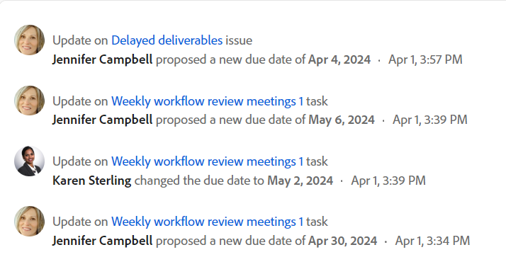

# Atualizar trabalho

<!--take "Beta" references out when we remove the beta-->

As informações destacadas nesta página se referem à funcionalidade ainda não disponível no geral. Está disponível somente no ambiente de Visualização.

>[!NOTE]
>
>No momento, estamos reprojetando a maneira como você atualiza o trabalho ao usar a seção Atualizações de um objeto.
>
>Você pode acessar o novo design ativando o comentário Beta.
>
>Atualmente, o Beta está disponível para problemas.
>
>Para obter mais informações sobre a nova experiência de atualização, consulte [Nova experiência de comentário](../updating-work-items-and-viewing-updates/unified-commenting-experience.md).

Você pode adicionar comentários à maioria dos objetos no Adobe Workfront na seção Atualizações . Para obter mais informações sobre quais objetos exibem a seção Atualizações , consulte [Visão geral da seção Atualizações](../updating-work-items-and-viewing-updates/updates-tab-overview.md).

É possível adicionar uma atualização em um objeto do Workfront (projeto, tarefa ou problema) para se comunicar sobre o progresso no objeto, conforme você comenta no objeto. Os usuários que estiverem atribuídos ou inscritos no objeto poderão visualizar sua atualização. Também é possível marcar usuários para chamar a atenção para a atualização. Os usuários marcados recebem uma notificação no aplicativo e um email sobre a atualização.

As informações nesta página descrevem como você pode comentar os objetos do Workfront e como você atualiza projetos, tarefas e problemas. Para obter informações sobre comentários sobre metas, consulte [Gerenciar comentários da meta nas Metas da Adobe Workfront](../../workfront-goals/goal-management/manage-goal-comments.md). Você deve ter uma licença adicional para acessar as Metas da Workfront.

Você pode adicionar uma atualização a projetos, tarefas e problemas das seguintes áreas do Workfront:

* Em um objeto do Workfront, na seção Atualizações
* Da área de trabalho (para tarefas e problemas)
* No painel Resumo em uma lista de objetos (para tarefas e problemas)
* Na folha de ponto (para tarefas e problemas)

## Requisitos de acesso

<!--
drafted for P&P release:
<table style="table-layout:auto"> 
 <col> 
 </col> 
 <col> 
 </col> 
 <tbody> 
  <tr> 
   <td role="rowheader"><strong>Adobe Workfront plan*</strong></td> 
   <td> 
Any
 </td> 
  </tr> 
  <tr> 
   <td role="rowheader"><strong>Adobe Workfront license*</strong></td> 
   <td> 
Current license: Contributor or higher for issues and documents: Light or higher for all other objects
 
   Or
   
Legacy  license: Request or higher for issues and documents; Review or higher for all other objects

   </td> 
  </tr> 
  <tr> 
   <td role="rowheader"><strong>Access level configurations*</strong></td> 
   <td> 
View or Edit access for the object the update is on
 
<b>NOTE</b>
   
   If you still don't have access, ask your Workfront administrator if they set additional restrictions in your access level. For information on how a Workfront administrator can modify your access level, see <a href="../../administration-and-setup/add-users/configure-and-grant-access/create-modify-access-levels.md" class="MCXref xref">Create or modify custom access levels</a>.
 </td> 
  </tr> 
  <tr> 
   <td role="rowheader"><strong>Object permissions</strong></td> 
   <td> 
View access to the object
 
For information on requesting additional access, see <a href="../../workfront-basics/grant-and-request-access-to-objects/request-access.md" class="MCXref xref">Request access to objects </a>.
 </td> 
  </tr> 
 </tbody> 
</table>
-->
Você deve ter o seguinte acesso para executar as etapas neste artigo:

<table style="table-layout:auto"> 
 <col> 
 </col> 
 <col> 
 </col> 
 <tbody> 
  <tr> 
   <td role="rowheader"><strong>Plano Adobe Workfront*</strong></td> 
   <td> 
Qualquer Um
 </td> 
  </tr> 
  <tr> 
   <td role="rowheader"><strong>Licença da Adobe Workfront*</strong></td> 
   <td> 
Pedido ou superior para questões e documentos; Revisar ou superior para todos os outros objetos
 </td> 
  </tr> 
  <tr> 
   <td role="rowheader"><strong>Configurações de nível de acesso*</strong></td> 
   <td> 
Exibir ou editar o acesso do objeto no qual a atualização está
 
<b>Nota</b>

Caso ainda não tenha acesso, pergunte ao administrador do Workfront se ele definiu restrições adicionais em seu nível de acesso. Para obter informações sobre como um administrador do Workfront pode modificar seu nível de acesso, consulte <a href="../../administration-and-setup/add-users/configure-and-grant-access/create-modify-access-levels.md" class="MCXref xref">Criar ou modificar níveis de acesso personalizados</a>.
 </td>
</tr> 
  <tr> 
   <td role="rowheader"><strong>Permissões de objeto</strong></td> 
   <td> 
Exibir acesso ao objeto
 
Para obter informações sobre como solicitar acesso adicional, consulte <a href="../../workfront-basics/grant-and-request-access-to-objects/request-access.md" class="MCXref xref">Solicitar acesso a objetos </a>.
 </td> 
  </tr> 
 </tbody> 
</table>

&#42;Para descobrir qual plano, tipo de licença ou acesso você tem, entre em contato com o administrador da Workfront.

## Adicionar uma atualização a um item de trabalho

<!--drafted for the commenting experience - change the NOTE at the top of the following section with every new release to other objects -->

A adição de uma atualização a um item de trabalho é diferente, dependendo da versão da seção Atualizações e do objeto escolhido.

### Adicionar uma atualização a um item de trabalho na seção Atualizações atuais

>[!NOTE]
>
>A funcionalidade a seguir está disponível para todos os objetos, exceto para metas. Você deve ter uma licença adicional para acessar as Metas da Workfront. Para obter informações sobre comentários sobre metas, consulte [Gerenciar comentários da meta nas Metas da Adobe Workfront](../../workfront-goals/goal-management/manage-goal-comments.md)

1. Vá para o item de trabalho para o qual deseja fornecer uma atualização (como um projeto, tarefa ou problema).
1. Clique no botão **Atualizações** seção.
1. Clique em **Iniciar uma nova atualização,** em seguida, digite a atualização.
1. (Opcional) Use Rich Text ou adicione emojis, links ou imagens à sua atualização para aprimorar seu conteúdo. Para obter mais informações, consulte a seção &quot;Usar rich text em uma atualização do Workfront&quot; neste artigo
1. (Opcional) Atualize qualquer uma das seguintes informações sobre o item de trabalho:

   <table style="table-layout:auto"> 
    <col> 
    <col> 
    <tbody> 
     <tr> 
      <td role="rowheader"><strong>Notificar</strong></td> 
      <td>Identifique usuários que devem ser notificados sobre a atualização. Os usuários atribuídos ou inscritos no objeto recebem automaticamente uma notificação quando uma atualização é feita. 
Para obter informações sobre como incluir outras pessoas em uma atualização, consulte <a href="../../workfront-basics/updating-work-items-and-viewing-updates/tag-others-on-updates.md" class="MCXref xref">Marcar outras pessoas em atualizações</a>.
</td> 
     </tr> 
     <tr> 
      <td role="rowheader"><strong>Data de confirmação</strong></td> 
      <td>No seletor de datas, selecione a data em que você comprometeu a concluir o item de trabalho. Para obter informações sobre a Data da Confirmação, consulte <a href="../../manage-work/projects/updating-work-in-a-project/overview-of-commit-dates.md" class="MCXref xref">Visão geral da data de confirmação</a>.</td> 
     </tr> 
     <tr> 
      <td role="rowheader"><strong>Condição</strong></td> 
      <td>Selecione uma nova condição para a tarefa ou o problema. Para obter informações sobre como selecionar uma condição, consulte <a href="../../manage-work/projects/updating-work-in-a-project/update-condition-for-tasks-and-issues.md" class="MCXref xref">Atualizar condição para tarefas e problemas</a>.</td> 
     </tr> 
     <tr> 
      <td role="rowheader"><strong>Status</strong></td> 
      <td>Clique na seta ao lado do status atual e selecione o status desejado no menu suspenso. Para obter informações sobre como definir um Status, consulte <a href="../../manage-work/projects/updating-work-in-a-project/update-task-status.md" class="MCXref xref">Atualizar status da tarefa</a>.
Atualizar o status de um item de trabalho não altera automaticamente o status de um projeto. Dependendo de como seu projeto está configurado, talvez seja necessário fazer atualizações no status do projeto separadamente. Para obter mais informações sobre os vários tipos de atualização de projeto, consulte <a href="../../manage-work/projects/manage-projects/select-project-update-type.md" class="MCXref xref">Selecione o Tipo de Atualização do projeto </a>.

<b>Nota</b>

   Não é possível alterar o status de um item de trabalho enquanto ele estiver em um status de Aprovação pendente.
</td>
   </tr> 
     <tr> 
      <td role="rowheader"><strong>Barra de conclusão</strong></td> 
      <td>(Disponível somente em tarefas) Indica a porcentagem de trabalho concluído deslizando a barra de progresso para a porcentagem desejada. Você também pode clicar duas vezes na barra de conclusão e inserir o percentual de conclusão.</td> 
     </tr> 
     <tr> 
      <td role="rowheader"><strong>Privativo(s) de minha empresa</strong></td> 
      <td> 
Desative essa opção para impedir que usuários de fora da empresa tenham acesso para visualizar essa atualização.
 
      
<b>Nota</b>

      
Essa opção é exibida somente quando o usuário está associado a uma Empresa.

      </td> 
     </tr> 
    </tbody> 
   </table>

1. Clique em **Atualizar** para adicionar a atualização ao objeto do Workfront.

   >[!NOTE]
   >
   >Uma pequena janela pop-up será exibida por sete segundos após clicar **Atualizar**, permitindo desfazer a atualização e retornar ao painel de edição antes da publicação da atualização. A atualização será publicada se você ignorar a pop-up desfazer, aguardar até que desapareça ou sair da página.
   >
   >Se o administrador do Workfront selecionar a configuração &quot;Nunca permitir que os usuários excluam comentários&quot; em seu nível de acesso, você não poderá desfazer um comentário. Para obter mais informações, consulte [Criar e modificar níveis de acesso personalizados](../../administration-and-setup/add-users/configure-and-grant-access/create-modify-access-levels.md).

1. Para responder a uma atualização, consulte [Responder atualizações](../../workfront-basics/updating-work-items-and-viewing-updates/reply-to-updates.md).

### Adicionar uma atualização a um item de trabalho usando os comentários da experiência Beta

>[!NOTE]
>
>A funcionalidade descrita nesta seção está disponível para os seguintes objetos:
>
>* Problemas, ao ativar a experiência de comentário Beta.
   >
   >   Essa funcionalidade está disponível somente para a seção Atualizações de problemas e não está disponível para as seguintes áreas:
   >
   >   * Página inicial
   >   * Painel Resumo em listas
   >   * Painel Resumo nas folhas de horas
>* Metas

   >
   >   A nova experiência de comentário é a experiência atual padrão para metas.
   >   Você deve ter uma licença adicional para acessar as Metas da Workfront. Para obter mais informações, consulte [Requisitos para usar as metas do Workfront](../../workfront-goals/goal-management/access-needed-for-wf-goals.md).

1. Localize o objeto que deseja atualizar e clique em seu nome para abrir a página do objeto.
1. Clique em  **Atualizações** no painel esquerdo.
1. Clique em **Experimente o comentário Beta** no canto inferior direito da área Atualizações e clique em **Concordar** sobre o contrato Beta. Isso alterna a área Atualizações para a experiência Beta de comentário. 
O 
**Comentários** é selecionada por padrão.
1. Comece a inserir um comentário na **Novo comentário** caixa.

   

   >[!TIP]
   >
   >Navegar para fora da seção Atualizações antes de terminar de digitar e enviar um comentário mantém o comentário na página no modo de rascunho mesmo depois de fazer logoff e logon novamente. Os comentários rascunhados são visíveis apenas para o usuário que os insere.

1. (Opcional) Na seção **Marcar pessoas ou equipes** , comece digitando o nome ou o email de um usuário ou de uma equipe que você gostaria de incluir neste comentário e selecione-o quando ele for exibido na lista.
1. (Opcional) Para adicionar formatação Rich Text à atualização, use qualquer uma das seguintes opções da **Texto formatado** barra de ferramentas para aprimorar o texto:

   * Negrito
   * Itálico
   * Sublinhar
   * Link
   * Lista com marcadores
   * Lista numerada
   * Adicionar anexo <!--(mark this parenthesis as draft: ************ this might be renamed to "Add image")-->

   Para obter mais informações, consulte a seção &quot;Usar rich text em uma atualização do Workfront&quot; neste artigo. <!--remove this list, above, when we get to parity for Rich Text-->

   <!--not available yet in preview - should be live with production: format this as a TIP: 
      * If another user submits a comment to the same item you are updating, there will be a red line with a "New" indicator to inform you of the newer comments. 
      * The indicator only displays only after the comment was submitted on the item, and not when the comment is still composed. 
      * The "New" indicator displays only when both the user that entered a new update as well as the user who is currently entering an update are using the new commenting experience. 
      -->

1. Clique em **Enviar** para adicionar a atualização ao objeto do Workfront.
1. (Opcional) Para editar um comentário, clique no botão **Mais** menu  à direita do ícone Curtir e, em seguida, clique em **Editar**.
1. Edite as informações no comentário ou remova qualquer um dos usuários marcados.
É possível editar seu comentário em 15 após enviá-lo. Um indicador &quot;Editado&quot; é adicionado à esquerda do carimbo de data que é exibido quando o comentário é atualizado.

   

   >[!TIP]
   >
   >   Um email é gerado para notificar os usuários sobre sua atualização somente quando você envia a atualização original. Nenhum email é gerado após você ter editado sua atualização.
1. (Opcional) Clique em **Responder** para responder a um comentário existente, siga as etapas 4 a 7 acima. <!--(**************insure this stays accurate***********)-->. Para obter informações sobre como responder a uma atualização, consulte [Responder atualizações](../../workfront-basics/updating-work-items-and-viewing-updates/reply-to-updates.md).
1. (Opcional) Clique no botão **Like** ícone. O ícone é atualizado com o número de curtidas.
1. (Condicional e Opcional) Se você incluiu pessoas adicionais em seu comentário, clique no número de membros incluídos na atualização para exibir uma lista de entidades com as quais o comentário inserido foi compartilhado.

   
1. (Opcional) Clique no botão **Atividade do sistema** para exibir as atualizações registradas pelo sistema. Quando o objeto ou qualquer um de seus filhos é atualizado, o Workfront gera uma nota sobre essa atualização e a exibe na guia Atividade do sistema.

   Para obter mais informações, consulte [Visão geral da seção Atualizações](../updating-work-items-and-viewing-updates/updates-tab-overview.md)

   >[!TIP]
   >
   >Não é possível adicionar um comentário a uma atualização do sistema.

## Usar rich text em uma atualização do Workfront

<!--remove this top note when we get to parity with the current version, OR change the note to mention that some options are ONLY available in the Beta version and not the current one.-->

>[!NOTE]
>
>Algumas das opções na barra de ferramentas Rich Text podem não estar disponíveis para os comentários da experiência Beta.

Você pode aprimorar suas atualizações usando Rich Text ou adicionando vários itens a ele, como emojis, links ou imagens.

1. Vá para a área Atualizações e comece a digitar um comentário.
1. (Opcional) Para adicionar formatação Rich Text à atualização, use quaisquer atributos na **Texto formatado** barra de ferramentas ao digitar.

   | **Atributo** | **Botão da barra de ferramentas** | **Teclas de atalho do Mac** | **Teclas de atalho do PC** |
   |---|---|---|---|
   | Negrito |  | Alt+b | Ctrl+B |
   | Itálico |  | Perguntas frequentes | Ctrl+I |
   | Sublinhar |  | Perguntas frequentes | Ctrl+U |
   | Hiperlink |  | ⌘+K | Ctrl+K |
   | Lista com marcadores |  | Alt+Shift+8 | Ctrl+Shift+8 |
   | Lista numerada |  | Alt+Shift+7 | Ctrl+Shift+7 |
   | Cotação de bloco |  | Alt+Shift+9 | Ctrl+Shift+9 |

   Para interromper a formatação do texto, desmarque o atributo no **Texto formatado** barra de ferramentas.

   >[!NOTE]
   >
   >* A formatação também é exibida em qualquer notificação por email recebida pelos usuários contendo sua atualização.
   >* A formatação Rich Text aplicada a uma atualização em um email não é exibida na atualização quando visualizada na guia Atualizações.
   >* Se sua organização usar o Workfront com o Internet Explorer, qualquer texto formatado colado em uma atualização perderá a formatação Rich Text e será exibido como texto sem formatação. Você pode reformatar o texto usando os atributos na barra de ferramentas Rich Text.
   >* A formatação Rich Text não está disponível para atualizações feitas na área Folhas de tempo ou para objetos de Observação e Última condição exibidos em um relatório.

1. (Opcional) Se você deseja incluir texto de atualizações anteriores ou de outras fontes e diferenciá-lo de sua própria atualização, você pode marcá-lo como uma Cotação de Bloco. Clique no botão **Cotação de Bloqueio** ícone  e digite o texto que deseja citar. O texto entre aspas é exibido marcado com uma linha cinza vertical. Clique no botão **Cotação de Bloqueio** novamente para retornar à formatação normal.

   

1. (Opcional) Adicione emojis à atualização.

   >[!NOTE]
   >
   >* O Workfront não substitui os emoticons de pontuação, como :) por emojis.
   >* Emojs não estão disponíveis para atualizações feitas na área Folhas de tempo ou para objetos de Observação e Última condição exibidos em um relatório.
   >* O recurso emoji no Workfront utiliza caracteres Unicode e, como tal, é exibido somente em navegadores e sistemas operacionais compatíveis com pontos de código Unicode. Os usuários em uma plataforma, navegador ou versão do sistema operacional diferente da sua podem não ter acesso aos mesmos emojis.
   >* Um emoji não suportado é representado por uma caixa preta ou branca.
   >* O Windows 7 suporta apenas emojis preto e branco.
   >* Os emails aplicados a uma atualização feita por email não são exibidos na atualização quando visualizados na área Atualizações.

1. (Opcional) Para adicionar um link de URL a fontes de informação adicionais:

   1. Clique em na atualização onde deseja inserir um link.
   1. No **Texto formatado** na barra de ferramentas, clique no botão **Hiperlink** ícone . 

   1. No **Criar link** que aparece, em **URL**, digite ou cole o URL da fonte à qual deseja vincular.

   1. Em **Texto a ser exibido**, digite ou cole o texto do link.
   1. Clique em **Salvar**.

1. (Opcional) Para anexar uma imagem à sua atualização, clique no botão **Imagem** ícone  e navegue até a imagem em seu computador.\
   Ou\
   Arraste a imagem para a área de atualização.

   >[!NOTE]
   >
   >* O administrador do Workfront deve habilitar a adição de imagens antes de visualizar o ícone Imagem.
   >* O tamanho máximo do arquivo de imagem é de 7 MB. Os tipos de arquivos de imagem suportados são .jpg, .gif e .png.
   >* As imagens são acessíveis somente na guia Atualizações em um objeto e não estão disponíveis na guia Documentos.
   >* Você pode enviar uma atualização com uma imagem e sem texto.

1. Clique em **Atualizar**  ou **Enviar**, na experiência de comentário em Beta.

## Copiar informações de atualização

<!--drafted for beta release toggle - remove when copying an update will be available:-->

>[!NOTE]
>
>Não é possível copiar uma atualização ao usar a experiência de comentário Beta.

Há várias maneiras de copiar uma atualização. Depois de copiar um link, você pode compartilhá-lo com outras pessoas para direcioná-los para a atualização.

* [Copiar a atualização](#copy-the-update)
* [Copiar o link de encadeamento](#copy-the-thread-link)
* [Copiar o link de atualização](#copy-the-update-link)

### Copiar a atualização {#copy-the-update}

Essa opção copia o texto de uma atualização específica para a área de transferência.

1. Vá para a atualização ou resposta que deseja copiar.
1. Clique no botão **Mais** , em seguida, clique em **Copiar texto do corpo**.

   

### Copiar o link de encadeamento {#copy-the-thread-link}

Essa opção copia o link de encadeamento completo para a área de transferência para que você possa compartilhar o encadeamento com outros usuários.

1. Vá para o thread de atualização que deseja copiar.
1. Clique no botão **Mais** , em seguida, clique em **Copiar link de encadeamento**.

   

### Copiar o link de atualização {#copy-the-update-link}

Essa opção copia um link de atualização específico para a área de transferência. Quando você compartilha o link de atualização, o usuário que o segue vê uma borda ao redor da atualização.

1. Vá para a atualização ou resposta que deseja copiar.
1. Clique no botão **Mais** ao lado da atualização individual, em seguida, clique em **Copiar link de atualização**.

   

## Excluir uma atualização ou resposta

Dependendo do acesso que o administrador do Workfront oferece, talvez seja possível excluir atualizações adicionadas na guia Atualizações de um objeto. Para obter mais informações, consulte [Criar ou modificar níveis de acesso personalizados](../../administration-and-setup/add-users/configure-and-grant-access/create-modify-access-levels.md#creating-a-new-access-from-scratch) no artigo [Criar ou modificar níveis de acesso personalizados](../../administration-and-setup/add-users/configure-and-grant-access/create-modify-access-levels.md).

Nenhum usuário do Workfront (incluindo o administrador do Workfront) pode excluir atualizações feitas por outro usuário. No entanto, se o nível de acesso de um usuário permitir que ele exclua suas próprias atualizações, o administrador do Workfront poderá fazer logon como esse usuário e excluir as atualizações feitas. Para obter mais informações, consulte [Criar ou modificar níveis de acesso personalizados](../../administration-and-setup/add-users/configure-and-grant-access/create-modify-access-levels.md#creating-a-new-access-from-scratch) e [Fazer logon como outro usuário](../../administration-and-setup/add-users/create-and-manage-users/log-in-as-another-user.md).

1. Vá para a atualização ou resposta que deseja excluir.
1. Clique no botão **Mais** ao lado da atualização ou resposta que deseja excluir, em seguida, clique em **Excluir**.

   

1. Na mensagem que aparece, clique em **Confirmar** ou **Excluir**, na experiência de comentário em Beta.

>[!NOTE]
>
>A exclusão de uma atualização com uma imagem anexada exclui o comentário e a imagem.

## Adicionar uma atualização a uma Folha de Horas

1. Vá para uma Folha de Horas na qual deseja fazer uma atualização.
1. Clique na Folha de Horas para abri-la.
1. Na parte inferior da Folha de Horas, clique em **Incluir um comentário**.
1. Na caixa que é exibida na parte inferior da Folha de horas, digite uma atualização.

   

1. (Condicional)Para salvar sua atualização sem enviar a Folha de horas para aprovação, clique em **Salvar para mais tarde**.

   Ou

   Para salvar sua atualização e enviar a Folha de horas para aprovação, clique em **Enviar para aprovação**.

   Ou

   Se a folha de horas não estiver configurada com um aprovador, clique em **Salvar e fechar folha de ponto** para salvar sua atualização.

## Ativar ou desativar atualizações do sistema

<!--remove the preview tag with 23.2 production, but keep the note till we remove Beta and it becomed the only exprience: -->

>[!NOTE]
>
>Não é possível desativar as atualizações do sistema ao usar a experiência de comentário Beta. 
>As informações nesta seção se referem apenas à funcionalidade disponível na seção Atualizações atuais. 
>Para obter mais informações sobre atualizações do sistema na versão Beta, consulte [Visão geral da seção Atualizações](../updating-work-items-and-viewing-updates/updates-tab-overview.md). 

A seção Atualizações de um objeto do Workfront exibe dois tipos de informações:

* **Atualizações do usuário:** As atualizações do usuário são comentários que você e outros usuários inseriram em seu sistema.

   

* **Atualizações do sistema:** O sistema atualiza o registro removendo ativos, adicionando ou excluindo versões, anexando ou removendo uma solicitação de aprovação, bem como quaisquer edições ou alterações feitas nos documentos no objeto.

   

Dependendo da licença da Workfront, as atualizações do sistema podem ser ativadas por padrão. Os administradores do Workfront podem determinar o que é rastreado nas atualizações do sistema, como explicado em [Atualizações controladas pelo sistema](../../administration-and-setup/set-up-workfront/system-tracked-update-feeds/system-tracked-update-feeds.md). Também é possível filtrar as atualizações ou atividades do sistema para que você veja somente as atualizações do usuário para todos os objetos.

Para obter mais informações sobre a diferença entre atualizações de usuário e sistema, consulte [Atualizações controladas pelo sistema](../../administration-and-setup/set-up-workfront/system-tracked-update-feeds/system-tracked-update-feeds.md).

Para ativar ou desativar atualizações do sistema:

1. Clique no botão **Atualizações** em um objeto.
1. Clique em **Mostrar atualizações do sistema** para deslizar o switch para a esquerda (desativado) ou para a direita (ativado).

   

   Essa opção é mantida em todos os objetos em todo o Workfront e permanece na posição selecionada, mesmo se você sair do Workfront.

