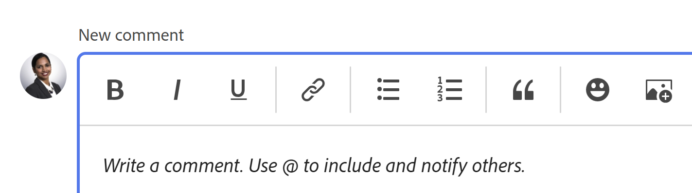

# Atualizar trabalho

<!-- Audited: 1/2024 -->

<!--The highlighted information on this page refers to functionality not yet generally available. It is available only in the Preview environment.  (*****for all customers or in Production for customers who enabled fast releases-->

<!--For information about fast releases, see [Enable or disable fast releases for your organization](/help/quicksilver/administration-and-setup/set-up-workfront/configure-system-defaults/enable-fast-release-process.md).

For information about the current release schedule, see [Second Quarter 2024 release overview](/help/quicksilver/product-announcements/product-releases/24-q2-release-activity/24-q2-release-overview.md).
-->

<!--info for April 11: hide the "Important" box below-->

<!--
>[!IMPORTANT]
>
>We are currently redesigning the commenting experience in Adobe Workfront.
>
>Depending on what objects you access the commenting experience for, you might see the following functionality for the Updates section:
>* The new experience
>* The legacy experience
>* The new and the legacy experience
>
>For more information about the new commenting experience and its availability, see [New commenting experience](../../product-announcements/betas/new-commenting-experience-beta/unified-commenting-experience.md). 
>
> The legacy commenting experience has been removed from projects, tasks, issues, and documents in the Preview environment. 
>
>The new commenting experience is available only for the Updates section of Workfront objects, and it is not available when you access updates from the following areas:
>
> * Home
> * Summary panel in lists
> * Summary panel in timesheets 
> * Summary panel in the Workload Balancer
>
>The new commenting experience is available in the Summary panel in lists, timesheets, and the Workload Balancer in the Preview environment and in the Production environment for customers who have opted for the fast release process. 
-->

Você pode adicionar uma atualização em um objeto Adobe Workfront para comunicar a outras pessoas sobre o progresso no objeto. Para obter mais informações sobre a quais objetos você pode adicionar atualizações no Workfront, consulte [Visão geral da seção de atualização](/help/quicksilver/workfront-basics/updating-work-items-and-viewing-updates/updates-tab-overview.md).

As informações neste artigo descrevem como você pode comentar e atualizar informações de projetos, tarefas e problemas. Os usuários atribuídos ou inscritos no objeto podem exibir sua atualização. Também é possível marcar os usuários para chamar a atenção deles para a atualização.

Adicionar comentários a outros objetos é semelhante a atualizar projetos, tarefas e problemas. Para obter informações adicionais sobre como comentar em cartões e metas, consulte também os seguintes artigos:

* [Gerenciar comentários de meta em Metas do Adobe Workfront](../../workfront-goals/goal-management/manage-goal-comments.md).

  Você deve ter uma licença adicional para acessar o Workfront Goals.

* [Adicionar um cartão ad hoc a um quadro](/help/quicksilver/agile/get-started-with-boards/add-card-to-board.md)

* [Usar placas conectadas em placas](/help/quicksilver/agile/get-started-with-boards/connected-cards.md)

<!--Add a bullet for record comments when Planning is in GA: help/quicksilver/planning/records/manage-record-comments.md-->

## Requisitos de acesso

+++ Expanda para visualizar os requisitos de acesso para a funcionalidade neste artigo.

Você deve ter o seguinte acesso para executar as etapas deste artigo:

<table style="table-layout:auto"> 
 <col> 
 </col> 
 <col> 
 </col> 
 <tbody> 
  <tr> 
   <td role="rowheader"><strong>plano do Adobe Workfront</strong></td> 
   <td> 
Qualquer
 </td> 
  </tr> 
  <tr> 
   <td role="rowheader"><strong>Licença do Adobe Workfront</strong></td> 
   <td> 
   
Atual: solicitação ou superior para ocorrências e documentos; Revisão ou superior para todos os outros objetos

   
Novo: Colaborador ou superior para problemas e documentos: Claro ou superior para todos os outros objetos
 
   </td> 
  </tr> 
  <tr> 
   <td role="rowheader"><strong>Configurações de nível de acesso</strong></td> 
   <td> 
Acesso de Visualização ou Edição para o objeto no qual a atualização está
</td> 
  </tr> 
  <tr> 
   <td role="rowheader"><strong>Permissões de objeto</strong></td> 
   <td> 
Visualizar acesso ao objeto
</td> 
  </tr> 
 </tbody> 
</table>

Para obter mais detalhes sobre as informações nesta tabela, consulte [Requisitos de acesso na documentação do Workfront](/help/quicksilver/administration-and-setup/add-users/access-levels-and-object-permissions/access-level-requirements-in-documentation.md).

+++

## Considerações sobre a atualização do trabalho

* Você pode adicionar comentários à maioria dos objetos no Adobe Workfront na seção Atualizações. Para obter mais informações sobre quais objetos exibem a seção Atualizações, consulte [Visão geral da seção Atualizações](../updating-work-items-and-viewing-updates/updates-tab-overview.md).

* Você pode adicionar comentários a objetos do Workfront de outros aplicativos integrados ao Workfront ou do aplicativo móvel Workfront.

  Nem todos os aplicativos integrados ao Workfront podem adicionar comentários a objetos do Workfront.

  Nem todos os recursos disponíveis na seção Atualizações de um objeto no Workfront estão disponíveis em outros aplicativos, ao acessar objetos do Workfront pelo aplicativo. Por exemplo, os recursos de Rich Text ou tornar um comentário privado para a Empresa de alguém podem não estar disponíveis ao adicionar comentários a um objeto do Workfront a partir de um aplicativo de terceiros.

* Você pode se comunicar sobre o progresso em um objeto do Workfront (projeto, tarefa ou problema), conforme comenta no objeto. Os usuários atribuídos ou inscritos no objeto podem receber uma notificação sobre sua atualização. Qualquer pessoa com acesso de Visualização ao objeto pode visualizar sua atualização.

* É possível marcar os usuários para chamar a atenção deles para a atualização. Os usuários marcados receberão uma notificação no aplicativo e um email sobre a atualização.

  >[!TIP]
  >
  >Os proprietários do comentário são marcados automaticamente. Para obter mais informações, consulte [Marcar outros usuários em atualizações](../../workfront-basics/updating-work-items-and-viewing-updates/tag-others-on-updates.md).

* Você pode adicionar um comentário a um objeto que pode ser exibido ou pode fazer logon como administrador de grupo ou da Workfront e adicionar um comentário em nome de outro usuário. Para obter mais informações, consulte [Fazer logon como outro usuário](../../administration-and-setup/add-users/create-and-manage-users/log-in-as-another-user.md).

* Você pode adicionar uma atualização a projetos, tarefas e problemas nas seguintes áreas do Workfront:

   * A partir de um objeto do Workfront, na seção Atualizações (para projetos, tarefas e problemas)
   * Na área Início (para tarefas e problemas)
   * No painel Resumo, nas seguintes áreas (para tarefas, problemas e documentos):

      * Uma lista de objetos
      * Uma planilha de horas
      * Início
      * O Balanceador de carga de trabalho

<!--info for April 11: hide the section below: add an update to a work item-->

<!--
## Add an update to a work item

Adding an update to a work item differs depending on what version of the Updates section you use.

You can add updates to the following objects: 

* Projects
* Tasks
* Issues
* Programs
* Portfolios
* Templates
* Template tasks
* Users
* Timesheets
* Teams
* Goals
* Cards in the Boards area
* Iterations
-->

<!--info for April 11: hide the section below completely:-->

<!--
### Add an update to a work item in the legacy Updates section

>[!IMPORTANT]
>
>The information on this page describes how you update projects, tasks, and issues.

1. Go to the work item for which you want to provide an update (such as a project, task, or issue).
1. Click the **Updates** section.
1. (Conditional) If it is enabled, click the **New commenting** option in the upper-right corner of the Updates section to disable it and enable the legacy commenting experience.
1. Click **Start a new update,** then type your update.  
1. (Optional) Use the options in the Rich Text toolbar to format your text, add emojis, links, or images to your update, to enhance your content. For more information, see the [Use Rich Text in a Workfront update](#use-rich-text-in-a-workfront-update) section in this article.
1. (Optional) Update any of the following information about the work item:

   <table style="table-layout:auto"> 
    <col> 
    <col> 
    <tbody> 
     <tr> 
      <td role="rowheader"><strong>Notify</strong></td> 
      <td>Identify users who must be notified of the update. Users assigned or subscribed to the object automatically receive notification when an update is made. 
For information about how to include others on an update, see <a href="../../workfront-basics/updating-work-items-and-viewing-updates/tag-others-on-updates.md" class="MCXref xref">Tag others on updates</a>.
</td> 
     </tr> 
     <tr> 
      <td role="rowheader"><strong>Commit Date</strong></td> 
      <td>In the date picker, select the date that you commit to complete the work item. For information about Commit Date, see <a href="../../manage-work/projects/updating-work-in-a-project/overview-of-commit-dates.md" class="MCXref xref">Commit Date overview</a>.</td> 
     </tr> 
     <tr> 
      <td role="rowheader"><strong>Condition</strong></td> 
      <td>Select a new condition for the task or issue. For information about selecting a condition, see <a href="../../manage-work/projects/updating-work-in-a-project/update-condition-for-tasks-and-issues.md" class="MCXref xref">Update Condition for tasks and issues</a>.</td> 
     </tr> 
     <tr> 
      <td role="rowheader"><strong>Status</strong></td> 
      <td>Click the arrow beside the current status, then select the desired status from the drop-down menu. For information about setting a Status, see <a href="../../manage-work/projects/updating-work-in-a-project/update-task-status.md" class="MCXref xref">Update task status</a>.
Updating the status of a work item does not automatically change the status of a project. Depending on how your project is set up, you might make updates to the project status separately. For more information on the various project update types, see <a href="../../manage-work/projects/manage-projects/select-project-update-type.md" class="MCXref xref">Select the project Update Type </a>.

<b>NOTE</b>
      
      You cannot change the status of a work item while it is in a Pending Approval status.
</td> 
     </tr> 
     <tr> 
      <td role="rowheader"><strong>Completion Bar</strong></td> 
      <td>(Only available on tasks) Indicate the percentage of work completed by sliding the progress bar to the desired percentage. You can also double-click the completion bar and enter the percent complete.</td> 
     </tr> 
     <tr> 
      <td role="rowheader"><strong>Private to my company</strong></td> 
      <td> 
Disable this option to prevent users outside your company from having access to view this update.
 
      
<b>NOTE</b>

      
This option displays only when the user is associated with a Company.

      
This option is not available in all areas where you can add updates from. For example, this is not available in third-party applications where you can add updates from. 

      </td> 
     </tr> 
    </tbody> 
   </table>

1. Click **Update** to add the update to the Workfront object.

   >[!NOTE]
   >
   >A small pop-up window will appear for seven seconds after clicking **Update**, allowing you to undo the update and return to the editing pane before the update is posted. The update is posted if you dismiss the undo pop-up, wait for it to disappear, or navigate away from the page. 
   >
   >If your Workfront administrator selects the "Never allow users to delete comments" setting in your access level, you cannot undo a comment. For more information, see [Create and modify custom access levels](../../administration-and-setup/add-users/configure-and-grant-access/create-modify-access-levels.md).

1. To reply to an update, see [Reply to updates](../../workfront-basics/updating-work-items-and-viewing-updates/reply-to-updates.md).
-->

<!--info for April 11: reword the title of this section to: "Add an update to a work item"; take out the step that says you need to enable the "New commenting" toggle (I think it is step 3??)-->

## Adicionar uma atualização a um item de trabalho

Este artigo descreve como você pode atualizar projetos, tarefas ou problemas. A atualização da maioria dos outros objetos é semelhante.

1. Localize o objeto que você deseja atualizar e clique no nome dele para abrir a página do objeto.
1. Clique em  **Atualizações** no painel esquerdo.
A variável **Comentários** é selecionada por padrão.

   <!--
   1. (Conditional) If the **New commenting** option is disabled, click to enable it. 

      This enables the new commenting experience. 

         >[!TIP]
         >
         >The New commenting option has been removed in the Preview environment.
   -->

1. Comece a inserir um comentário no **Novo comentário** caixa.

   

   >[!TIP]
   >
   >Sair da seção Atualizações antes de terminar de digitar e enviar um comentário mantém o comentário na página no modo de rascunho mesmo depois de fazer logoff e logon novamente. As imagens adicionadas ao comentário também são salvas no rascunho. Os rascunhos são salvos por 7 dias após os quais são descartados e não podem ser recuperados. Comentários em rascunho só ficam visíveis para o usuário que os digita.

1. (Opcional) Para desfazer ou refazer uma alteração, use as seguintes teclas de atalho:
   * CTRL + Z (⌘+z para Mac) para desfazer uma alteração
   * CTRL + Y (⌘+y para Mac) para refazer uma alteração

1. (Opcional) Na **Marcar pessoas ou equipes** digite o nome ou o email de um usuário ou de uma equipe que deseja incluir neste comentário e, em seguida, selecione-o quando ele for exibido na lista.
1. (Opcional) Use as opções na barra de ferramentas de Rich Text para formatar o texto, adicionar emojis, links ou imagens à atualização e aprimorar o conteúdo. Para obter mais informações, consulte [Usar Rich Text em uma atualização do Workfront](#use-rich-text-in-a-workfront-update) neste artigo.

   >[!TIP]
   >
   >Se outro usuário enviar um comentário para o mesmo item que você está atualizando, há uma linha vermelha com um indicador &quot;Novo&quot; para informá-lo sobre os comentários mais recentes.
   >
   >O indicador é exibido somente depois que o comentário foi enviado no item, e não quando o comentário ainda está composto.
   >
   >O indicador &quot;Novo&quot; é exibido somente quando o usuário que inseriu uma nova atualização, bem como o usuário que está inserindo uma atualização no momento, estão usando a nova experiência de comentário.
   >

1. Clique em **Enviar** para adicionar a atualização ao objeto do Workfront.
1. Para editar um comentário, clique no link **Mais** menu  no canto superior direito do comentário e clique em **Editar**.

   >[!IMPORTANT]
   >
   >Você pode editar seu comentário somente em 15 minutos a partir do envio.

1. Edite as informações no comentário, adicione ou remova imagens ou remova qualquer um dos usuários marcados. Um indicador &quot;Editado&quot; é adicionado à esquerda do carimbo de data que é exibido quando o comentário é inserido.

   >[!TIP]
   >
   >Os comentários do ano atual não exibem o ano no carimbo de data. Passar o mouse sobre um carimbo de data e hora exibe a data completa, incluindo o ano.

   

   >[!TIP]
   >
   >* Um email é gerado para notificar os usuários sobre sua atualização somente quando você envia a atualização original. Nenhum email é gerado após a edição da atualização.
   >* O carimbo de data ao lado do comentário é a data do comentário original, não a data da última edição.
   >* Quando você adiciona um comentário em nome de outro usuário (ao fazer logon como outro usuário como Workfront ou administrador de grupo), não é possível editar o comentário se você estiver conectado como o outro usuário. Você pode editar o comentário somente depois de fazer logoff como usuário e logon novamente como você mesmo.

1. (Opcional) Clique em **Responder** ou comece a digitar um comentário no campo **Adicionar resposta...** para responder a um comentário existente, siga as etapas de 3 a 7 acima. <!--(**************insure this stays accurate***********)--> Para obter informações sobre como responder a uma atualização, consulte [Responder a atualizações](../../workfront-basics/updating-work-items-and-viewing-updates/reply-to-updates.md).

1. (Condicional e opcional) Se outros usuários tiverem adicionado comentários que são exibidos fora da área visível na seção Atualizações enquanto você estava adicionando seus comentários, clique em **Exibir** dentro do azul **novo banner de comentários** na parte inferior da tela para exibir esses comentários.

   

   Comentários adicionais são exibidos na parte inferior da tela.

1. (Opcional) Clique no link **Curtir** ícone. O ícone é atualizado com o número de curtidas.
1. (Condicional e opcional) Se você incluiu outras pessoas em seu comentário, clique no número de membros incluídos na atualização para exibir uma lista de entidades com as quais o comentário inserido é compartilhado.

   

   >[!TIP]
   >
   >Os nomes das duas primeiras entidades marcadas são exibidos ao lado de seus avatares. Se mais de duas entidades forem marcadas, somente o nome da primeira e o número de entidades adicionais serão exibidos.

1. (Opcional) Clique no nome de um comentarista para ver seu nome, função e endereço de email em uma caixa de informações. Clique no nome do comentarista novamente na caixa de informações para abrir o perfil do usuário.
1. (Opcional) Clique no link **Atividade do sistema** para ver as atualizações registradas pelo sistema. Quando o objeto ou qualquer um de seus filhos é atualizado, o Workfront gera uma observação sobre essa atualização e a exibe na guia Atividade do sistema.

   Para obter mais informações, consulte [Visão geral da seção Atualizações](../updating-work-items-and-viewing-updates/updates-tab-overview.md).

   >[!TIP]
   >
   >Não é possível adicionar um comentário a uma atualização do sistema. No entanto, todas as respostas feitas aos registros de atividade do sistema na experiência de comentários herdada foram adicionadas à guia Atividade do sistema como somente leitura. A experiência de comentários herdada foi removida do Workfront em 11 de abril de 2024.

1. (Opcional) Clique no link **Todos** para exibir comentários do usuário e comentários de atividades do sistema em um local. Esta é uma guia somente para visualização.

   >[!TIP]
   >
   >Não é possível responder a comentários ou marcar outros usuários em comentários existentes na guia Todos. Para responder a um comentário na guia Todos, clique em **Responder em Comentários** para abrir o comentário na guia Comentários.

## Usar Rich Text em uma atualização do Workfront{#use-rich-text-in-a-workfront-update}

Você pode aprimorar suas atualizações usando Rich Text ou adicionando vários itens a ele, como emojis, links ou imagens.

1. Vá para a **Atualizações** de um objeto do Workfront e comece a digitar um comentário.
1. (Opcional) Para adicionar uma formatação de Rich Text à atualização, use os atributos na **Rich Text** à medida que você digita.

   

   | **Atributo** | **Botão da barra de ferramentas** | **Teclas de atalho do Mac** | **Teclas de atalho do Windows** |
   |---|---|---|---|
   | Negrito |  | ⌘+b | Ctrl+O |
   | Itálico |  | ⌘+i | Ctrl+I |
   | Sublinhar |  | ⌘+u | Ctrl+S |
   | Hiperlink |  |  Para abrir a caixa Adicionar links: ⌘+K   Para colar um link sobre o texto selecionado: ⌘+V  |  Para abrir a caixa Adicionar links: Ctrl+K   Para colar um link sobre o texto selecionado: Ctrl+V  |
   | Lista com marcadores |  | ⌘+Shift+8 | Ctrl+Shift+8 |
   | Lista numerada |  | ⌘+Shift+7 | Ctrl+Shift+7 |
   <!--| Block Quote | |⌘+Shift+9 | Ctrl+Shift+9   This is not available in the new commenting experience.   |-->

   <!--remove the last row when we remove legacy from the system-->

   Para interromper a formatação do texto, desmarque o atributo no **Rich Text** barra de ferramentas.

   <!-- in the table above: take "Create Links" verbiage from the hyperlink when the old commenting is removed and the commenting beta is the only way to comment - with October 2023-->

   >[!NOTE]
   >
   >* A formatação também é exibida em qualquer notificação por email que os usuários recebem contendo sua atualização.
   >* A formatação de Rich Text aplicada a uma atualização em um email não é exibida na atualização quando visualizada na guia Atualizações.
   >* Se sua organização usar o Workfront com o Internet Explorer, qualquer texto formatado colado em uma atualização perderá sua formatação Rich Text e será exibido como texto sem formatação. É possível reformatar o texto usando os atributos na barra de ferramentas Rich Text.
   >* A formatação Rich Text não está disponível para atualizações feitas na área Folhas de horas ou para objetos de Nota e Última condição exibidos em um relatório.

   <!--1. (Optional and conditional) If you want to include text from previous updates or from other sources and distinguish it from your own update, you can mark it as a Block Quote. Click the **Block Quote** icon  and type the text you want to quote. The quoted text displays marked with a vertical gray line. Click the **Block Quote** icon again to return to normal formatting. This is not available in the new commenting experience.-->

   <!--remove this picture below and the bullet above when we remove legacy-->

   <!---->

1. (Opcional) Clique no link **emoji** ícone  para adicionar emojis à atualização.

   >[!NOTE]
   >
   >* O Workfront não substitui emoticons de pontuação, como :) por emojis.
   >* Os emojis não estão disponíveis para os objetos Nota e Última Condição exibidos em um relatório.
   >* O recurso emoji no Workfront utiliza caracteres Unicode e, como tal, é exibido apenas em navegadores e sistemas operacionais que oferecem suporte a pontos de código Unicode. Usuários em uma plataforma, navegador ou versão de sistema operacional diferente da sua podem não ter acesso aos mesmos emojis.
   >* Um emoji não suportado é representado por uma caixa preta ou branca.
   >* O Windows 7 suporta apenas emojis em preto-e-branco.
   >* Os emojis aplicados a uma atualização feita por email não são exibidos na atualização quando visualizados na área Atualizações.

1. (Opcional) Para adicionar um link de URL a fontes de informações adicionais:

   1. Clique em na atualização em que deseja inserir um link.
   1. No **Rich Text** barra de ferramentas, clique no link **Hiperlink** ícone .

   1. No **Criar link** que aparece, em **URL**, digite ou cole o URL da origem à qual deseja vincular.

   1. Em **Texto a ser exibido**, digite ou cole o texto do link.
   1. Clique em **Salvar**.

1. (Opcional) Para anexar uma imagem à atualização, siga um destes procedimentos:

   * Salve a imagem no computador e arraste-a e solte-a na área Novo comentário.
   * Copie uma captura de tela do computador e cole-a no comentário.<!-- This is not available in the legacy commenting experience.-->
   * Clique em **Adicionar imagem** ícone  e navegue até a imagem no computador.

   >[!NOTE]
   >
   >**IMPORTANTE**
   >
   ><!--You cannot add images to goals or ad-hoc cards on boards. -->
   >
   >* O administrador do Workfront deve ativar a adição de imagens na seção Preferências de atualização de feeds da área Interface do Workfront antes que você possa ver os ícones de Imagem ou Adicionar anexo. Para obter informações, consulte [Configurar preferências para atualizações de usuário](../../administration-and-setup/set-up-workfront/system-tracked-update-feeds/configure-preferences-user-updates.md).
   >* O tamanho máximo do arquivo de imagem é 7 MB. Os tipos de arquivo de imagem compatíveis são .jpg, .gif e .png.
   >* As imagens podem ser acessadas na seção Atualizações em um objeto e também estão disponíveis na área Documentos do Menu principal.
   >* Você pode colar a imagem clicando com o botão direito do mouse no novo comentário ou pressionando CTRL + V para Windows (ou ⌘ + V para Mac) no teclado.
   >* É possível enviar uma atualização com uma imagem e nenhum texto.
   >* Quando você exclui um comentário que contém uma imagem, ela é removida da seção Atualizações, bem como da área Documentos. A imagem também é excluída da área Documentos ao editar um comentário e excluir a imagem.
   >* Quando alguém exclui uma imagem anexada a um comentário da área Documentos, ela também é removida do comentário.

   <!--remove the statement above about legacy, when we remove the legacy environment.-->

1. (Opcional) Para exibir uma imagem na atualização existente, siga um destes procedimentos:

   * Clique em **Visualizar** ícone  na miniatura da imagem para abrir a imagem em tamanho real em uma nova guia do navegador.
   * Clique em **Baixar** ícone  na miniatura da imagem para baixar a imagem.

1. Clique em **Enviar** para adicionar seu comentário.

## Procurar uma atualização

Você pode procurar um comentário ou uma resposta na seção Atualizações de um objeto.

1. Vá para a **Atualizações** seção de um objeto.
1. Comece a digitar uma palavra-chave <!--or a user's name --> no **Pesquisar** no canto superior direito da caixa **Comentários** guia.

   <!--Add this tip or note instead of the note below - when it'll be possible: You can search for users who have been tagged or for comment owners.-->

   >[!NOTE]
   >
   >Você pode pesquisar somente palavras que pertençam ao texto de um comentário ou resposta. Não é possível pesquisar nomes de usuários ou equipes marcados em uma atualização.

   

   A palavra-chave <!--or user--> pesquisado for realçado e os comentários que o contêm serão exibidos na parte superior da seção Atualizações.

   O Workfront pesquisa todo o fluxo de atualização do objeto, fora dos comentários que estão visíveis na tela.

1. Clique em **x** no campo de pesquisa para limpar os resultados da pesquisa e retornar a todos os comentários.

<!-- when we release search to production, check above and make sure you don't have to add that the users tagged/ owners are also searchable-->

## Copiar atualizações

Há várias maneiras de copiar uma atualização.

Você pode copiar um link para a atualização ou copiar o conteúdo de uma atualização para usá-lo em uma nova atualização.

<!--Copying an update differs depending on which commenting experience you use.-->

<!--info for April 11: take the sentence above out and reword the section title below to: Copy an update-->

### Copiar uma atualização <!--in the new commenting experience-->

<!--For information about what features are available for the new commenting experience and for what objects, see [New commenting experience](../../product-announcements/betas/new-commenting-experience-beta/unified-commenting-experience.md).-->

Você pode copiar informações de um comentário existente seguindo um destes procedimentos:

* [Copiar link](#copy-link)
* [Copiar texto do corpo](#copy-body-text)
* [Citar resposta](#quote-reply)

#### Copiar link

A opção Copiar link copia o comentário ou o link do encadeamento para a área de transferência para que você possa compartilhar o comentário ou todo o encadeamento com outros usuários.

1. Vá para a atualização cujo link deseja copiar.

1. Clique em **Mais** e clique em **Copiar link**.

1. Cole o link copiado na etapa anterior em um email ou outro aplicativo para compartilhá-lo com outras pessoas. O link compartilhado abre o comentário do qual você compartilhou o link.

   >[!TIP]
   >
   >Quando você compartilha o link de uma conversa em um objeto filho de um objeto de classificação mais alta, o link abre a thread na área Atualizações do objeto de classificação mais alta.
   >
   >Por exemplo, se você copiar o link de um comentário de tarefa da área Atualizações do projeto, o comentário abrirá a página do projeto.

#### Copiar texto do corpo

A opção Copiar texto do corpo copia o texto de uma atualização específica para a área de transferência.

1. Vá para a atualização ou resposta que deseja copiar.
1. Clique em **Mais** e clique em **Copiar texto do corpo**.

#### Citar resposta

A opção Citar resposta copia o comentário original para uma nova resposta como uma cotação em bloco.

1. Vá para a atualização ou resposta que deseja copiar.
1. Clique em **Mais** e clique em **Citar resposta**.

   Uma nova caixa de comentário é aberta e a resposta entre aspas é incluída no novo comentário e marcada como aspas de bloco.

   

1. Continue adicionando sua atualização e clique em **Enviar** para adicionar o comentário.

<!--info for April 11: hide the entire section below - notice that there are several sub-sub sections below this main section - hide them all, all the way up to "Delete an update"-->

<!--
### Copy an update in the legacy commenting experience

* [Copy the update](#copy-the-update) 
* [Copy the thread link](#copy-the-thread-link) 
* [Copy the update link](#copy-the-update-link)
* [Quote Reply](#quote-reply)

   >[!TIP]
   >
   >When you copy and share the link of a conversation on a child object from a higher-ranking object, the link opens the thread in the child object's Updates area. 
   >
   >For example, if you copy the link of a task comment from the project's Updates area, the comment opens the task page.

#### Copy the update {#copy-the-update}

This option copies the text from a specific update to the clipboard.

1. Go to the update or reply you want to copy.
1. Click the **More** menu, then click **Copy body text**.

   

#### Copy the thread link {#copy-the-thread-link}

This option copies the full thread link to the clipboard so you can share the thread with other users.

1. Go to the update thread you want to copy.

1. Click the **More** menu, then click **Copy thread link**.

    

1. Paste the link you copied in the previous step in an email or another application to share it with others. The shared link opens the comment you shared the link from. 

#### Copy the update link {#copy-the-update-link}

This option copies a specific update link to the clipboard. When you share the update link, the user who follows it sees a border around the update.

1. Go to the update or reply you want to copy.
1. Click the **More** menu next to the individual update, then click **Copy update link**.

   

1. Paste the link you copied in the previous step in an email or another application to share it with others. The shared link opens the comment you shared the link from. 

#### Quote Reply  

The Quote Reply option copies the original comment to a new reply as a block quote. 

1. Go to the update or reply you want to copy.
1. Click the **More** menu, then click **Quote Reply**.

   A new comment box opens and the quoted reply is included in the new comment and marked as a block quote.

1. Continue adding your update and click **Reply** to add the comment.
-->

## Excluir atualização ou resposta

Dependendo do acesso que seu administrador do Workfront fornecer, talvez você possa excluir as atualizações adicionadas na guia Atualizações de um objeto. Para obter mais informações, consulte [Criar ou modificar níveis de acesso personalizados](../../administration-and-setup/add-users/configure-and-grant-access/create-modify-access-levels.md#creating-a-new-access-from-scratch) no artigo [Criar ou modificar níveis de acesso personalizados](../../administration-and-setup/add-users/configure-and-grant-access/create-modify-access-levels.md).

Nenhum usuário do Workfront (incluindo o administrador do Workfront) pode excluir atualizações feitas por outro usuário. No entanto, se o nível de acesso de um usuário permitir que ele exclua suas próprias atualizações, o administrador do Workfront poderá fazer logon como esse usuário e excluir as atualizações feitas. Para obter mais informações, consulte [Criar ou modificar níveis de acesso personalizados](../../administration-and-setup/add-users/configure-and-grant-access/create-modify-access-levels.md#creating-a-new-access-from-scratch) e [Fazer logon como outro usuário](../../administration-and-setup/add-users/create-and-manage-users/log-in-as-another-user.md).

1. Vá para a atualização ou resposta que deseja excluir.
1. Clique em **Mais** menu ao lado da atualização ou resposta que deseja excluir e clique em **Excluir**.

   

1. Na mensagem exibida, clique em **Excluir**.

   >[!NOTE]
   >
   >Excluir uma atualização com uma imagem anexada exclui o comentário e a imagem. Para obter mais informações, consulte [Usar Rich Text em uma atualização do Workfront](#use-rich-text-in-a-workfront-update) neste artigo.

   Quando o comentário excluído tiver respostas associadas, há uma indicação de que o comentário foi removido com o nome do usuário que o removeu.

   

   Os comentários excluídos são removidos imediatamente do Workfront. Um usuário que usa a seção Atualizações vê um comentário sendo excluído por outro usuário em tempo real.

## Revisar atualizações do sistema

A seção Atualizações de um objeto do Workfront exibe dois tipos de informações:

* **Atualizações de usuário:** Atualizações de usuário são comentários que você e outros usuários do sistema inseriram. As atualizações de usuário são exibidas nas guias Comentários e Todas da seção Atualizações.

  

* **Atualizações do sistema:** Atualizações do sistema registram a remoção de tarefas ou problemas, adição ou exclusão de versões de documentos, anexação ou remoção de uma solicitação de aprovação, bem como quaisquer edições ou alterações feitas no objeto. As atualizações do sistema são exibidas na Atividade do sistema e nas guias All da seção Updates.

  

  Os administradores do Workfront podem determinar o que é rastreado nas atualizações do sistema, conforme explicado em [Atualizações rastreadas pelo sistema](../../administration-and-setup/set-up-workfront/system-tracked-update-feeds/system-tracked-update-feeds.md). Você também pode filtrar as atualizações ou atividades do sistema para ver apenas as atualizações do usuário para todos os objetos.

  Os seguintes objetos não têm atualizações geradas pelo sistema:

   * Equipe
   * Modelo
   * Modelo de Tarefa
   * Cartão ad-hoc

Para obter mais informações sobre atualizações do sistema na seção Atualizações, consulte [Visão geral da seção Atualizações](../updating-work-items-and-viewing-updates/updates-tab-overview.md).

<!--
After the monthly releases to Production, the same features are also available in the Production environment for customers who enabled fast releases.   
For information about fast releases, see [Enable or disable fast releases for your organization](../../administration-and-setup/set-up-workfront/configure-system-defaults/enable-fast-release-process.md)  
-->

<!-- with October 26 release: add somewhere this, and decide where we need to keep information about the legacy commenting. Should we create an article about iterations comments like we have for goals and cards?!:

>[!NOTE]
>
>Iterations display the legacy commenting experience.-->

<!--old message, before Auhust 17: 

>[!NOTE]
>
>We are currently redesigning the commenting experience in Adobe Workfront.
>
>For more information about the new commenting experience, see [New commenting experience](../../product-announcements/betas/new-commenting-experience-beta/unified-commenting-experience.md). 
>
>You can access the new experience for the following objects:
> * Issues, projects, tasks, and documents.
>
>     This is available when you enable the commenting Beta experience.
>
>     This functionality is available only for the Updates section, and it is not available for the following areas:
>
>     * Home
>     * Summary panel in lists
>     * Summary panel in timesheets
>
> * Goals, cards in the Boards area
>
>   The new commenting experience is the only experience for goals and cards. You must have an additional license to access Workfront Goals. For more information, see [Requirements to use Workfront Goals](../../workfront-goals/goal-management/access-needed-for-wf-goals.md). 
>
>     You can add and view updates to cards in the Boards area when you enable the Comments and System Activity sections on a card. For more information, see [Add an ad hoc card to a board](../../agile/get-started-with-boards/add-card-to-board.md).
-->