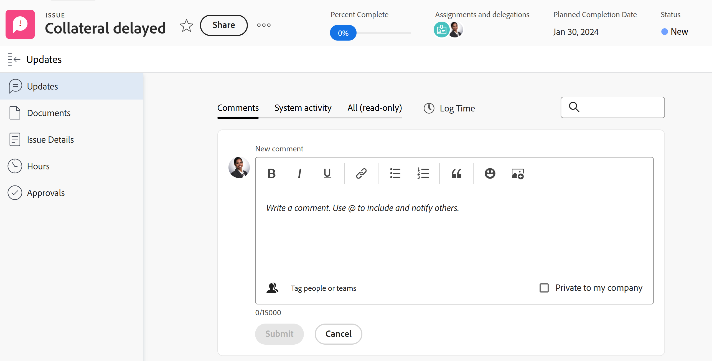

# Visão geral da seção Atualizações

{{highlighted-preview}}

<!-- Audited: 1/2024 -->

<!--take "legacy" and "new commenting" references out when we remove the legacy - April 2024???-->

<!--The highlighted information on this page refers to functionality not yet generally available. It is available only in the Preview environment for all customers. 

For information about the current release schedule, see [First Quarter 2024 release overview](/help/quicksilver/product-announcements/product-releases/24-q1-release-activity/24-q1-release-overview.md). -->

>[!IMPORTANT]
>
>No momento, estamos reprojetando a experiência de comentários no Adobe Workfront.
>
>Dependendo dos objetos para os quais você acessa a experiência de comentários, você pode ver a seguinte funcionalidade para a seção Atualizações:
>* A nova experiência
>* A experiência herdada
>* A experiência nova e herdada
>
>Este artigo contém informações sobre as versões nova e herdada da seção Atualizações.
>
>Para obter mais informações sobre a nova experiência de comentários e sua disponibilidade, consulte [Nova experiência de comentários](../../product-announcements/betas/new-commenting-experience-beta/unified-commenting-experience.md).
>
>A nova experiência de comentários está disponível somente para a seção Atualizações de objetos do Workfront e não está disponível quando você acessa os objetos das seguintes áreas:
>
> * Início
> * Painel Resumo em listas
> * Painel Resumo em Planilhas de Horas
> * Painel Resumo no Balanceador de carga de trabalho
>
>A nova experiência de comentários está disponível no painel Resumo em listas, folhas de horas e o Balanceador de carga de trabalho no ambiente de Pré-visualização.

## Visão geral da seção Atualizações

A seção Atualizações de um objeto mostra atualizações do sistema e até 200 das atualizações mais recentes feitas pelos usuários nos últimos 90 dias.

Exemplo da seção Atualizações no ambiente de Pré-visualização:

Exemplo da seção Atualizações no ambiente de Produção:

Dependendo dos objetos para os quais você acessa a experiência de comentários, você pode encontrar a seguinte experiência na seção Atualizações:

* A experiência de comentários nova e herdada para os seguintes objetos:

   * Projeto
   * Tarefa (inclui Histórias)
   * Problema
   * Documento

     >[!TIP]
     >
     >Use a opção Novo comentário para exibir a nova experiência de comentários (quando você a habilita) ou a experiência de comentários herdada (quando a desabilita). A nova experiência de comentários é o padrão. Para obter mais informações, consulte [Nova experiência de comentários](../../product-announcements/betas/new-commenting-experience-beta/unified-commenting-experience.md).

* Somente a nova experiência de comentários para os objetos listados abaixo. Não há opção para habilitar a experiência de comentários herdada para estes objetos:

   * Meta

     >[!NOTE]
     >
     >Você deve ter uma licença adicional para acessar o Adobe Workfront Goals para acessar essa área do Workfront. Para obter mais informações, consulte [Requisitos para usar as metas do Workfront](../../workfront-goals/goal-management/access-needed-for-wf-goals.md).

   * Cartão em um quadro
   * Equipe
   * Modelo
   * Modelo de Tarefa
   * Planilha de horas
   * Programa
   * Portfólio
   * Usuário

* Somente a experiência de comentários herdada para os seguintes objetos:

   * Iterações

     Não há opção para habilitar a nova experiência de comentários para iterações.

### Visão geral da seção Atualizações na nova experiência de comentários

Exemplo da seção Atualizações no ambiente de Pré-visualização:

Exemplo da seção Atualizações no ambiente de Produção:

>[!NOTE]
>
>A nova experiência de comentários não está disponível para iterações.

* A seção Atualizações exibe informações nas seguintes guias na nova experiência de comentários:

   * **Comentários**: exibe comentários feitos por usuários e responde a esses comentários. Use a guia Comentários para adicionar novos comentários ou responder aos existentes. Para obter informações sobre como atualizar objetos na nova experiência de comentários, consulte [Atualizar trabalho](../updating-work-items-and-viewing-updates/update-work.md).
   * **Atividade do sistema**: exibe as atualizações do sistema que são mensagens informativas criadas pelo Workfront para registrar determinados eventos em um objeto. Por exemplo, alterações em status, nome ou campos personalizados são capturadas com atualizações do sistema. O administrador do Workfront ou de grupo pode habilitar atualizações de sistema para seus objetos. Quaisquer respostas feitas aos registros de atividade do sistema na experiência de comentários herdada serão preenchidas na guia Atividade do sistema como somente leitura. Para obter mais informações, consulte [Configurar atualizações do sistema](../../administration-and-setup/set-up-workfront/system-tracked-update-feeds/configure-system-updates.md).
   * **Todos (somente leitura)**: exibe comentários do usuário e comentários de atividades do sistema em um local. Esta é uma guia somente para visualização. Não é possível responder a comentários ou marcar outros usuários em comentários existentes na guia Todos. Para responder a um comentário específico, use o link da guia All para a guia Comments. Para obter informações sobre como atualizar objetos na nova experiência de comentários, consulte [Atualizar trabalho](../updating-work-items-and-viewing-updates/update-work.md).

* Os seguintes objetos não têm a guia Atividade do sistema ou na guia Todos:

   * Equipe
   * Modelo
   * Modelo de Tarefa
   * Cartão ad-hoc

### Visão geral da seção Atualizações herdadas

<!--when we remove legacy, make this section an "Iterations-only" section-->

A seção Atualizações herdadas mostra as seguintes informações:

* **Atualizações do usuário**: Comentários feitos pelos usuários e respostas a esses comentários.
* **Atualizações do sistema**: mensagens informativas que o Workfront cria para registrar determinados eventos em um objeto. Por exemplo, você pode capturar alterações em campos de status, nome ou personalizados com atualizações do sistema. O administrador do Workfront ou de grupo pode habilitar atualizações de sistema para seus objetos. Para obter mais informações, consulte [Configurar atualizações do sistema](../../administration-and-setup/set-up-workfront/system-tracked-update-feeds/configure-system-updates.md).

Os seguintes objetos não registram atualizações do sistema:

* Equipe
* Modelo
* Modelo de Tarefa
* Iterações

## Atualizações que também aparecem em objetos de classificação mais alta

Comentários, respostas ou atualizações de sistema de determinados objetos também aparecem na seção Atualizações de objetos com classificação mais alta.

Por exemplo, quando você adiciona uma atualização a uma tarefa, a atualização aparece na seção Atualizações da tarefa e na seção Atualizações do projeto que contém a tarefa.

A tabela a seguir mostra os objetos cujos comentários também são exibidos em seus objetos de classificação mais alta:

<table style="table-layout:auto"> 
 <col> 
 <col> 
 <thead> 
  <tr> 
   <th><strong>Objeto onde a atualização original foi adicionada</strong> </th> 
   <th> 
<strong>Objeto com classificação mais alta no qual a atualização original também aparece</strong> 
 </th> 
  </tr> 
 </thead> 
 <tbody> 
  <tr> 
   <td>Problema</td> 
   <td>Projeto</td> 
  </tr> 
  <tr> 
   <td>Tarefa</td> 
   <td>Projeto</td> 
  </tr> 
  <tr> 
   <td>Projeto</td> 
   <td>Programa, Portfolio</td> 
  </tr> 
  <tr data-mc-conditions=""> 
   <td>Documento </td> 
   <td>Objeto onde o documento está anexado, Projeto </td> 
  </tr> 
  <tr> 
   <td>Programa</td> 
   <td>Portfólio</td> 
  </tr> 
  <tr> 
   <td>Usuário</td> 
   <td>Equipe</td> 
  </tr> 
  <tr> 
   <td>Planilha de horas</td> 
   <td>
Usuário, Equipe

   
<b>Nota</b>

   
Os comentários da folha de horas são exibidos na seção Atualizações do usuário que faz o comentário e na seção Atualizações da equipe inicial.

   </td> 
  </tr> 
  <tr> 
   <td>Modelo de Tarefa</td> 
   <td>Modelo</td> 
  </tr> 
  <tr> 
   <td>História</td> 
   <td>Iteração, Equipe</td> 
  </tr> 
  <tr> 
   <td>Iteração</td> 
   <td>Equipe</td> 
  </tr>

<tr> 
   <td>Resultado</td> 
   <td>Meta</td> 
  </tr> 
  <tr> 
   <td>Atividade</td> 
   <td>Meta</td> 
  </tr> 
 </tbody> 
</table>

>[!NOTE]
>
>As respostas adicionadas às atualizações do sistema não são acumuladas no objeto pai. Somente respostas diretas em um objeto filho e respostas adicionadas a atualizações existentes são acumuladas em objetos pai.
>
>Para obter informações sobre a hierarquia de objetos no Adobe Workfront, consulte [Entender objetos no Adobe Workfront](../../workfront-basics/navigate-workfront/workfront-navigation/understand-objects.md).
>
> Não é possível responder às atualizações do sistema na nova experiência de comentários. Para obter mais informações, consulte [Nova experiência de comentários](../../product-announcements/betas/new-commenting-experience-beta/unified-commenting-experience.md).

## Limitações da seção Atualizações

Existem algumas limitações na seção Atualizações de uma equipe e ao inserir atualizações em nome de outros usuários.

### Limitações para usuários e equipes

Considere o seguinte ao visualizar atualizações para usuários e equipes:

* Não é possível adicionar novos comentários na seção Atualizações de uma equipe.

* Você pode adicionar uma resposta a uma atualização que visualiza em uma equipe. A resposta é exibida na seção Atualizações da equipe, bem como na seção Atualizações do objeto ao qual pertence.

* A seção Atualizações para equipes é preenchida por atualizações inseridas nos seguintes objetos:

   * Usuários
   * Folhas de horas*
   * Histórias
   * Iterações*

  *Eles não estão disponíveis para a nova experiência de comentários.

* Na seção Atualizações para usuários e equipes, é possível visualizar as atualizações inseridas nos últimos 90 dias.

  Se quiser ver todas as atualizações feitas em um usuário ou uma equipe, além do limite de 90 dias, você pode criar um relatório para notas. O relatório não deve ter um filtro de tempo que exiba todas as atualizações feitas para usuários ou equipes. Para obter mais informações, consulte [Criar um relatório personalizado](../../reports-and-dashboards/reports/creating-and-managing-reports/create-custom-report.md).

### Limitações ao inserir comentários em nome de outro usuário

Os administradores do Adobe Workfront e de grupos podem fazer logon como outros usuários e executar ações no Workfront, como inserir comentários.

Para obter informações, consulte [Fazer logon como outro usuário](../../administration-and-setup/add-users/create-and-manage-users/log-in-as-another-user.md).

Considere o seguinte ao fazer logon como outro usuário e adicionar comentários:

* Quaisquer comentários feitos em nome de outro usuário são indicados no comentário.

* Um administrador de grupo pode comentar em nome de outra pessoa, mas não pode excluir esse comentário. Somente um administrador do Adobe Workfront pode excluir um comentário feito em nome de outro usuário.

* Um administrador de Workfront ou de grupo só poderá editar um comentário adicionado em nome de outro usuário quando fizer logout como o usuário e login como eles mesmos. Eles não podem excluir um comentário em nome de outro usuário.

## Exibir atualizações do sistema em itens de trabalho com o relatório de Lançamento

O relatório de Lançamento documentado mostra atualizações de sistema da área Atualizações de projetos, tarefas e problemas.

O relatório permite visualizar:

* Quantas alterações de status ocorreram
* Quando uma tarefa ou problema é excluído
* Como os valores em campos personalizados importantes foram alterados durante um projeto
* Quais datas importantes foram alteradas ao longo de um projeto
* Se a prioridade mudou durante um projeto
* Se o proprietário de um projeto mudou

Para obter mais informações, consulte [Relatório na área Atualizações](../../reports-and-dashboards/reports/creating-and-managing-reports/create-journal-entry-report.md).
